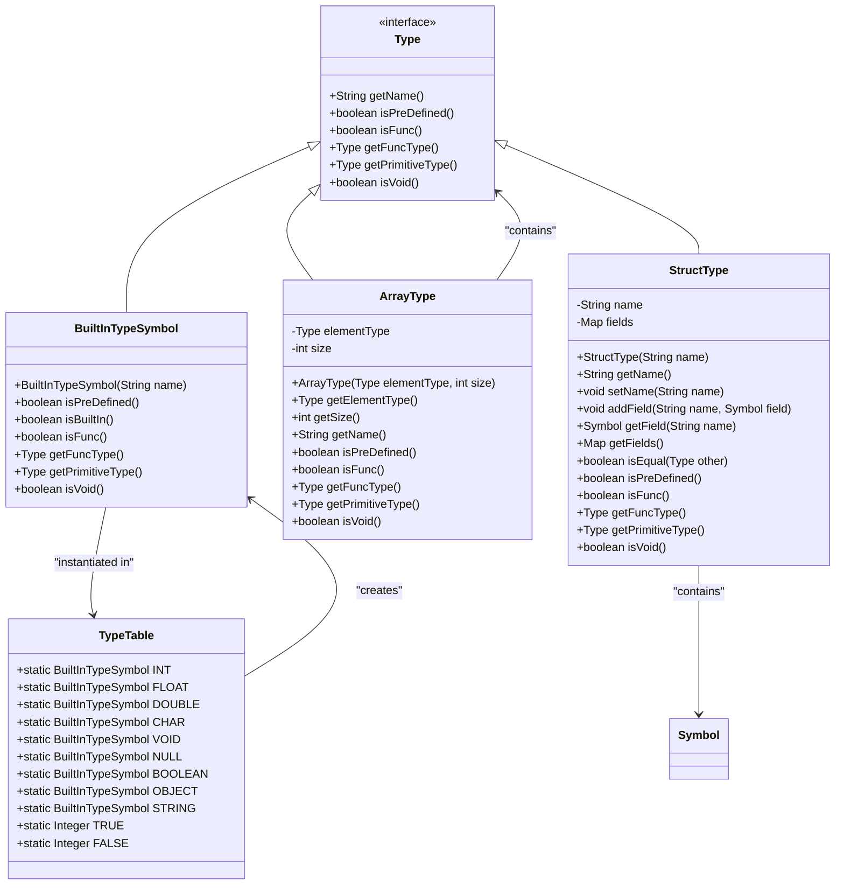
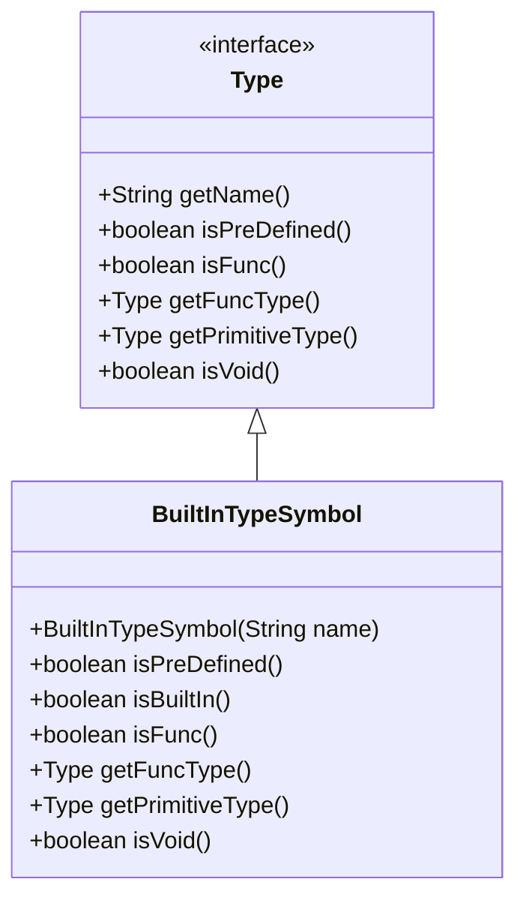
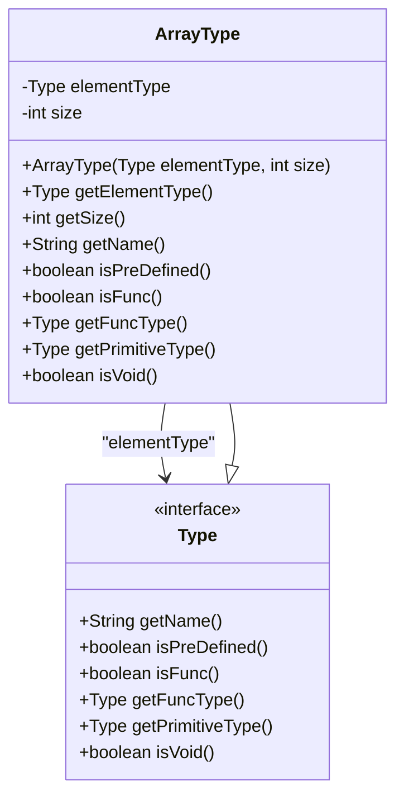
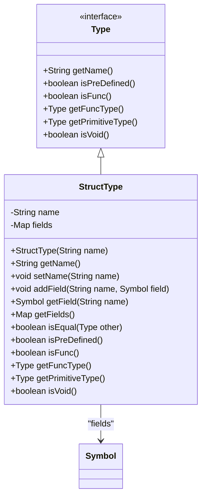
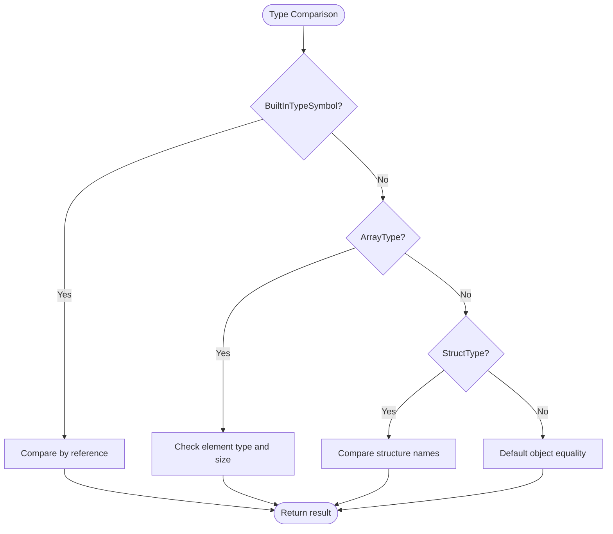

# Type Hierarchy

<cite>
**Referenced Files in This Document**   
- [Type.java](file://ep20/src/main/java/org/teachfx/antlr4/ep20/symtab/type/Type.java)
- [BuiltInTypeSymbol.java](file://ep20/src/main/java/org/teachfx/antlr4/ep20/symtab/type/BuiltInTypeSymbol.java)
- [ArrayType.java](file://ep20/src/main/java/org/teachfx/antlr4/ep20/symtab/type/ArrayType.java)
- [StructType.java](file://ep20/src/main/java/org/teachfx/antlr4/ep20/symtab/type/StructType.java)
- [TypeTable.java](file://ep20/src/main/java/org/teachfx/antlr4/ep20/symtab/type/TypeTable.java)
</cite>

## Table of Contents
1. [Introduction](#introduction)
2. [Core Components](#core-components)
3. [Architecture Overview](#architecture-overview)
4. [Detailed Component Analysis](#detailed-component-analysis)
5. [Type Instantiation and Comparison](#type-instantiation-and-comparison)
6. [Extensibility and Future Additions](#extensibility-and-future-additions)
7. [Conclusion](#conclusion)

## Introduction
The Cymbol compiler implements a robust type system to support static type checking and semantic analysis. This document details the type hierarchy design, focusing on the core abstractions that represent all types within the language. The system supports primitive types, arrays, and user-defined structures, with a clear inheritance and composition model. The design enables type equality checks, subtyping determination, and extensibility for future language features.

## Core Components

This section outlines the fundamental building blocks of the Cymbol type system, including the base Type interface and its concrete implementations for built-in types, arrays, and structures.

**Section sources**
- [Type.java](file://ep20/src/main/java/org/teachfx/antlr4/ep20/symtab/type/Type.java)
- [BuiltInTypeSymbol.java](file://ep20/src/main/java/org/teachfx/antlr4/ep20/symtab/type/BuiltInTypeSymbol.java)
- [ArrayType.java](file://ep20/src/main/java/org/teachfx/antlr4/ep20/symtab/type/ArrayType.java)
- [StructType.java](file://ep20/src/main/java/org/teachfx/antlr4/ep20/symtab/type/StructType.java)

## Architecture Overview

The type system in Cymbol is built around a central Type interface that defines the contract for all type representations. Concrete implementations include BuiltInTypeSymbol for primitive types, ArrayType for array types with dimension tracking, and StructType for user-defined composite types. These types are managed through a TypeTable singleton that provides access to predefined primitive types.

**Diagram sources**
- [Type.java](file://ep20/src/main/java/org/teachfx/antlr4/ep20/symtab/type/Type.java)
- [BuiltInTypeSymbol.java](file://ep20/src/main/java/org/teachfx/antlr4/ep20/symtab/type/BuiltInTypeSymbol.java)
- [ArrayType.java](file://ep20/src/main/java/org/teachfx/antlr4/ep20/symtab/type/ArrayType.java)
- [StructType.java](file://ep20/src/main/java/org/teachfx/antlr4/ep20/symtab/type/StructType.java)
- [TypeTable.java](file://ep20/src/main/java/org/teachfx/antlr4/ep20/symtab/type/TypeTable.java)

## Detailed Component Analysis

This section provides an in-depth examination of each component in the type hierarchy, detailing their implementation and responsibilities within the Cymbol compiler's type system.

### Base Type Interface
The Type interface serves as the foundation for all type representations in the Cymbol compiler. It defines essential methods for type introspection and classification, enabling the compiler to perform type checking and semantic analysis. All concrete types must implement this interface to ensure consistent behavior across the type system.

**Section sources**
- [Type.java](file://ep20/src/main/java/org/teachfx/antlr4/ep20/symtab/type/Type.java)

### Built-in Type Implementation
The BuiltInTypeSymbol class implements the Type interface for primitive types such as int, float, bool, string, and void. It extends the Symbol class and provides specific implementations for type characteristics. The isPreDefined() method returns true for all built-in types, while isVoid() checks if the type name is "void" (case-insensitive). The getPrimitiveType() method returns the type itself, indicating that built-in types are their own primitive types.

**Diagram sources**
- [BuiltInTypeSymbol.java](file://ep20/src/main/java/org/teachfx/antlr4/ep20/symtab/type/BuiltInTypeSymbol.java)
- [Type.java](file://ep20/src/main/java/org/teachfx/antlr4/ep20/symtab/type/Type.java)

**Section sources**
- [BuiltInTypeSymbol.java](file://ep20/src/main/java/org/teachfx/antlr4/ep20/symtab/type/BuiltInTypeSymbol.java)

### Array Type Extension
The ArrayType class extends the type system to support array types with dimension and element type tracking. It maintains a reference to the element type and the array size. The getName() method returns a string representation of the array type (e.g., "int[10]"). The getElementType() method provides access to the element type, while getSize() returns the array dimension. Array types are not predefined and are never considered void types.

**Diagram sources**
- [ArrayType.java](file://ep20/src/main/java/org/teachfx/antlr4/ep20/symtab/type/ArrayType.java)
- [Type.java](file://ep20/src/main/java/org/teachfx/antlr4/ep20/symtab/type/Type.java)

**Section sources**
- [ArrayType.java](file://ep20/src/main/java/org/teachfx/antlr4/ep20/symtab/type/ArrayType.java)

### Structure Type Implementation
The StructType class represents user-defined composite types with field layout and member access capabilities. It maintains a name and a map of field names to Symbol objects. Fields can be added using addField() and accessed by name using getField(). The isEqual() method determines type equality by comparing structure names, implementing nominal typing. The getFields() method returns all fields in the structure, enabling introspection of the field layout.

**Diagram sources**
- [StructType.java](file://ep20/src/main/java/org/teachfx/antlr4/ep20/symtab/type/StructType.java)
- [Type.java](file://ep20/src/main/java/org/teachfx/antlr4/ep20/symtab/type/Type.java)
- [Symbol.java](file://ep20/src/main/java/org/teachfx/antlr4/ep20/symtab/symbol/Symbol.java)

**Section sources**
- [StructType.java](file://ep20/src/main/java/org/teachfx/antlr4/ep20/symtab/type/StructType.java)

## Type Instantiation and Comparison

The Cymbol type system provides mechanisms for type instantiation and comparison through the TypeTable class and type equality methods. Primitive types are instantiated once and stored in static fields of TypeTable, ensuring singleton instances for each built-in type. Type equality is determined differently for each type: BuiltInTypeSymbol instances are compared by reference (as they are singletons), ArrayType instances require matching element types and sizes, and StructType instances use nominal typing by comparing structure names.

**Diagram sources**
- [TypeTable.java](file://ep20/src/main/java/org/teachfx/antlr4/ep20/symtab/type/TypeTable.java)
- [BuiltInTypeSymbol.java](file://ep20/src/main/java/org/teachfx/antlr4/ep20/symtab/type/BuiltInTypeSymbol.java)
- [ArrayType.java](file://ep20/src/main/java/org/teachfx/antlr4/ep20/symtab/type/ArrayType.java)
- [StructType.java](file://ep20/src/main/java/org/teachfx/antlr4/ep20/symtab/type/StructType.java)

**Section sources**
- [TypeTable.java](file://ep20/src/main/java/org/teachfx/antlr4/ep20/symtab/type/TypeTable.java)

## Extensibility and Future Additions

The Cymbol type hierarchy is designed to be extensible, allowing for the addition of new type kinds without modifying existing code. New types can be implemented by creating classes that implement the Type interface and adding appropriate factory methods or registration mechanisms. The interface-based design ensures that new types integrate seamlessly with existing type checking and semantic analysis components. Potential extensions could include pointer types, function types, or generic types, each implementing the Type interface with appropriate methods for their specific characteristics.

## Conclusion

The Cymbol compiler's type system provides a comprehensive foundation for static type checking and semantic analysis. The hierarchy, centered around the Type interface, supports primitive types through BuiltInTypeSymbol, arrays through ArrayType, and user-defined structures through StructType. The system enables type equality checks, subtyping determination, and extensibility for future language features. The design patterns used—interface-based polymorphism, composition, and singleton instances for built-in types—demonstrate effective object-oriented principles in compiler construction.