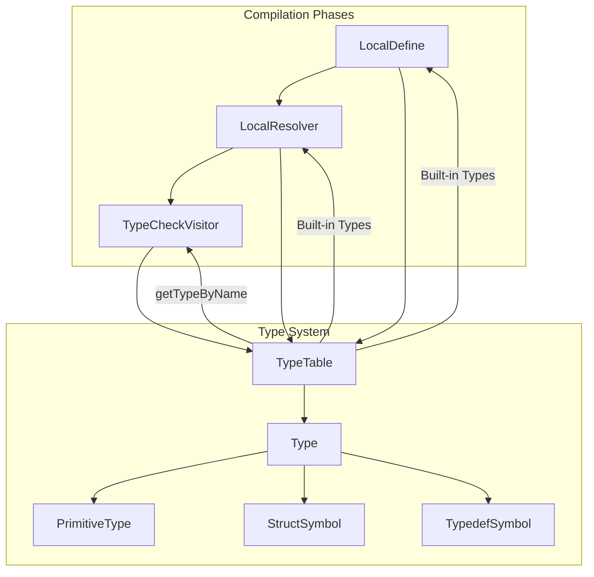
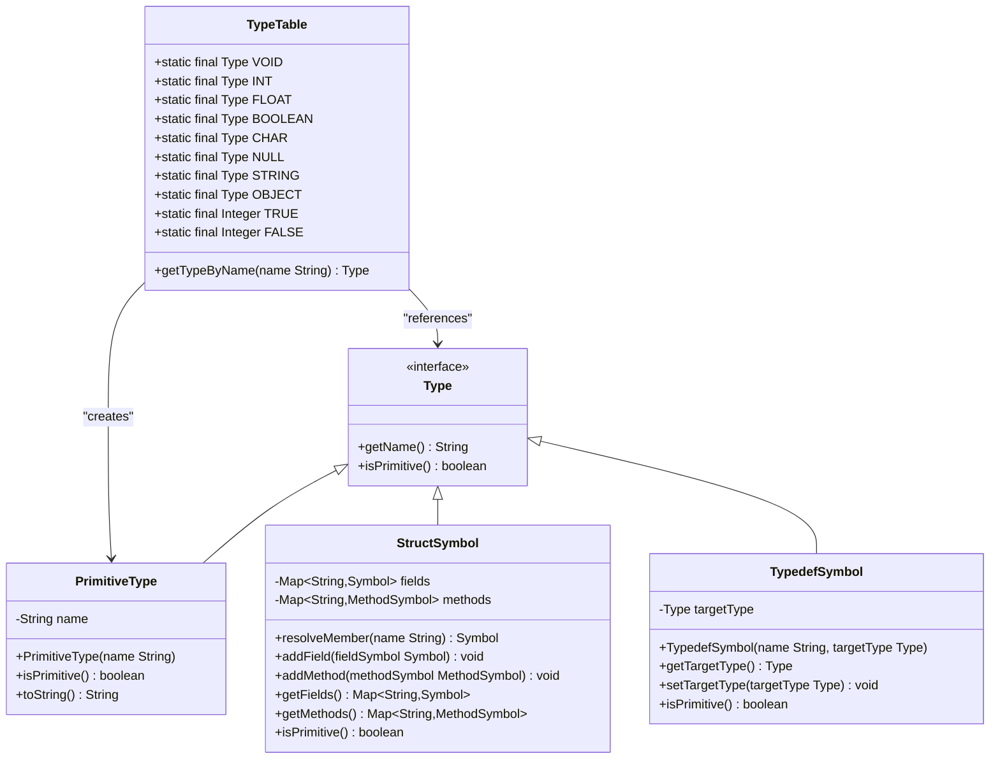
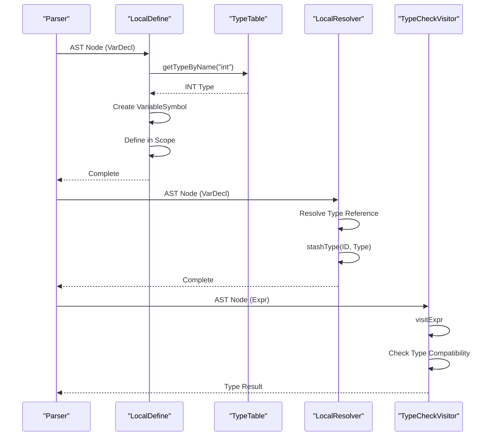
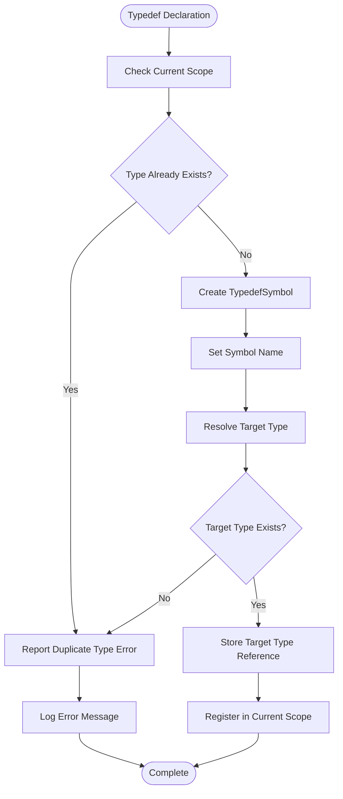
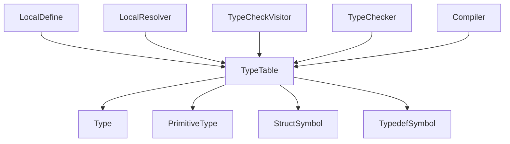

# Type Management

<cite>
**Referenced Files in This Document**   
- [TypeTable.java](file://ep19/src/main/java/org/teachfx/antlr4/ep19/symtab/TypeTable.java)
- [Type.java](file://ep19/src/main/java/org/teachfx/antlr4/ep19/symtab/Type.java)
- [PrimitiveType.java](file://ep19/src/main/java/org/teachfx/antlr4/ep19/symtab/symbol/PrimitiveType.java)
- [TypedefSymbol.java](file://ep19/src/main/java/org/teachfx/antlr4/ep19/symtab/symbol/TypedefSymbol.java)
- [StructSymbol.java](file://ep19/src/main/java/org/teachfx/antlr4/ep19/symtab/symbol/StructSymbol.java)
- [LocalDefine.java](file://ep19/src/main/java/org/teachfx/antlr4/ep19/pass/LocalDefine.java)
- [LocalResolver.java](file://ep19/src/main/java/org/teachfx/antlr4/ep19/pass/LocalResolver.java)
- [TypeCheckVisitor.java](file://ep19/src/main/java/org/teachfx/antlr4/ep19/pass/TypeCheckVisitor.java)
- [TypeChecker.java](file://ep19/src/main/java/org/teachfx/antlr4/ep19/symtab/TypeChecker.java)
</cite>

## Table of Contents
1. [Introduction](#introduction)
2. [Core Components](#core-components)
3. [Architecture Overview](#architecture-overview)
4. [Detailed Component Analysis](#detailed-component-analysis)
5. [Dependency Analysis](#dependency-analysis)
6. [Performance Considerations](#performance-considerations)
7. [Troubleshooting Guide](#troubleshooting-guide)
8. [Conclusion](#conclusion)

## Introduction
The TypeTable class serves as the central registry for all type definitions in the Cymbol compiler, providing a comprehensive type management system that handles built-in types, user-defined types, and type aliases. This document details the implementation of TypeTable as the authoritative source for type resolution throughout the compilation process. The system supports both primitive types and complex user-defined types such as structs and typedefs, enabling robust type checking and semantic analysis. TypeTable integrates seamlessly with the symbol table system, allowing for efficient type lookup and namespace management during compilation. The implementation demonstrates a sophisticated approach to type resolution, handling both direct type references and aliased types through typedef declarations. This centralized type registry ensures consistency across the compilation pipeline, from parsing and semantic analysis to code generation and execution.

## Core Components
The TypeTable implementation consists of several key components that work together to provide comprehensive type management. The core is the TypeTable class itself, which maintains static references to all built-in types and provides methods for type resolution by name. These built-in types include primitive types such as int, float, bool, char, and void, as well as reference types like String and Object. The Type interface defines the contract for all types in the system, requiring implementations to provide a name and indicate whether they represent a primitive type. PrimitiveType implements this interface for basic data types, while more complex types like structs and typedefs extend this foundation. The system also includes specialized symbol classes for different type categories, including StructSymbol for user-defined structures and TypedefSymbol for type aliases. These components work in concert with the compiler's semantic analysis phases, particularly during symbol definition and resolution.

**Section sources**
- [TypeTable.java](file://ep19/src/main/java/org/teachfx/antlr4/ep19/symtab/TypeTable.java#L4-L32)
- [Type.java](file://ep19/src/main/java/org/teachfx/antlr4/ep19/symtab/Type.java#L1-L7)
- [PrimitiveType.java](file://ep19/src/main/java/org/teachfx/antlr4/ep19/symtab/symbol/PrimitiveType.java#L1-L23)

## Architecture Overview
The type management system follows a layered architecture where TypeTable serves as the central registry that coordinates type resolution across the compilation pipeline. The system integrates with the symbol table hierarchy, allowing types to be resolved within their appropriate lexical scopes. During the semantic analysis phase, the LocalDefine visitor establishes type symbols in the appropriate scopes, while the LocalResolver visitor resolves type references and associates them with AST nodes. The TypeCheckVisitor then uses these resolved types to perform comprehensive type checking on expressions and statements. This architecture enables efficient type lookup through a combination of static references for built-in types and dynamic resolution for user-defined types. The system also supports type aliasing through typedef declarations, which are resolved to their target types during compilation. This layered approach ensures that type information is consistently maintained and accessible throughout the compilation process.

**Diagram sources **
- [TypeTable.java](file://ep19/src/main/java/org/teachfx/antlr4/ep19/symtab/TypeTable.java#L4-L32)
- [Type.java](file://ep19/src/main/java/org/teachfx/antlr4/ep19/symtab/Type.java#L1-L7)
- [LocalDefine.java](file://ep19/src/main/java/org/teachfx/antlr4/ep19/pass/LocalDefine.java#L1-L326)
- [LocalResolver.java](file://ep19/src/main/java/org/teachfx/antlr4/ep19/pass/LocalResolver.java#L1-L704)
- [TypeCheckVisitor.java](file://ep19/src/main/java/org/teachfx/antlr4/ep19/pass/TypeCheckVisitor.java#L1-L628)

## Detailed Component Analysis

### TypeTable Implementation
The TypeTable class provides a centralized registry for all type definitions in the compiler, serving as the authoritative source for type resolution. It maintains static final references to built-in types such as INT, FLOAT, BOOLEAN, CHAR, VOID, NULL, STRING, and OBJECT, all implemented as instances of PrimitiveType. The class also defines constants for boolean values (TRUE and FALSE) to support literal value handling. A key method in TypeTable is getTypeByName, which takes a type name as a string parameter and returns the corresponding Type instance. This method uses a switch statement to efficiently map type names to their respective type objects, returning null for undefined types. The implementation ensures that all built-in types are immediately available without requiring instantiation, providing optimal performance for type resolution operations.

#### For Object-Oriented Components:

**Diagram sources **
- [TypeTable.java](file://ep19/src/main/java/org/teachfx/antlr4/ep19/symtab/TypeTable.java#L4-L32)
- [Type.java](file://ep19/src/main/java/org/teachfx/antlr4/ep19/symtab/Type.java#L1-L7)
- [PrimitiveType.java](file://ep19/src/main/java/org/teachfx/antlr4/ep19/symtab/symbol/PrimitiveType.java#L1-L23)
- [StructSymbol.java](file://ep19/src/main/java/org/teachfx/antlr4/ep19/symtab/symbol/StructSymbol.java#L1-L102)
- [TypedefSymbol.java](file://ep19/src/main/java/org/teachfx/antlr4/ep19/symtab/symbol/TypedefSymbol.java#L1-L56)

**Section sources**
- [TypeTable.java](file://ep19/src/main/java/org/teachfx/antlr4/ep19/symtab/TypeTable.java#L4-L32)

### Type Resolution Process
The type resolution process begins during the LocalDefine phase, where type symbols are established in their appropriate scopes. When a variable declaration is encountered, the LocalDefine visitor looks up the type in the TypeTable using the type name from the AST. For built-in types, this lookup returns the corresponding static type instance from TypeTable. For user-defined types such as structs, the lookup returns the StructSymbol that was previously defined in the scope. The system also handles typedef declarations, which create TypedefSymbol instances that reference other types. During the LocalResolver phase, these type references are resolved and associated with the appropriate AST nodes using the ParseTreeProperty mechanism. This two-phase approach separates symbol definition from symbol resolution, ensuring that all types are properly established before they are used in expressions and statements.

#### For API/Service Components:

**Diagram sources **
- [LocalDefine.java](file://ep19/src/main/java/org/teachfx/antlr4/ep19/pass/LocalDefine.java#L1-L326)
- [LocalResolver.java](file://ep19/src/main/java/org/teachfx/antlr4/ep19/pass/LocalResolver.java#L1-L704)
- [TypeCheckVisitor.java](file://ep19/src/main/java/org/teachfx/antlr4/ep19/pass/TypeCheckVisitor.java#L1-L628)
- [TypeTable.java](file://ep19/src/main/java/org/teachfx/antlr4/ep19/symtab/TypeTable.java#L4-L32)

**Section sources**
- [LocalDefine.java](file://ep19/src/main/java/org/teachfx/antlr4/ep19/pass/LocalDefine.java#L1-L326)
- [LocalResolver.java](file://ep19/src/main/java/org/teachfx/antlr4/ep19/pass/LocalResolver.java#L1-L704)

### Type Aliasing and User-Defined Types
The TypeTable system supports type aliasing through typedef declarations, allowing users to create alternative names for existing types. When a typedef declaration is encountered, the LocalDefine visitor creates a TypedefSymbol with the specified name and a reference to the target type. Initially, the target type may be null if the referenced type has not yet been resolved, but this is handled during the LocalResolver phase. The TypedefSymbol class implements the Type interface and provides methods to get and set the target type, supporting nested typedefs through recursive resolution in the getTargetType method. For user-defined structs, the system creates StructSymbol instances that contain fields and methods, with each member having its own type association. These user-defined types are registered in the appropriate scope and can be referenced by name through the TypeTable's resolution mechanism, enabling complex type hierarchies and compositions.

#### For Complex Logic Components:

**Diagram sources **
- [TypedefSymbol.java](file://ep19/src/main/java/org/teachfx/antlr4/ep19/symtab/symbol/TypedefSymbol.java#L1-L56)
- [LocalDefine.java](file://ep19/src/main/java/org/teachfx/antlr4/ep19/pass/LocalDefine.java#L1-L326)
- [LocalResolver.java](file://ep19/src/main/java/org/teachfx/antlr4/ep19/pass/LocalResolver.java#L1-L704)

**Section sources**
- [TypedefSymbol.java](file://ep19/src/main/java/org/teachfx/antlr4/ep19/symtab/symbol/TypedefSymbol.java#L1-L56)
- [StructSymbol.java](file://ep19/src/main/java/org/teachfx/antlr4/ep19/symtab/symbol/StructSymbol.java#L1-L102)

## Dependency Analysis
The TypeTable implementation has dependencies on several key components of the compiler infrastructure. It directly depends on the Type interface, which defines the contract for all type objects in the system. The PrimitiveType class implements this interface for built-in types, while other type implementations such as StructSymbol and TypedefSymbol extend this foundation. The system integrates with the scope management infrastructure through dependencies on BaseScope, GlobalScope, and LocalScope classes, allowing types to be resolved within their appropriate lexical contexts. The visitor pattern components, including LocalDefine, LocalResolver, and TypeCheckVisitor, depend on TypeTable for type resolution during semantic analysis. Additionally, the TypeChecker utility class uses TypeTable to validate type compatibility in assignments, function calls, and operations. These dependencies create a cohesive type management system that spans multiple phases of the compilation process.

**Diagram sources **
- [TypeTable.java](file://ep19/src/main/java/org/teachfx/antlr4/ep19/symtab/TypeTable.java#L4-L32)
- [Type.java](file://ep19/src/main/java/org/teachfx/antlr4/ep19/symtab/Type.java#L1-L7)
- [PrimitiveType.java](file://ep19/src/main/java/org/teachfx/antlr4/ep19/symtab/symbol/PrimitiveType.java#L1-L23)
- [StructSymbol.java](file://ep19/src/main/java/org/teachfx/antlr4/ep19/symtab/symbol/StructSymbol.java#L1-L102)
- [TypedefSymbol.java](file://ep19/src/main/java/org/teachfx/antlr4/ep19/symtab/symbol/TypedefSymbol.java#L1-L56)
- [LocalDefine.java](file://ep19/src/main/java/org/teachfx/antlr4/ep19/pass/LocalDefine.java#L1-L326)
- [LocalResolver.java](file://ep19/src/main/java/org/teachfx/antlr4/ep19/pass/LocalResolver.java#L1-L704)
- [TypeCheckVisitor.java](file://ep19/src/main/java/org/teachfx/antlr4/ep19/pass/TypeCheckVisitor.java#L1-L628)
- [TypeChecker.java](file://ep19/src/main/java/org/teachfx/antlr4/ep19/symtab/TypeChecker.java#L1-L317)

**Section sources**
- [TypeTable.java](file://ep19/src/main/java/org/teachfx/antlr4/ep19/symtab/TypeTable.java#L4-L32)
- [Type.java](file://ep19/src/main/java/org/teachfx/antlr4/ep19/symtab/Type.java#L1-L7)
- [LocalDefine.java](file://ep19/src/main/java/org/teachfx/antlr4/ep19/pass/LocalDefine.java#L1-L326)
- [LocalResolver.java](file://ep19/src/main/java/org/teachfx/antlr4/ep19/pass/LocalResolver.java#L1-L704)

## Performance Considerations
The TypeTable implementation is designed for optimal performance in type resolution operations. The use of static final fields for built-in types ensures that these types are immediately available without requiring instantiation or lookup overhead. The getTypeByName method employs a switch statement on the type name, providing O(1) lookup performance for built-in types. This approach is more efficient than using a HashMap for the small set of built-in types, avoiding hash computation and potential collisions. The system minimizes object creation by reusing type instances throughout the compilation process, reducing garbage collection pressure. The separation of type definition and resolution phases allows for efficient batch processing of type information, while the use of ParseTreeProperty for type associations provides fast access to type information during subsequent compilation phases. These performance optimizations ensure that type management does not become a bottleneck in the compilation pipeline, even for large codebases.

## Troubleshooting Guide
When encountering issues with type resolution, several common problems should be checked. For undefined type errors, verify that the type has been properly declared before use and that it is visible in the current scope. For duplicate type definition errors, ensure that typedef or struct declarations do not conflict with existing type names. When dealing with type compatibility issues, check that assignments and operations follow the type system rules, particularly regarding implicit conversions between numeric types. For typedef resolution problems, verify that the target type exists and is accessible in the current scope. Debugging type issues can be facilitated by examining the output of the LocalDefine and LocalResolver phases, which show how types are established and resolved in the AST. The compiler's logging system can also provide insights into type resolution decisions and error conditions.

**Section sources**
- [TypeTable.java](file://ep19/src/main/java/org/teachfx/antlr4/ep19/symtab/TypeTable.java#L4-L32)
- [LocalDefine.java](file://ep19/src/main/java/org/teachfx/antlr4/ep19/pass/LocalDefine.java#L1-L326)
- [LocalResolver.java](file://ep19/src/main/java/org/teachfx/antlr4/ep19/pass/LocalResolver.java#L1-L704)
- [TypeCheckVisitor.java](file://ep19/src/main/java/org/teachfx/antlr4/ep19/pass/TypeCheckVisitor.java#L1-L628)

## Conclusion
The TypeTable implementation provides a robust and efficient type management system for the Cymbol compiler, serving as the central registry for all type definitions and resolutions. By maintaining static references to built-in types and providing efficient lookup mechanisms for user-defined types, the system ensures consistent and performant type handling throughout the compilation process. The integration with the symbol table system enables proper scope management and namespace resolution, while support for typedefs and complex user-defined types allows for flexible type composition. The two-phase approach of symbol definition followed by symbol resolution ensures that all type references are properly established before they are used in semantic analysis. This comprehensive type management infrastructure forms a critical foundation for the compiler's type checking and code generation capabilities, enabling the creation of type-safe programs with rich type hierarchies and compositions.