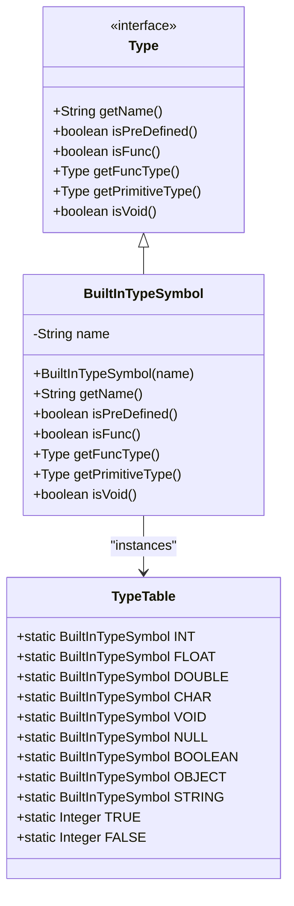
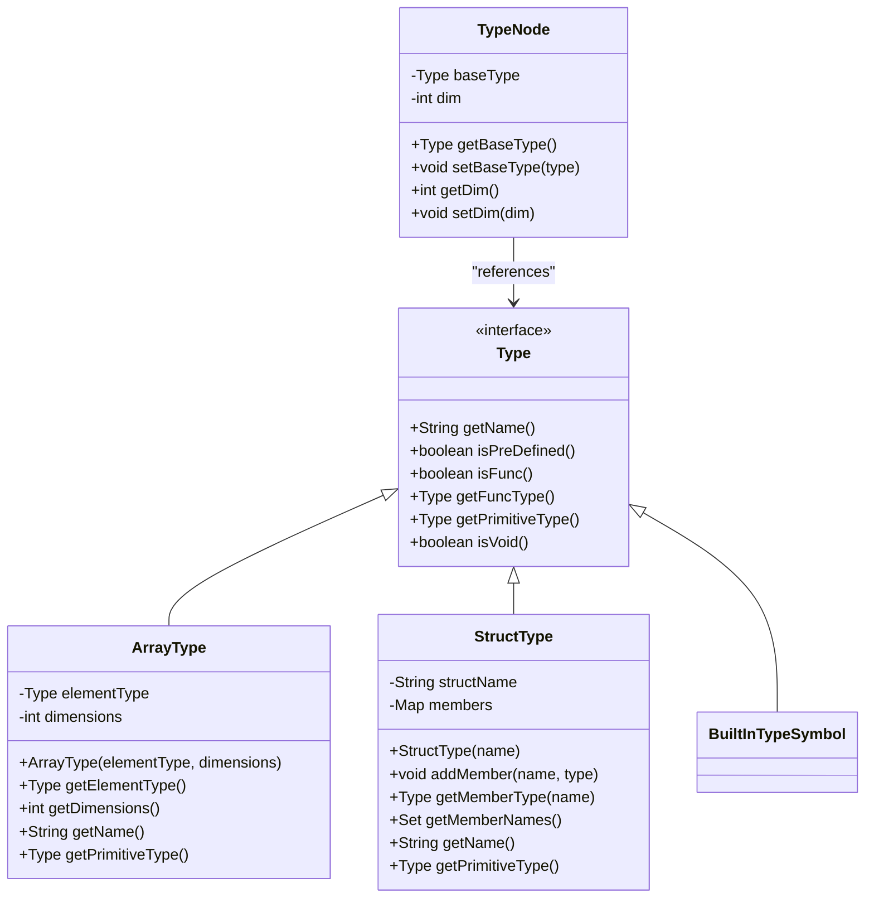
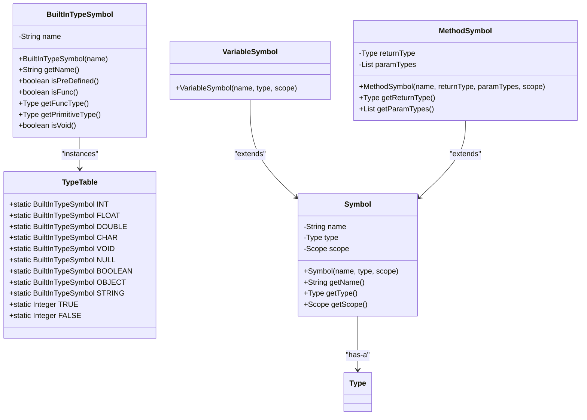
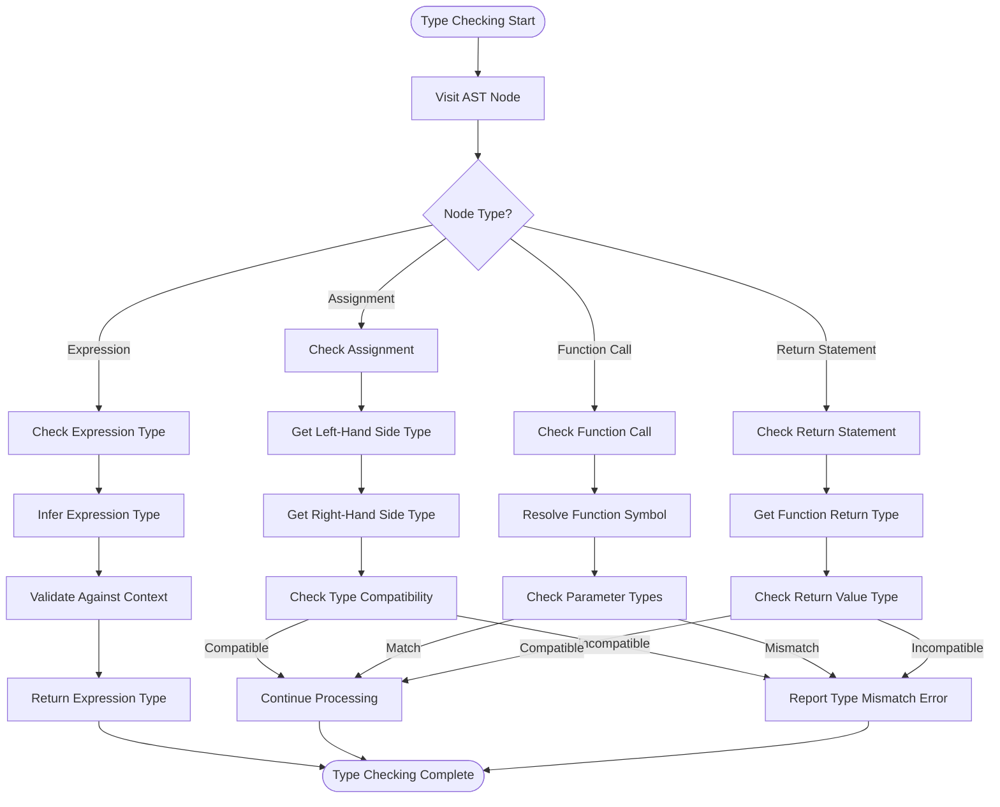
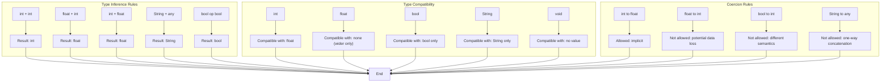
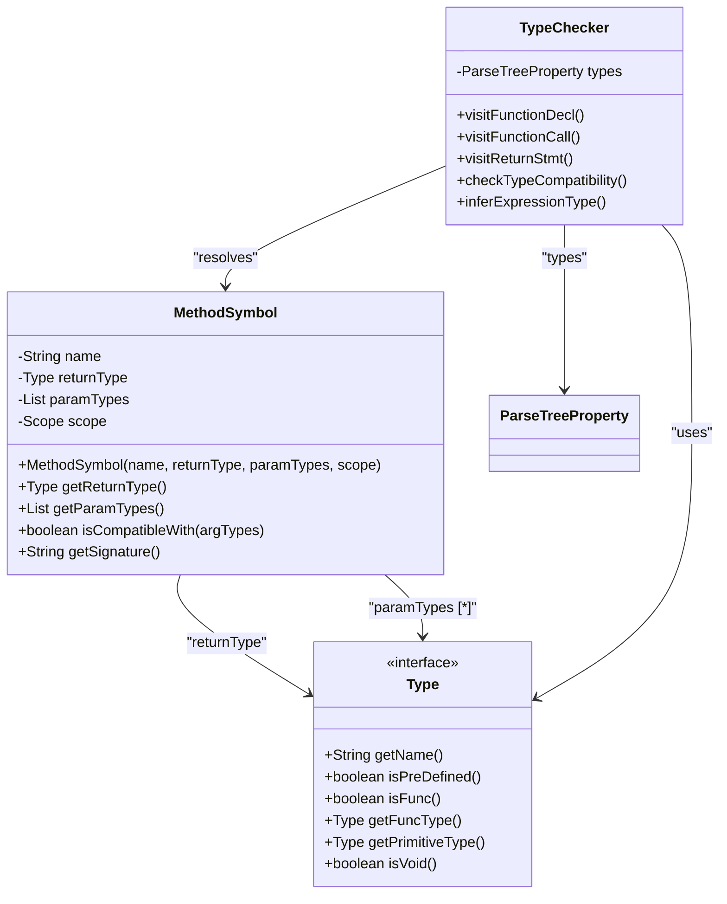
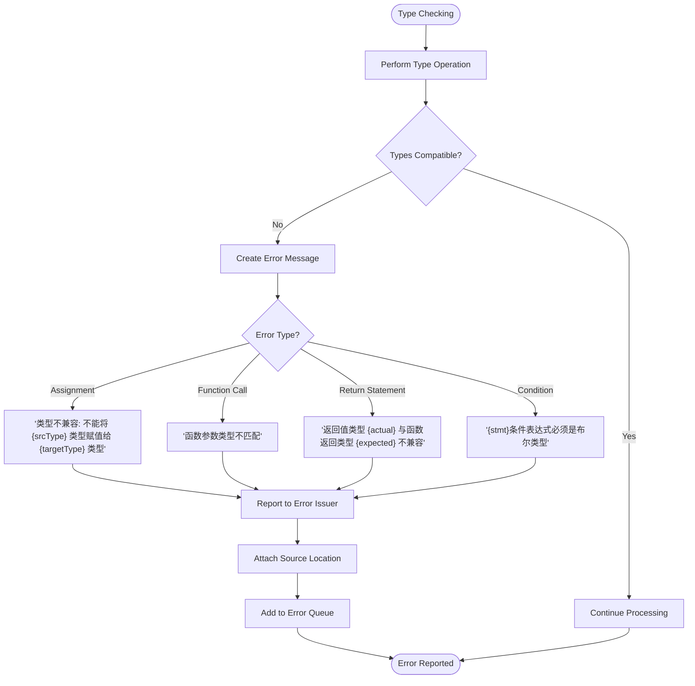
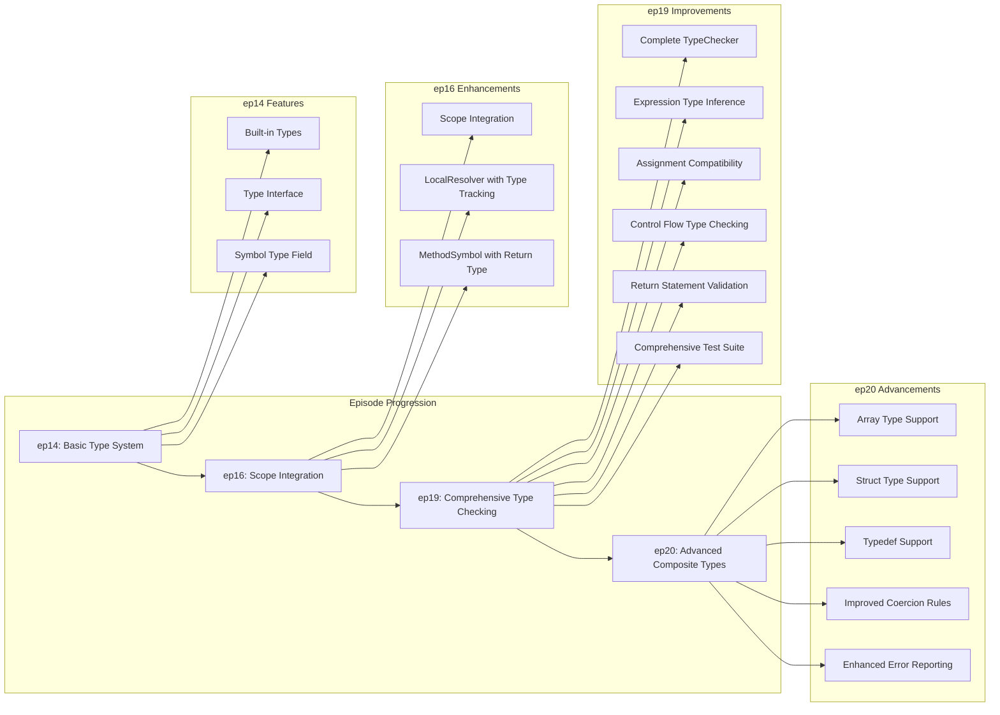

# Type System

<cite>
**Referenced Files in This Document**   
- [Type.java](file://ep20/src/main/java/org/teachfx/antlr4/ep20/symtab/type/Type.java)
- [TypeTable.java](file://ep20/src/main/java/org/teachfx/antlr4/ep20/symtab/type/TypeTable.java)
- [TypeChecker.java](file://ep20/src/main/java/org/teachfx/antlr4/ep20/pass/sematic/TypeChecker.java)
- [TypeNode.java](file://ep20/src/main/java/org/teachfx/antlr4/ep20/ast/type/TypeNode.java)
- [TypeSystemTest.java](file://ep19/src/test/java/org/teachfx/antlr4/ep19/TypeSystemTest.java)
- [TypeCheckerTest.java](file://ep20/src/test/java/org/teachfx/antlr4/ep20/pass/sematic/TypeCheckerTest.java)
</cite>

## Table of Contents
1. [Introduction](#introduction)
2. [Type Hierarchy and Built-in Types](#type-hierarchy-and-built-in-types)
3. [Composite Types: Arrays and Structs](#composite-types-arrays-and-structs)
4. [TypeTable: Type Definition and Lookup Management](#typetable-type-definition-and-lookup-management)
5. [Type Checking Algorithm](#type-checking-algorithm)
6. [Type Inference, Compatibility, and Coercion](#type-inference-compatibility-and-coercion)
7. [Type Checking Examples](#type-checking-examples)
8. [Function Signatures and Return Types](#function-signatures-and-return-types)
9. [Error Reporting for Type Mismatches](#error-reporting-for-type-mismatches)
10. [Type System Evolution Across Episodes](#type-system-evolution-across-episodes)

## Introduction
The type system in this compiler implementation provides a robust framework for static type checking, ensuring type safety and correctness in the language. It supports both primitive and composite types, manages type definitions through a centralized type table, and performs comprehensive type checking during semantic analysis. The system has evolved significantly across implementation episodes, expanding from basic type support to advanced features like arrays, structs, and function types.

## Type Hierarchy and Built-in Types

The type system is built around the `Type` interface, which defines the contract for all type representations in the compiler. Built-in types are predefined in the `TypeTable` class as static instances of `BuiltInTypeSymbol`, providing a centralized registry of fundamental types.



**Diagram sources**
- [Type.java](file://ep20/src/main/java/org/teachfx/antlr4/ep20/symtab/type/Type.java)
- [TypeTable.java](file://ep20/src/main/java/org/teachfx/antlr4/ep20/symtab/type/TypeTable.java)

**Section sources**
- [Type.java](file://ep20/src/main/java/org/teachfx/antlr4/ep20/symtab/type/Type.java#L1-L14)
- [TypeTable.java](file://ep20/src/main/java/org/teachfx/antlr4/ep20/symtab/type/TypeTable.java#L1-L19)

## Composite Types: Arrays and Structs

The type system supports composite types through specialized type representations. Arrays are represented with dimension information, while structs are handled through struct type definitions that contain member type information.



**Diagram sources**
- [Type.java](file://ep20/src/main/java/org/teachfx/antlr4/ep20/symtab/type/Type.java)
- [TypeNode.java](file://ep20/src/main/java/org/teachfx/antlr4/ep20/ast/type/TypeNode.java)

**Section sources**
- [Type.java](file://ep20/src/main/java/org/teachfx/antlr4/ep20/symtab/type/Type.java#L1-L14)
- [TypeNode.java](file://ep20/src/main/java/org/teachfx/antlr4/ep20/ast/type/TypeNode.java#L1-L47)

## TypeTable: Type Definition and Lookup Management

The `TypeTable` class serves as a centralized registry for all type definitions in the system. It provides static references to built-in types and supports type lookup operations. The table is initialized with fundamental types and can be extended with user-defined types during compilation.



**Diagram sources**
- [TypeTable.java](file://ep20/src/main/java/org/teachfx/antlr4/ep20/symtab/type/TypeTable.java)
- [BuiltInTypeSymbol.java](file://ep20/src/main/java/org/teachfx/antlr4/ep20/symtab/type/BuiltInTypeSymbol.java)

**Section sources**
- [TypeTable.java](file://ep20/src/main/java/org/teachfx/antlr4/ep20/symtab/type/TypeTable.java#L1-L19)

## Type Checking Algorithm

The type checking algorithm is implemented in the `TypeChecker` class, which traverses the abstract syntax tree (AST) to verify type correctness. The algorithm uses a visitor pattern to process different AST node types and performs type checking for expressions, assignments, control flow statements, and function calls.



**Diagram sources**
- [TypeChecker.java](file://ep20/src/main/java/org/teachfx/antlr4/ep20/pass/sematic/TypeChecker.java)

**Section sources**
- [TypeChecker.java](file://ep20/src/main/java/org/teachfx/antlr4/ep20/pass/sematic/TypeChecker.java)

## Type Inference, Compatibility, and Coercion

The type system implements type inference for expressions, determining the resulting type based on operand types. Type compatibility rules define when types can be used interchangeably, and limited coercion is supported for certain type conversions.



**Diagram sources**
- [TypeChecker.java](file://ep20/src/main/java/org/teachfx/antlr4/ep20/pass/sematic/TypeChecker.java)
- [TypeSystemTest.java](file://ep19/src/test/java/org/teachfx/antlr4/ep19/TypeSystemTest.java)

**Section sources**
- [TypeChecker.java](file://ep20/src/main/java/org/teachfx/antlr4/ep20/pass/sematic/TypeChecker.java)
- [TypeSystemTest.java](file://ep19/src/test/java/org/teachfx/antlr4/ep19/TypeSystemTest.java#L1-L149)

## Type Checking Examples

The type system handles various type checking scenarios, including expression evaluation, assignments, and control flow statements. The examples below illustrate common type checking patterns.

```mermaid
sequenceDiagram
participant Source as "Source Code"
participant Parser as "Parser"
participant AST as "AST"
participant TypeChecker as "TypeChecker"
participant TypeTable as "TypeTable"
participant ErrorReporter as "Error Reporter"
Source->>Parser : int a; float b; a = 5; b = a;
Parser->>AST : Build AST
AST->>TypeChecker : Accept TypeChecker
TypeChecker->>TypeChecker : Visit varDecl 'a'
TypeChecker->>TypeTable : Lookup 'int' type
TypeChecker->>TypeChecker : Store type for 'a'
TypeChecker->>TypeChecker : Visit varDecl 'b'
TypeChecker->>TypeTable : Lookup 'float' type
TypeChecker->>TypeChecker : Store type for 'b'
TypeChecker->>TypeChecker : Visit assignment a=5
TypeChecker->>TypeChecker : Infer type of 5 as int
TypeChecker->>TypeChecker : Check compatibility (int = int)
TypeChecker->>TypeChecker : Success
TypeChecker->>TypeChecker : Visit assignment b=a
TypeChecker->>TypeChecker : Get type of 'a' as int
TypeChecker->>TypeChecker : Check compatibility (float = int)
TypeChecker->>TypeChecker : Allow implicit coercion
TypeChecker->>TypeChecker : Success
TypeChecker-->>Source : No errors
```

```mermaid
sequenceDiagram
participant Source as "Source Code"
participant Parser as "Parser"
participant AST as "AST"
participant TypeChecker as "TypeChecker"
participant TypeTable as "TypeTable"
participant ErrorReporter as "Error Reporter"
Source->>Parser : int a; float b; b = 5.0; a = b;
Parser->>AST : Build AST
AST->>TypeChecker : Accept TypeChecker
TypeChecker->>TypeChecker : Visit varDecl 'a'
TypeChecker->>TypeTable : Lookup 'int' type
TypeChecker->>TypeChecker : Store type for 'a'
TypeChecker->>TypeChecker : Visit varDecl 'b'
TypeChecker->>TypeTable : Lookup 'float' type
TypeChecker->>TypeChecker : Store type for 'b'
TypeChecker->>TypeChecker : Visit assignment b=5.0
TypeChecker->>TypeChecker : Infer type of 5.0 as float
TypeChecker->>TypeChecker : Check compatibility (float = float)
TypeChecker->>TypeChecker : Success
TypeChecker->>TypeChecker : Visit assignment a=b
TypeChecker->>TypeChecker : Get type of 'b' as float
TypeChecker->>TypeChecker : Check compatibility (int = float)
TypeChecker->>ErrorReporter : Report type mismatch error
ErrorReporter-->>Source : "类型不兼容 : 不能将 float 类型赋值给 int 类型"
```

**Diagram sources**
- [TypeChecker.java](file://ep20/src/main/java/org/teachfx/antlr4/ep20/pass/sematic/TypeChecker.java)
- [TypeSystemTest.java](file://ep19/src/test/java/org/teachfx/antlr4/ep19/TypeSystemTest.java)

**Section sources**
- [TypeSystemTest.java](file://ep19/src/test/java/org/teachfx/antlr4/ep19/TypeSystemTest.java#L1-L149)

## Function Signatures and Return Types

The type system handles function signatures by checking parameter types and return types. Function symbols store signature information, and calls are validated against these signatures.



**Diagram sources**
- [MethodSymbol.java](file://ep20/src/main/java/org/teachfx/antlr4/ep20/symtab/symbol/MethodSymbol.java)
- [TypeChecker.java](file://ep20/src/main/java/org/teachfx/antlr4/ep20/pass/sematic/TypeChecker.java)

**Section sources**
- [TypeChecker.java](file://ep20/src/main/java/org/teachfx/antlr4/ep20/pass/sematic/TypeChecker.java)
- [TypeSystemTest.java](file://ep19/src/test/java/org/teachfx/antlr4/ep19/TypeSystemTest.java#L1-L149)

## Error Reporting for Type Mismatches

Type mismatches are reported through the compiler's error reporting framework, providing descriptive messages that help users identify and fix type-related issues. Errors are integrated with the overall compilation process and include source location information.



**Diagram sources**
- [TypeChecker.java](file://ep20/src/main/java/org/teachfx/antlr4/ep20/pass/sematic/TypeChecker.java)
- [CymbalError.java](file://ep20/src/main/java/org/teachfx/antlr4/ep20/error/CymbalError.java)

**Section sources**
- [TypeChecker.java](file://ep20/src/main/java/org/teachfx/antlr4/ep20/pass/sematic/TypeChecker.java)
- [TypeSystemTest.java](file://ep19/src/test/java/org/teachfx/antlr4/ep19/TypeSystemTest.java#L1-L149)

## Type System Evolution Across Episodes

The type system has evolved significantly from earlier episodes to the current implementation, adding support for increasingly sophisticated type features and improving type checking accuracy.



**Diagram sources**
- [Type.java](file://ep20/src/main/java/org/teachfx/antlr4/ep20/symtab/type/Type.java)
- [TypeTable.java](file://ep20/src/main/java/org/teachfx/antlr4/ep20/symtab/type/TypeTable.java)
- [TypeChecker.java](file://ep20/src/main/java/org/teachfx/antlr4/ep20/pass/sematic/TypeChecker.java)
- [TypeSystemTest.java](file://ep19/src/test/java/org/teachfx/antlr4/ep19/TypeSystemTest.java)

**Section sources**
- [Type.java](file://ep20/src/main/java/org/teachfx/antlr4/ep20/symtab/type/Type.java#L1-L14)
- [TypeTable.java](file://ep20/src/main/java/org/teachfx/antlr4/ep20/symtab/type/TypeTable.java#L1-L19)
- [TypeChecker.java](file://ep20/src/main/java/org/teachfx/antlr4/ep20/pass/sematic/TypeChecker.java)
- [TypeSystemTest.java](file://ep19/src/test/java/org/teachfx/antlr4/ep19/TypeSystemTest.java#L1-L149)