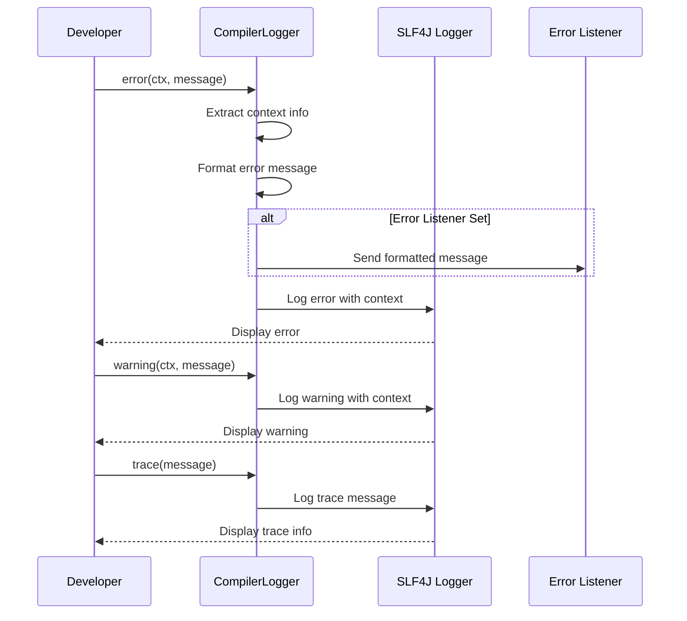
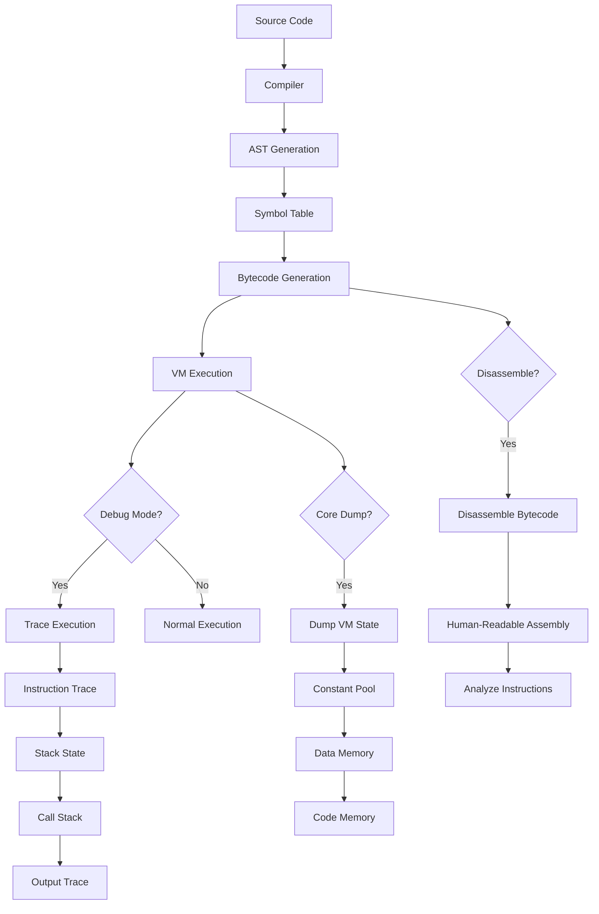
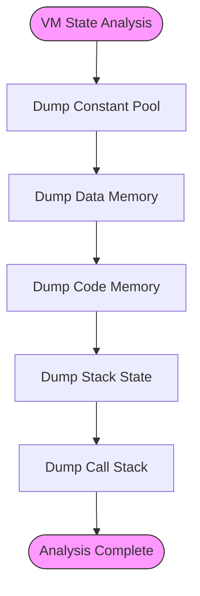
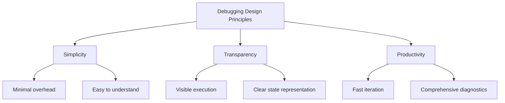

# Debugging Support

<cite>
**Referenced Files in This Document**   
- [DisAssembler.java](file://ep18/src/main/java/org/teachfx/antlr4/ep18/stackvm/DisAssembler.java)
- [CompilerLogger.java](file://ep19/src/main/java/org/teachfx/antlr4/ep19/misc/CompilerLogger.java)
- [VMInterpreter.java](file://ep18/src/main/java/org/teachfx/antlr4/ep18/VMInterpreter.java)
- [BytecodeDefinition.java](file://ep18/src/main/java/org/teachfx/antlr4/ep18/stackvm/BytecodeDefinition.java)
- [ByteCodeAssembler.java](file://ep18/src/main/java/org/teachfx/antlr4/ep18/stackvm/ByteCodeAssembler.java)
- [FunctionSymbol.java](file://ep18/src/main/java/org/teachfx/antlr4/ep18/stackvm/FunctionSymbol.java)
- [VM_Design.md](file://ep18/VM_Design.md)
</cite>

## Table of Contents
1. [Introduction](#introduction)
2. [Disassembler Implementation](#disassembler-implementation)
3. [Logging Infrastructure](#logging-infrastructure)
4. [Debugging Workflow](#debugging-workflow)
5. [Disassembly for Troubleshooting](#disassembly-for-troubleshooting)
6. [VM State Analysis](#vm-state-analysis)
7. [Design Rationale](#design-rationale)

## Introduction
This document provides comprehensive documentation for the virtual machine's debugging and diagnostic capabilities. It explains the disassembly process, logging infrastructure, debugging workflow, and analysis techniques for troubleshooting compilation and execution issues. The documentation covers how binary bytecode is converted back into human-readable assembly format, how execution traces are generated, and how to interpret VM state dumps and error messages.

## Disassembler Implementation

The DisAssembler class converts binary bytecode back into human-readable assembly format for inspection and debugging purposes. It works by decoding the raw byte instructions and mapping them to their corresponding mnemonic representations.

```mermaid
classDiagram
class DisAssembler {
+Object[] constPool
+byte[] code
+int codeSize
+BytecodeDefinition def
+DisAssembler(byte[], int, Object[])
+void disassemble()
+int disassembleInstruction(int)
+String showConstPoolOperand(int)
}
class BytecodeDefinition {
+short INSTR_IADD
+short INSTR_ISUB
+short INSTR_IMUL
+Instruction[] instructions
}
class FunctionSymbol {
+String name
+int nargs
+int nlocals
+int address
}
DisAssembler --> BytecodeDefinition : "uses"
DisAssembler --> FunctionSymbol : "references"
DisAssembler --> "constPool" : "accesses"
DisAssembler --> "code" : "reads"
```

**Diagram sources**
- [DisAssembler.java](file://ep18/src/main/java/org/teachfx/antlr4/ep18/stackvm/DisAssembler.java#L1-L76)
- [BytecodeDefinition.java](file://ep18/src/main/java/org/teachfx/antlr4/ep18/stackvm/BytecodeDefinition.java#L1-L136)
- [FunctionSymbol.java](file://ep18/src/main/java/org/teachfx/antlr4/ep18/stackvm/FunctionSymbol.java#L1-L40)

The disassembler processes each instruction sequentially by:
1. Reading the opcode at the current instruction pointer (ip)
2. Looking up the corresponding instruction definition in the BytecodeDefinition.instructions array
3. Formatting the instruction mnemonic and operands in a human-readable format
4. Handling different operand types (registers, constants, function references) appropriately

For constant pool references, the disassembler displays both the pool index and the actual value, with special formatting for strings (quoted) and function symbols (showing name and address).

**Section sources**
- [DisAssembler.java](file://ep18/src/main/java/org/teachfx/antlr4/ep18/stackvm/DisAssembler.java#L1-L76)
- [BytecodeDefinition.java](file://ep18/src/main/java/org/teachfx/antlr4/ep18/stackvm/BytecodeDefinition.java#L1-L136)

## Logging Infrastructure

The CompilerLogger class provides a centralized logging infrastructure for compiler diagnostics and debugging information. It uses SLF4J as the underlying logging framework and supports different log levels for various types of messages.



**Diagram sources**
- [CompilerLogger.java](file://ep19/src/main/java/org/teachfx/antlr4/ep19/misc/CompilerLogger.java#L1-L156)

The logging system captures important contextual information including:
- Source file name and location (line and character position)
- Relevant source code snippet (truncated if too long)
- Call stack information to determine the calling class
- Different severity levels (error, warning, info, debug, trace)

Error messages are particularly detailed, including the source file, line number, character position, and a snippet of the problematic code. The system also supports an optional error listener that can receive error messages programmatically, enabling integration with IDEs or other tools.

**Section sources**
- [CompilerLogger.java](file://ep19/src/main/java/org/teachfx/antlr4/ep19/misc/CompilerLogger.java#L1-L156)

## Debugging Workflow

The debugging workflow spans from compilation to VM execution analysis, providing multiple entry points for inspection and troubleshooting.



**Diagram sources**
- [VMInterpreter.java](file://ep18/src/main/java/org/teachfx/antlr4/ep18/VMInterpreter.java#L1-L423)
- [ByteCodeAssembler.java](file://ep18/src/main/java/org/teachfx/antlr4/ep18/stackvm/ByteCodeAssembler.java#L1-L270)

The debugging workflow begins with compilation, where the CompilerLogger captures warnings and errors. After successful compilation, the generated bytecode can be disassembled for inspection before execution. During VM execution, multiple debugging options are available:

1. **Trace mode** (-trace): Shows each instruction as it executes, along with current stack and call stack state
2. **Disassembly mode** (-dis): Outputs the complete disassembled bytecode after execution
3. **Core dump mode** (-dump): Displays the complete VM state including constant pool, data memory, and code memory

These options can be combined to provide comprehensive visibility into the execution process.

**Section sources**
- [VMInterpreter.java](file://ep18/src/main/java/org/teachfx/antlr4/ep18/VMInterpreter.java#L1-L423)
- [CompilerLogger.java](file://ep19/src/main/java/org/teachfx/antlr4/ep19/misc/CompilerLogger.java#L1-L156)

## Disassembly for Troubleshooting

Disassembly is a powerful tool for troubleshooting compilation issues by revealing the actual bytecode generated from source code. This allows developers to verify that the compiler is generating correct instructions and to identify optimization opportunities or bugs.

The disassembler output format includes:
- Instruction address (4-digit hexadecimal)
- Instruction mnemonic (left-aligned in 11-character field)
- Operands (with appropriate formatting based on type)

For example, a typical disassembly output might look like:
```
0000:    iconst      10
0005:    iconst      20
0010:    call        #2:main()@15
0015:    print       
0016:    halt        
```

When troubleshooting compilation issues, developers can:
1. Verify that constants are properly loaded into the constant pool
2. Check that function calls reference the correct function symbols
3. Confirm that control flow instructions (branches, jumps) have correct targets
4. Validate that arithmetic operations use the appropriate instruction variants

The disassembler also helps identify issues such as:
- Incorrect operand types being used
- Missing or extra instructions in critical sections
- Improper stack manipulation that could lead to underflow/overflow
- Incorrect function parameter passing and local variable allocation

**Section sources**
- [DisAssembler.java](file://ep18/src/main/java/org/teachfx/antlr4/ep18/stackvm/DisAssembler.java#L1-L76)
- [VMInterpreter.java](file://ep18/src/main/java/org/teachfx/antlr4/ep18/VMInterpreter.java#L1-L423)

## VM State Analysis

VM state dumps provide a comprehensive snapshot of the virtual machine's internal state at a given point in time, enabling deep analysis of execution issues.



**Diagram sources**
- [VMInterpreter.java](file://ep18/src/main/java/org/teachfx/antlr4/ep18/VMInterpreter.java#L1-L423)

The coredump functionality in VMInterpreter provides three main types of information:

1. **Constant Pool**: Lists all constants used in the program, including strings, numbers, and function symbols, with their memory addresses
2. **Data Memory**: Shows the contents of global variables with their values and types
3. **Code Memory**: Displays the raw bytecode in hexadecimal format for low-level analysis

Execution traces (enabled with -trace) provide real-time insight into the VM's operation, showing:
- The current instruction being executed
- The complete operand stack contents
- The current call stack with function names

Error messages follow a consistent format that includes:
- Error level (Error, Warning)
- Source file and location
- Descriptive message
- Relevant code snippet

This comprehensive state information allows developers to diagnose issues such as:
- Memory corruption
- Stack overflow/underflow
- Invalid instruction execution
- Type mismatches
- Null pointer dereferences

**Section sources**
- [VMInterpreter.java](file://ep18/src/main/java/org/teachfx/antlr4/ep18/VMInterpreter.java#L1-L423)

## Design Rationale

The debugging features were designed with several key principles in mind, as documented in the VM_Design.md file. The design emphasizes simplicity, transparency, and developer productivity.



**Diagram sources**
- [VM_Design.md](file://ep18/VM_Design.md#L1-L129)

Key design decisions include:

1. **Stack-based architecture**: Simplifies instruction decoding and execution tracing
2. **Explicit operand specification**: All operands are clearly visible in disassembly
3. **Centralized logging**: Single point for all diagnostic messages
4. **Multiple debug views**: Different levels of abstraction for different debugging needs
5. **Human-readable output**: Disassembled code uses mnemonics and symbolic references

The virtual machine's execution engine follows a clear fetch-decode-execute cycle with comprehensive runtime checks for:
- Stack overflow/underflow
- Memory access violations
- Type safety
- Arithmetic exceptions (division by zero)

The function call mechanism uses a straightforward stack frame model with clear parameter passing and return value handling. This design makes it easier to trace function calls and understand program flow during debugging.

**Section sources**
- [VM_Design.md](file://ep18/VM_Design.md#L1-L129)
- [VMInterpreter.java](file://ep18/src/main/java/org/teachfx/antlr4/ep18/VMInterpreter.java#L1-L423)