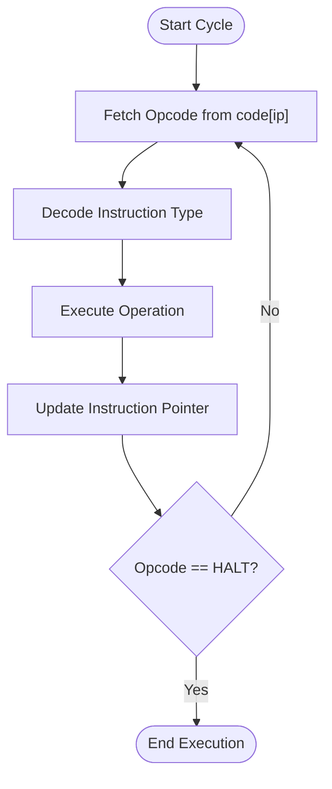
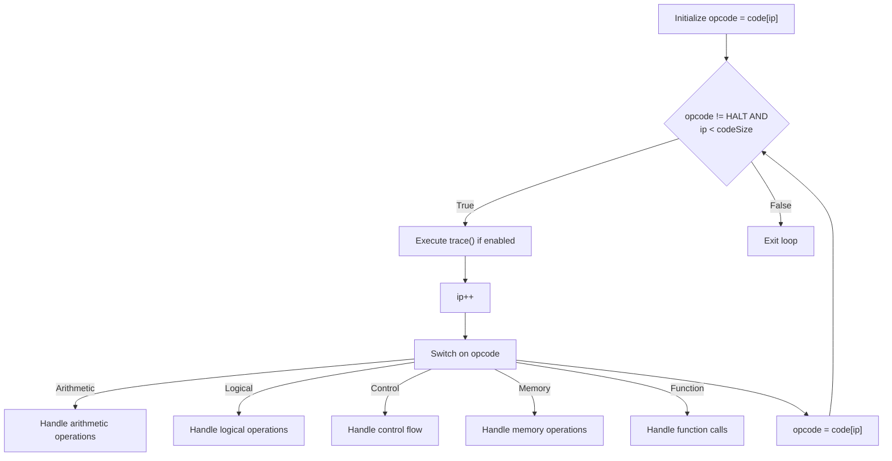
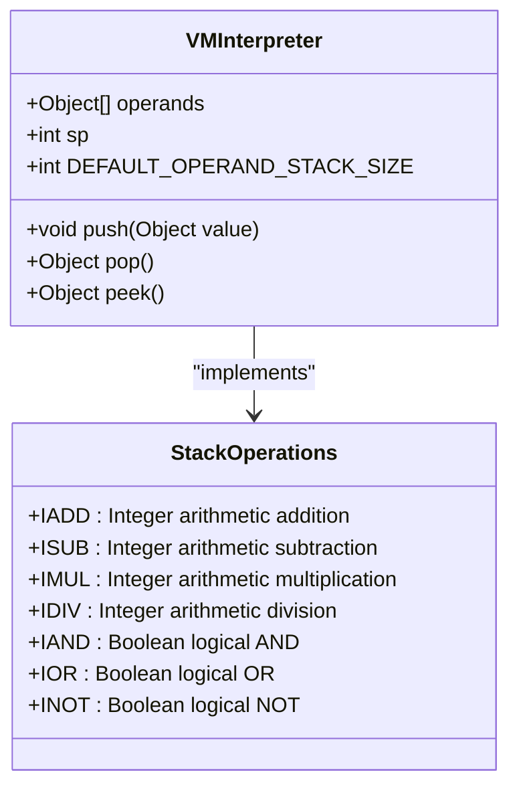
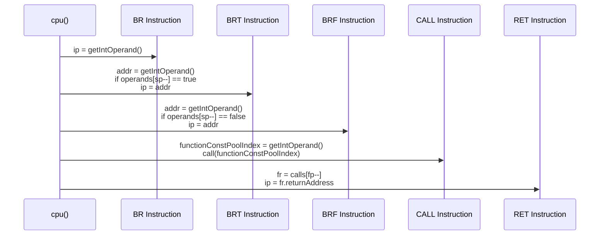
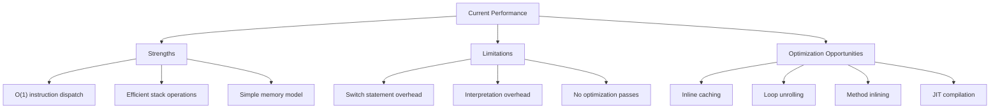
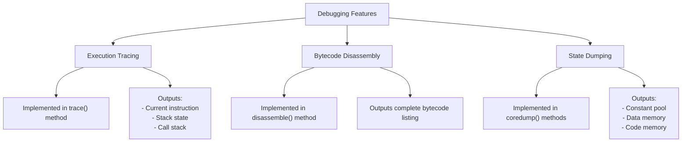

# Execution Engine

<cite>
**Referenced Files in This Document**   
- [VMInterpreter.java](file://ep18/src/main/java/org/teachfx/antlr4/ep18/VMInterpreter.java)
- [ByteCodeAssembler.java](file://ep18/src/main/java/org/teachfx/antlr4/ep18/stackvm/ByteCodeAssembler.java)
- [DisAssembler.java](file://ep18/src/main/java/org/teachfx/antlr4/ep18/stackvm/DisAssembler.java)
- [StackFrame.java](file://ep18/src/main/java/org/teachfx/antlr4/ep18/stackvm/StackFrame.java)
- [FunctionSymbol.java](file://ep18/src/main/java/org/teachfx/antlr4/ep18/stackvm/FunctionSymbol.java)
- [BytecodeDefinition.java](file://ep18/src/main/java/org/teachfx/antlr4/ep18/stackvm/BytecodeDefinition.java)
- [c.vm](file://ep18/src/main/resources/c.vm)
- [t.vm](file://ep18/src/main/resources/t.vm)
</cite>

## Table of Contents
1. [Introduction](#introduction)
2. [Instruction Fetch-Decode-Execute Cycle](#instruction-fetch-decode-execute-cycle)
3. [Main Execution Loop Structure](#main-execution-loop-structure)
4. [Operand Stack Operations](#operand-stack-operations)
5. [Control Flow Execution](#control-flow-execution)
6. [Performance Analysis](#performance-analysis)
7. [Debugging and Tracing Capabilities](#debugging-and-tracing-capabilities)
8. [Conclusion](#conclusion)

## Introduction
The virtual machine execution engine implemented in VMInterpreter.java provides a stack-based interpreter for executing bytecode instructions. This document details the core components of the execution engine, focusing on the instruction processing cycle, operand stack management, control flow handling, and debugging features. The engine processes bytecode generated from a custom assembly language and executes it through a fetch-decode-execute cycle with comprehensive tracing and debugging capabilities.

## Instruction Fetch-Decode-Execute Cycle

The execution engine implements a classic fetch-decode-execute cycle that processes bytecode instructions sequentially. The cycle begins with instruction fetch, where the current instruction pointer (ip) references the next bytecode to be executed. The decode phase interprets the opcode and determines the required operands, while the execute phase performs the actual operation.

The cycle is implemented in the cpu() method of VMInterpreter, which continuously processes instructions until encountering a halt instruction or reaching the end of the code segment. Each iteration of the loop fetches the current opcode, increments the instruction pointer, and dispatches to the appropriate operation handler through a switch statement.

**Diagram sources**
- [VMInterpreter.java](file://ep18/src/main/java/org/teachfx/antlr4/ep18/VMInterpreter.java#L150-L423)

**Section sources**
- [VMInterpreter.java](file://ep18/src/main/java/org/teachfx/antlr4/ep18/VMInterpreter.java#L150-L423)

## Main Execution Loop Structure

The main execution loop is implemented in the cpu() method, which serves as the central dispatch mechanism for all bytecode instructions. The loop maintains the instruction pointer (ip) and processes each opcode through a comprehensive switch statement that handles all defined instructions.

The execution loop begins by initializing the opcode from the current instruction pointer position and continues until either the HALT instruction is encountered or the instruction pointer exceeds the code size boundary. The loop structure ensures that each instruction is processed exactly once in sequence, with conditional branching instructions modifying the instruction pointer to implement control flow.

Key components of the execution loop include:
- Instruction pointer (ip) management
- Operand stack pointer (sp) manipulation
- Function call stack (fp) handling
- Global variable access
- Constant pool referencing

**Diagram sources**
- [VMInterpreter.java](file://ep18/src/main/java/org/teachfx/antlr4/ep18/VMInterpreter.java#L150-L423)

**Section sources**
- [VMInterpreter.java](file://ep18/src/main/java/org/teachfx/antlr4/ep18/VMInterpreter.java#L150-L423)

## Operand Stack Operations

The execution engine implements a stack-based architecture where all computations occur on an operand stack. The stack is represented by the operands array with a stack pointer (sp) tracking the current top position. The engine supports various stack operations including pushing constants, loading values, performing arithmetic, and storing results.

The operand stack handles multiple data types including integers, floating-point numbers, booleans, characters, and references. Type-specific operations are provided for arithmetic and logical computations, with conversion operations available for type coercion. The stack grows upward from index 0, with the stack pointer indicating the highest occupied position.

Stack operations include:
- Push operations (ICONST, FCONST, SCONST)
- Pop operations (POP)
- Arithmetic operations (IADD, ISUB, IMUL, IDIV)
- Logical operations (ILT, IGT, IEQ, INE)
- Type conversion (ITOF)

**Diagram sources**
- [VMInterpreter.java](file://ep18/src/main/java/org/teachfx/antlr4/ep18/VMInterpreter.java#L20-L35)
- [BytecodeDefinition.java](file://ep18/src/main/java/org/teachfx/antlr4/ep18/stackvm/BytecodeDefinition.java#L1-L137)

**Section sources**
- [VMInterpreter.java](file://ep18/src/main/java/org/teachfx/antlr4/ep18/VMInterpreter.java#L170-L250)

## Control Flow Execution

The execution engine supports complex control flow structures through conditional and unconditional branching instructions. These instructions manipulate the instruction pointer to implement loops, conditionals, and function calls. The control flow mechanism is demonstrated in the t.vm example program, which implements nested conditional logic and looping behavior.

Key control flow instructions include:
- BR (unconditional branch)
- BRT (branch if true)
- BRF (branch if false)
- CALL (function call)
- RET (function return)

The engine implements structured control flow by maintaining a call stack of StackFrame objects, each containing function metadata and local variables. When a function is called, a new stack frame is created and pushed onto the call stack, preserving the return address for later restoration.

**Diagram sources**
- [VMInterpreter.java](file://ep18/src/main/java/org/teachfx/antlr4/ep18/VMInterpreter.java#L250-L350)
- [t.vm](file://ep18/src/main/resources/t.vm#L1-L40)

**Section sources**
- [VMInterpreter.java](file://ep18/src/main/java/org/teachfx/antlr4/ep18/VMInterpreter.java#L250-L350)
- [t.vm](file://ep18/src/main/resources/t.vm#L1-L40)

## Performance Analysis

The interpreter loop in VMInterpreter.java implements a direct-threaded interpretation approach where each bytecode instruction is dispatched through a switch statement. This approach provides good performance for a software interpreter but has inherent limitations compared to compiled execution.

Performance characteristics include:
- O(1) instruction dispatch via switch statement
- Array-based operand stack with O(1) push/pop operations
- Direct memory access for global and local variables
- Function call overhead of O(n) where n is the number of parameters

The execution engine could benefit from several optimization opportunities:
- **Inline caching**: Cache frequently accessed values to reduce memory lookups
- **Loop unrolling**: Unroll tight loops to reduce branching overhead
- **Method inlining**: Inline small functions to eliminate call overhead
- **Just-in-time compilation**: Compile frequently executed code paths to native code

The current implementation prioritizes simplicity and debuggability over raw performance, making it suitable for educational purposes and development environments rather than production deployment.

**Diagram sources**
- [VMInterpreter.java](file://ep18/src/main/java/org/teachfx/antlr4/ep18/VMInterpreter.java#L150-L423)

**Section sources**
- [VMInterpreter.java](file://ep18/src/main/java/org/teachfx/antlr4/ep18/VMInterpreter.java#L150-L423)

## Debugging and Tracing Capabilities

The execution engine includes comprehensive debugging and tracing capabilities designed to facilitate development and troubleshooting. These features can be enabled through command-line arguments and provide detailed insight into the execution state.

Key debugging features include:
- **Execution tracing** (-trace flag): Prints each instruction as it executes along with stack and call frame state
- **Disassembly** (-dis flag): Outputs a complete disassembly of the loaded bytecode
- **Core dumping** (-dump flag): Dumps the complete state of the virtual machine including constant pool, data memory, and code memory

The trace() method provides real-time visibility into the execution process, displaying the current instruction, operand stack contents, and active function calls. This feature is invaluable for understanding program flow and identifying logical errors in the bytecode.

**Diagram sources**
- [VMInterpreter.java](file://ep18/src/main/java/org/teachfx/antlr4/ep18/VMInterpreter.java#L370-L423)
- [DisAssembler.java](file://ep18/src/main/java/org/teachfx/antlr4/ep18/stackvm/DisAssembler.java#L1-L77)

**Section sources**
- [VMInterpreter.java](file://ep18/src/main/java/org/teachfx/antlr4/ep18/VMInterpreter.java#L370-L423)
- [DisAssembler.java](file://ep18/src/main/java/org/teachfx/antlr4/ep18/stackvm/DisAssembler.java#L1-L77)

## Conclusion
The virtual machine execution engine in VMInterpreter.java implements a robust stack-based interpreter with a clear fetch-decode-execute cycle. The engine efficiently processes bytecode instructions through a central dispatch loop, managing operand stack operations, control flow, and function calls. While the current implementation prioritizes clarity and debuggability, it provides a solid foundation that could be extended with various optimization techniques for improved performance. The comprehensive debugging and tracing capabilities make it particularly well-suited for educational purposes and development environments where visibility into the execution process is essential.