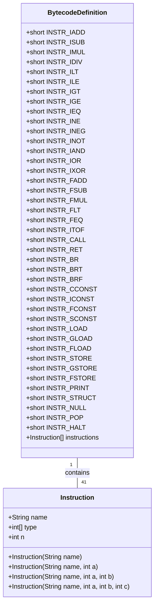
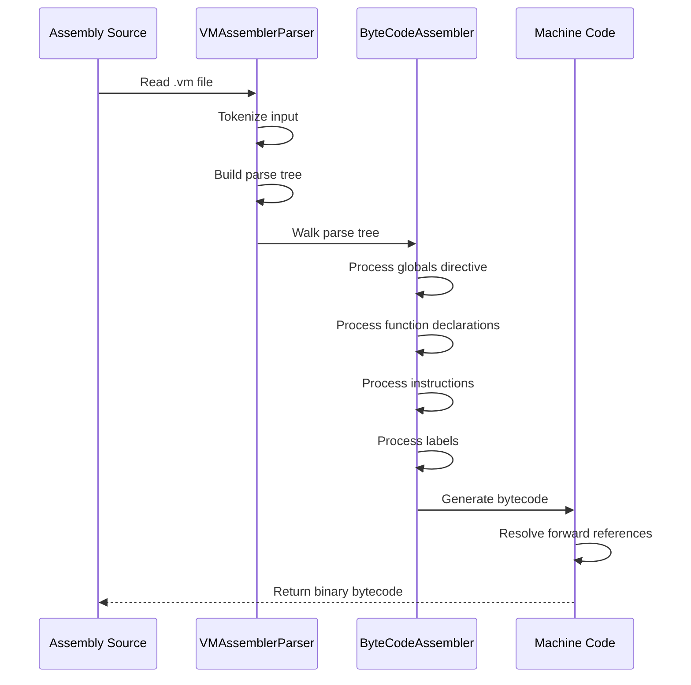
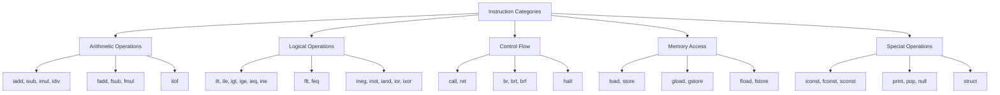
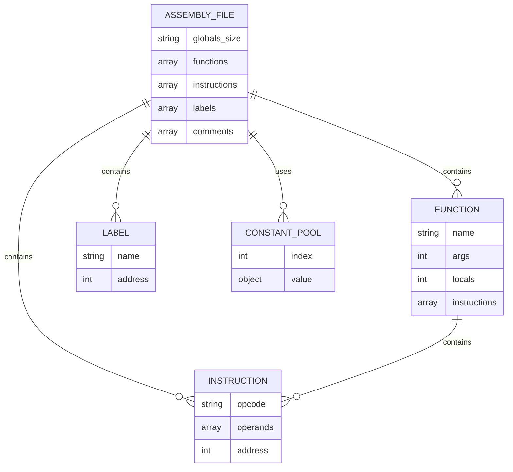
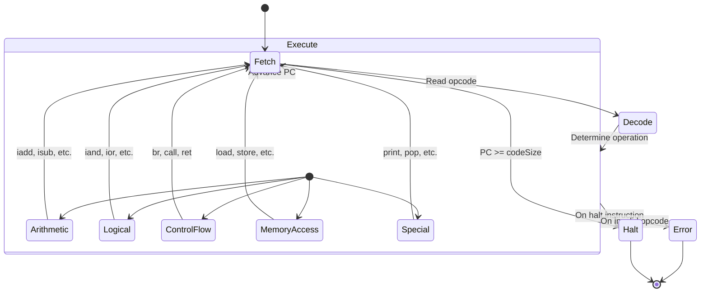

# Instruction Set

<cite>
**Referenced Files in This Document**   
- [BytecodeDefinition.java](file://ep18/src/main/java/org/teachfx/antlr4/ep18/stackvm/BytecodeDefinition.java)
- [ByteCodeAssembler.java](file://ep18/src/main/java/org/teachfx/antlr4/ep18/stackvm/ByteCodeAssembler.java)
- [VMAssemblerParser.java](file://ep18/src/main/java/org/teachfx/antlr4/ep18/parser/VMAssemblerParser.java)
- [VMInterpreter.java](file://ep18/src/main/java/org/teachfx/antlr4/ep18/VMInterpreter.java)
- [c.vm](file://ep18/src/main/resources/c.vm)
- [t.vm](file://ep18/src/main/resources/t.vm)
- [VM_Design.md](file://ep18/VM_Design.md)
</cite>

## Table of Contents
1. [Introduction](#introduction)
2. [Instruction Set Architecture](#instruction-set-architecture)
3. [Bytecode Definition and Encoding](#bytecode-definition-and-encoding)
4. [Assembly Process and Syntax](#assembly-process-and-syntax)
5. [Instruction Reference](#instruction-reference)
6. [Assembly File Format](#assembly-file-format)
7. [Encoding Examples](#encoding-examples)
8. [Virtual Machine Execution Model](#virtual-machine-execution-model)

## Introduction
This document provides comprehensive documentation for the virtual machine's instruction set architecture. It details the complete set of bytecode operations, their encoding, and execution semantics. The virtual machine implements a stack-based architecture with a rich instruction set supporting arithmetic operations, control flow, function calls, and memory management. The documentation covers the definition of instructions in BytecodeDefinition.java, the assembly process through ByteCodeAssembler.java, and the mapping from human-readable assembly to binary bytecode. Two example programs (c.vm and t.vm) demonstrate the practical application of the instruction set for complex computational tasks involving function calls, loops, and conditional branching.

## Instruction Set Architecture
The virtual machine implements a stack-based architecture where operations manipulate values on an operand stack. Each instruction consists of an opcode followed by zero or more operands, with operands encoded as 4-byte signed integers. The instruction set is designed to support a wide range of operations including arithmetic computations, logical operations, control flow, function calls, and memory access. The architecture follows a register-indirect addressing model for local and global variables, using integer indices to reference locations in the current stack frame or global memory space. The virtual machine maintains separate memory regions for code, data, and stack, with the stack growing downward during function calls. The execution model is based on a fetch-decode-execute cycle where the program counter advances through the bytecode stream, dispatching to appropriate handlers for each opcode.

**Section sources**
- [VM_Design.md](file://ep18/VM_Design.md#L1-L130)
- [VMInterpreter.java](file://ep18/src/main/java/org/teachfx/antlr4/ep18/VMInterpreter.java#L1-L424)

## Bytecode Definition and Encoding
The complete set of supported instructions is defined in BytecodeDefinition.java, which establishes the opcode mapping and operand types for each bytecode operation. Each instruction is assigned a unique 16-bit opcode value, with the instruction set organized to accommodate future expansion. The encoding scheme uses variable-length instructions where the opcode is stored as a single byte, followed by zero or more 4-byte operands depending on the instruction type. Operand types are categorized as immediate integers (INT), constant pool references (POOL), function symbols (FUNC), or register identifiers (REG). The Instruction class within BytecodeDefinition encapsulates the metadata for each opcode, including its mnemonic name and the expected types of its operands. This metadata is used by the assembler to validate operand types during the assembly process and by the disassembler to properly interpret binary bytecode.



**Diagram sources**
- [BytecodeDefinition.java](file://ep18/src/main/java/org/teachfx/antlr4/ep18/stackvm/BytecodeDefinition.java#L1-L137)

**Section sources**
- [BytecodeDefinition.java](file://ep18/src/main/java/org/teachfx/antlr4/ep18/stackvm/BytecodeDefinition.java#L1-L137)

## Assembly Process and Syntax
The assembly process is implemented by ByteCodeAssembler.java, which translates human-readable assembly code into binary bytecode. The assembler operates as an ANTLR4 parse tree listener, processing the abstract syntax tree generated from the assembly source. It maintains several key data structures during assembly: a byte array for the generated machine code, a constant pool for literals and symbols, a map of instruction opcodes, and a symbol table for labels and functions. The assembly process involves several phases: first, instruction mnemonics are mapped to their corresponding opcodes using a lookup table initialized from BytecodeDefinition.instructions; second, operands are encoded according to their type, with integers and characters converted directly, while strings, floats, and symbols are stored in the constant pool and referenced by index; third, forward references to labels are resolved by patching jump targets after all labels have been defined. The VMAssemblerParser defines the grammar for the assembly language, supporting directives like .def for function declarations, labels ending with a colon, and instruction lines with optional operands separated by commas.



**Diagram sources**
- [ByteCodeAssembler.java](file://ep18/src/main/java/org/teachfx/antlr4/ep18/stackvm/ByteCodeAssembler.java#L1-L271)
- [VMAssemblerParser.java](file://ep18/src/main/java/org/teachfx/antlr4/ep18/parser/VMAssemblerParser.java#L1-L614)

**Section sources**
- [ByteCodeAssembler.java](file://ep18/src/main/java/org/teachfx/antlr4/ep18/stackvm/ByteCodeAssembler.java#L1-L271)

## Instruction Reference
The virtual machine supports 41 distinct bytecode instructions categorized into arithmetic, logical, control flow, memory access, and special operations. Each instruction is identified by a unique opcode and may accept zero to three operands. The following table provides a complete reference of all instructions, including their opcode, operand types, and semantic meaning.



**Diagram sources**
- [BytecodeDefinition.java](file://ep18/src/main/java/org/teachfx/antlr4/ep18/stackvm/BytecodeDefinition.java#L1-L137)

**Section sources**
- [BytecodeDefinition.java](file://ep18/src/main/java/org/teachfx/antlr4/ep18/stackvm/BytecodeDefinition.java#L1-L137)

### Complete Instruction Set Reference

| Opcode | Mnemonic | Operands | Description |
|--------|----------|---------|-------------|
| 1 | iadd | - | Integer addition: pops two integers, pushes their sum |
| 2 | isub | - | Integer subtraction: pops two integers, pushes their difference |
| 3 | imul | - | Integer multiplication: pops two integers, pushes their product |
| 4 | idiv | - | Integer division: pops two integers, pushes their quotient |
| 5 | ilt | - | Integer less than: pops two integers, pushes boolean result |
| 6 | ile | - | Integer less or equal: pops two integers, pushes boolean result |
| 7 | igt | - | Integer greater than: pops two integers, pushes boolean result |
| 8 | ige | - | Integer greater or equal: pops two integers, pushes boolean result |
| 9 | ieq | - | Integer equal: pops two integers, pushes boolean result |
| 10 | ine | - | Integer not equal: pops two integers, pushes boolean result |
| 11 | ineg | - | Integer negate: pops one integer, pushes its negation |
| 12 | inot | - | Integer not: pops one boolean, pushes its logical negation |
| 13 | iand | - | Integer and: pops two booleans, pushes their logical AND |
| 14 | ior | - | Integer or: pops two booleans, pushes their logical OR |
| 15 | ixor | - | Integer xor: pops two booleans, pushes their logical XOR |
| 16 | fadd | - | Float addition: pops two floats, pushes their sum |
| 17 | fsub | - | Float subtraction: pops two floats, pushes their difference |
| 18 | fmul | - | Float multiplication: pops two floats, pushes their product |
| 19 | flt | - | Float less than: pops two floats, pushes boolean result |
| 20 | feq | - | Float equal: pops two floats, pushes boolean result |
| 21 | itof | - | Integer to float: pops one integer, pushes its float conversion |
| 22 | call | FUNC | Call function: calls function at specified constant pool index |
| 23 | ret | - | Return from function: returns to caller |
| 24 | br | INT | Branch unconditionally to address |
| 25 | brt | INT | Branch if true: pops boolean, branches if true |
| 26 | brf | INT | Branch if false: pops boolean, branches if false |
| 27 | cconst | INT | Push character constant |
| 28 | iconst | INT | Push integer constant |
| 29 | fconst | POOL | Push float constant from constant pool |
| 30 | sconst | POOL | Push string constant from constant pool |
| 31 | load | INT | Load from local variable |
| 32 | gload | INT | Load from global variable |
| 33 | fload | INT | Load from struct field |
| 34 | store | INT | Store to local variable |
| 35 | gstore | INT | Store to global variable |
| 36 | fstore | INT | Store to struct field |
| 37 | print | - | Print top of stack |
| 38 | struct | INT | Create struct with specified number of fields |
| 39 | null | - | Push null reference |
| 40 | pop | - | Pop and discard top of stack |
| 41 | halt | - | Halt execution |

## Assembly File Format
The virtual machine assembly files (.vm files) follow a structured format that begins with optional global data declarations followed by function definitions and instructions. The file format supports several key elements: the .globals directive specifies the size of global memory, the .def directive declares a function with its parameter and local variable counts, labels provide symbolic names for instruction addresses, and instruction lines contain opcodes with optional operands. Comments are supported using semicolon (;) and extend to the end of the line. The assembly syntax is line-oriented, with each instruction occupying a separate line. Operands are separated by commas when multiple operands are present. The assembler processes the file sequentially, first collecting all symbol definitions and then generating the corresponding bytecode. Forward references to labels are allowed and resolved during the assembly process. The constant pool is built dynamically as literals and symbols are encountered, with duplicate entries eliminated.



**Diagram sources**
- [VM_Design.md](file://ep18/VM_Design.md#L1-L130)
- [c.vm](file://ep18/src/main/resources/c.vm#L1-L29)
- [t.vm](file://ep18/src/main/resources/t.vm#L1-L40)

**Section sources**
- [c.vm](file://ep18/src/main/resources/c.vm#L1-L29)
- [t.vm](file://ep18/src/main/resources/t.vm#L1-L40)

## Encoding Examples
The encoding process transforms human-readable assembly into binary bytecode according to the rules defined in BytecodeDefinition.java and implemented in ByteCodeAssembler.java. For arithmetic operations, the encoding is straightforward: the opcode is written as a single byte, followed by any operands as 4-byte integers. For example, the instruction "iconst 10" is encoded as byte 28 (the opcode for iconst) followed by the 4-byte representation of integer 10. Control flow instructions use symbolic labels that are resolved to absolute addresses during assembly. Function calls encode the function name as an index into the constant pool, where the function symbol is stored. The following examples demonstrate the encoding of common operations:

**Arithmetic Operation Example:**
```assembly
iconst 10
iconst 20
iadd
```
This sequence pushes two integers onto the stack and adds them. The encoding would be: 28 (iconst) + 4-byte 10 + 28 (iconst) + 4-byte 20 + 1 (iadd).

**Control Flow Example:**
```assembly
load 0
iconst 0
igt
brf L6
```
This sequence loads a variable, compares it with zero, and branches if it's not greater. The encoding would resolve the label L6 to an absolute address during assembly.

**Function Call Example:**
```assembly
.def f: args=2, locals=1
    load 0
    load 1
    call ck()
    ret
```
This function definition shows how parameters are accessed via load instructions and how function calls are made using the call instruction with a function symbol.

**Section sources**
- [c.vm](file://ep18/src/main/resources/c.vm#L1-L29)
- [t.vm](file://ep18/src/main/resources/t.vm#L1-L40)

## Virtual Machine Execution Model
The virtual machine executes bytecode through a fetch-decode-execute cycle implemented in VMInterpreter.java. The execution model maintains several key components: the program counter (ip) that points to the current instruction, the operand stack (operands) that stores values being manipulated, the call stack (calls) that manages function invocations, and the constant pool (constPool) that stores literals and symbols. When executing an instruction, the virtual machine first fetches the opcode from the code memory at the current program counter position, then decodes the instruction to determine its operation and operand count, and finally executes the corresponding operation. Arithmetic and logical operations pop their operands from the stack, perform the computation, and push the result back onto the stack. Memory access instructions use integer indices to reference locations in the current stack frame or global memory. Control flow instructions modify the program counter to implement branching and function calls. The execution continues until the halt instruction is encountered or an error occurs.



**Diagram sources**
- [VMInterpreter.java](file://ep18/src/main/java/org/teachfx/antlr4/ep18/VMInterpreter.java#L1-L424)

**Section sources**
- [VMInterpreter.java](file://ep18/src/main/java/org/teachfx/antlr4/ep18/VMInterpreter.java#L1-L424)