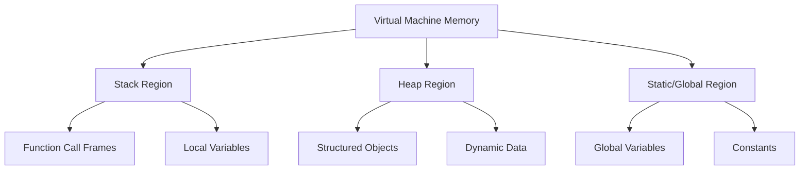
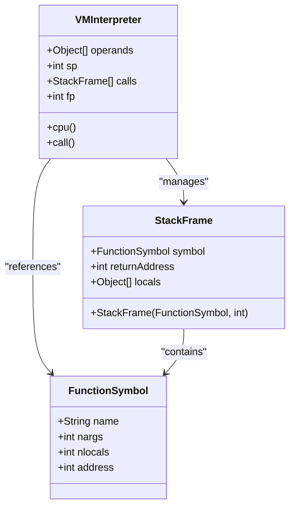
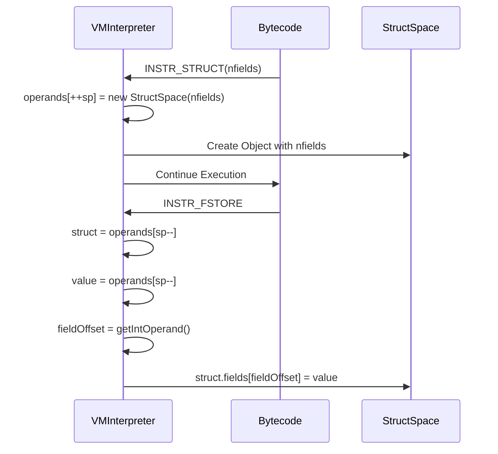
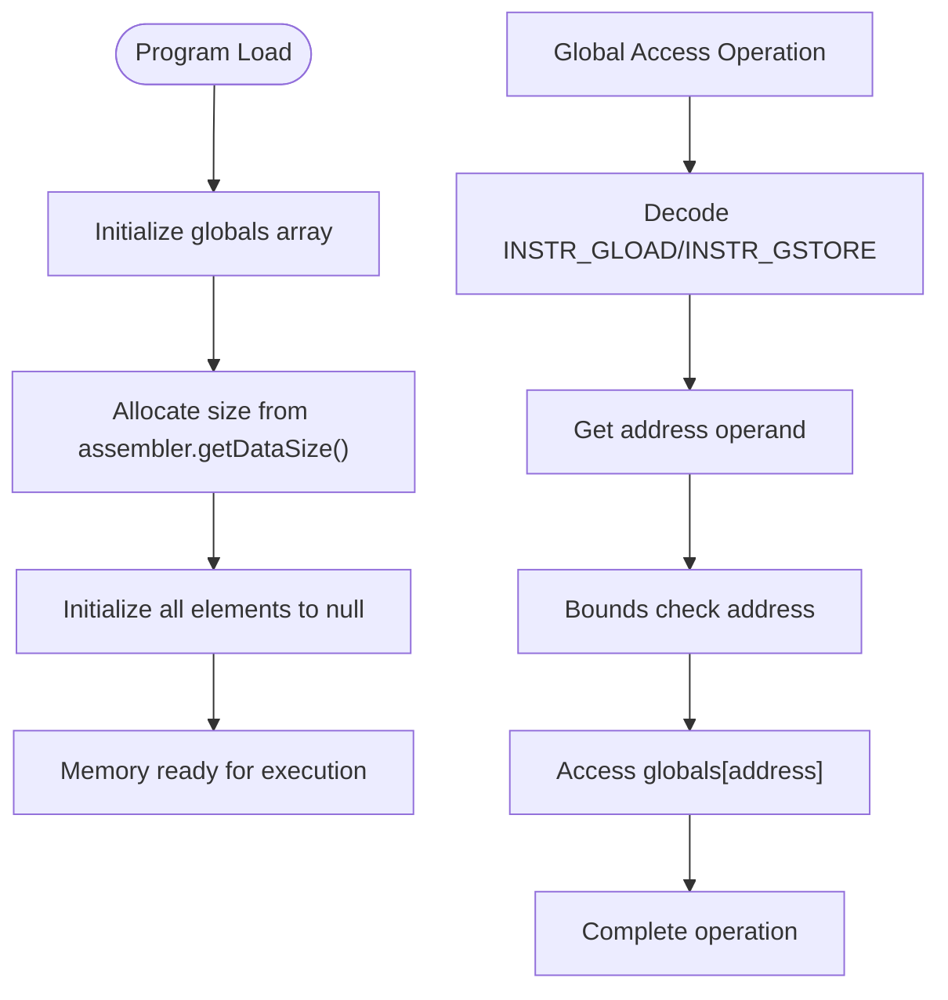
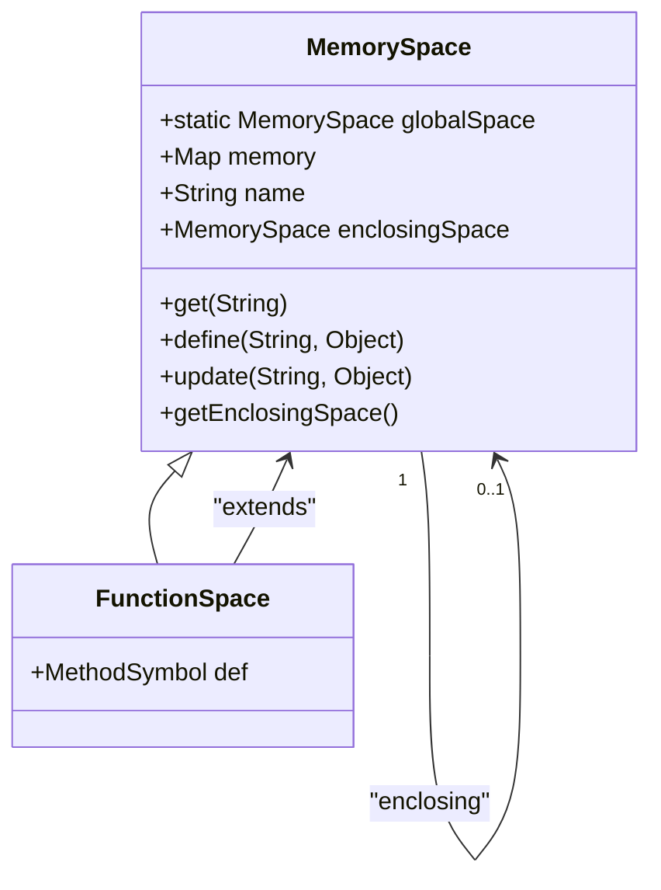
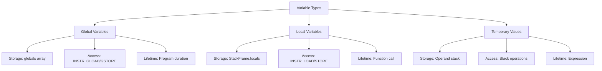
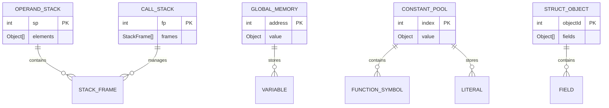

# Memory Model

<cite>
**Referenced Files in This Document**   
- [StructSpace.java](file://ep18/src/main/java/org/teachfx/antlr4/ep18/stackvm/StructSpace.java)
- [MemorySpace.java](file://ep19/src/main/java/org/teachfx/antlr4/ep19/runtime/MemorySpace.java)
- [FunctionSpace.java](file://ep19/src/main/java/org/teachfx/antlr4/ep19/runtime/FunctionSpace.java)
- [VMInterpreter.java](file://ep18/src/main/java/org/teachfx/antlr4/ep18/VMInterpreter.java)
- [StackFrame.java](file://ep18/src/main/java/org/teachfx/antlr4/ep18/stackvm/StackFrame.java)
- [FunctionSymbol.java](file://ep18/src/main/java/org/teachfx/antlr4/ep18/stackvm/FunctionSymbol.java)
</cite>

## Table of Contents
1. [Introduction](#introduction)
2. [Memory Regions Overview](#memory-regions-overview)
3. [Stack Memory Organization](#stack-memory-organization)
4. [Heap Memory Management](#heap-memory-management)
5. [Static and Global Memory](#static-and-global-memory)
6. [Structured Data Handling with StructSpace](#structured-data-handling-with-structspace)
7. [General Memory Operations via MemorySpace](#general-memory-operations-via-memoryspace)
8. [Function Code and Metadata Storage](#function-code-and-metadata-storage)
9. [Variable Storage Strategies](#variable-storage-strategies)
10. [Memory Layout Diagrams](#memory-layout-diagrams)
11. [Memory Access Patterns and Bounds Checking](#memory-access-patterns-and-bounds-checking)
12. [Garbage Collection Considerations](#garbage-collection-considerations)

## Introduction
This document provides a comprehensive analysis of the virtual machine's memory model as implemented in the Antlr4-based programming language compiler and runtime system. The memory architecture is designed to support efficient execution of compiled bytecode while maintaining clear separation between different types of data and code. The system implements a multi-region memory model consisting of stack, heap, and static/global regions, each serving distinct purposes in program execution. Key components such as StructSpace.java, MemorySpace.java, and FunctionSpace.java provide specialized memory management capabilities for structured data, general variable storage, and function metadata respectively.

## Memory Regions Overview
The virtual machine implements a three-tiered memory architecture that separates execution concerns into distinct regions: stack memory for function call management and local variables, heap memory for dynamic object allocation, and static/global memory for program-wide data storage. This separation enables efficient memory management, predictable performance characteristics, and simplified garbage collection strategies. The stack region handles function call frames and local variable storage with LIFO semantics, while the heap accommodates dynamically allocated objects including structured data types. The static region maintains global variables and constants accessible throughout program execution. This architectural division follows conventional virtual machine design patterns while incorporating language-specific optimizations for the implemented grammar and type system.

**Diagram sources**
- [VMInterpreter.java](file://ep18/src/main/java/org/teachfx/antlr4/ep18/VMInterpreter.java#L0-L423)
- [MemorySpace.java](file://ep19/src/main/java/org/teachfx/antlr4/ep19/runtime/MemorySpace.java#L0-L74)

## Stack Memory Organization
The stack memory region is implemented as a fixed-size array of Object references managed by the VMInterpreter, with each function call creating a new stack frame containing local variables and execution context. Stack frames are allocated in the calls array and managed through the frame pointer (fp) and stack pointer (sp) registers, following conventional stack-based virtual machine design. Each StackFrame contains a reference to its associated FunctionSymbol, return address, and an array of locals sized according to the function's parameter and local variable count. The operand stack operates separately, storing intermediate computation results during bytecode execution. Function calls push new frames onto the stack, while returns pop frames and restore the previous execution context, enabling proper nested function invocation and recursion support.

**Diagram sources**
- [StackFrame.java](file://ep18/src/main/java/org/teachfx/antlr4/ep18/stackvm/StackFrame.java#L0-L13)
- [FunctionSymbol.java](file://ep18/src/main/java/org/teachfx/antlr4/ep18/stackvm/FunctionSymbol.java#L0-L39)
- [VMInterpreter.java](file://ep18/src/main/java/org/teachfx/antlr4/ep18/VMInterpreter.java#L0-L423)

**Section sources**
- [StackFrame.java](file://ep18/src/main/java/org/teachfx/antlr4/ep18/stackvm/StackFrame.java#L0-L13)
- [VMInterpreter.java](file://ep18/src/main/java/org/teachfx/antlr4/ep18/VMInterpreter.java#L0-L423)

## Heap Memory Management
Heap memory in this virtual machine implementation is primarily managed through the StructSpace class, which provides dynamic object allocation capabilities for structured data types. Unlike traditional heap implementations with complex allocation algorithms, this system uses Java's native object allocation and garbage collection, leveraging the host JVM's memory management. Structured objects are created via the INSTR_STRUCT bytecode instruction, which allocates a new StructSpace instance with a specified number of fields. These objects are stored in the general object heap and can be referenced from both stack and global memory regions. Field access operations (INSTR_FLOAD and INSTR_FSTORE) provide bounds-checked access to structure fields, preventing memory corruption. The heap design prioritizes simplicity and safety over performance optimization, relying on the underlying Java runtime for efficient memory management.

**Diagram sources**
- [StructSpace.java](file://ep18/src/main/java/org/teachfx/antlr4/ep18/stackvm/StructSpace.java#L0-L15)
- [VMInterpreter.java](file://ep18/src/main/java/org/teachfx/antlr4/ep18/VMInterpreter.java#L0-L423)

**Section sources**
- [StructSpace.java](file://ep18/src/main/java/org/teachfx/antlr4/ep18/stackvm/StructSpace.java#L0-L15)
- [VMInterpreter.java](file://ep18/src/main/java/org/teachfx/antlr4/ep18/VMInterpreter.java#L267-L298)

## Static and Global Memory
The static and global memory region is implemented as a fixed-size array of Object references in the VMInterpreter class, initialized during program loading based on the data size determined by the assembler. This region stores global variables and constants that persist for the duration of program execution, accessible from any function context through explicit bytecode instructions. The globals array is indexed by pre-allocated addresses assigned during compilation, providing direct memory access without lookup overhead. Global variables are accessed via INSTR_GLOAD and INSTR_GSTORE bytecode instructions, which take an address operand specifying the target location. The region is initialized to null references, with actual values populated during program execution. This design provides predictable performance for global access operations while maintaining compatibility with the stack-based execution model.

**Diagram sources**
- [VMInterpreter.java](file://ep18/src/main/java/org/teachfx/antlr4/ep18/VMInterpreter.java#L0-L423)

**Section sources**
- [VMInterpreter.java](file://ep18/src/main/java/org/teachfx/antlr4/ep18/VMInterpreter.java#L267-L298)

## Structured Data Handling with StructSpace
The StructSpace class provides specialized memory management for structured data types, implementing a fixed-size array of Object references that represent object fields. Each StructSpace instance is created with a predetermined number of fields specified at construction time, supporting the object-oriented features of the implemented language. The class serves as a container for structured data allocated on the heap, with field access controlled through dedicated bytecode instructions that perform bounds checking. The implementation uses Java's native array bounds checking to prevent memory access violations, enhancing system security and stability. Structured objects can contain references to other objects, enabling complex data structures and object graphs. The toString method provides debugging support by displaying field contents in array format, facilitating program analysis and troubleshooting.

**Section sources**
- [StructSpace.java](file://ep18/src/main/java/org/teachfx/antlr4/ep18/stackvm/StructSpace.java#L0-L15)

## General Memory Operations via MemorySpace
The MemorySpace class implements a hierarchical scope management system using a linked chain of symbol tables, providing efficient variable storage and retrieval for both global and local contexts. Each MemorySpace contains a HashMap for local variable storage and maintains a reference to its enclosing (parent) space, enabling lexical scoping and variable shadowing. The implementation supports variable definition, retrieval, and updating operations with automatic delegation to enclosing scopes when a variable is not found in the current scope. The get method implements a cascading lookup strategy, first checking the local memory and then delegating to the enclosing space if necessary. This design enables proper support for nested function definitions and closures while maintaining efficient access patterns. The globalSpace static instance provides a singleton entry point for the scope hierarchy.

**Diagram sources**
- [MemorySpace.java](file://ep19/src/main/java/org/teachfx/antlr4/ep19/runtime/MemorySpace.java#L0-L74)
- [FunctionSpace.java](file://ep19/src/main/java/org/teachfx/antlr4/ep19/runtime/FunctionSpace.java#L0-L19)

**Section sources**
- [MemorySpace.java](file://ep19/src/main/java/org/teachfx/antlr4/ep19/runtime/MemorySpace.java#L50-L73)

## Function Code and Metadata Storage
Function metadata and code storage is managed through the FunctionSymbol class and associated constant pool mechanisms, providing a comprehensive representation of callable routines within the virtual machine. Each FunctionSymbol contains essential metadata including the function name, parameter count, local variable count, and entry address in the bytecode stream. These symbols are stored in the constant pool and referenced by index during function invocation, enabling efficient lookup and call resolution. The FunctionSpace class extends MemorySpace to provide function-specific scope management, associating each function with its defining MethodSymbol and enclosing scope. During function calls, the VMInterpreter uses the function's metadata to allocate the appropriate stack frame size and manage parameter passing. This design enables proper function invocation semantics, including parameter binding, local variable allocation, and return address management.

**Section sources**
- [FunctionSymbol.java](file://ep18/src/main/java/org/teachfx/antlr4/ep18/stackvm/FunctionSymbol.java#L0-L39)
- [FunctionSpace.java](file://ep19/src/main/java/org/teachfx/antlr4/ep19/runtime/FunctionSpace.java#L0-L19)

## Variable Storage Strategies
The virtual machine implements distinct storage strategies for global versus local variables, optimizing access patterns and lifetime management for each category. Global variables are stored in the fixed-size globals array and accessed via direct memory addressing using INSTR_GLOAD and INSTR_GSTORE instructions, providing constant-time access with no lookup overhead. Local variables are stored within the current stack frame's locals array and accessed via INSTR_LOAD and INSTR_STORE instructions with frame-relative addressing, enabling efficient access within function contexts. The MemorySpace hierarchy provides an additional layer of symbolic access for variables, supporting lexical scoping and dynamic lookup when needed. Variable storage follows a strict lifetime model: global variables persist for program duration, local variables exist for the function call duration, and temporary values are managed on the operand stack with expression-level lifetime.

**Diagram sources**
- [VMInterpreter.java](file://ep18/src/main/java/org/teachfx/antlr4/ep18/VMInterpreter.java#L267-L298)
- [StackFrame.java](file://ep18/src/main/java/org/teachfx/antlr4/ep18/stackvm/StackFrame.java#L0-L13)

## Memory Layout Diagrams
The virtual machine's memory layout consists of several distinct regions organized to support efficient program execution and memory management. The operand stack stores intermediate computation results during bytecode execution, operating as a push-down stack with the stack pointer (sp) tracking the current top position. The call stack maintains function execution contexts, with each stack frame containing function metadata, return addresses, and local variables. The global memory region provides persistent storage for program-wide variables, while the constant pool stores literals and function symbols. The heap space, managed by the host JVM, accommodates dynamically allocated objects including structured data. These regions work together to provide a complete memory model that supports the language's features while maintaining execution efficiency.

**Diagram sources**
- [VMInterpreter.java](file://ep18/src/main/java/org/teachfx/antlr4/ep18/VMInterpreter.java#L0-L423)
- [StackFrame.java](file://ep18/src/main/java/org/teachfx/antlr4/ep18/stackvm/StackFrame.java#L0-L13)
- [StructSpace.java](file://ep18/src/main/java/org/teachfx/antlr4/ep18/stackvm/StructSpace.java#L0-L15)

## Memory Access Patterns and Bounds Checking
Memory access in the virtual machine follows strict patterns designed to ensure safety and prevent memory corruption, with comprehensive bounds checking implemented at the bytecode execution level. Stack operations are protected by explicit bounds checks on the stack pointer, preventing underflow and overflow conditions during push and pop operations. Local variable access through INSTR_LOAD and INSTR_STORE instructions relies on the pre-validated size of the locals array in each stack frame, with Java's array bounds checking providing automatic protection. Global memory access uses the pre-allocated globals array size as a natural boundary, with array access exceptions preventing out-of-bounds access. Structured data field access via INSTR_FLOAD and INSTR_FSTORE benefits from Java's native array bounds checking, ensuring field index validity. The design leverages the host JVM's safety features while adding additional validation in critical execution paths.

**Section sources**
- [VMInterpreter.java](file://ep18/src/main/java/org/teachfx/antlr4/ep18/VMInterpreter.java#L267-L298)
- [StructSpace.java](file://ep18/src/main/java/org/teachfx/antlr4/ep18/stackvm/StructSpace.java#L0-L15)

## Garbage Collection Considerations
The garbage collection strategy in this virtual machine implementation relies entirely on the host Java Virtual Machine's automatic memory management system, leveraging its mature and optimized garbage collection algorithms. Since all allocated objects, including StructSpace instances and other data structures, are standard Java objects, they participate in the JVM's normal garbage collection cycles. The design ensures proper object reachability tracking through well-defined reference patterns: stack frames maintain references to local variables, global memory holds references to persistent data, and structured objects contain references to their fields. When objects become unreachable from these root sets, they become eligible for garbage collection. The system does not implement manual memory management or finalization protocols, instead depending on Java's automatic reference counting and tracing collectors to reclaim unused memory efficiently and safely.

**Section sources**
- [StructSpace.java](file://ep18/src/main/java/org/teachfx/antlr4/ep18/stackvm/StructSpace.java#L0-L15)
- [MemorySpace.java](file://ep19/src/main/java/org/teachfx/antlr4/ep19/runtime/MemorySpace.java#L0-L74)