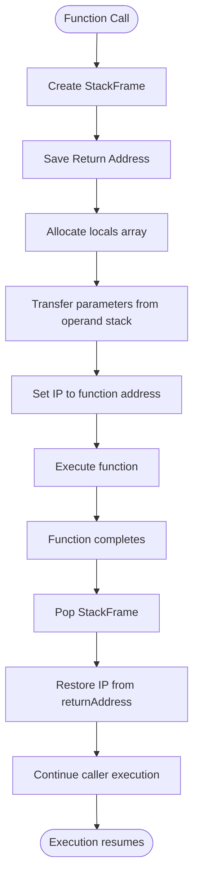

# Stack Frame Management

<cite>
**Referenced Files in This Document**   
- [StackFrame.java](file://ep18/src/main/java/org/teachfx/antlr4/ep18/stackvm/StackFrame.java)
- [FunctionSymbol.java](file://ep18/src/main/java/org/teachfx/antlr4/ep18/stackvm/FunctionSymbol.java)
- [LabelSymbol.java](file://ep18/src/main/java/org/teachfx/antlr4/ep18/stackvm/LabelSymbol.java)
- [VMInterpreter.java](file://ep18/src/main/java/org/teachfx/antlr4/ep18/VMInterpreter.java)
</cite>

## Table of Contents
1. [Introduction](#introduction)
2. [Stack Frame Structure](#stack-frame-structure)
3. [Function Call Mechanism](#function-call-mechanism)
4. [Call Stack Lifecycle](#call-stack-lifecycle)
5. [Symbol Management](#symbol-management)
6. [Function Call Lifecycle](#function-call-lifecycle)
7. [Nested and Recursive Calls](#nested-and-recursive-calls)
8. [Architecture Overview](#architecture-overview)

## Introduction
This document details the stack frame implementation and function call mechanism in the Cymbol virtual machine. The system manages function execution through a stack-based architecture that handles local variables, parameters, and return addresses. The implementation provides a complete runtime environment for function invocation, parameter passing, and return value handling.

## Stack Frame Structure

The StackFrame class represents a single frame in the call stack, containing all necessary information for function execution. Each frame is created during function invocation and destroyed upon return.

**Diagram sources**
- [StackFrame.java](file://ep18/src/main/java/org/teachfx/antlr4/ep18/stackvm/StackFrame.java#L2-L12)

**Section sources**
- [StackFrame.java](file://ep18/src/main/java/org/teachfx/antlr4/ep18/stackvm/StackFrame.java#L2-L12)

The StackFrame structure consists of three main components:
- **symbol**: Reference to the FunctionSymbol containing metadata about the function
- **returnAddress**: Instruction pointer value to return to after function completion
- **locals**: Array storing both parameters and local variables

During initialization, the locals array is allocated with size equal to the sum of nargs (number of parameters) and nlocals (number of local variables). Parameters occupy the first nargs positions, followed by local variables.

## Function Call Mechanism

The function call mechanism is implemented in the VMInterpreter class, which manages the call stack and executes function calls through bytecode instructions.

**Diagram sources**
- [VMInterpreter.java](file://ep18/src/main/java/org/teachfx/antlr4/ep18/VMInterpreter.java#L335-L343)
- [StackFrame.java](file://ep18/src/main/java/org/teachfx/antlr4/ep18/stackvm/StackFrame.java#L2-L12)

**Section sources**
- [VMInterpreter.java](file://ep18/src/main/java/org/teachfx/antlr4/ep18/VMInterpreter.java#L335-L343)

The call process follows these steps:
1. The CALL instruction triggers the call method with a function constant pool index
2. The FunctionSymbol is retrieved from the constant pool
3. A new StackFrame is created with the function symbol and current instruction pointer
4. Parameters are popped from the operand stack and stored in the frame's locals array
5. The instruction pointer is set to the function's entry address

## Call Stack Lifecycle

The call stack manages function execution context through push and pop operations during invocation and return.

**Diagram sources**
- [VMInterpreter.java](file://ep18/src/main/java/org/teachfx/antlr4/ep18/VMInterpreter.java#L335-L343)
- [StackFrame.java](file://ep18/src/main/java/org/teachfx/antlr4/ep18/stackvm/StackFrame.java#L2-L12)

The lifecycle begins with frame creation and ends with frame destruction. When a function returns, the RET instruction pops the current frame from the call stack and restores the instruction pointer from the returnAddress field, allowing the caller to continue execution.

## Symbol Management

Function metadata and control flow targets are managed through symbol classes that provide essential information for function execution.

**Diagram sources**
- [FunctionSymbol.java](file://ep18/src/main/java/org/teachfx/antlr4/ep18/stackvm/FunctionSymbol.java#L2-L39)
- [LabelSymbol.java](file://ep18/src/main/java/org/teachfx/antlr4/ep18/stackvm/LabelSymbol.java#L4-L46)

**Section sources**
- [FunctionSymbol.java](file://ep18/src/main/java/org/teachfx/antlr4/ep18/stackvm/FunctionSymbol.java#L2-L39)
- [LabelSymbol.java](file://ep18/src/main/java/org/teachfx/antlr4/ep18/stackvm/LabelSymbol.java#L4-L46)

The FunctionSymbol class contains:
- **name**: Function identifier
- **nargs**: Number of parameters
- **nlocals**: Number of local variables
- **address**: Entry point address in bytecode

The LabelSymbol class supports forward references and control flow:
- **address**: Resolved memory address
- **isForwardRef**: Flag indicating unresolved reference
- **forwardRefs**: List of locations needing patching
- **resolveForwardReferences()**: Method to update references when address is known

## Function Call Lifecycle

The complete function call lifecycle encompasses argument passing, execution, and return value handling.

**Diagram sources**
- [VMInterpreter.java](file://ep18/src/main/java/org/teachfx/antlr4/ep18/VMInterpreter.java#L335-L343)
- [StackFrame.java](file://ep18/src/main/java/org/teachfx/antlr4/ep18/stackvm/StackFrame.java#L2-L12)

**Section sources**
- [VMInterpreter.java](file://ep18/src/main/java/org/teachfx/antlr4/ep18/VMInterpreter.java#L335-L343)

The lifecycle proceeds as follows:
1. Caller pushes arguments onto the operand stack
2. CALL instruction transfers control to the VM interpreter
3. New stack frame is created and pushed onto call stack
4. Arguments are transferred from operand stack to frame locals
5. Function executes with access to parameters and locals
6. Return value (if any) is pushed onto operand stack
7. RET instruction pops frame and restores caller context
8. Caller accesses return value from operand stack

## Nested and Recursive Calls

The stack frame implementation naturally supports nested and recursive function calls through proper stack management.

**Diagram sources**
- [StackFrame.java](file://ep18/src/main/java/org/teachfx/antlr4/ep18/stackvm/StackFrame.java#L2-L12)
- [VMInterpreter.java](file://ep18/src/main/java/org/teachfx/antlr4/ep18/VMInterpreter.java#L335-L343)

**Section sources**
- [StackFrame.java](file://ep18/src/main/java/org/teachfx/antlr4/ep18/stackvm/StackFrame.java#L2-L12)

For recursive calls, each invocation creates a new stack frame with its own parameter and local variable storage. This ensures that recursive calls do not interfere with each other's state. The stack depth is limited only by available memory, with each frame maintaining complete isolation of its local context.

## Architecture Overview

The stack frame implementation is part of a virtual machine architecture that executes bytecode instructions through a stack-based model.

**Diagram sources**
- [VMInterpreter.java](file://ep18/src/main/java/org/teachfx/antlr4/ep18/VMInterpreter.java#L335-L343)
- [StackFrame.java](file://ep18/src/main/java/org/teachfx/antlr4/ep18/stackvm/StackFrame.java#L2-L12)
- [FunctionSymbol.java](file://ep18/src/main/java/org/teachfx/antlr4/ep18/stackvm/FunctionSymbol.java#L2-L39)

**Section sources**
- [VMInterpreter.java](file://ep18/src/main/java/org/teachfx/antlr4/ep18/VMInterpreter.java#L335-L343)

The architecture integrates the stack frame system with other VM components:
- **Instruction Pointer (IP)**: Tracks current execution position
- **Code Memory**: Stores bytecode instructions
- **Operand Stack**: Handles temporary values and function arguments
- **Call Stack**: Manages function execution contexts
- **Global Memory**: Stores global variables
- **Constant Pool**: Stores constants and function symbols

The VM interpreter coordinates these components through a central CPU loop that fetches and executes instructions, with special handling for function call and return operations that manipulate the call stack.