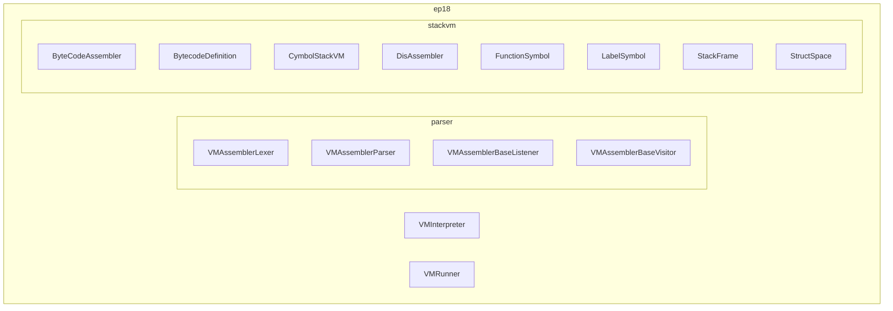
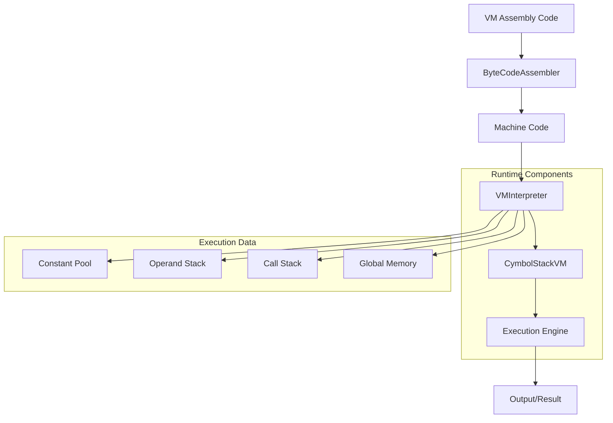
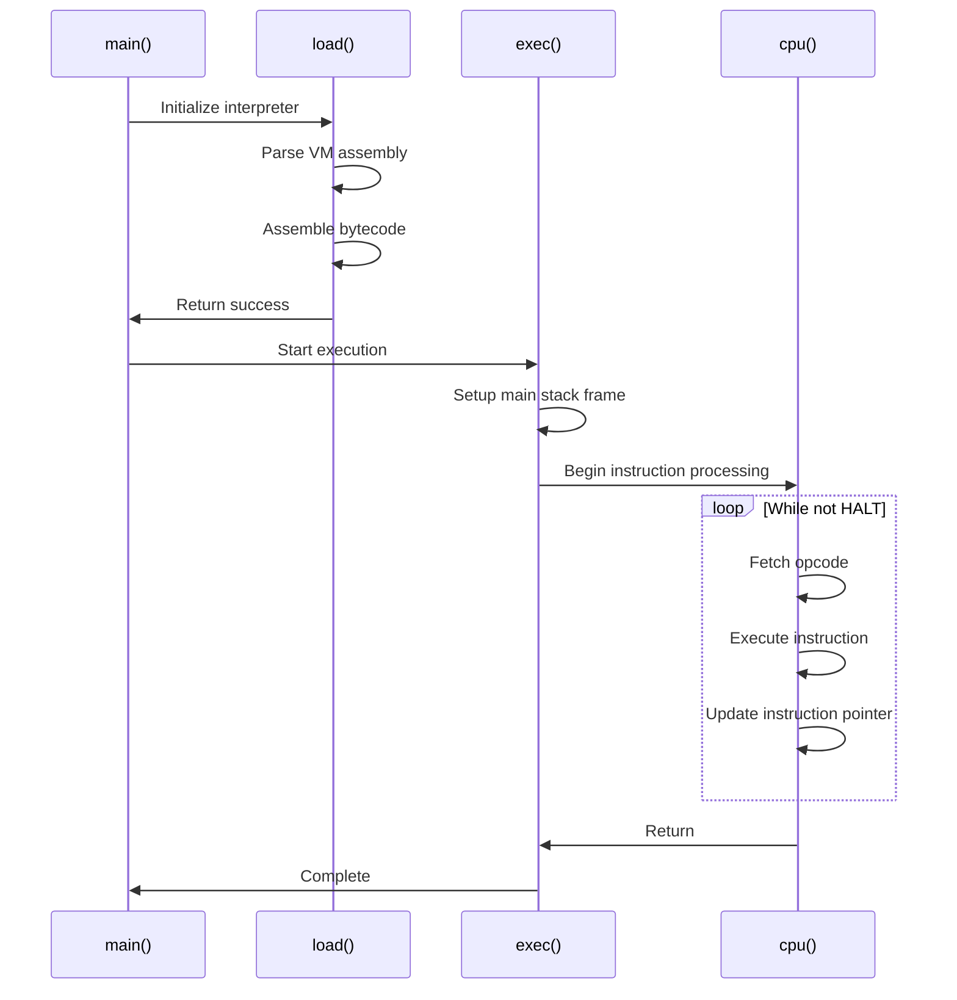
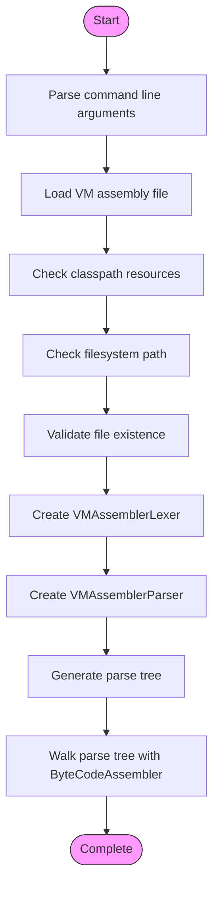
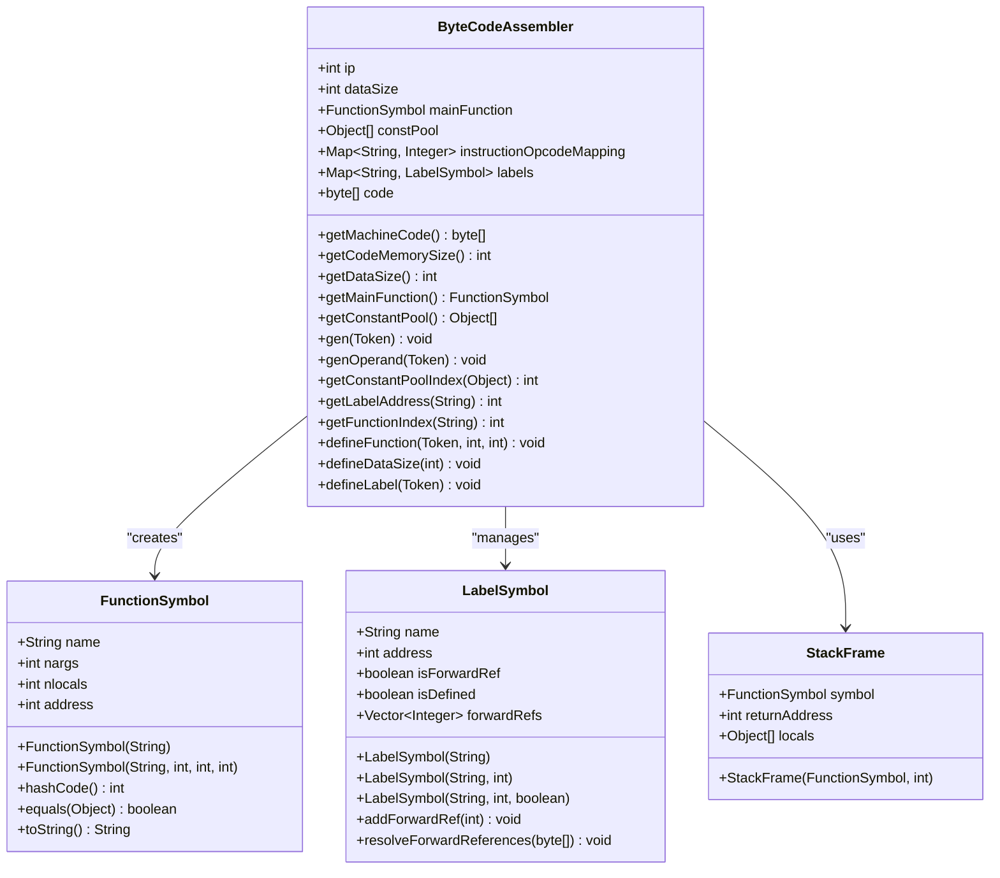
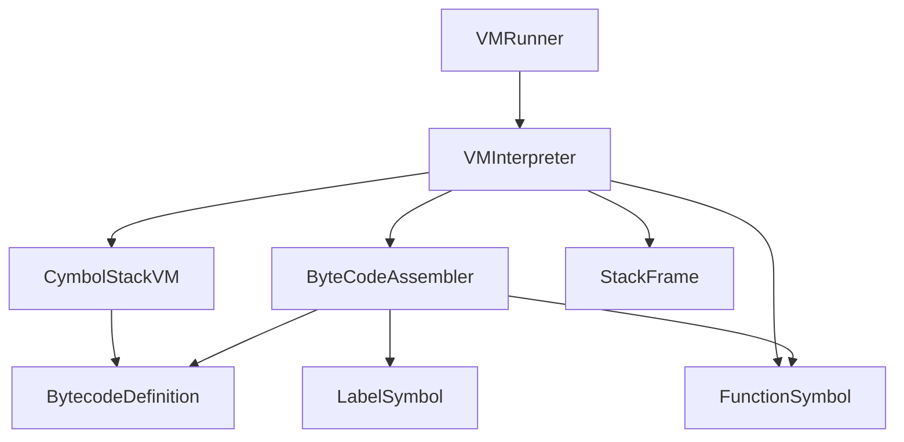

# VM Architecture

<cite>
**Referenced Files in This Document**   
- [CymbolStackVM.java](file://ep18/src/main/java/org/teachfx/antlr4/ep18/stackvm/CymbolStackVM.java)
- [VMInterpreter.java](file://ep18/src/main/java/org/teachfx/antlr4/ep18/VMInterpreter.java)
- [VMRunner.java](file://ep18/src/main/java/org/teachfx/antlr4/ep18/VMRunner.java)
- [ByteCodeAssembler.java](file://ep18/src/main/java/org/teachfx/antlr4/ep18/stackvm/ByteCodeAssembler.java)
- [BytecodeDefinition.java](file://ep18/src/main/java/org/teachfx/antlr4/ep18/stackvm/BytecodeDefinition.java)
- [StackFrame.java](file://ep18/src/main/java/org/teachfx/antlr4/ep18/stackvm/StackFrame.java)
- [FunctionSymbol.java](file://ep18/src/main/java/org/teachfx/antlr4/ep18/stackvm/FunctionSymbol.java)
- [LabelSymbol.java](file://ep18/src/main/java/org/teachfx/antlr4/ep18/stackvm/LabelSymbol.java)
- [c.vm](file://ep18/src/main/resources/c.vm)
</cite>

## Table of Contents
1. [Introduction](#introduction)
2. [Project Structure](#project-structure)
3. [Core Components](#core-components)
4. [Architecture Overview](#architecture-overview)
5. [Detailed Component Analysis](#detailed-component-analysis)
6. [Dependency Analysis](#dependency-analysis)
7. [Performance Considerations](#performance-considerations)
8. [Troubleshooting Guide](#troubleshooting-guide)
9. [Conclusion](#conclusion)

## Introduction
This document provides a comprehensive overview of the virtual machine architecture implemented in the Cymbol language compiler framework. It details the design and interaction of core components including the CymbolStackVM, VMInterpreter, and VMRunner, focusing on the stack-based execution model and its support for Cymbol language features.

## Project Structure
The VM architecture is located within the ep18 module of the project, containing dedicated packages for the stack-based virtual machine implementation, bytecode assembler, and interpreter components.



**Diagram sources**
- [CymbolStackVM.java](file://ep18/src/main/java/org/teachfx/antlr4/ep18/stackvm/CymbolStackVM.java)
- [VMInterpreter.java](file://ep18/src/main/java/org/teachfx/antlr4/ep18/VMInterpreter.java)
- [VMRunner.java](file://ep18/src/main/java/org/teachfx/antlr4/ep18/VMRunner.java)

**Section sources**
- [CymbolStackVM.java](file://ep18/src/main/java/org/teachfx/antlr4/ep18/stackvm/CymbolStackVM.java)
- [VMInterpreter.java](file://ep18/src/main/java/org/teachfx/antlr4/ep18/VMInterpreter.java)
- [VMRunner.java](file://ep18/src/main/java/org/teachfx/antlr4/ep18/VMRunner.java)

## Core Components
The virtual machine architecture consists of three primary components: CymbolStackVM as the execution engine, VMInterpreter as the runtime environment, and VMRunner as the execution launcher. These components work together to load, interpret, and execute bytecode generated from Cymbol source code.

**Section sources**
- [CymbolStackVM.java](file://ep18/src/main/java/org/teachfx/antlr4/ep18/stackvm/CymbolStackVM.java)
- [VMInterpreter.java](file://ep18/src/main/java/org/teachfx/antlr4/ep18/VMInterpreter.java)
- [VMRunner.java](file://ep18/src/main/java/org/teachfx/antlr4/ep18/VMRunner.java)

## Architecture Overview
The VM architecture follows a stack-based execution model where bytecode instructions operate on operand stacks, call stacks, and global memory. The system processes VM assembly code through a multi-stage pipeline from loading to execution and termination.



**Diagram sources**
- [VMInterpreter.java](file://ep18/src/main/java/org/teachfx/antlr4/ep18/VMInterpreter.java)
- [ByteCodeAssembler.java](file://ep18/src/main/java/org/teachfx/antlr4/ep18/stackvm/ByteCodeAssembler.java)
- [CymbolStackVM.java](file://ep18/src/main/java/org/teachfx/antlr4/ep18/stackvm/CymbolStackVM.java)

## Detailed Component Analysis

### CymbolStackVM Analysis
CymbolStackVM serves as the core execution engine for the virtual machine, defining the fundamental operations and data structures for bytecode execution. Although the implementation is currently minimal, it represents the central component around which the VM architecture is built.

**Section sources**
- [CymbolStackVM.java](file://ep18/src/main/java/org/teachfx/antlr4/ep18/stackvm/CymbolStackVM.java)

### VMInterpreter Analysis
VMInterpreter implements the complete runtime environment for executing Cymbol bytecode, handling program loading, execution, and termination. It manages the virtual machine's state including instruction pointer, operand stack, and call frames.



**Diagram sources**
- [VMInterpreter.java](file://ep18/src/main/java/org/teachfx/antlr4/ep18/VMInterpreter.java)

### VMRunner Analysis
VMRunner provides the entry point for the VM execution process, responsible for loading VM assembly code from files or resources and initiating the interpretation process through VMInterpreter.



**Diagram sources**
- [VMRunner.java](file://ep18/src/main/java/org/teachfx/antlr4/ep18/VMRunner.java)

### ByteCodeAssembler Analysis
ByteCodeAssembler converts VM assembly code into executable bytecode, managing the constant pool, instruction encoding, and symbol resolution for functions and labels.



**Diagram sources**
- [ByteCodeAssembler.java](file://ep18/src/main/java/org/teachfx/antlr4/ep18/stackvm/ByteCodeAssembler.java)
- [FunctionSymbol.java](file://ep18/src/main/java/org/teachfx/antlr4/ep18/stackvm/FunctionSymbol.java)
- [LabelSymbol.java](file://ep18/src/main/java/org/teachfx/antlr4/ep18/stackvm/LabelSymbol.java)
- [StackFrame.java](file://ep18/src/main/java/org/teachfx/antlr4/ep18/stackvm/StackFrame.java)

### BytecodeDefinition Analysis
BytecodeDefinition contains the complete instruction set architecture for the virtual machine, defining all opcodes and their operand types.

```mermaid
erDiagram
INSTRUCTION {
short opcode PK
string name UK
int[] operandTypes
int operandCount
}
OPERAND_TYPE {
int typeCode PK
string typeName
}
CONSTANT_POOL {
int index PK
Object value
}
INSTRUCTION ||--o{ OPERAND_TYPE : "has operands"
INSTRUCTION ||--o{ CONSTANT_POOL : "references"
INSTRUCTION {
"iadd" iadd
"isub" isub
"imul" imul
"idiv" idiv
"ilt" ilt
"ile" ile
"igt" igt
"ige" ige
"ieq" ieq
"ine" ine
"ineg" ineg
"inot" inot
"iand" iand
"ior" ior
"ixor" ixor
"fadd" fadd
"fsub" fsub
"fmul" fmul
"flt" flt
"feq" feq
"itof" itof
"call" call
"ret" ret
"br" br
"brt" brt
"brf" brf
"cconst" cconst
"iconst" iconst
"fconst" fconst
"sconst" sconst
"load" load
"gload" gload
"fload" fload
"store" store
"gstore" gstore
"fstore" fstore
"print" print
"struct" struct
"null" null
"pop" pop
"halt" halt
}
```

**Diagram sources**
- [BytecodeDefinition.java](file://ep18/src/main/java/org/teachfx/antlr4/ep18/stackvm/BytecodeDefinition.java)

## Dependency Analysis
The VM components exhibit a clear dependency hierarchy with well-defined interfaces between the assembler, interpreter, and execution engine components.



**Diagram sources**
- [VMRunner.java](file://ep18/src/main/java/org/teachfx/antlr4/ep18/VMRunner.java)
- [VMInterpreter.java](file://ep18/src/main/java/org/teachfx/antlr4/ep18/VMInterpreter.java)
- [ByteCodeAssembler.java](file://ep18/src/main/java/org/teachfx/antlr4/ep18/stackvm/ByteCodeAssembler.java)
- [CymbolStackVM.java](file://ep18/src/main/java/org/teachfx/antlr4/ep18/stackvm/CymbolStackVM.java)

**Section sources**
- [VMRunner.java](file://ep18/src/main/java/org/teachfx/antlr4/ep18/VMRunner.java)
- [VMInterpreter.java](file://ep18/src/main/java/org/teachfx/antlr4/ep18/VMInterpreter.java)
- [ByteCodeAssembler.java](file://ep18/src/main/java/org/teachfx/antlr4/ep18/stackvm/ByteCodeAssembler.java)

## Performance Considerations
The stack-based VM architecture provides efficient execution through direct bytecode interpretation with minimal overhead. The design prioritizes simplicity and correctness over optimization, with fixed-size operand and call stacks providing predictable memory usage patterns.

## Troubleshooting Guide
Common issues in the VM architecture include unresolved symbol references, stack overflow errors, and invalid opcode exceptions. The VMInterpreter provides tracing and disassembly capabilities to aid in debugging.

**Section sources**
- [VMInterpreter.java](file://ep18/src/main/java/org/teachfx/antlr4/ep18/VMInterpreter.java)
- [ByteCodeAssembler.java](file://ep18/src/main/java/org/teachfx/antlr4/ep18/stackvm/ByteCodeAssembler.java)

## Conclusion
The Cymbol VM architecture implements a clean, stack-based execution model that effectively supports the Cymbol language features through a well-structured component hierarchy. The separation of concerns between the assembler, interpreter, and execution engine enables maintainable and extensible virtual machine design.