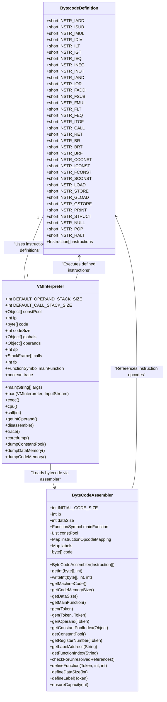
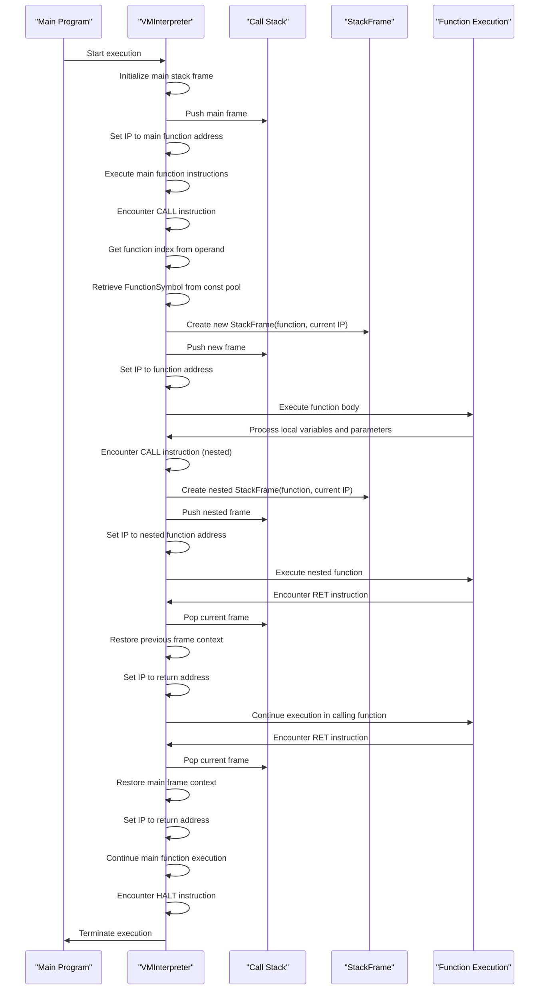
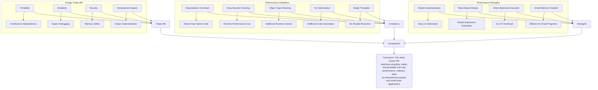

# Virtual Machine

<cite>
**Referenced Files in This Document**   
- [CymbolStackVM.java](file://ep18/src/main/java/org/teachfx/antlr4/ep18/stackvm/CymbolStackVM.java)
- [VMInterpreter.java](file://ep18/src/main/java/org/teachfx/antlr4/ep18/VMInterpreter.java)
- [StackFrame.java](file://ep18/src/main/java/org/teachfx/antlr4/ep18/stackvm/StackFrame.java)
- [FunctionSymbol.java](file://ep18/src/main/java/org/teachfx/antlr4/ep18/stackvm/FunctionSymbol.java)
- [ByteCodeAssembler.java](file://ep18/src/main/java/org/teachfx/antlr4/ep18/stackvm/ByteCodeAssembler.java)
- [BytecodeDefinition.java](file://ep18/src/main/java/org/teachfx/antlr4/ep18/stackvm/BytecodeDefinition.java)
- [DisAssembler.java](file://ep18/src/main/java/org/teachfx/antlr4/ep18/stackvm/DisAssembler.java)
- [t.vm](file://ep18/src/main/resources/t.vm)
- [VM_Design.md](file://ep18/VM_Design.md)
</cite>

## Table of Contents
1. [Introduction](#introduction)
2. [Architecture Overview](#architecture-overview)
3. [Instruction Set and Bytecode Processing](#instruction-set-and-bytecode-processing)
4. [Stack Frame Management and Function Calls](#stack-frame-management-and-function-calls)
5. [Memory Organization](#memory-organization)
6. [Control Flow and Function Returns](#control-flow-and-function-returns)
7. [Disassembler and Debugging Support](#disassembler-and-debugging-support)
8. [Performance Characteristics and Limitations](#performance-characteristics-and-limitations)
9. [Execution Examples](#execution-examples)

## Introduction
This document provides a comprehensive analysis of the stack-based virtual machine implementation in the Cymbol language framework. The virtual machine, implemented primarily in the ep18 module, serves as the runtime execution engine for compiled Cymbol programs. The system consists of a bytecode interpreter, stack-based execution model, and supporting components for code generation, disassembly, and debugging. The virtual machine processes instructions generated from Cymbol source code, manages function calls through stack frames, handles memory organization for global and local variables, and supports control flow operations. This documentation details the architecture, instruction processing, memory management, and execution model of the virtual machine, providing insights into its design and operation.

## Architecture Overview

```mermaid
graph TD
subgraph "Virtual Machine Components"
VMInterpreter[VMInterpreter<br>Execution Engine]
CymbolStackVM[CymbolStackVM<br>Stack VM Base]
ByteCodeAssembler[ByteCodeAssembler<br>Code Generation]
DisAssembler[DisAssembler<br>Code Inspection]
end
subgraph "Runtime Data Structures"
StackFrame[StackFrame<br>Function Context]
FunctionSymbol[FunctionSymbol<br>Function Metadata]
OperandStack[Operand Stack<br>Value Storage]
CallStack[Call Stack<br>Execution History]
end
subgraph "Memory Areas"
CodeMemory[Code Memory<br>Bytecode Storage]
DataMemory[Data Memory<br>Global Variables]
ConstPool[Constant Pool<br>Literals & Symbols]
end
VMInterpreter --> ByteCodeAssembler : "Loads bytecode"
VMInterpreter --> DisAssembler : "Supports disassembly"
VMInterpreter --> StackFrame : "Manages execution context"
VMInterpreter --> FunctionSymbol : "Resolves function calls"
VMInterpreter --> OperandStack : "Processes operations"
VMInterpreter --> CallStack : "Tracks function calls"
ByteCodeAssembler --> CodeMemory : "Generates instructions"
ByteCodeAssembler --> ConstPool : "Stores constants"
VMInterpreter --> DataMemory : "Accesses globals"
VMInterpreter --> ConstPool : "Retrieves constants"
```

**Diagram sources**
- [VMInterpreter.java](file://ep18/src/main/java/org/teachfx/antlr4/ep18/VMInterpreter.java)
- [ByteCodeAssembler.java](file://ep18/src/main/java/org/teachfx/antlr4/ep18/stackvm/ByteCodeAssembler.java)
- [StackFrame.java](file://ep18/src/main/java/org/teachfx/antlr4/ep18/stackvm/StackFrame.java)
- [FunctionSymbol.java](file://ep18/src/main/java/org/teachfx/antlr4/ep18/stackvm/FunctionSymbol.java)

**Section sources**
- [VMInterpreter.java](file://ep18/src/main/java/org/teachfx/antlr4/ep18/VMInterpreter.java)
- [CymbolStackVM.java](file://ep18/src/main/java/org/teachfx/antlr4/ep18/stackvm/CymbolStackVM.java)
- [VM_Design.md](file://ep18/VM_Design.md)

## Instruction Set and Bytecode Processing



**Diagram sources**
- [BytecodeDefinition.java](file://ep18/src/main/java/org/teachfx/antlr4/ep18/stackvm/BytecodeDefinition.java)
- [VMInterpreter.java](file://ep18/src/main/java/org/teachfx/antlr4/ep18/VMInterpreter.java)
- [ByteCodeAssembler.java](file://ep18/src/main/java/org/teachfx/antlr4/ep18/stackvm/ByteCodeAssembler.java)

**Section sources**
- [BytecodeDefinition.java](file://ep18/src/main/java/org/teachfx/antlr4/ep18/stackvm/BytecodeDefinition.java)
- [VMInterpreter.java](file://ep18/src/main/java/org/teachfx/antlr4/ep18/VMInterpreter.java)
- [ByteCodeAssembler.java](file://ep18/src/main/java/org/teachfx/antlr4/ep18/stackvm/ByteCodeAssembler.java)

## Stack Frame Management and Function Calls



**Diagram sources**
- [VMInterpreter.java](file://ep18/src/main/java/org/teachfx/antlr4/ep18/VMInterpreter.java)
- [StackFrame.java](file://ep18/src/main/java/org/teachfx/antlr4/ep18/stackvm/StackFrame.java)
- [FunctionSymbol.java](file://ep18/src/main/java/org/teachfx/antlr4/ep18/stackvm/FunctionSymbol.java)

**Section sources**
- [VMInterpreter.java](file://ep18/src/main/java/org/teachfx/antlr4/ep18/VMInterpreter.java#L200-L250)
- [StackFrame.java](file://ep18/src/main/java/org/teachfx/antlr4/ep18/stackvm/StackFrame.java)
- [FunctionSymbol.java](file://ep18/src/main/java/org/teachfx/antlr4/ep18/stackvm/FunctionSymbol.java)

## Memory Organization

```mermaid
erDiagram
CODE_MEMORY ||--o{ INSTRUCTIONS : contains
DATA_MEMORY ||--o{ GLOBAL_VARIABLES : stores
CONSTANT_POOL ||--o{ LITERALS : holds
CONSTANT_POOL ||--o{ FUNCTION_SYMBOLS : references
CALL_STACK ||--o{ STACK_FRAMES : contains
STACK_FRAMES }|--|| LOCAL_VARIABLES : contains
STACK_FRAMES }|--|| PARAMETERS : contains
OPERAND_STACK ||--o{ OPERANDS : stores
class CODE_MEMORY {
byte[] code
int codeSize
int ip
}
class DATA_MEMORY {
Object[] globals
int dataSize
}
class CONSTANT_POOL {
Object[] constPool
int getConstantPoolIndex(Object)
}
class CALL_STACK {
StackFrame[] calls
int fp
}
class STACK_FRAMES {
FunctionSymbol symbol
int returnAddress
Object[] locals
}
class OPERAND_STACK {
Object[] operands
int sp
}
CODE_MEMORY }|--|| INSTRUCTIONS : "Bytecode instructions"
DATA_MEMORY }|--|| GLOBAL_VARIABLES : "Global variables"
CONSTANT_POOL }|--|| LITERALS : "String, float, bool literals"
CONSTANT_POOL }|--|| FUNCTION_SYMBOLS : "Function references"
CALL_STACK }|--|| STACK_FRAMES : "Execution contexts"
STACK_FRAMES }|--|| LOCAL_VARIABLES : "Local variables"
STACK_FRAMES }|--|| PARAMETERS : "Function parameters"
OPERAND_STACK }|--|| OPERANDS : "Temporary values"
```

**Diagram sources**
- [VMInterpreter.java](file://ep18/src/main/java/org/teachfx/antlr4/ep18/VMInterpreter.java#L50-L80)
- [ByteCodeAssembler.java](file://ep18/src/main/java/org/teachfx/antlr4/ep18/stackvm/ByteCodeAssembler.java#L50-L60)
- [StackFrame.java](file://ep18/src/main/java/org/teachfx/antlr4/ep18/stackvm/StackFrame.java)

**Section sources**
- [VMInterpreter.java](file://ep18/src/main/java/org/teachfx/antlr4/ep18/VMInterpreter.java#L50-L100)
- [ByteCodeAssembler.java](file://ep18/src/main/java/org/teachfx/antlr4/ep18/stackvm/ByteCodeAssembler.java#L50-L70)
- [StackFrame.java](file://ep18/src/main/java/org/teachfx/antlr4/ep18/stackvm/StackFrame.java)

## Control Flow and Function Returns

```mermaid
flowchart TD
Start([Start Execution]) --> MainEntry["Enter main function"]
MainEntry --> Init["Initialize stack frame"]
Init --> LoadConst["iconst 10"]
LoadConst --> Store["store 0"]
Store --> LoopStart["L4: load 0"]
LoopStart --> Compare["iconst 0, igt"]
Compare --> CheckCondition["brf L6?"]
CheckCondition --> |False| LoopBody["L5: load 0, iconst 5, igt"]
LoopBody --> BranchCondition["brf L8?"]
BranchCondition --> |False| PrintValue["L7: load 0, print"]
PrintValue --> CompareSeven["load 0, iconst 7, ieq"]
CompareSeven --> BranchSeven["brf L8?"]
BranchSeven --> |False| JumpToL3["L9: iconst 7, br L3"]
JumpToL3 --> LoopStart
BranchCondition --> |True| BreakPrint["L8: sconst \"break\", print"]
BreakPrint --> Decrement["load 0, call dec1()"]
Decrement --> UpdateVar["store 0"]
UpdateVar --> JumpToL4["br L4"]
JumpToL4 --> LoopStart
CheckCondition --> |True| SetZero["L6: iconst 0"]
SetZero --> Halt["L3: halt"]
Halt --> End([Program Termination])
style Start fill:#9f9,stroke:#333
style End fill:#f9f,stroke:#333
style LoopStart stroke:#f66,stroke-width:2px
style Halt stroke:#66f,stroke-width:2px
```

**Diagram sources**
- [VMInterpreter.java](file://ep18/src/main/java/org/teachfx/antlr4/ep18/VMInterpreter.java#L300-L400)
- [t.vm](file://ep18/src/main/resources/t.vm)

**Section sources**
- [VMInterpreter.java](file://ep18/src/main/java/org/teachfx/antlr4/ep18/VMInterpreter.java#L300-L400)
- [t.vm](file://ep18/src/main/resources/t.vm)

## Disassembler and Debugging Support

```mermaid
classDiagram
class DisAssembler {
+Object[] constPool
+byte[] code
+int codeSize
+DisAssembler(byte[], int, Object[])
+disassemble()
+disassembleInstruction(int)
+showConstPoolOperand(int)
}
class VMInterpreter {
+DisAssembler disasm
+boolean trace
+disassemble()
+trace()
+coredump()
+dumpConstantPool()
+dumpDataMemory()
+dumpCodeMemory()
}
class ByteCodeAssembler {
+List<Object> constPool
+byte[] code
+int ip
+getMachineCode()
+getConstantPool()
+getCodeMemorySize()
}
VMInterpreter --> DisAssembler : "Holds reference"
VMInterpreter --> VMInterpreter : "Provides debugging methods"
ByteCodeAssembler --> VMInterpreter : "Provides code and const pool"
DisAssembler ..> ByteCodeAssembler : "Uses code format"
DisAssembler ..> BytecodeDefinition : "Uses instruction definitions"
note right of VMInterpreter
The VMInterpreter class integrates
multiple debugging features :
- disassemble() : Full code disassembly
- trace() : Execution tracing with
stack and call stack display
- coredump() : Complete state dump
including constant pool, data
memory, and code memory
end
note right of DisAssembler
The DisAssembler class provides
human-readable disassembly of
bytecode, showing :
- Instruction addresses
- Opcode names
- Operand values with #index : values
- Function symbols with addresses
- String literals with quotes
end
```

**Diagram sources**
- [DisAssembler.java](file://ep18/src/main/java/org/teachfx/antlr4/ep18/stackvm/DisAssembler.java)
- [VMInterpreter.java](file://ep18/src/main/java/org/teachfx/antlr4/ep18/VMInterpreter.java#L400-L420)

**Section sources**
- [DisAssembler.java](file://ep18/src/main/java/org/teachfx/antlr4/ep18/stackvm/DisAssembler.java)
- [VMInterpreter.java](file://ep18/src/main/java/org/teachfx/antlr4/ep18/VMInterpreter.java#L400-L420)

## Performance Characteristics and Limitations



**Diagram sources**
- [VMInterpreter.java](file://ep18/src/main/java/org/teachfx/antlr4/ep18/VMInterpreter.java)
- [BytecodeDefinition.java](file://ep18/src/main/java/org/teachfx/antlr4/ep18/stackvm/BytecodeDefinition.java)
- [VM_Design.md](file://ep18/VM_Design.md)

**Section sources**
- [VMInterpreter.java](file://ep18/src/main/java/org/teachfx/antlr4/ep18/VMInterpreter.java)
- [BytecodeDefinition.java](file://ep18/src/main/java/org/teachfx/antlr4/ep18/stackvm/BytecodeDefinition.java)
- [VM_Design.md](file://ep18/VM_Design.md)

## Execution Examples

```mermaid
sequenceDiagram
participant User as "User"
participant VM as "VMInterpreter"
participant Stack as "Operand Stack"
participant Memory as "Global Memory"
participant Code as "Code Memory"
User->>VM : Run t.vm with -trace
VM->>VM : Load bytecode from t.vm
VM->>VM : Initialize execution state
VM->>VM : Set up main stack frame
VM->>VM : Start execution at main
Note over VM,Stack : Initial State
Note right of Stack : Stack : []
Note right of VM : IP : address of main
Note right of Memory : Globals : []
VM->>Stack : iconst 10
Stack->>Stack : Push 10
Note right of Stack : Stack : [10]
Note right of VM : IP : next instruction
VM->>Memory : store 0
Memory->>Memory : globals[0] = 10
Stack->>Stack : Pop 10
Note right of Stack : Stack : []
Note right of Memory : Globals[0] : 10
VM->>Stack : load 0
Memory->>Stack : Push globals[0] (10)
Note right of Stack : Stack : [10]
VM->>Stack : iconst 0
Stack->>Stack : Push 0
Note right of Stack : Stack : [10, 0]
VM->>Stack : igt
Stack->>Stack : Pop 0, Pop 10
Stack->>Stack : Push (10 > 0) = true
Note right of Stack : Stack : [true]
VM->>VM : brf L6? (condition is false)
VM->>VM : Continue to L5 (not branch)
VM->>Stack : load 0
Memory->>Stack : Push globals[0] (10)
Note right of Stack : Stack : [10]
VM->>Stack : iconst 5
Stack->>Stack : Push 5
Note right of Stack : Stack : [10, 5]
VM->>Stack : igt
Stack->>Stack : Pop 5, Pop 10
Stack->>Stack : Push (10 > 5) = true
Note right of Stack : Stack : [true]
VM->>VM : brf L8? (condition is false)
VM->>VM : Continue to L7 (not branch)
VM->>Stack : load 0
Memory->>Stack : Push globals[0] (10)
Note right of Stack : Stack : [10]
VM->>VM : print
VM->>User : Output : 10
Stack->>Stack : Pop 10
Note right of Stack : Stack : []
VM->>Stack : load 0
Memory->>Stack : Push globals[0] (10)
Note right of Stack : Stack : [10]
VM->>Stack : iconst 7
Stack->>Stack : Push 7
Note right of Stack : Stack : [10, 7]
VM->>Stack : ieq
Stack->>Stack : Pop 7, Pop 10
Stack->>Stack : Push (10 == 7) = false
Note right of Stack : Stack : [false]
VM->>VM : brf L8? (condition is true)
VM->>VM : Branch to L8
VM->>Stack : sconst "break"
Stack->>Stack : Push "break"
Note right of Stack : Stack : ["break"]
VM->>VM : print
VM->>User : Output : break
Stack->>Stack : Pop "break"
VM->>Stack : load 0
Memory->>Stack : Push globals[0] (10)
Note right of Stack : Stack : [10]
VM->>VM : call dec1()
VM->>VM : Set up dec1 stack frame
VM->>VM : Pass parameter 10
VM->>VM : Jump to dec1 address
Note over VM,Stack : In dec1 function
Note right of Stack : Stack : [10] (parameter)
VM->>Stack : load 0
Stack->>Stack : Push parameter (10)
Note right of Stack : Stack : [10, 10]
VM->>Stack : iconst 1
Stack->>Stack : Push 1
Note right of Stack : Stack : [10, 10, 1]
VM->>Stack : isub
Stack->>Stack : Pop 1, Pop 10
Stack->>Stack : Push (10 - 1) = 9
Note right of Stack : Stack : [9]
VM->>VM : ret
VM->>VM : Return to main
VM->>Stack : Push return value 9
Note right of Stack : Stack : [9]
VM->>Memory : store 0
Memory->>Memory : globals[0] = 9
Stack->>Stack : Pop 9
Note right of Stack : Stack : []
Note right of Memory : Globals[0] : 9
VM->>VM : br L4
VM->>VM : Branch to loop start
VM->>VM : Continue loop with globals[0] = 9
Note over VM,User : Loop continues with decreasing values
Note over VM,User : until globals[0] <= 0, then program halts
```



**Diagram sources**
- [VMInterpreter.java](file://ep18/src/main/java/org/teachfx/antlr4/ep18/VMInterpreter.java)
- [t.vm](file://ep18/src/main/resources/t.vm)

**Section sources**
- [VMInterpreter.java](file://ep18/src/main/java/org/teachfx/antlr4/ep18/VMInterpreter.java)
- [t.vm](file://ep18/src/main/resources/t.vm)