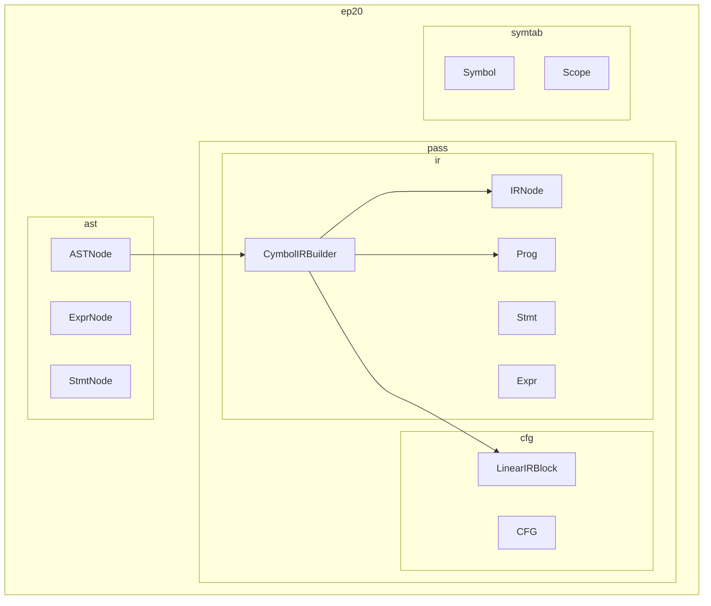
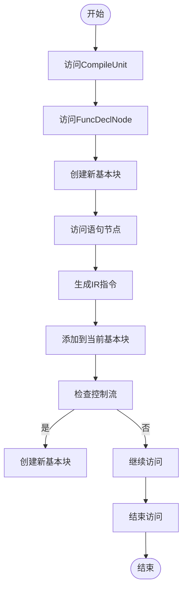
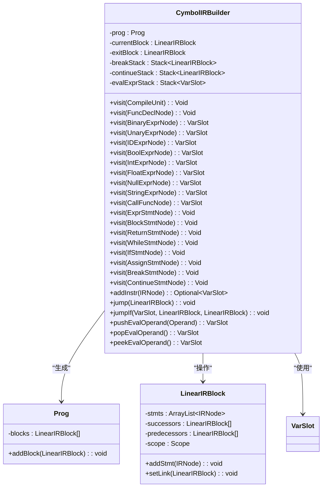
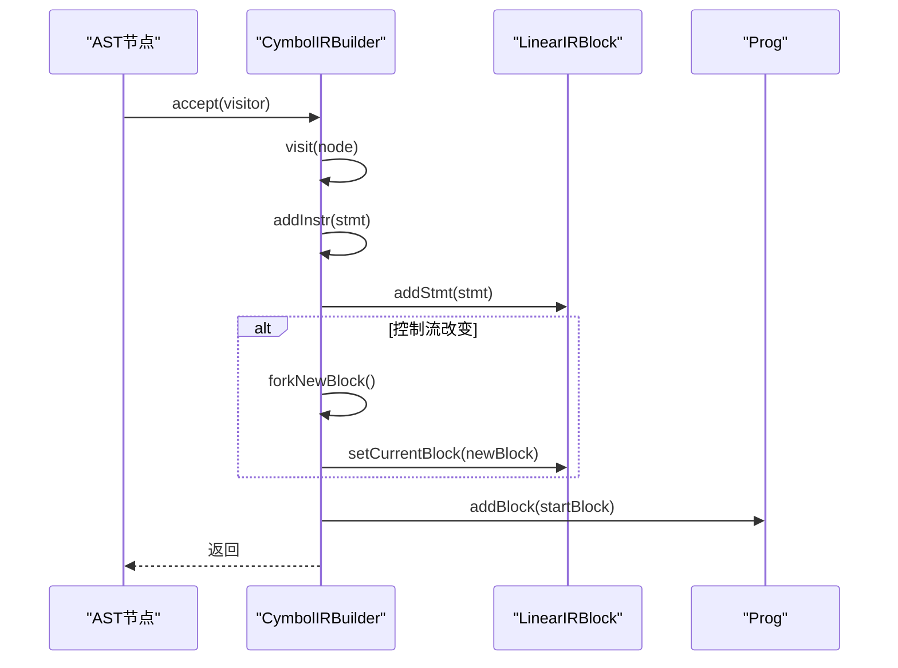
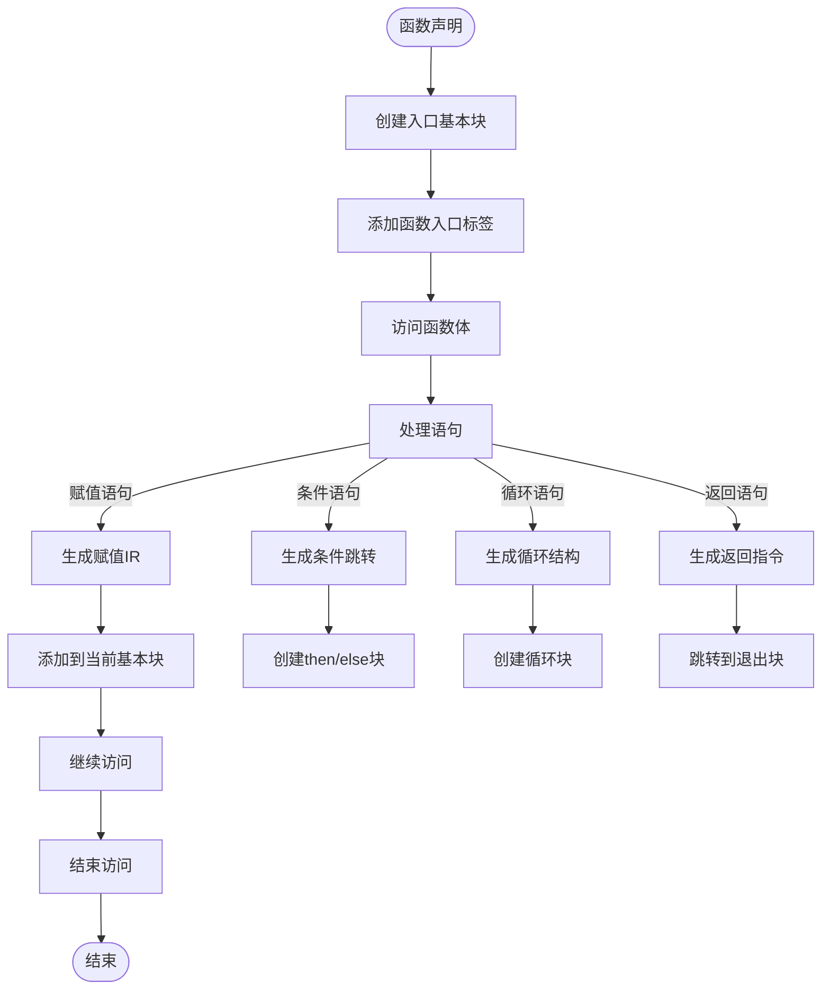
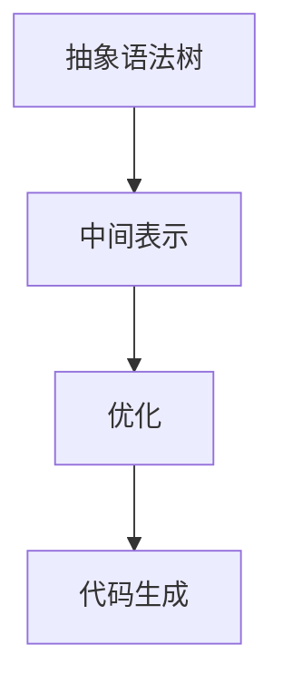
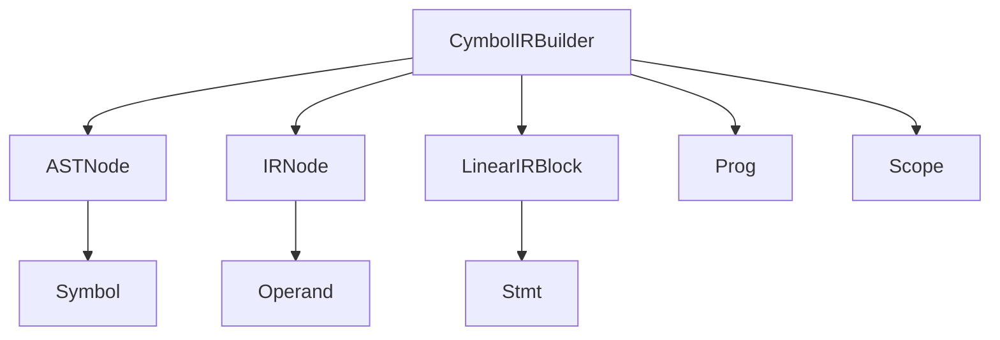

# IR生成

<cite>
**本文档中引用的文件**  
- [CymbolIRBuilder.java](file://ep20/src/main/java/org/teachfx/antlr4/ep20/pass/ir/CymbolIRBuilder.java)
- [LinearIRBlock.java](file://ep20/src/main/java/org/teachfx/antlr4/ep20/pass/cfg/LinearIRBlock.java)
- [VarSlot.java](file://ep20/src/main/java/org/teachfx/antlr4/ep20/ir/expr/VarSlot.java)
- [OperandSlot.java](file://ep20/src/main/java/org/teachfx/antlr4/ep20/ir/expr/addr/OperandSlot.java)
- [FrameSlot.java](file://ep20/src/main/java/org/teachfx/antlr4/ep20/ir/expr/addr/FrameSlot.java)
- [ConstVal.java](file://ep20/src/main/java/org/teachfx/antlr4/ep20/ir/expr/val/ConstVal.java)
- [Assign.java](file://ep20/src/main/java/org/teachfx/antlr4/ep20/ir/stmt/Assign.java)
- [BinExpr.java](file://ep20/src/main/java/org/teachfx/antlr4/ep20/ir/expr/arith/BinExpr.java)
- [IRVisitor.java](file://ep20/src/main/java/org/teachfx/antlr4/ep20/ir/IRVisitor.java)
</cite>

## 目录
1. [简介](#简介)
2. [项目结构](#项目结构)
3. [核心组件](#核心组件)
4. [架构概述](#架构概述)
5. [详细组件分析](#详细组件分析)
6. [依赖分析](#依赖分析)
7. [性能考虑](#性能考虑)
8. [故障排除指南](#故障排除指南)
9. [结论](#结论)
10. [附录](#附录)（如有必要）

## 简介
本文档详细介绍了Cymbol语言编译器中IR（中间表示）生成的过程，重点阐述了`CymbolIRBuilder`如何将AST（抽象语法树）转换为线性IR表示。文档深入解析了遍历AST并生成相应IR指令的算法流程，通过实际代码示例展示了常见编程结构（如算术表达式、条件语句、循环结构）的IR生成过程。同时，文档解释了基本块划分和控制流指令生成的实现细节，旨在为初学者提供从AST到IR转换的清晰概念，并为高级用户提供IR生成过程中的优化机会和自定义转换规则的实现方法。

## 项目结构
项目结构遵循典型的编译器分层设计，包含AST、IR、符号表、代码生成等模块。IR生成相关的代码主要位于`ep20`和`ep21`目录下的`pass/ir`包中，其中`CymbolIRBuilder`是核心的IR生成器。

**图示来源**
- [CymbolIRBuilder.java](file://ep20/src/main/java/org/teachfx/antlr4/ep20/pass/ir/CymbolIRBuilder.java)
- [LinearIRBlock.java](file://ep20/src/main/java/org/teachfx/antlr4/ep20/pass/cfg/LinearIRBlock.java)
- [ASTNode.java](file://ep20/src/main/java/org/teachfx/antlr4/ep20/ast/ASTNode.java)
- [IRNode.java](file://ep20/src/main/java/org/teachfx/antlr4/ep20/ir/IRNode.java)

**本节来源**
- [CymbolIRBuilder.java](file://ep20/src/main/java/org/teachfx/antlr4/ep20/pass/ir/CymbolIRBuilder.java)
- [LinearIRBlock.java](file://ep20/src/main/java/org/teachfx/antlr4/ep20/pass/cfg/LinearIRBlock.java)

## 核心组件
`CymbolIRBuilder`是IR生成的核心组件，它实现了`ASTVisitor`接口，通过访问者模式遍历AST节点并生成相应的IR指令。`LinearIRBlock`用于表示基本块，`Prog`表示整个程序的IR表示。

**本节来源**
- [CymbolIRBuilder.java](file://ep20/src/main/java/org/teachfx/antlr4/ep20/pass/ir/CymbolIRBuilder.java)
- [LinearIRBlock.java](file://ep20/src/main/java/org/teachfx/antlr4/ep20/pass/cfg/LinearIRBlock.java)
- [Prog.java](file://ep20/src/main/java/org/teachfx/antlr4/ep20/ir/Prog.java)

## 架构概述
`CymbolIRBuilder`通过访问者模式遍历AST，为每个AST节点生成相应的IR指令。IR指令被组织在`LinearIRBlock`中，形成控制流图（CFG）。`Prog`对象包含所有基本块，表示整个程序的IR。

**图示来源**
- [CymbolIRBuilder.java](file://ep20/src/main/java/org/teachfx/antlr4/ep20/pass/ir/CymbolIRBuilder.java)
- [LinearIRBlock.java](file://ep20/src/main/java/org/teachfx/antlr4/ep20/pass/cfg/LinearIRBlock.java)

## 详细组件分析
### CymbolIRBuilder分析
`CymbolIRBuilder`通过实现`ASTVisitor`接口，为不同类型的AST节点生成相应的IR指令。

#### 对象导向组件

**图示来源**
- [CymbolIRBuilder.java](file://ep20/src/main/java/org/teachfx/antlr4/ep20/pass/ir/CymbolIRBuilder.java)
- [Prog.java](file://ep20/src/main/java/org/teachfx/antlr4/ep20/ir/Prog.java)
- [LinearIRBlock.java](file://ep20/src/main/java/org/teachfx/antlr4/ep20/pass/cfg/LinearIRBlock.java)
- [VarSlot.java](file://ep20/src/main/java/org/teachfx/antlr4/ep20/ir/expr/VarSlot.java)

#### API/服务组件

**图示来源**
- [CymbolIRBuilder.java](file://ep20/src/main/java/org/teachfx/antlr4/ep20/pass/ir/CymbolIRBuilder.java)
- [LinearIRBlock.java](file://ep20/src/main/java/org/teachfx/antlr4/ep20/pass/cfg/LinearIRBlock.java)
- [Prog.java](file://ep20/src/main/java/org/teachfx/antlr4/ep20/ir/Prog.java)

#### 复杂逻辑组件

**图示来源**
- [CymbolIRBuilder.java](file://ep20/src/main/java/org/teachfx/antlr4/ep20/pass/ir/CymbolIRBuilder.java)

**本节来源**
- [CymbolIRBuilder.java](file://ep20/src/main/java/org/teachfx/antlr4/ep20/pass/ir/CymbolIRBuilder.java)
- [LinearIRBlock.java](file://ep20/src/main/java/org/teachfx/antlr4/ep20/pass/cfg/LinearIRBlock.java)
- [Prog.java](file://ep20/src/main/java/org/teachfx/antlr4/ep20/ir/Prog.java)

### 概念概述
IR生成过程将高级语言的AST转换为低级的线性指令序列，便于后续的优化和代码生成。每个AST节点对应一个或多个IR指令，控制流结构（如if、while）被转换为基本块和跳转指令。

## 依赖分析
`CymbolIRBuilder`依赖于AST节点、IR指令、基本块和符号表等组件。它通过访问者模式与AST节点交互，生成IR指令并组织成基本块。

**图示来源**
- [CymbolIRBuilder.java](file://ep20/src/main/java/org/teachfx/antlr4/ep20/pass/ir/CymbolIRBuilder.java)
- [ASTNode.java](file://ep20/src/main/java/org/teachfx/antlr4/ep20/ast/ASTNode.java)
- [IRNode.java](file://ep20/src/main/java/org/teachfx/antlr4/ep20/ir/IRNode.java)
- [LinearIRBlock.java](file://ep20/src/main/java/org/teachfx/antlr4/ep20/pass/cfg/LinearIRBlock.java)
- [Prog.java](file://ep20/src/main/java/org/teachfx/antlr4/ep20/ir/Prog.java)
- [Scope.java](file://ep20/src/main/java/org/teachfx/antlr4/ep20/symtab/scope/Scope.java)

**本节来源**
- [CymbolIRBuilder.java](file://ep20/src/main/java/org/teachfx/antlr4/ep20/pass/ir/CymbolIRBuilder.java)
- [ASTNode.java](file://ep20/src/main/java/org/teachfx/antlr4/ep20/ast/ASTNode.java)
- [IRNode.java](file://ep20/src/main/java/org/teachfx/antlr4/ep20/ir/IRNode.java)
- [LinearIRBlock.java](file://ep20/src/main/java/org/teachfx/antlr4/ep20/pass/cfg/LinearIRBlock.java)
- [Prog.java](file://ep20/src/main/java/org/teachfx/antlr4/ep20/ir/Prog.java)
- [Scope.java](file://ep20/src/main/java/org/teachfx/antlr4/ep20/symtab/scope/Scope.java)

## 性能考虑
IR生成过程的时间复杂度主要取决于AST的大小，通常为O(n)，其中n是AST节点的数量。空间复杂度取决于生成的IR指令数量和基本块数量。通过合理管理基本块和优化IR生成过程，可以提高编译器的整体性能。

## 故障排除指南
在IR生成过程中，常见的问题包括基本块链接错误、控制流指令生成错误和符号表查找失败。通过调试日志和单元测试可以有效定位和解决这些问题。

**本节来源**
- [CymbolIRBuilder.java](file://ep20/src/main/java/org/teachfx/antlr4/ep20/pass/ir/CymbolIRBuilder.java)
- [LinearIRBlock.java](file://ep20/src/main/java/org/teachfx/antlr4/ep20/pass/cfg/LinearIRBlock.java)

## 结论
`CymbolIRBuilder`通过访问者模式高效地将AST转换为线性IR表示，为后续的优化和代码生成奠定了基础。通过合理的设计和实现，IR生成过程能够准确地反映源代码的语义，并为编译器的其他阶段提供可靠的输入。