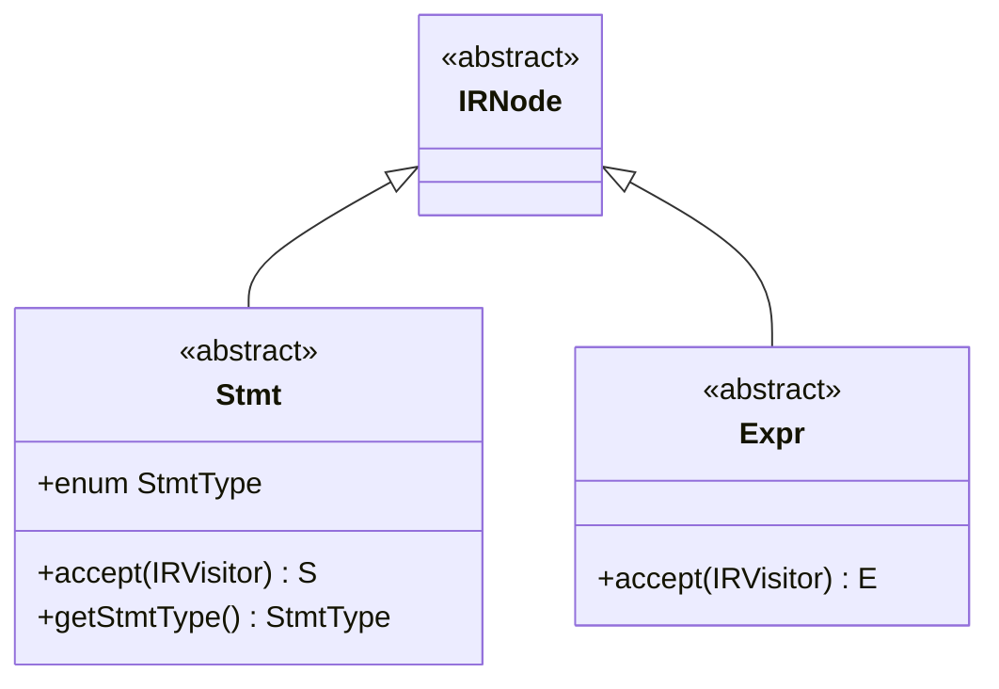
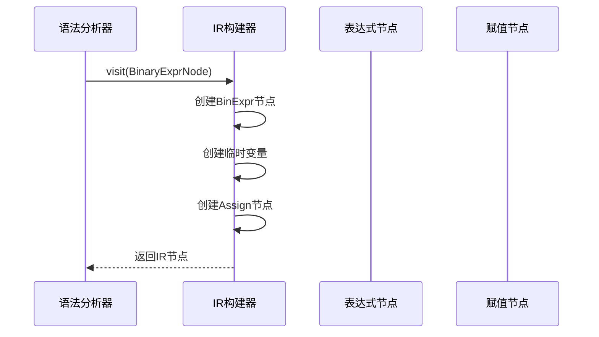
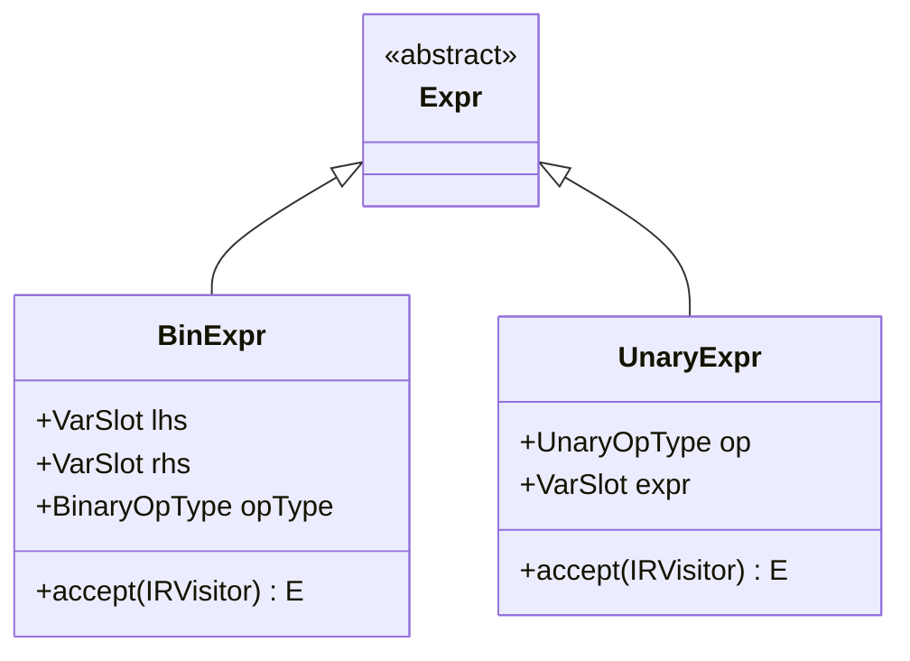
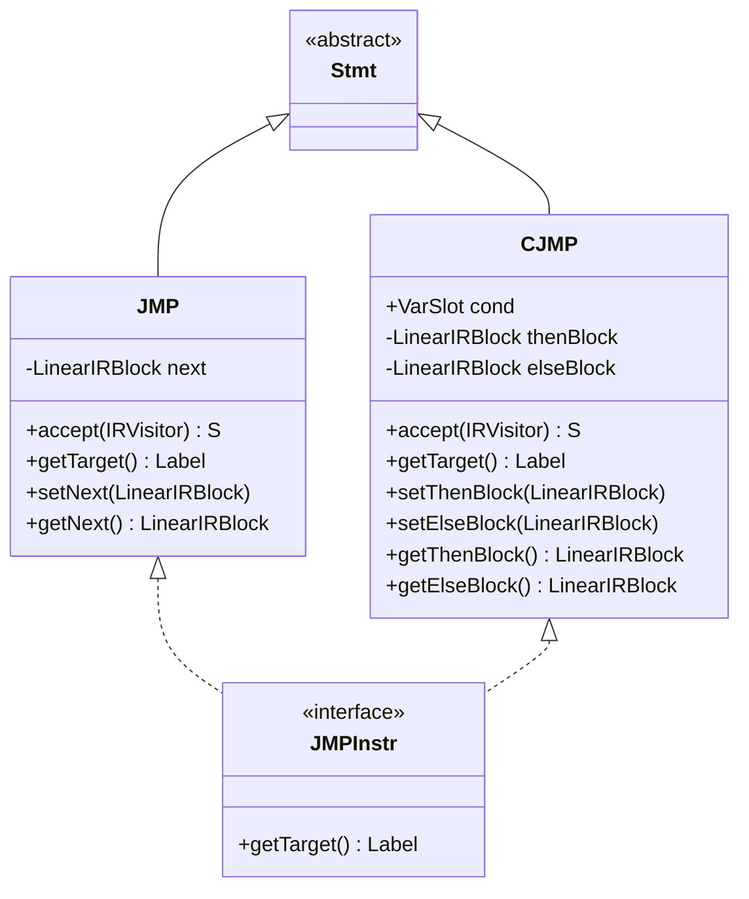

# IR设计

<cite>
**本文档中引用的文件**
- [IRNode.java](file://ep20/src/main/java/org/teachfx/antlr4/ep20/ir/IRNode.java)
- [Expr.java](file://ep20/src/main/java/org/teachfx/antlr4/ep20/ir/expr/Expr.java)
- [Stmt.java](file://ep20/src/main/java/org/teachfx/antlr4/ep20/ir/stmt/Stmt.java)
- [BinExpr.java](file://ep20/src/main/java/org/teachfx/antlr4/ep20/ir/expr/arith/BinExpr.java)
- [UnaryExpr.java](file://ep20/src/main/java/org/teachfx/antlr4/ep20/ir/expr/arith/UnaryExpr.java)
- [Assign.java](file://ep20/src/main/java/org/teachfx/antlr4/ep20/ir/stmt/Assign.java)
- [CJMP.java](file://ep20/src/main/java/org/teachfx/antlr4/ep20/ir/stmt/CJMP.java)
- [JMP.java](file://ep20/src/main/java/org/teachfx/antlr4/ep20/ir/stmt/JMP.java)
</cite>

## 目录
1. [引言](#引言)
2. [IRNode基类架构](#irnode基类架构)
3. [IR分层设计](#ir分层设计)
4. [三地址码设计原理](#三地址码设计原理)
5. [IR节点类型系统](#ir节点类型系统)
6. [IR节点接口与实现](#ir节点接口与实现)
7. [为初学者提供的IR设计概念](#为初学者提供的ir设计概念)
8. [为高级用户提供的IR扩展机制](#为高级用户提供的ir扩展机制)
9. [结论](#结论)

## 引言
中间表示（Intermediate Representation，简称IR）是编译器设计中的核心组件，它作为源代码与目标代码之间的桥梁，承担着程序结构抽象、优化和代码生成的关键任务。本文档详细阐述了基于Antlr4实现的编程语言中IR的设计，重点介绍IRNode基类的架构、继承体系以及三地址码的设计原理。通过分析语句节点（Stmt）和表达式节点（Expr）的抽象层次，解释IR如何支持算术表达式、控制流语句和函数调用等核心语言特性。文档还提供了IR节点类型的扩展机制，帮助开发者理解如何为新语言特性添加支持。

## IRNode基类架构

IRNode是所有中间表示节点的抽象基类，位于`org.teachfx.antlr4.ep20.ir`包中。该类采用面向对象的设计模式，为所有IR节点提供统一的继承基础。IRNode本身不包含具体的数据成员或行为方法，而是作为一个标记性抽象类存在，其主要作用是建立类型层次结构，使得编译器可以通过多态机制统一处理各种IR节点。

所有具体的IR节点都直接或间接继承自IRNode，这种设计确保了类型系统的完整性和一致性。通过继承IRNode，各个子类能够被统一纳入编译器的遍历、优化和代码生成流程中。IRNode的设计体现了编译器中间表示的模块化思想，使得不同类型的节点可以在保持接口统一的同时，实现各自特定的功能逻辑。

**节段来源**
- [IRNode.java](file://ep20/src/main/java/org/teachfx/antlr4/ep20/ir/IRNode.java#L1-L6)

## IR分层设计

IR的分层设计通过继承体系实现了语句（Stmt）和表达式（Expr）的清晰分离。这种分层结构在`org.teachfx.antlr4.ep20.ir`包中体现为两个主要的抽象子类：Stmt和Expr，它们均继承自IRNode。



**图示来源**
- [IRNode.java](file://ep20/src/main/java/org/teachfx/antlr4/ep20/ir/IRNode.java#L1-L6)
- [Stmt.java](file://ep20/src/main/java/org/teachfx/antlr4/ep20/ir/stmt/Stmt.java#L1-L20)
- [Expr.java](file://ep20/src/main/java/org/teachfx/antlr4/ep20/ir/expr/Expr.java#L1-L9)

### 语句节点(Stmt)
Stmt类代表程序中的语句节点，继承自IRNode并定义了`accept`和`getStmtType`两个抽象方法。其中`getStmtType`方法返回一个枚举类型`StmtType`，用于标识语句的具体种类，如跳转（JMP）、条件跳转（CJMP）、赋值（ASSIGN）、标签（LABEL）、返回（RETURN）和表达式语句（EXPR）。这种设计使得编译器可以根据语句类型进行不同的处理。

### 表达式节点(Expr)
Expr类代表程序中的表达式节点，同样继承自IRNode。与Stmt不同的是，Expr的`accept`方法返回一个泛型类型E，这符合表达式求值返回结果的语义。Expr的设计支持嵌套表达式结构，允许复杂的算术运算和逻辑运算通过树形结构表示。

## 三地址码设计原理

三地址码（Three-Address Code）是一种重要的中间表示形式，其设计原理基于将复杂的表达式分解为一系列简单的三元操作。每个三地址码指令最多包含三个操作数：两个源操作数和一个目标操作数。这种设计在编译器中具有显著优势：

1. **简化控制流分析**：三地址码将复杂的表达式转换为线性指令序列，便于进行数据流分析和控制流分析。
2. **优化友好**：简单的指令格式使得编译器优化（如常量传播、死代码消除、公共子表达式消除）更容易实现。
3. **目标代码生成便捷**：三地址码与大多数目标机器的指令集具有良好的对应关系，便于代码生成。

在本实现中，三地址码通过`Assign`、`BinExpr`等节点体现。例如，表达式`a = b + c`被表示为一个赋值语句节点，其中右侧是一个二元表达式节点，这种结构完美契合三地址码的设计理念。



**图示来源**
- [BinExpr.java](file://ep20/src/main/java/org/teachfx/antlr4/ep20/ir/expr/arith/BinExpr.java#L1-L60)
- [Assign.java](file://ep20/src/main/java/org/teachfx/antlr4/ep20/ir/stmt/Assign.java#L1-L66)

## IR节点类型系统

IR节点类型系统通过继承层次和接口定义实现了对各种语言特性的支持。系统主要包含算术表达式、控制流语句和函数调用等核心节点类型。

### 算术表达式节点
算术表达式节点包括二元表达式（BinExpr）和一元表达式（UnaryExpr），它们都继承自Expr类。



**图示来源**
- [BinExpr.java](file://ep20/src/main/java/org/teachfx/antlr4/ep20/ir/expr/arith/BinExpr.java#L1-L60)
- [UnaryExpr.java](file://ep20/src/main/java/org/teachfx/antlr4/ep20/ir/expr/arith/UnaryExpr.java#L1-L32)

### 控制流语句节点
控制流语句节点包括无条件跳转（JMP）和条件跳转（CJMP），它们都继承自Stmt类并实现JMPInstr接口。



**图示来源**
- [JMP.java](file://ep20/src/main/java/org/teachfx/antlr4/ep20/ir/stmt/JMP.java#L1-L46)
- [CJMP.java](file://ep20/src/main/java/org/teachfx/antlr4/ep20/ir/stmt/CJMP.java#L1-L61)
- [JMPInstr.java](file://ep20/src/main/java/org/teachfx/antlr4/ep20/ir/JMPInstr.java)

## IR节点接口与实现

IR节点的设计采用了访问者模式（Visitor Pattern），通过IRVisitor接口实现对IR树的遍历和操作。这种设计模式将算法与数据结构分离，使得可以在不修改节点类的情况下添加新的操作。

### IRVisitor接口
IRVisitor接口定义了访问各种IR节点的方法，采用双参数泛型设计：S表示语句的返回类型，E表示表达式的返回类型。这种设计允许访问者在访问语句和表达式时返回不同类型的结果。

### 具体节点实现
每个具体的IR节点都实现了`accept`方法，该方法接受一个IRVisitor参数并调用访问者对应的`visit`方法。例如，BinExpr节点的`accept`方法如下：
```java
@Override
public <S, E> E accept(IRVisitor<S, E> visitor) {
    return visitor.visit(this);
}
```

这种实现方式确保了访问者能够正确地访问到具体节点类型，从而执行相应的操作。同时，静态工厂方法`with`的使用简化了节点的创建过程，提高了代码的可读性和可维护性。

**节段来源**
- [Expr.java](file://ep20/src/main/java/org/teachfx/antlr4/ep20/ir/expr/Expr.java#L1-L9)
- [BinExpr.java](file://ep20/src/main/java/org/teachfx/antlr4/ep20/ir/expr/arith/BinExpr.java#L1-L60)
- [UnaryExpr.java](file://ep20/src/main/java/org/teachfx/antlr4/ep20/ir/expr/arith/UnaryExpr.java#L1-L32)

## 为初学者提供的IR设计概念

对于初学者而言，理解IR设计的关键在于掌握以下几个核心概念：

1. **抽象语法树与中间表示的区别**：AST直接反映源代码的语法结构，而IR是对程序逻辑的抽象表示，更接近目标机器的执行模型。
2. **三地址码的优势**：通过将复杂表达式分解为简单操作，三地址码简化了编译器的优化和代码生成过程。
3. **访问者模式的应用**：这种设计模式使得编译器可以在不修改IR节点类的情况下添加新的遍历算法，如类型检查、优化和代码生成。
4. **类型系统的层次结构**：通过继承体系，IR能够清晰地区分语句和表达式，为不同类型的节点提供适当的接口和行为。

这些概念构成了理解现代编译器中间表示的基础，帮助初学者建立起对编译器工作原理的整体认识。

## 为高级用户提供的IR扩展机制

对于高级用户，IR系统提供了灵活的扩展机制来支持新的语言特性：

1. **新增节点类型**：通过继承Stmt或Expr基类，可以创建新的语句或表达式节点。例如，要支持数组访问操作，可以创建ArrayAccessExpr类继承自Expr。
2. **扩展操作符类型**：在OperatorType枚举中添加新的操作符类型，然后在BinExpr或UnaryExpr中支持这些新操作符。
3. **自定义访问者**：实现IRVisitor接口可以创建新的遍历算法，如针对特定语言特性的优化器或分析器。
4. **集成到编译流程**：在AST到IR的转换阶段（如CymbolIRBuilder中）添加对新语法结构的处理逻辑，将其转换为相应的IR节点。

这种模块化的设计使得IR系统具有良好的可扩展性，能够适应不断演进的编程语言需求。

**节段来源**
- [IRNode.java](file://ep20/src/main/java/org/teachfx/antlr4/ep20/ir/IRNode.java#L1-L6)
- [Expr.java](file://ep20/src/main/java/org/teachfx/antlr4/ep20/ir/expr/Expr.java#L1-L9)
- [Stmt.java](file://ep20/src/main/java/org/teachfx/antlr4/ep20/ir/stmt/Stmt.java#L1-L20)

## 结论
本文档详细介绍了基于Antlr4实现的编程语言中中间表示（IR）的设计。通过分析IRNode基类的架构和继承体系，阐述了IR的分层设计理念。文档解释了三地址码的设计原理及其在编译器中的优势，描述了IR节点的类型系统，包括算术表达式、控制流语句等核心节点类型。通过实际代码示例展示了IRNode接口的设计和具体实现，为初学者提供了IR设计的基本概念，为高级用户详细介绍了如何扩展IR节点类型以支持新的语言特性。这套IR设计体现了现代编译器中间表示的先进理念，具有良好的模块化、可扩展性和优化友好性。