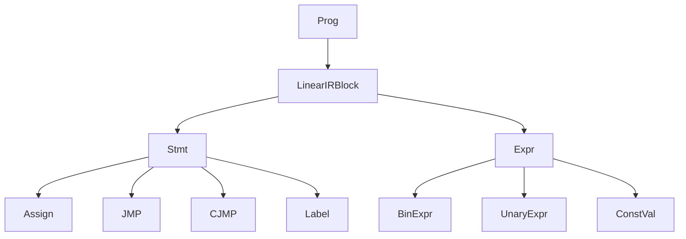
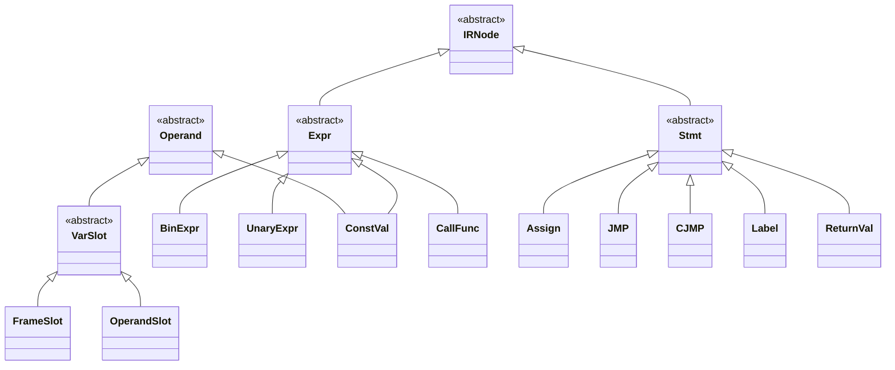
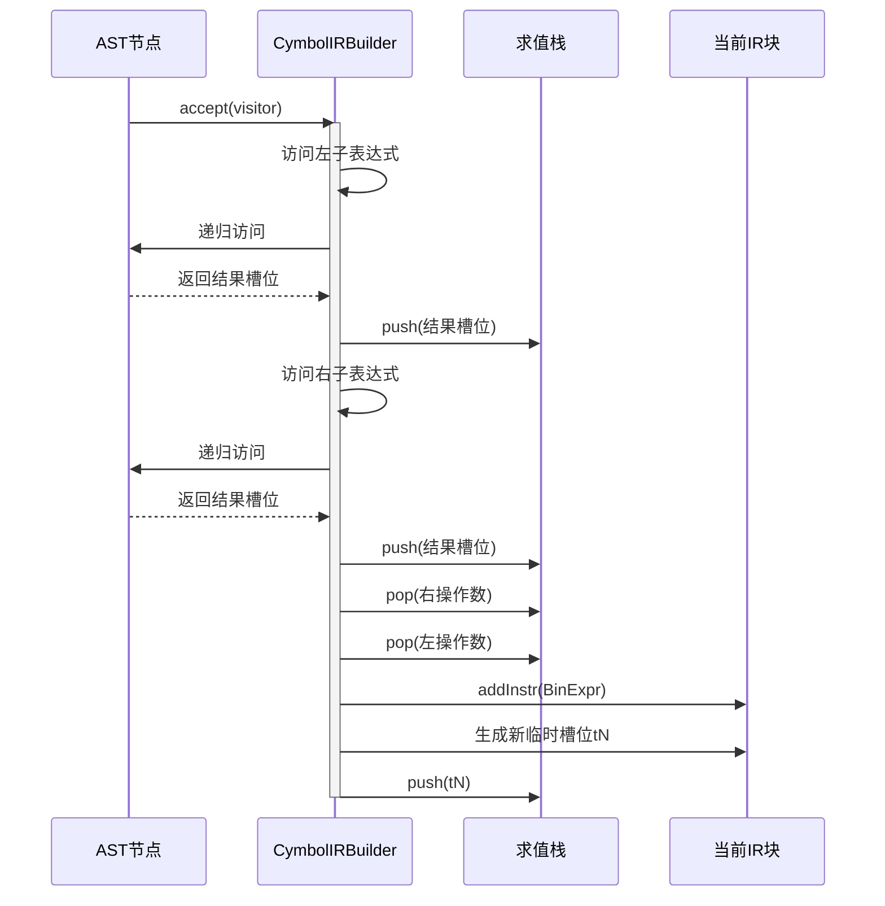

# 中间表示(IR)

<cite>
**本文档中引用的文件**  
- [IRNode.java](file://ep20/src/main/java/org/teachfx/antlr4/ep20/ir/IRNode.java)
- [OperandSlot.java](file://ep20/src/main/java/org/teachfx/antlr4/ep20/ir/expr/addr/OperandSlot.java)
- [CymbolIRBuilder.java](file://ep20/src/main/java/org/teachfx/antlr4/ep20/pass/ir/CymbolIRBuilder.java)
- [BinExpr.java](file://ep20/src/main/java/org/teachfx/antlr4/ep20/ir/expr/arith/BinExpr.java)
- [UnaryExpr.java](file://ep20/src/main/java/org/teachfx/antlr4/ep20/ir/expr/arith/UnaryExpr.java)
- [Assign.java](file://ep20/src/main/java/org/teachfx/antlr4/ep20/ir/stmt/Assign.java)
- [JMP.java](file://ep20/src/main/java/org/teachfx/antlr4/ep20/ir/stmt/JMP.java)
- [FrameSlot.java](file://ep20/src/main/java/org/teachfx/antlr4/ep20/ir/expr/addr/FrameSlot.java)
- [Prog.java](file://ep20/src/main/java/org/teachfx/antlr4/ep20/ir/Prog.java)
- [ThreeAddressCodeTest.java](file://ep20/src/test/java/org/teachfx/antlr4/ep20/ir/ThreeAddressCodeTest.java)
</cite>

## 目录
1. [引言](#引言)
2. [中间表示设计](#中间表示设计)
3. [IRNode基类与继承体系](#irnode基类与继承体系)
4. [表达式节点实现](#表达式节点实现)
5. [语句节点实现](#语句节点实现)
6. [CymbolIRBuilder与AST到IR的转换](#cymbolirbuilder与ast到ir的转换)
7. [虚拟寄存器分配与操作数槽位管理](#虚拟寄存器分配与操作数槽位管理)
8. [常见编程结构的IR生成示例](#常见编程结构的ir生成示例)
9. [IR优化与扩展](#ir优化与扩展)
10. [结论](#结论)

## 引言
中间表示（Intermediate Representation, IR）是编译器设计中的核心概念，作为源代码与目标代码之间的桥梁。它将高级语言的抽象语法树（AST）转换为更接近机器指令的线性形式，便于后续的优化和代码生成。本项目中的IR采用三地址码形式，通过`CymbolIRBuilder`将AST转换为包含表达式和语句的线性指令序列。IR的设计强调可读性、可分析性和可优化性，为实现高效的编译流程奠定了基础。

## 中间表示设计
本项目的中间表示（IR）设计旨在将高级语言结构转换为一种简洁、线性的三地址码形式。这种表示方法通过引入临时变量（如`t0`, `t1`）来分解复杂的表达式，使得每个指令最多包含一个操作符，从而简化了后续的优化和代码生成过程。IR的核心由`IRNode`抽象基类派生出的表达式（`Expr`）和语句（`Stmt`）节点构成，形成一个层次化的类型体系。整个IR程序由`Prog`类管理，其中包含一系列线性排列的`LinearIRBlock`，每个块代表一个基本的控制流单元。



**Diagram sources**
- [Prog.java](file://ep20/src/main/java/org/teachfx/antlr4/ep20/ir/Prog.java)
- [LinearIRBlock.java](file://ep20/src/main/java/org/teachfx/antlr4/ep20/pass/cfg/LinearIRBlock.java)
- [Stmt.java](file://ep20/src/main/java/org/teachfx/antlr4/ep20/ir/stmt/Stmt.java)
- [Expr.java](file://ep20/src/main/java/org/teachfx/antlr4/ep20/ir/expr/Expr.java)

**Section sources**
- [Prog.java](file://ep20/src/main/java/org/teachfx/antlr4/ep20/ir/Prog.java)
- [CymbolIRBuilder.java](file://ep20/src/main/java/org/teachfx/antlr4/ep20/pass/ir/CymbolIRBuilder.java)

## IRNode基类与继承体系
`IRNode`是所有中间表示节点的抽象基类，它本身不包含任何具体实现，仅作为`Expr`（表达式）和`Stmt`（语句）两个核心子类的共同父类。这种设计遵循了访问者模式（Visitor Pattern），通过`accept`方法允许`IRVisitor`对不同类型的IR节点进行统一的遍历和处理，增强了代码的可扩展性和可维护性。整个继承体系清晰地划分了表达式和语句的职责，确保了IR结构的模块化。



**Diagram sources**
- [IRNode.java](file://ep20/src/main/java/org/teachfx/antlr4/ep20/ir/IRNode.java)
- [Expr.java](file://ep20/src/main/java/org/teachfx/antlr4/ep20/ir/expr/Expr.java)
- [Stmt.java](file://ep20/src/main/java/org/teachfx/antlr4/ep20/ir/stmt/Stmt.java)

**Section sources**
- [IRNode.java](file://ep20/src/main/java/org/teachfx/antlr4/ep20/ir/IRNode.java)

## 表达式节点实现
表达式节点负责表示计算过程并产生一个值。它们继承自`Expr`类，并实现了`IRVisitor`模式。主要的表达式节点包括`BinExpr`（二元表达式）、`UnaryExpr`（一元表达式）和`ConstVal`（常量值）。

### 二元表达式 (BinExpr)
`BinExpr`类表示如加法、减法等二元操作。它包含一个操作符（`opType`）和左右两个操作数（`lhs`和`rhs`），这两个操作数都是`VarSlot`类型的引用，可以指向变量槽位或临时槽位。其`toString`方法生成形如`t0 ADD t1`的字符串，清晰地展示了三地址码的格式。

**Section sources**
- [BinExpr.java](file://ep20/src/main/java/org/teachfx/antlr4/ep20/ir/expr/arith/BinExpr.java)

### 一元表达式 (UnaryExpr)
`UnaryExpr`类表示如取负、逻辑非等一元操作。它包含一个操作符（`op`）和一个操作数（`expr`）。其设计与`BinExpr`类似，但只处理单个操作数，`toString`方法生成形如`NEG t0`的字符串。

**Section sources**
- [UnaryExpr.java](file://ep20/src/main/java/org/teachfx/antlr4/ep20/ir/expr/arith/UnaryExpr.java)

### 常量值 (ConstVal)
`ConstVal`类用于表示整数、浮点数、布尔值等字面量常量。它继承自`Operand`，可以直接作为指令的操作数使用。

**Section sources**
- [ConstVal.java](file://ep20/src/main/java/org/teachfx/antlr4/ep20/ir/expr/val/ConstVal.java)

## 语句节点实现
语句节点代表程序中的操作或控制流指令，它们继承自`Stmt`类。主要的语句节点包括`Assign`（赋值）、`JMP`（无条件跳转）和`CJMP`（条件跳转）。

### 赋值语句 (Assign)
`Assign`类表示将一个操作数（`rhs`）的值赋给一个变量槽位（`lhs`）。`lhs`必须是`VarSlot`类型，而`rhs`可以是`VarSlot`或`ConstVal`等`Operand`类型。其`toString`方法生成形如`@1 = t0`的字符串，其中`@1`代表位于栈帧第1个槽位的变量。

**Section sources**
- [Assign.java](file://ep20/src/main/java/org/teachfx/antlr4/ep20/ir/stmt/Assign.java)

### 无条件跳转 (JMP)
`JMP`类表示无条件跳转到目标基本块。它实现了`JMPInstr`接口，并持有一个指向目标`LinearIRBlock`的引用。`toString`方法生成`jmp <block>`形式的字符串。

**Section sources**
- [JMP.java](file://ep20/src/main/java/org/teachfx/antlr4/ep20/ir/stmt/JMP.java)

### 条件跳转 (CJMP)
`CJMP`类表示基于条件表达式结果的分支跳转。它包含一个条件操作数（`cond`）和两个目标块（`thenBlock`和`elseBlock`）。当条件为真时跳转到`thenBlock`，否则跳转到`elseBlock`。

**Section sources**
- [CJMP.java](file://ep20/src/main/java/org/teachfx/antlr4/ep20/ir/stmt/CJMP.java)

## CymbolIRBuilder与AST到IR的转换
`CymbolIRBuilder`是AST到IR转换的核心组件，它实现了`ASTVisitor<Void, VarSlot>`接口。该访问者遍历AST，为每个节点生成相应的IR指令，并将结果（通常是`VarSlot`）压入一个求值栈（`evalExprStack`），以支持表达式的嵌套计算。

### 转换过程
转换从`visit(CompileUnit)`开始，为每个函数声明创建一个新的`LinearIRBlock`。在访问表达式节点时，如`BinaryExprNode`，它会递归访问左右子表达式，从求值栈中弹出它们的结果，然后调用`addInstr`创建一个`BinExpr`指令。`addInstr`方法会将指令添加到当前块，并根据指令类型管理求值栈和生成新的临时槽位。



**Diagram sources**
- [CymbolIRBuilder.java](file://ep20/src/main/java/org/teachfx/antlr4/ep20/pass/ir/CymbolIRBuilder.java)
- [BinExpr.java](file://ep20/src/main/java/org/teachfx/antlr4/ep20/ir/expr/arith/BinExpr.java)

**Section sources**
- [CymbolIRBuilder.java](file://ep20/src/main/java/org/teachfx/antlr4/ep20/pass/ir/CymbolIRBuilder.java)

## 虚拟寄存器分配与操作数槽位管理
本项目使用基于槽位（Slot）的虚拟寄存器分配策略，通过`OperandSlot`和`FrameSlot`两个类来管理。

### FrameSlot
`FrameSlot`代表函数栈帧中的一个固定位置，用于存储局部变量和参数。它的索引由符号表（`VariableSymbol`）在语义分析阶段确定。`FrameSlot`的字符串表示为`@N`，其中`N`是槽位索引。

**Section sources**
- [FrameSlot.java](file://ep20/src/main/java/org/teachfx/antlr4/ep20/ir/expr/addr/FrameSlot.java)

### OperandSlot
`OperandSlot`代表一个临时的虚拟寄存器，用于存储表达式计算的中间结果。它通过一个静态计数器`ordSeq`来生成唯一的序号。每次调用`OperandSlot.genTemp()`都会创建一个新的临时槽位（如`t0`, `t1`），并使计数器递增。`pushStack`和`popStack`方法用于模拟栈操作，与求值栈协同工作以管理临时变量的生命周期。

```mermaid
flowchart TD
A[开始] --> B[调用 genTemp()]
B --> C[创建新 OperandSlot]
C --> D[分配 ord = ordSeq++]
D --> E[返回 t<ord>]
E --> F[使用 t<ord> 作为操作数]
F --> G[指令执行完毕]
G --> H[调用 popStack()]
H --> I[ordSeq--]
I --> J[结束]
```

**Diagram sources**
- [OperandSlot.java](file://ep20/src/main/java/org/teachfx/antlr4/ep20/ir/expr/addr/OperandSlot.java)

**Section sources**
- [OperandSlot.java](file://ep20/src/main/java/org/teachfx/antlr4/ep20/ir/expr/addr/OperandSlot.java)

## 常见编程结构的IR生成示例
以下示例展示了如何将常见的编程结构转换为三地址码IR。

### 算术表达式
对于表达式 `a = b + c * d`，其IR生成过程如下：
1.  访问 `c * d`：生成 `t0 = @2` (加载c), `t1 = @3` (加载d), `t2 = t0 MUL t1`。
2.  访问 `b + t2`：生成 `t3 = @1` (加载b), `t4 = t3 ADD t2`。
3.  访问 `a = t4`：生成 `@0 = t4` (存储到a)。

**Section sources**
- [ThreeAddressCodeTest.java](file://ep20/src/test/java/org/teachfx/antlr4/ep20/ir/ThreeAddressCodeTest.java)

### 条件语句
对于 `if (x > 0) { y = 1; }`，其IR生成过程会创建三个基本块：条件块、then块和结束块。
1.  在条件块中生成比较指令，如 `t0 = @0 GT 0`。
2.  生成条件跳转 `cjmp t0, then_block, end_block`。
3.  在then块中生成 `@1 = 1`。
4.  最后跳转到结束块。

**Section sources**
- [CymbolIRBuilder.java](file://ep20/src/main/java/org/teachfx/antlr4/ep20/pass/ir/CymbolIRBuilder.java#L275-L305)

## IR优化与扩展
当前的IR设计为后续的优化提供了良好的基础。例如，可以基于`CFG`（控制流图）进行常量传播、死代码消除等优化。`IRVisitor`模式使得添加新的分析或转换变得非常容易。要扩展IR，可以定义新的`Expr`或`Stmt`子类，并在`IRVisitor`接口中添加相应的访问方法，然后在`CymbolIRBuilder`中实现其生成逻辑。

**Section sources**
- [CymbolIRBuilder.java](file://ep20/src/main/java/org/teachfx/antlr4/ep20/pass/ir/CymbolIRBuilder.java)
- [IRVisitor.java](file://ep20/src/main/java/org/teachfx/antlr4/ep20/ir/IRVisitor.java)

## 结论
本文档详细介绍了本项目中中间表示（IR）的设计与实现。通过`IRNode`基类和其丰富的继承体系，构建了一个结构清晰、易于扩展的IR框架。`CymbolIRBuilder`利用访问者模式高效地将AST转换为三地址码形式的线性IR，而`OperandSlot`和`FrameSlot`机制则有效地管理了虚拟寄存器的分配。这种设计不仅为代码生成提供了坚实的基础，也为未来的IR优化和分析开辟了广阔的空间。