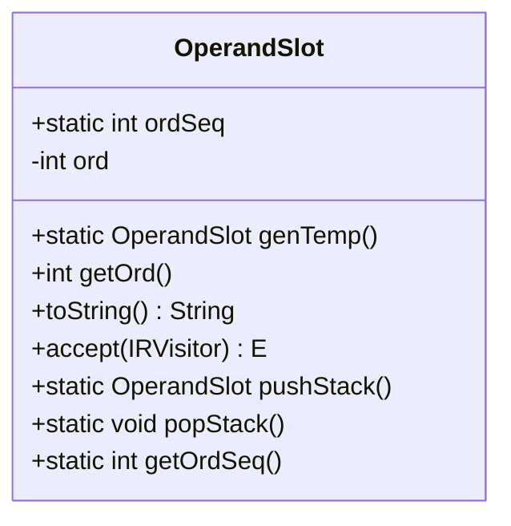
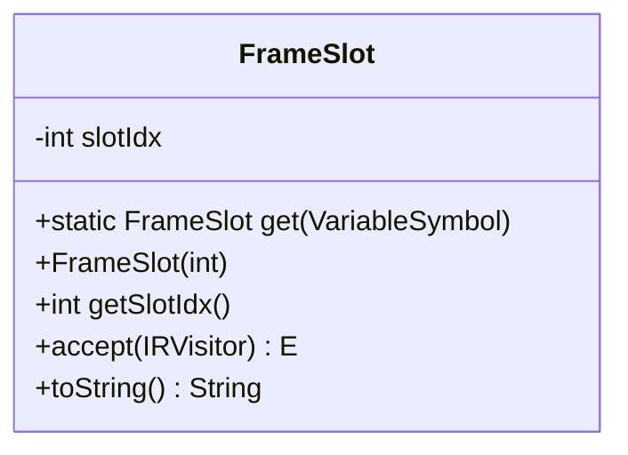
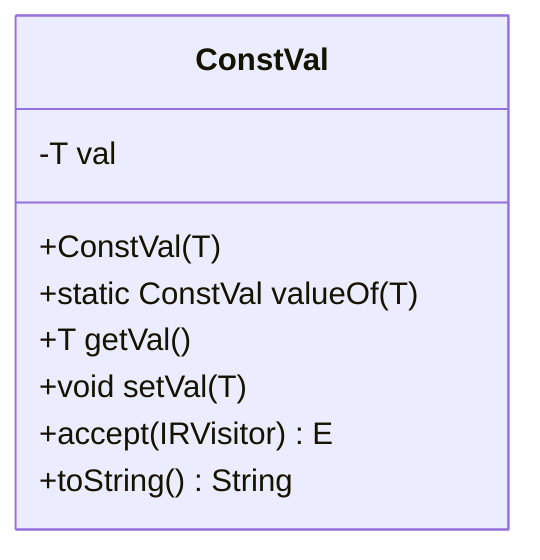
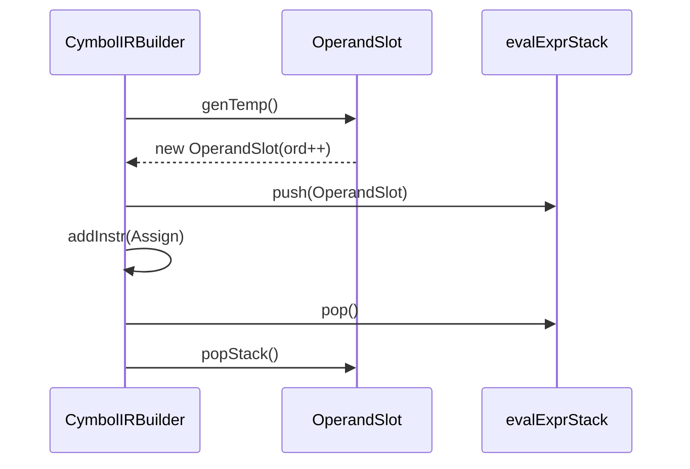
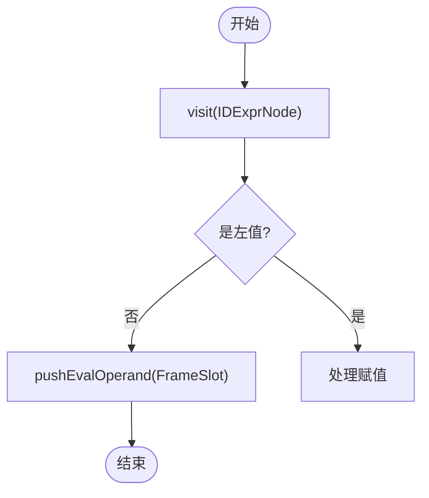
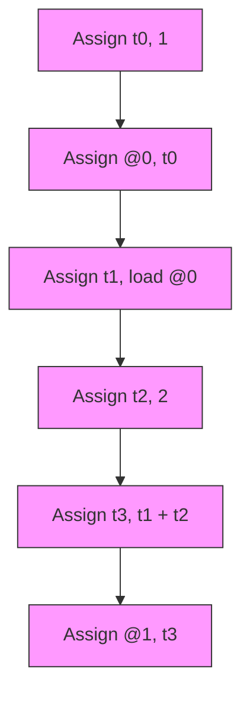

# 地址化表示

<cite>
**本文档中引用的文件**  
- [OperandSlot.java](file://ep20/src/main/java/org/teachfx/antlr4/ep20/ir/expr/addr/OperandSlot.java)
- [FrameSlot.java](file://ep20/src/main/java/org/teachfx/antlr4/ep20/ir/expr/addr/FrameSlot.java)
- [ConstVal.java](file://ep20/src/main/java/org/teachfx/antlr4/ep20/ir/expr/val/ConstVal.java)
- [CymbolIRBuilder.java](file://ep20/src/main/java/org/teachfx/antlr4/ep20/pass/ir/CymbolIRBuilder.java)
- [CymbolAssembler.java](file://ep20/src/main/java/org/teachfx/antlr4/ep20/pass/codegen/CymbolAssembler.java)
- [BasicBlockOptimizationTest.java](file://ep20/src/test/java/org/teachfx/antlr4/ep20/pass/cfg/BasicBlockOptimizationTest.java)
</cite>

## 目录
1. [简介](#简介)
2. [核心组件](#核心组件)
3. [地址化表示的设计与实现](#地址化表示的设计与实现)
4. [虚拟寄存器分配机制](#虚拟寄存器分配机制)
5. [操作数槽位管理策略](#操作数槽位管理策略)
6. [变量引用到栈帧位置的转换](#变量引用到栈帧位置的转换)
7. [常量折叠与立即数优化](#常量折叠与立即数优化)
8. [地址化过程的实际示例](#地址化过程的实际示例)
9. [槽位分配优化](#槽位分配优化)
10. [结论](#结论)

## 简介
地址化表示是编译器中间表示（IR）中的关键环节，负责将源代码中的变量、表达式和常量映射到具体的内存或寄存器位置。本文档详细介绍了 `OperandSlot`、`FrameSlot` 和 `ConstVal` 的设计与实现，阐述了虚拟寄存器分配机制和操作数槽位管理策略，并通过实际代码示例展示变量访问、函数参数传递和返回值处理的地址化过程。

## 核心组件
本文档重点分析以下核心类的设计与功能：
- `OperandSlot`：表示临时操作数槽位，用于存储中间计算结果。
- `FrameSlot`：表示栈帧中的变量槽位，对应局部变量在栈中的位置。
- `ConstVal`：表示常量值，支持整数、布尔值、字符串等类型。

**本节来源**  
- [OperandSlot.java](file://ep20/src/main/java/org/teachfx/antlr4/ep20/ir/expr/addr/OperandSlot.java)
- [FrameSlot.java](file://ep20/src/main/java/org/teachfx/antlr4/ep20/ir/expr/addr/FrameSlot.java)
- [ConstVal.java](file://ep20/src/main/java/org/teachfx/antlr4/ep20/ir/expr/val/ConstVal.java)

## 地址化表示的设计与实现
地址化表示的核心是将抽象语法树（AST）中的表达式和语句转换为带有具体地址信息的中间表示。这通过 `CymbolIRBuilder` 类实现，它遍历 AST 并生成包含 `OperandSlot`、`FrameSlot` 和 `ConstVal` 的 IR 指令。

### OperandSlot
`OperandSlot` 用于表示临时变量，通常用于保存二元或一元运算的中间结果。每个 `OperandSlot` 有一个唯一的序号（`ord`），由静态变量 `ordSeq` 递增生成。



**图示来源**  
- [OperandSlot.java](file://ep20/src/main/java/org/teachfx/antlr4/ep20/ir/expr/addr/OperandSlot.java)

### FrameSlot
`FrameSlot` 表示函数栈帧中的变量槽位，其 `slotIdx` 对应变量在栈中的偏移量。通过 `VariableSymbol.getSlotIdx()` 获取槽位索引。



**图示来源**  
- [FrameSlot.java](file://ep20/src/main/java/org/teachfx/antlr4/ep20/ir/expr/addr/FrameSlot.java)

### ConstVal
`ConstVal` 封装常量值，支持泛型类型。`toString()` 方法根据值类型格式化输出。



**图示来源**  
- [ConstVal.java](file://ep20/src/main/java/org/teachfx/antlr4/ep20/ir/expr/val/ConstVal.java)

## 虚拟寄存器分配机制
虚拟寄存器通过 `OperandSlot` 实现，采用栈式管理。每次生成临时变量时调用 `OperandSlot.genTemp()` 创建新槽位，并将其压入求值栈（`evalExprStack`）。运算完成后，通过 `popEvalOperand()` 弹出操作数并递减 `ordSeq`。



**图示来源**  
- [CymbolIRBuilder.java](file://ep20/src/main/java/org/teachfx/antlr4/ep20/pass/ir/CymbolIRBuilder.java#L438-L472)

## 操作数槽位管理策略
槽位管理依赖于 `evalExprStack` 和静态计数器 `ordSeq`。`pushEvalOperand()` 将操作数压栈，`popEvalOperand()` 弹出并验证栈平衡。若 `ordSeq` 变为负数，则抛出异常。

**本节来源**  
- [CymbolIRBuilder.java](file://ep20/src/main/java/org/teachfx/antlr4/ep20/pass/ir/CymbolIRBuilder.java#L438-L472)

## 变量引用到栈帧位置的转换
当访问变量时，`CymbolIRBuilder.visit(IDExprNode)` 根据符号表中的 `VariableSymbol` 创建 `FrameSlot`，其 `slotIdx` 由符号的 `getSlotIdx()` 提供。赋值操作通过 `Assign.with(lhs, rhs)` 生成 IR 指令。



**图示来源**  
- [CymbolIRBuilder.java](file://ep20/src/main/java/org/teachfx/antlr4/ep20/pass/ir/CymbolIRBuilder.java#L207-L215)

## 常量折叠与立即数优化
常量值通过 `ConstVal.valueOf()` 创建，并在生成 IR 时直接嵌入指令。例如，整数字面量调用 `pushEvalOperand(ConstVal.valueOf(int))`，在汇编阶段转换为 `iconst` 指令。

**本节来源**  
- [CymbolIRBuilder.java](file://ep20/src/main/java/org/teachfx/antlr4/ep20/pass/ir/CymbolIRBuilder.java#L238-L242)
- [CymbolAssembler.java](file://ep20/src/main/java/org/teachfx/antlr4/ep20/pass/codegen/CymbolAssembler.java#L134-L140)

## 地址化过程的实际示例
以下代码：
```c
int a = 1;
int b = a + 2;
```
生成的 IR 为：
```
t0 = 1
store 0
t1 = load 0
t2 = 2
t3 = t1 + t2
store 1
```
其中 `t0`, `t1`, `t2`, `t3` 为 `OperandSlot`，`store 0` 和 `store 1` 对应 `FrameSlot`。

**本节来源**  
- [CymbolIRBuilder.java](file://ep20/src/main/java/org/teachfx/antlr4/ep20/pass/ir/CymbolIRBuilder.java)
- [CymbolAssembler.java](file://ep20/src/main/java/org/teachfx/antlr4/ep20/pass/codegen/CymbolAssembler.java)

## 槽位分配优化
通过 `BasicBlock` 优化减少冗余赋值。例如，连续的 `Assign` 指令可合并或消除。`ControlFlowAnalysis` 进一步优化控制流。



**图示来源**  
- [BasicBlockOptimizationTest.java](file://ep20/src/test/java/org/teachfx/antlr4/ep20/pass/cfg/BasicBlockOptimizationTest.java#L0-L37)

## 结论
地址化表示通过 `OperandSlot`、`FrameSlot` 和 `ConstVal` 实现了变量、临时值和常量的精确映射。虚拟寄存器分配和槽位管理确保了 IR 的正确性和高效性。未来可通过更复杂的寄存器分配算法进一步优化性能。