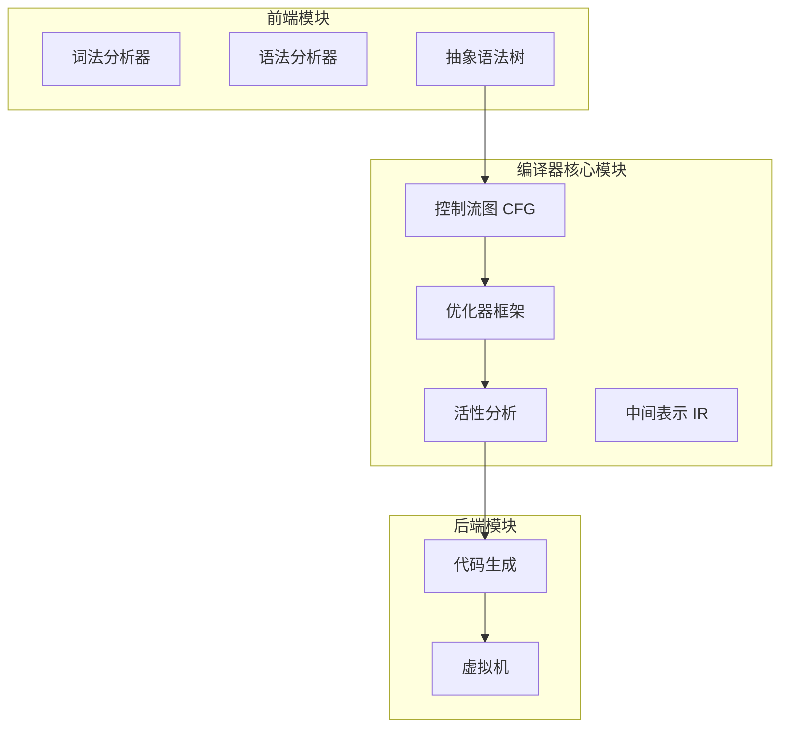
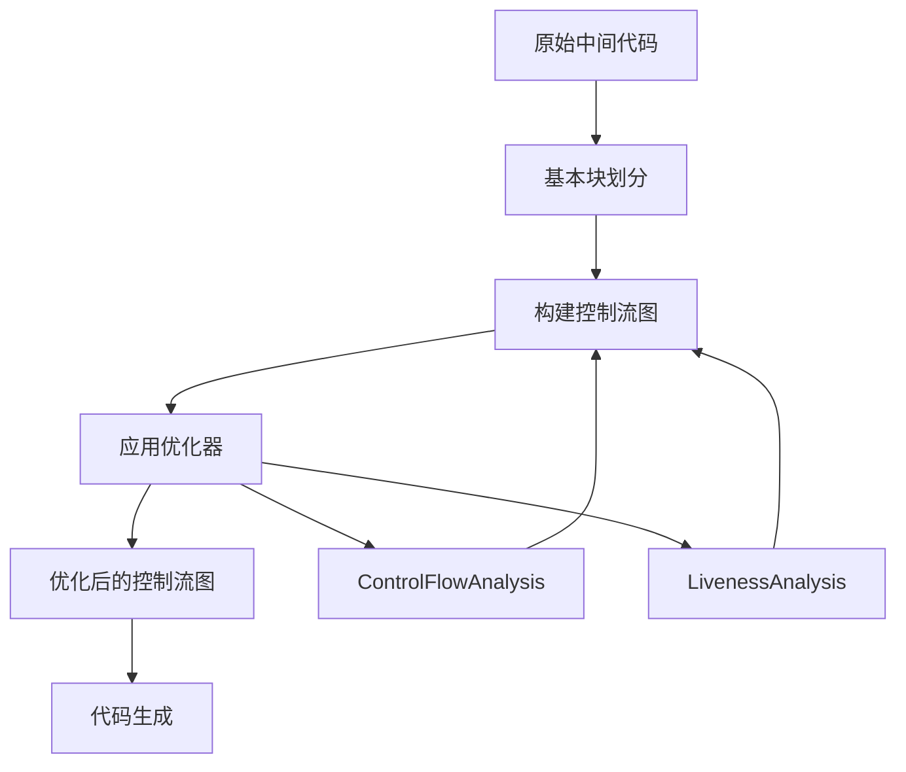
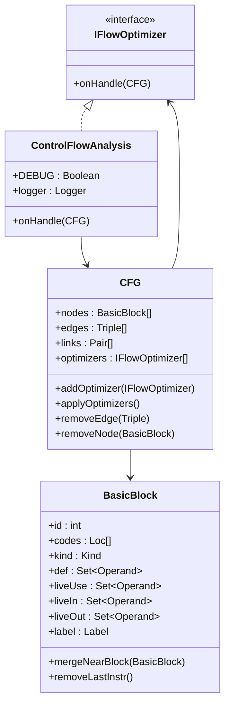
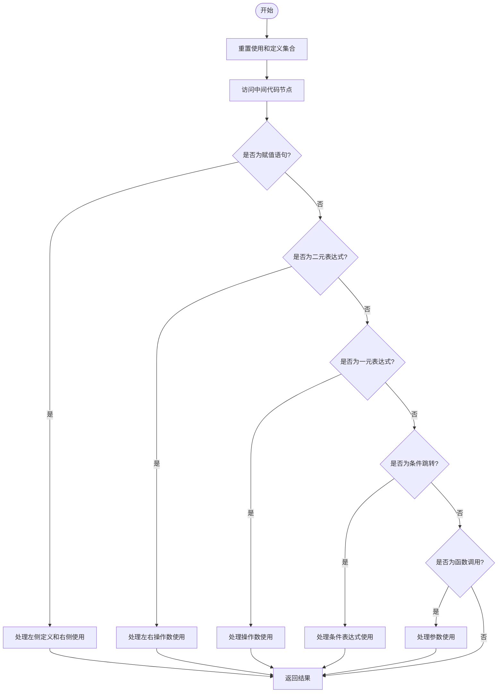
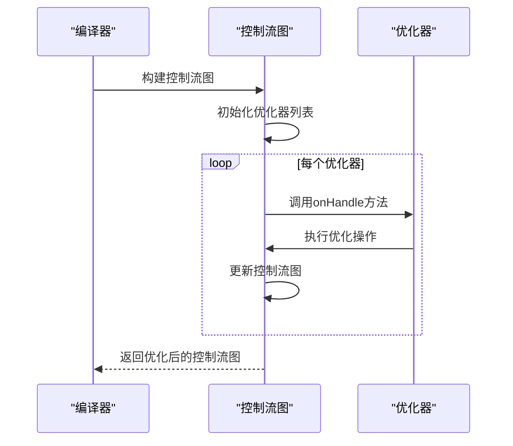
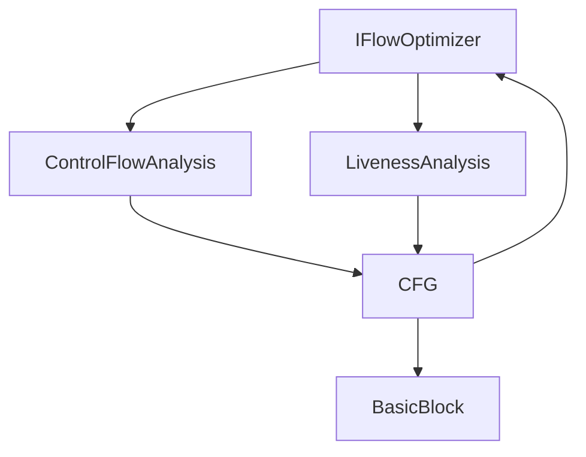

# 代码优化

<cite>
**本文档引用的文件**  
- [ControlFlowAnalysis.java](file://ep20/src/main/java/org/teachfx/antlr4/ep20/pass/cfg/ControlFlowAnalysis.java)
- [LivenessAnalysis.java](file://ep20/src/main/java/org/teachfx/antlr4/ep20/pass/cfg/LivenessAnalysis.java)
- [IFlowOptimizer.java](file://ep20/src/main/java/org/teachfx/antlr4/ep20/pass/cfg/IFlowOptimizer.java)
- [CFG.java](file://ep20/src/main/java/org/teachfx/antlr4/ep20/pass/cfg/CFG.java)
- [BasicBlock.java](file://ep20/src/main/java/org/teachfx/antlr4/ep20/pass/cfg/BasicBlock.java)
</cite>

## 目录
1. [引言](#引言)
2. [项目结构](#项目结构)
3. [核心组件](#核心组件)
4. [架构概述](#架构概述)
5. [详细组件分析](#详细组件分析)
6. [依赖分析](#依赖分析)
7. [性能考虑](#性能考虑)
8. [故障排除指南](#故障排除指南)
9. [结论](#结论)

## 引言
本文档详细介绍了基于 ANTLR4 实现的编程语言编译器中的代码优化机制。重点阐述了控制流分析、活性分析以及优化器扩展框架的设计与实现。文档为初学者提供了代码优化的基本概念，同时为高级用户提供数据流分析和自定义优化算法的实现细节。

## 项目结构
项目 `ep20` 实现了一个完整的编译器，包含词法分析、语法分析、符号表管理、类型检查、中间代码生成和优化等完整编译流程。代码优化功能主要集中在 `pass/cfg` 包中，实现了控制流图（CFG）构建、控制流优化和活性分析等关键优化技术。

**图表来源**  
- [CFG.java](file://ep20/src/main/java/org/teachfx/antlr4/ep20/pass/cfg/CFG.java#L1-L159)

**章节来源**  
- [CFG.java](file://ep20/src/main/java/org/teachfx/antlr4/ep20/pass/cfg/CFG.java#L1-L159)
- [ControlFlowAnalysis.java](file://ep20/src/main/java/org/teachfx/antlr4/ep20/pass/cfg/ControlFlowAnalysis.java#L1-L69)

## 核心组件
本项目的核心优化组件包括控制流分析器、活性分析器和优化器接口。这些组件共同构成了一个可扩展的优化框架，支持基本的控制流优化和数据流分析。

**章节来源**  
- [ControlFlowAnalysis.java](file://ep20/src/main/java/org/teachfx/antlr4/ep20/pass/cfg/ControlFlowAnalysis.java#L1-L69)
- [LivenessAnalysis.java](file://ep20/src/main/java/org/teachfx/antlr4/ep20/pass/cfg/LivenessAnalysis.java#L1-L148)
- [IFlowOptimizer.java](file://ep20/src/main/java/org/teachfx/antlr4/ep20/pass/cfg/IFlowOptimizer.java#L1-L8)

## 架构概述
编译器的优化架构基于控制流图（CFG）进行构建。首先将中间代码转换为基本块，然后构建控制流图，最后应用各种优化器对控制流图进行优化。优化器通过实现 `IFlowOptimizer` 接口来扩展优化功能。

**图表来源**  
- [CFG.java](file://ep20/src/main/java/org/teachfx/antlr4/ep20/pass/cfg/CFG.java#L1-L159)
- [ControlFlowAnalysis.java](file://ep20/src/main/java/org/teachfx/antlr4/ep20/pass/cfg/ControlFlowAnalysis.java#L1-L69)

## 详细组件分析

### 控制流分析优化
`ControlFlowAnalysis` 类实现了基本的控制流优化，包括空标签消除和冗余跳转优化。该优化器通过分析控制流图的结构来识别和消除不必要的跳转指令。

#### 控制流优化类图

**图表来源**  
- [ControlFlowAnalysis.java](file://ep20/src/main/java/org/teachfx/antlr4/ep20/pass/cfg/ControlFlowAnalysis.java#L1-L69)
- [CFG.java](file://ep20/src/main/java/org/teachfx/antlr4/ep20/pass/cfg/CFG.java#L1-L159)
- [BasicBlock.java](file://ep20/src/main/java/org/teachfx/antlr4/ep20/pass/cfg/BasicBlock.java#L1-L131)

### 活性分析机制
`LivenessAnalysis` 类实现了活性分析算法，用于确定变量的活性区间，为寄存器分配等优化提供基础数据。该分析器通过遍历中间代码来跟踪变量的使用和定义。

#### 活性分析算法流程图

**图表来源**  
- [LivenessAnalysis.java](file://ep20/src/main/java/org/teachfx/antlr4/ep20/pass/cfg/LivenessAnalysis.java#L1-L148)

### 优化器扩展机制
`IFlowOptimizer` 接口定义了优化器的扩展机制，允许通过实现该接口来添加新的优化功能。`CFG` 类维护了一个优化器列表，可以按顺序应用多个优化器。

#### 优化器应用序列图

**图表来源**  
- [IFlowOptimizer.java](file://ep20/src/main/java/org/teachfx/antlr4/ep20/pass/cfg/IFlowOptimizer.java#L1-L8)
- [CFG.java](file://ep20/src/main/java/org/teachfx/antlr4/ep20/pass/cfg/CFG.java#L1-L159)

**章节来源**  
- [IFlowOptimizer.java](file://ep20/src/main/java/org/teachfx/antlr4/ep20/pass/cfg/IFlowOptimizer.java#L1-L8)
- [CFG.java](file://ep20/src/main/java/org/teachfx/antlr4/ep20/pass/cfg/CFG.java#L1-L159)

## 依赖分析
优化组件之间的依赖关系清晰，形成了一个层次化的架构。`ControlFlowAnalysis` 和 `LivenessAnalysis` 都依赖于 `CFG` 和 `BasicBlock` 类，而 `CFG` 类通过 `IFlowOptimizer` 接口与具体的优化器解耦。

**图表来源**  
- [IFlowOptimizer.java](file://ep20/src/main/java/org/teachfx/antlr4/ep20/pass/cfg/IFlowOptimizer.java#L1-L8)
- [ControlFlowAnalysis.java](file://ep20/src/main/java/org/teachfx/antlr4/ep20/pass/cfg/ControlFlowAnalysis.java#L1-L69)
- [LivenessAnalysis.java](file://ep20/src/main/java/org/teachfx/antlr4/ep20/pass/cfg/LivenessAnalysis.java#L1-L148)
- [CFG.java](file://ep20/src/main/java/org/teachfx/antlr4/ep20/pass/cfg/CFG.java#L1-L159)

**章节来源**  
- [IFlowOptimizer.java](file://ep20/src/main/java/org/teachfx/antlr4/ep20/pass/cfg/IFlowOptimizer.java#L1-L8)
- [ControlFlowAnalysis.java](file://ep20/src/main/java/org/teachfx/antlr4/ep20/pass/cfg/ControlFlowAnalysis.java#L1-L69)
- [LivenessAnalysis.java](file://ep20/src/main/java/org/teachfx/antlr4/ep20/pass/cfg/LivenessAnalysis.java#L1-L148)

## 性能考虑
控制流优化和活性分析都是编译器中的关键性能瓶颈。`ControlFlowAnalysis` 通过简单的遍历和条件判断来实现优化，时间复杂度相对较低。`LivenessAnalysis` 需要遍历所有中间代码节点，其性能取决于程序的复杂度。

## 故障排除指南
在使用代码优化功能时，可能会遇到控制流图构建错误或优化结果不符合预期的问题。建议检查中间代码的正确性，确保基本块划分和控制流边的连接符合预期。

**章节来源**  
- [ControlFlowAnalysis.java](file://ep20/src/main/java/org/teachfx/antlr4/ep20/pass/cfg/ControlFlowAnalysis.java#L1-L69)
- [LivenessAnalysis.java](file://ep20/src/main/java/org/teachfx/antlr4/ep20/pass/cfg/LivenessAnalysis.java#L1-L148)

## 结论
本文档详细介绍了基于 ANTLR4 实现的编程语言编译器中的代码优化机制。通过 `ControlFlowAnalysis` 和 `LivenessAnalysis` 等组件，实现了基本的控制流优化和数据流分析功能。`IFlowOptimizer` 接口提供了良好的扩展性，支持添加新的优化器。这些优化技术为生成高效的机器代码奠定了基础。