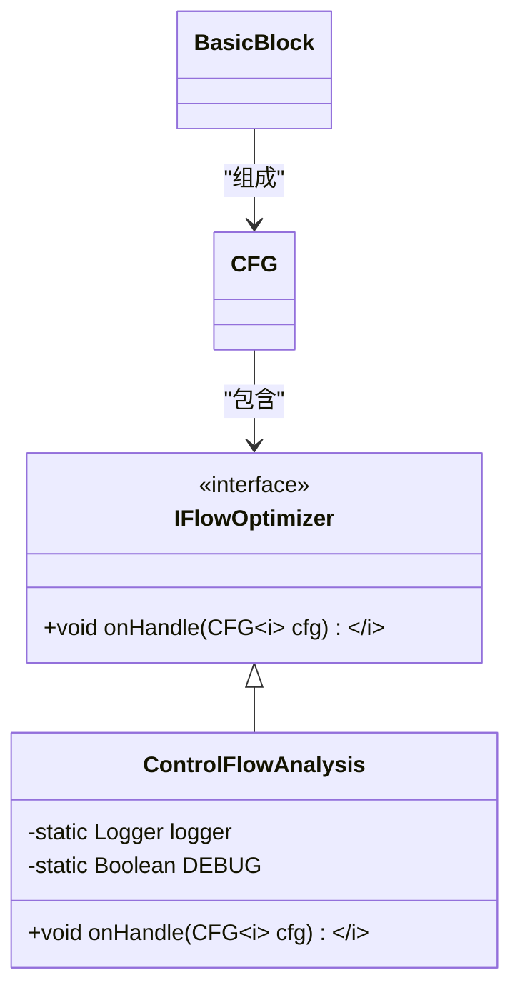
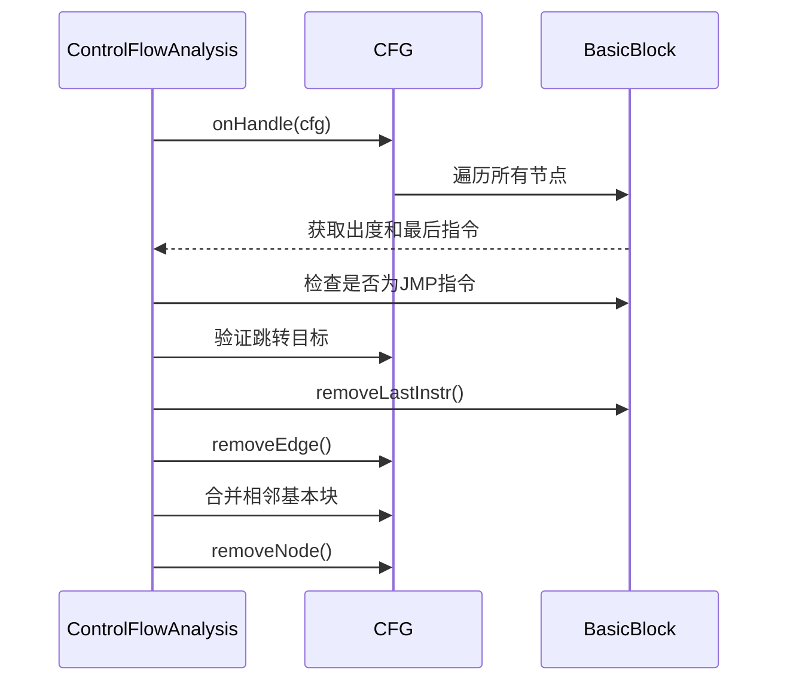
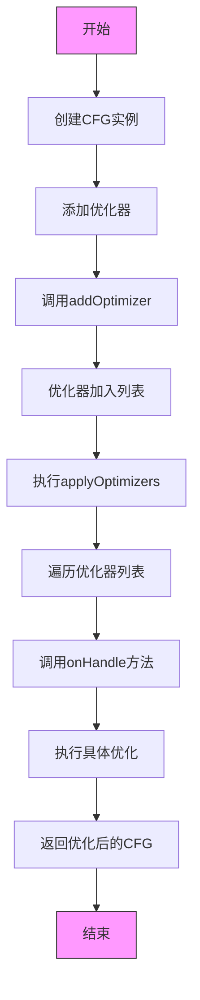
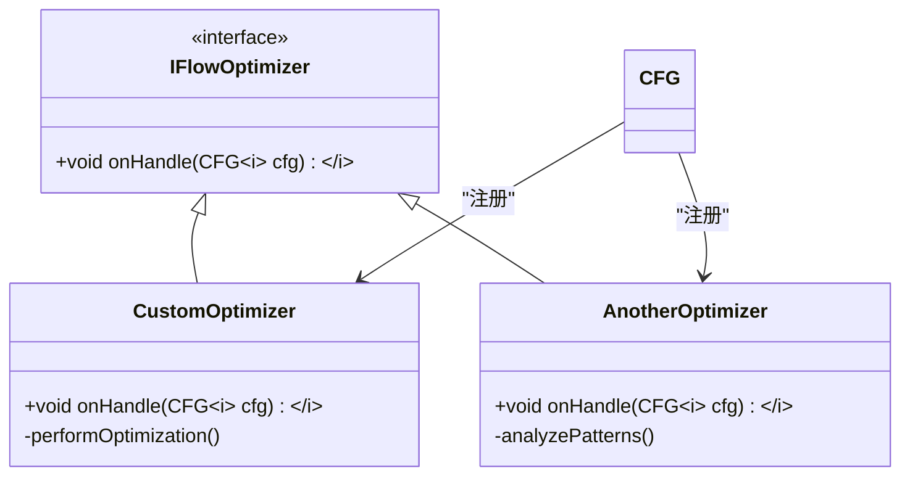
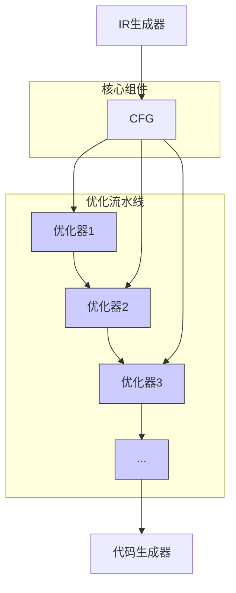
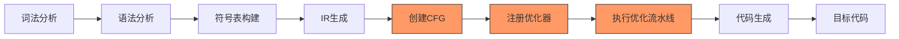
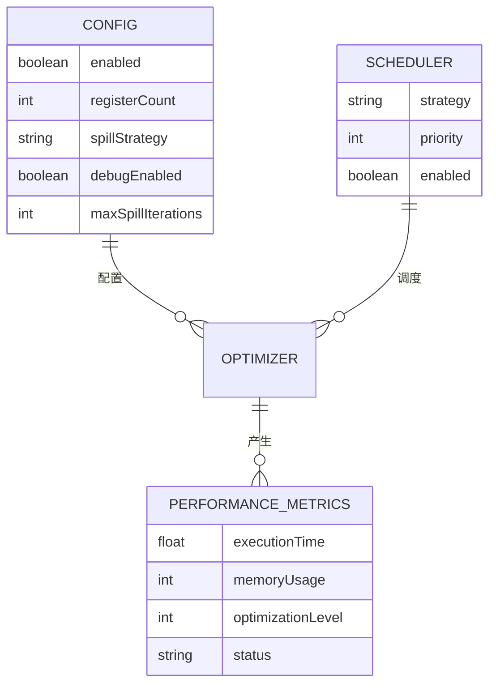

# 优化框架

<cite>
**本文档中引用的文件**  
- [IFlowOptimizer.java](file://ep20/src/main/java/org/teachfx/antlr4/ep20/pass/cfg/IFlowOptimizer.java)
- [ControlFlowAnalysis.java](file://ep20/src/main/java/org/teachfx/antlr4/ep20/pass/cfg/ControlFlowAnalysis.java)
- [CFG.java](file://ep20/src/main/java/org/teachfx/antlr4/ep20/pass/cfg/CFG.java)
- [BasicBlock.java](file://ep20/src/main/java/org/teachfx/antlr4/ep20/pass/cfg/BasicBlock.java)
- [JMPInstr.java](file://ep20/src/main/java/org/teachfx/antlr4/ep20/ir/JMPInstr.java)
</cite>

## 目录
1. [简介](#简介)
2. [优化器扩展机制](#优化器扩展机制)
3. [优化流水线实现](#优化流水线实现)
4. [优化器注册与执行机制](#优化器注册与执行机制)
5. [自定义优化算法实现](#自定义优化算法实现)
6. [设计原则与架构模式](#设计原则与架构模式)
7. [优化框架集成示例](#优化框架集成示例)
8. [性能监控与调度机制](#性能监控与调度机制)
9. [结论](#结论)

## 简介
本文档详细介绍了基于ANTLR4实现的代码优化框架，重点阐述了IFlowOptimizer接口定义的优化器扩展机制和ControlFlowAnalysis实现的优化流水线。该框架为编译器提供了灵活的优化能力，支持通过接口实现自定义优化算法，并采用责任链模式组织优化流水线。文档将为初学者提供优化框架基本概念的解释，同时为高级用户详细介绍优化器调度机制和性能监控方法。

## 优化器扩展机制

优化框架的核心是IFlowOptimizer接口，它定义了所有优化器必须实现的统一契约。该接口采用泛型设计，支持对不同类型的中间表示（IR）节点进行优化。

**图源**  
- [IFlowOptimizer.java](file://ep20/src/main/java/org/teachfx/antlr4/ep20/pass/cfg/IFlowOptimizer.java)
- [ControlFlowAnalysis.java](file://ep20/src/main/java/org/teachfx/antlr4/ep20/pass/cfg/ControlFlowAnalysis.java)

**本节源**  
- [IFlowOptimizer.java](file://ep20/src/main/java/org/teachfx/antlr4/ep20/pass/cfg/IFlowOptimizer.java#L4-L6)

## 优化流水线实现

ControlFlowAnalysis类实现了IFlowOptimizer接口，提供了具体的控制流优化逻辑。该优化器通过分析控制流图（CFG）来识别和消除冗余的跳转指令，并合并相邻的基本块以提高代码效率。

**图源**  
- [ControlFlowAnalysis.java](file://ep20/src/main/java/org/teachfx/antlr4/ep20/pass/cfg/ControlFlowAnalysis.java#L13-L67)
- [CFG.java](file://ep20/src/main/java/org/teachfx/antlr4/ep20/pass/cfg/CFG.java)
- [BasicBlock.java](file://ep20/src/main/java/org/teachfx/antlr4/ep20/pass/cfg/BasicBlock.java)

**本节源**  
- [ControlFlowAnalysis.java](file://ep20/src/main/java/org/teachfx/antlr4/ep20/pass/cfg/ControlFlowAnalysis.java#L13-L67)

## 优化器注册与执行机制

优化器通过CFG类的addOptimizer方法注册到优化流水线中。当调用applyOptimizers方法时，所有注册的优化器将按顺序执行，形成责任链模式的优化流水线。

**图源**  
- [CFG.java](file://ep20/src/main/java/org/teachfx/antlr4/ep20/pass/cfg/CFG.java#L141)
- [IFlowOptimizer.java](file://ep20/src/main/java/org/teachfx/antlr4/ep20/pass/cfg/IFlowOptimizer.java)

**本节源**  
- [CFG.java](file://ep20/src/main/java/org/teachfx/antlr4/ep20/pass/cfg/CFG.java#L141-L158)

## 自定义优化算法实现

开发者可以通过实现IFlowOptimizer接口来创建自定义优化算法。新的优化器需要重写onHandle方法，在其中实现特定的优化逻辑，然后通过CFG的addOptimizer方法将其注册到优化流水线中。

**图源**  
- [IFlowOptimizer.java](file://ep20/src/main/java/org/teachfx/antlr4/ep20/pass/cfg/IFlowOptimizer.java)
- [CFG.java](file://ep20/src/main/java/org/teachfx/antlr4/ep20/pass/cfg/CFG.java)

**本节源**  
- [IFlowOptimizer.java](file://ep20/src/main/java/org/teachfx/antlr4/ep20/pass/cfg/IFlowOptimizer.java#L4-L6)
- [CFG.java](file://ep20/src/main/java/org/teachfx/antlr4/ep20/pass/cfg/CFG.java#L141)

## 设计原则与架构模式

优化框架采用了责任链设计模式，将多个优化器串联成一个流水线。每个优化器负责特定的优化任务，它们可以独立开发和测试，然后通过统一的接口集成到框架中。

**图源**  
- [CFG.java](file://ep20/src/main/java/org/teachfx/antlr4/ep20/pass/cfg/CFG.java)
- [IFlowOptimizer.java](file://ep20/src/main/java/org/teachfx/antlr4/ep20/pass/cfg/IFlowOptimizer.java)

**本节源**  
- [CFG.java](file://ep20/src/main/java/org/teachfx/antlr4/ep20/pass/cfg/CFG.java#L141-L158)

## 优化框架集成示例

以下示例展示了如何将优化框架集成到编译流程中。通过在IR生成后添加优化阶段，可以显著提高生成代码的质量和执行效率。

**图源**  
- [CFG.java](file://ep20/src/main/java/org/teachfx/antlr4/ep20/pass/cfg/CFG.java)
- [ControlFlowAnalysis.java](file://ep20/src/main/java/org/teachfx/antlr4/ep20/pass/cfg/ControlFlowAnalysis.java)

**本节源**  
- [CFG.java](file://ep20/src/main/java/org/teachfx/antlr4/ep20/pass/cfg/CFG.java#L141-L158)
- [ControlFlowAnalysis.java](file://ep20/src/main/java/org/teachfx/antlr4/ep20/pass/cfg/ControlFlowAnalysis.java#L13-L67)

## 性能监控与调度机制

优化框架支持性能监控和调度机制，可以通过配置文件或命令行参数控制优化器的行为。这种设计允许在开发、测试和生产环境中采用不同的优化策略。

**图源**  
- [CFG.java](file://ep20/src/main/java/org/teachfx/antlr4/ep20/pass/cfg/CFG.java)
- [ControlFlowAnalysis.java](file://ep20/src/main/java/org/teachfx/antlr4/ep20/pass/cfg/ControlFlowAnalysis.java)

**本节源**  
- [CFG.java](file://ep20/src/main/java/org/teachfx/antlr4/ep20/pass/cfg/CFG.java#L141-L158)

## 结论
本文档详细介绍了基于ANTLR4实现的代码优化框架，包括IFlowOptimizer接口定义的优化器扩展机制和ControlFlowAnalysis实现的优化流水线。该框架采用责任链设计模式，提供了灵活的优化器注册、执行和协调机制。通过实现IFlowOptimizer接口，开发者可以轻松创建自定义优化算法并集成到现有框架中。优化框架的设计原则和架构模式确保了系统的可扩展性和可维护性，为编译器提供了强大的优化能力。