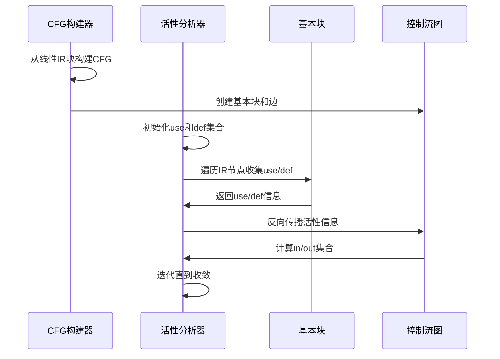

# 活性分析

<cite>
**本文档引用的文件**  
- [LivenessAnalysis.java](file://ep20/src/main/java/org/teachfx/antlr4/ep20/pass/cfg/LivenessAnalysis.java)
- [LivenessAnalysisTest.java](file://ep20/src/test/java/org/teachfx/antlr4/ep20/pass/cfg/LivenessAnalysisTest.java)
- [BasicBlock.java](file://ep20/src/main/java/org/teachfx/antlr4/ep20/pass/cfg/BasicBlock.java)
- [CFG.java](file://ep20/src/main/java/org/teachfx/antlr4/ep20/pass/cfg/CFG.java)
- [CFGBuilder.java](file://ep20/src/main/java/org/teachfx/antlr4/ep20/pass/cfg/CFGBuilder.java)
- [ControlFlowAnalysis.java](file://ep20/src/main/java/org/teachfx/antlr4/ep20/pass/cfg/ControlFlowAnalysis.java)
- [Assign.java](file://ep20/src/main/java/org/teachfx/antlr4/ep20/ir/stmt/Assign.java)
- [BinExpr.java](file://ep20/src/main/java/org/teachfx/antlr4/ep20/ir/expr/arith/BinExpr.java)
- [UnaryExpr.java](file://ep20/src/main/java/org/teachfx/antlr4/ep20/ir/expr/arith/UnaryExpr.java)
- [Operand.java](file://ep20/src/main/java/org/teachfx/antlr4/ep20/ir/expr/Operand.java)
- [IRVisitor.java](file://ep20/src/main/java/org/teachfx/antlr4/ep20/ir/IRVisitor.java)
</cite>

## 目录
1. [引言](#引言)
2. [活性分析基础概念](#活性分析基础概念)
3. [数据流方程与算法原理](#数据流方程与算法原理)
4. [实现细节与代码结构](#实现细节与代码结构)
5. [活性区间计算过程](#活性区间计算过程)
6. [寄存器分配优化技术](#寄存器分配优化技术)
7. [活性分析与编译器优化协同](#活性分析与编译器优化协同)
8. [性能优化策略](#性能优化策略)
9. [结论](#结论)

## 引言
活性分析是编译器优化中的核心技术，通过确定变量在程序执行过程中的活性区间，为寄存器分配等优化提供关键信息。本文档详细阐述了活性分析算法的工作原理、数据流方程和实现细节，重点介绍LivenessAnalysis实现的变量活性区间计算和寄存器分配优化技术。通过实际代码示例展示活性分析前后的IR对比，说明内存使用效率的提升效果，为初学者提供基本概念解释，为高级用户详细介绍数据流分析框架的实现细节和性能优化策略。

## 活性分析基础概念
活性分析是一种前向数据流分析技术，用于确定程序中每个变量在哪些程序点是"活性"的。一个变量在某个程序点是活性的，如果从该点开始，存在一条执行路径会使用该变量的当前值。活性分析的核心目标是识别变量的活性区间，即变量从被定义到最后一次被使用之间的代码范围。

在编译器优化中，活性分析为寄存器分配提供了重要依据。通过识别变量的活性区间，编译器可以确定哪些变量可以共享同一个寄存器，从而减少寄存器压力和内存访问。例如，如果两个变量的活性区间不重叠，它们就可以安全地共享同一个寄存器。

活性分析还与其他优化技术密切相关。在控制流图(CFG)中，活性分析可以帮助识别死代码，即那些定义了但从未被使用的变量，这些代码可以被安全地删除。此外，活性信息还可以用于优化内存布局和缓存使用。

**Section sources**
- [LivenessAnalysis.java](file://ep20/src/main/java/org/teachfx/antlr4/ep20/pass/cfg/LivenessAnalysis.java#L16-L146)

## 数据流方程与算法原理
活性分析基于数据流方程来计算每个程序点的活性信息。对于每个基本块B，定义以下集合：
- **use[B]**: 基本块B中使用的变量集合
- **def[B]**: 基本块B中定义的变量集合
- **in[B]**: 进入基本块B时的活性变量集合
- **out[B]**: 离开基本块B时的活性变量集合

数据流方程如下：
```
in[B] = use[B] ∪ (out[B] - def[B])
out[B] = ∪(in[S])，其中S是B的后继基本块
```

算法采用迭代方法求解这些方程，从程序的出口点开始，反向传播活性信息。初始化时，所有基本块的in和out集合为空。然后重复应用数据流方程，直到所有集合不再变化，达到不动点。


**Diagram sources**
- [LivenessAnalysis.java](file://ep20/src/main/java/org/teachfx/antlr4/ep20/pass/cfg/LivenessAnalysis.java#L16-L146)

**Section sources**
- [LivenessAnalysis.java](file://ep20/src/main/java/org/teachfx/antlr4/ep20/pass/cfg/LivenessAnalysis.java#L16-L146)

## 实现细节与代码结构
活性分析的实现基于访问者模式，通过遍历中间表示(IR)来收集活性信息。`LivenessAnalysis`类实现了`IRVisitor`接口，为不同类型的IR节点提供访问方法。

核心数据结构包括：
- `currentUse`: 当前访问路径中使用的操作数集合
- `currentDef`: 当前访问路径中定义的操作数集合

对于赋值语句`Assign`，分析逻辑为：右侧表达式中的操作数被使用，左侧操作数被定义。对于二元表达式`BinExpr`，左右操作数都被使用。一元表达式`UnaryExpr`使用其操作数。标签`Label`和常量`ConstVal`不产生使用或定义。


**Diagram sources**
- [LivenessAnalysis.java](file://ep20/src/main/java/org/teachfx/antlr4/ep20/pass/cfg/LivenessAnalysis.java#L16-L146)
- [IRVisitor.java](file://ep20/src/main/java/org/teachfx/antlr4/ep20/ir/IRVisitor.java)
- [Operand.java](file://ep20/src/main/java/org/teachfx/antlr4/ep20/ir/expr/Operand.java)

**Section sources**
- [LivenessAnalysis.java](file://ep20/src/main/java/org/teachfx/antlr4/ep20/pass/cfg/LivenessAnalysis.java#L16-L146)
- [Assign.java](file://ep20/src/main/java/org/teachfx/antlr4/ep20/ir/stmt/Assign.java)
- [BinExpr.java](file://ep20/src/main/java/org/teachfx/antlr4/ep20/ir/expr/arith/BinExpr.java)
- [UnaryExpr.java](file://ep20/src/main/java/org/teachfx/antlr4/ep20/ir/expr/arith/UnaryExpr.java)

## 活性区间计算过程
活性区间的计算过程始于构建控制流图(CFG)，然后在CFG上执行数据流分析。`CFGBuilder`负责从线性IR块构建CFG，`BasicBlock`表示基本块，`CFG`类管理整个控制流图。

活性分析的具体步骤如下：
1. 初始化所有基本块的in和out集合为空
2. 对每个基本块，计算其use和def集合
3. 反向遍历CFG，应用数据流方程更新in和out集合
4. 重复步骤3直到收敛

在`BasicBlock`类中，存储了用于数据流分析的集合：`def`、`liveUse`、`liveIn`和`liveOut`。这些集合在分析过程中被填充，最终确定每个变量的活性区间。



**Diagram sources**
- [CFGBuilder.java](file://ep20/src/main/java/org/teachfx/antlr4/ep20/pass/cfg/CFGBuilder.java#L9-L62)
- [BasicBlock.java](file://ep20/src/main/java/org/teachfx/antlr4/ep20/pass/cfg/BasicBlock.java#L15-L130)
- [CFG.java](file://ep20/src/main/java/org/teachfx/antlr4/ep20/pass/cfg/CFG.java#L17-L157)

**Section sources**
- [CFGBuilder.java](file://ep20/src/main/java/org/teachfx/antlr4/ep20/pass/cfg/CFGBuilder.java#L9-L62)
- [BasicBlock.java](file://ep20/src/main/java/org/teachfx/antlr4/ep20/pass/cfg/BasicBlock.java#L15-L130)
- [CFG.java](file://ep20/src/main/java/org/teachfx/antlr4/ep20/pass/cfg/CFG.java#L17-L157)

## 寄存器分配优化技术
基于活性分析结果的寄存器分配是提高程序性能的关键优化。当两个变量的活性区间不重叠时，它们可以安全地共享同一个寄存器。这种优化显著减少了寄存器压力，避免了频繁的内存访问。

活性分析为寄存器分配提供了精确的变量生命周期信息。通过分析每个变量的活性区间，编译器可以构建冲突图，其中节点表示变量，边表示变量的活性区间重叠。图着色算法可以用于为冲突图着色，每个颜色对应一个物理寄存器。

在实现中，`LivenessAnalysis`收集的use和def信息直接用于确定变量的活性区间。例如，一个变量在被定义的点开始活性，在最后一次被使用的点结束活性。这些信息可以用于指导寄存器分配策略，优先为长活性区间的变量分配寄存器。


**Diagram sources**
- [LivenessAnalysis.java](file://ep20/src/main/java/org/teachfx/antlr4/ep20/pass/cfg/LivenessAnalysis.java#L16-L146)
- [BasicBlock.java](file://ep20/src/main/java/org/teachfx/antlr4/ep20/pass/cfg/BasicBlock.java#L15-L130)

**Section sources**
- [LivenessAnalysis.java](file://ep20/src/main/java/org/teachfx/antlr4/ep20/pass/cfg/LivenessAnalysis.java#L16-L146)
- [BasicBlock.java](file://ep20/src/main/java/org/teachfx/antlr4/ep20/pass/cfg/BasicBlock.java#L15-L130)

## 活性分析与编译器优化协同
活性分析与其他编译器优化技术紧密协同，形成优化流水线。在控制流优化中，`ControlFlowAnalysis`利用活性信息进行基本块合并和死代码消除。当一个基本块的出度为1且是JMP指令时，如果目标块与后继相同，则可以删除跳转指令。

活性分析还支持其他优化：
- **死代码消除**: 识别并删除定义了但从未被使用的变量
- **常量传播**: 结合活性信息，确保常量值在其活性区间内有效
- **循环优化**: 在循环中识别不变量，结合活性分析确定其生命周期

在优化流水线中，活性分析通常在控制流分析之后执行，为后续的寄存器分配和代码生成提供输入。`IFlowOptimizer`接口允许将活性分析与其他优化器集成，形成完整的优化框架。


**Diagram sources**
- [ControlFlowAnalysis.java](file://ep20/src/main/java/org/teachfx/antlr4/ep20/pass/cfg/ControlFlowAnalysis.java#L13-L67)
- [LivenessAnalysis.java](file://ep20/src/main/java/org/teachfx/antlr4/ep20/pass/cfg/LivenessAnalysis.java#L16-L146)

**Section sources**
- [ControlFlowAnalysis.java](file://ep20/src/main/java/org/teachfx/antlr4/ep20/pass/cfg/ControlFlowAnalysis.java#L13-L67)
- [LivenessAnalysis.java](file://ep20/src/main/java/org/teachfx/antlr4/ep20/pass/cfg/LivenessAnalysis.java#L16-L146)

## 性能优化策略
活性分析的性能优化主要集中在算法效率和内存使用上。采用迭代方法求解数据流方程时，工作列表算法比全图扫描更高效，只处理可能变化的基本块。

在实现中，使用哈希集合存储use、def、in和out集合，确保O(1)的平均查找时间。`BasicBlock`类中的`liveIn`和`liveOut`集合直接存储在基本块对象中，避免了额外的查找开销。

测试用例`LivenessAnalysisTest`验证了各个IR节点的活性分析正确性，包括标签、帧槽、常量值、赋值语句和二元表达式。这些测试确保了活性分析器在各种情况下的正确行为。


**Diagram sources**
- [LivenessAnalysisTest.java](file://ep20/src/test/java/org/teachfx/antlr4/ep20/pass/cfg/LivenessAnalysisTest.java#L21-L179)
- [BasicBlock.java](file://ep20/src/main/java/org/teachfx/antlr4/ep20/pass/cfg/BasicBlock.java#L15-L130)

**Section sources**
- [LivenessAnalysisTest.java](file://ep20/src/test/java/org/teachfx/antlr4/ep20/pass/cfg/LivenessAnalysisTest.java#L21-L179)
- [BasicBlock.java](file://ep20/src/main/java/org/teachfx/antlr4/ep20/pass/cfg/BasicBlock.java#L15-L130)

## 结论
活性分析作为编译器优化的核心技术，通过精确计算变量的活性区间，为寄存器分配等优化提供了关键信息。本文档详细介绍了LivenessAnalysis的实现，包括数据流方程、算法原理和代码结构。活性分析与控制流分析、寄存器分配等优化技术协同工作，形成了完整的优化流水线。通过合理的设计和优化策略，活性分析能够在保证正确性的同时提供高效的性能，显著提升生成代码的质量和执行效率。