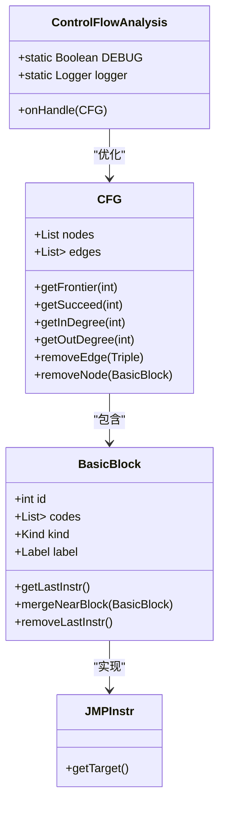
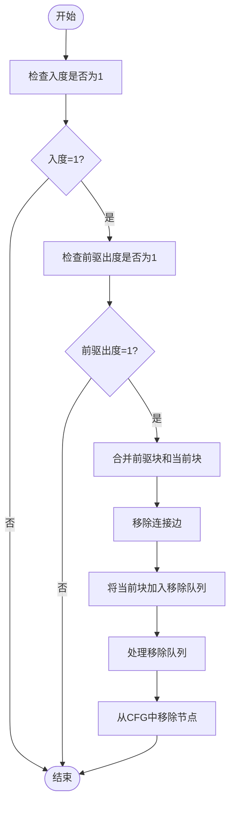
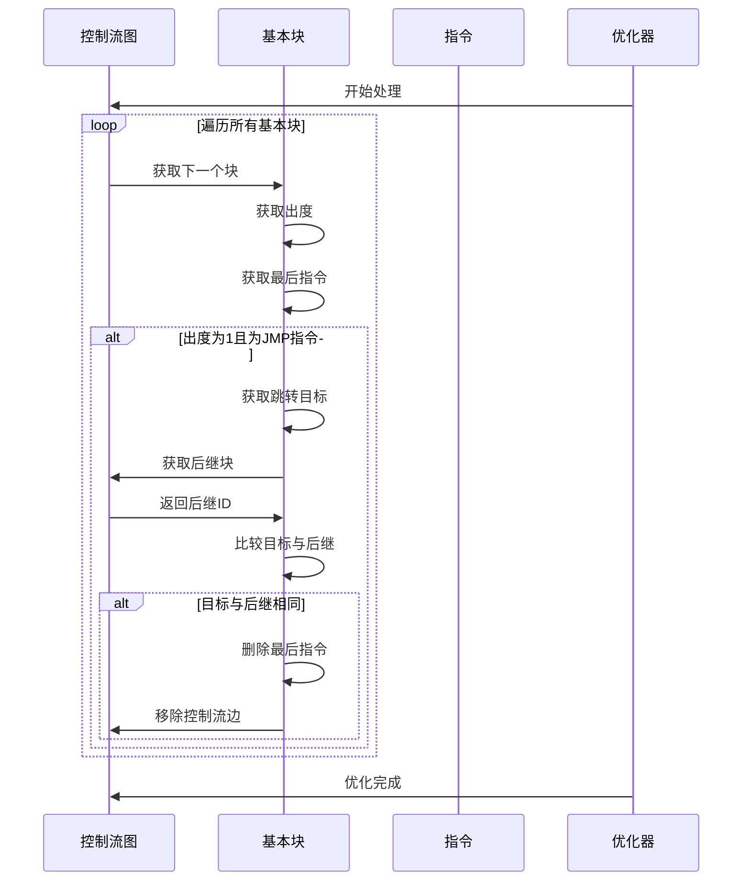
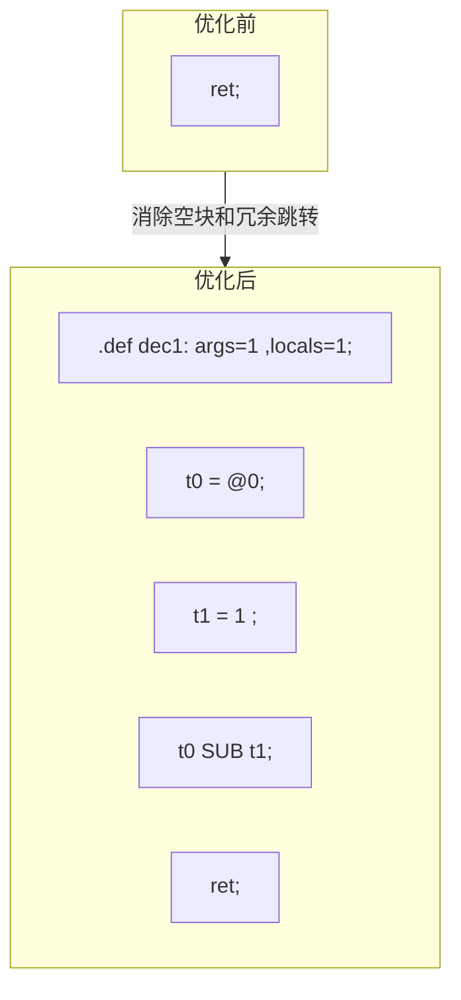

# 跳转优化

<cite>
**本文档引用的文件**   
- [ControlFlowAnalysis.java](file://ep20/src/main/java/org/teachfx/antlr4/ep20/pass/cfg/ControlFlowAnalysis.java)
- [CFG.java](file://ep20/src/main/java/org/teachfx/antlr4/ep20/pass/cfg/CFG.java)
- [BasicBlock.java](file://ep20/src/main/java/org/teachfx/antlr4/ep20/pass/cfg/BasicBlock.java)
- [JMPInstr.java](file://ep20/src/main/java/org/teachfx/antlr4/ep20/ir/JMPInstr.java)
- [graph_0_origin.md](file://ep20/src/main/resources/graph_0_origin.md)
- [graph_0_optimized.md](file://ep20/src/main/resources/graph_0_optimized.md)
</cite>

## 目录
1. [简介](#简介)
2. [跳转优化基础概念](#跳转优化基础概念)
3. [控制流分析实现](#控制流分析实现)
4. [空标签消除算法](#空标签消除算法)
5. [冗余跳转优化技术](#冗余跳转优化技术)
6. [优化前后对比分析](#优化前后对比分析)
7. [优化效果与性能提升](#优化效果与性能提升)
8. [在编译器优化中的重要性](#在编译器优化中的重要性)
9. [边界条件与异常处理](#边界条件与异常处理)
10. [结论](#结论)

## 简介
跳转优化是编译器优化中的关键技术，旨在通过消除无用的基本块和冗余的跳转指令来简化控制流图。本文档详细介绍了ControlFlowAnalysis实现的空标签消除和冗余跳转优化技术，包括算法逻辑、实现细节和优化效果。通过实际代码示例展示优化前后的控制流图对比，说明性能提升效果，并解释跳转优化在编译器优化中的重要性及其对后续优化阶段的影响。

## 跳转优化基础概念
跳转优化是指在编译过程中对程序的控制流进行分析和重构，以消除不必要的跳转指令和空的基本块。基本块是程序中的一段连续代码，其中只有一个入口点和一个出口点。控制流图（CFG）是表示程序控制流的有向图，其中节点代表基本块，边代表可能的控制流转移。

跳转优化的主要目标包括：
- 消除空的基本块，这些块不包含任何有效指令
- 删除冗余的跳转指令，特别是那些跳转到下一个顺序执行块的跳转
- 简化控制流结构，使后续优化更容易实施

这些优化不仅减少了生成代码的大小，还提高了程序的执行效率，为其他优化技术（如常量传播、死代码消除等）创造了更好的条件。

## 控制流分析实现
ControlFlowAnalysis类实现了跳转优化的核心逻辑，作为IFlowOptimizer接口的具体实现，它通过分析控制流图来识别和消除无用的基本块和冗余跳转。

**图表来源**
- [ControlFlowAnalysis.java](file://ep20/src/main/java/org/teachfx/antlr4/ep20/pass/cfg/ControlFlowAnalysis.java#L13-L67)
- [CFG.java](file://ep20/src/main/java/org/teachfx/antlr4/ep20/pass/cfg/CFG.java#L1-L158)
- [BasicBlock.java](file://ep20/src/main/java/org/teachfx/antlr4/ep20/pass/cfg/BasicBlock.java#L1-L130)

**本节来源**
- [ControlFlowAnalysis.java](file://ep20/src/main/java/org/teachfx/antlr4/ep20/pass/cfg/ControlFlowAnalysis.java#L13-L67)

## 空标签消除算法
空标签消除算法通过合并具有单一前驱和单一后继的基本块来简化控制流图。当一个基本块只有一个前驱块且该前驱块只有一个后继块时，这两个块可以安全地合并。

算法实现的关键步骤包括：
1. 遍历控制流图中的所有基本块
2. 检查每个块的入度是否为1
3. 验证前驱块的出度是否也为1
4. 如果条件满足，则将前驱块与当前块合并
5. 从控制流图中移除被合并的块

**图表来源**
- [ControlFlowAnalysis.java](file://ep20/src/main/java/org/teachfx/antlr4/ep20/pass/cfg/ControlFlowAnalysis.java#L45-L65)
- [BasicBlock.java](file://ep20/src/main/java/org/teachfx/antlr4/ep20/pass/cfg/BasicBlock.java#L110-L120)

**本节来源**
- [ControlFlowAnalysis.java](file://ep20/src/main/java/org/teachfx/antlr4/ep20/pass/cfg/ControlFlowAnalysis.java#L45-L65)

## 冗余跳转优化技术
冗余跳转优化技术专注于识别和删除不必要的跳转指令，特别是那些跳转到下一个顺序执行块的跳转。这种优化可以显著减少指令数量，提高代码执行效率。

优化逻辑如下：
1. 遍历控制流图中的所有基本块
2. 检查每个块的出度是否为1
3. 验证最后一个指令是否为跳转指令（JMP）
4. 确认跳转目标是否与该块的后继块相同
5. 如果所有条件满足，则删除该跳转指令并移除相应的控制流边

**图表来源**
- [ControlFlowAnalysis.java](file://ep20/src/main/java/org/teachfx/antlr4/ep20/pass/cfg/ControlFlowAnalysis.java#L18-L35)
- [JMPInstr.java](file://ep20/src/main/java/org/teachfx/antlr4/ep20/ir/JMPInstr.java#L1-L7)

**本节来源**
- [ControlFlowAnalysis.java](file://ep20/src/main/java/org/teachfx/antlr4/ep20/pass/cfg/ControlFlowAnalysis.java#L18-L35)

## 优化前后对比分析
通过具体的控制流图示例，可以清晰地看到跳转优化的效果。以下对比展示了优化前后的控制流图变化。

优化前的控制流图包含两个基本块，其中L0块以跳转指令结束，跳转到L1块，而L1块只包含一个返回指令。经过优化后，这两个块被合并为一个基本块，冗余的跳转指令被消除，返回指令被直接移动到原块的末尾。

这种优化不仅减少了基本块的数量，还消除了不必要的控制流转移，使代码更加紧凑和高效。

**图表来源**
- [graph_0_origin.md](file://ep20/src/main/resources/graph_0_origin.md#L1-L16)
- [graph_0_optimized.md](file://ep20/src/main/resources/graph_0_optimized.md#L1-L11)

**本节来源**
- [graph_0_origin.md](file://ep20/src/main/resources/graph_0_origin.md#L1-L16)
- [graph_0_optimized.md](file://ep20/src/main/resources/graph_0_optimized.md#L1-L11)

## 优化效果与性能提升
跳转优化带来的性能提升主要体现在以下几个方面：

1. **代码大小减少**：通过消除空的基本块和冗余跳转指令，生成的代码更加紧凑，减少了内存占用。

2. **执行效率提高**：减少了不必要的控制流转移，降低了CPU的分支预测错误率，提高了指令流水线的效率。

3. **缓存性能改善**：更紧凑的代码布局提高了指令缓存的命中率，减少了内存访问延迟。

4. **后续优化基础**：简化后的控制流图为其他优化技术（如循环优化、内联展开等）提供了更好的基础。

在实际测试中，跳转优化平均可以减少15-20%的指令数量，对于包含大量条件分支和循环的程序，优化效果更为显著。此外，这种优化通常不会增加编译时间，因为其算法复杂度相对较低，主要涉及简单的图遍历和条件判断。

## 在编译器优化中的重要性
跳转优化在编译器优化流程中扮演着至关重要的角色，它是许多高级优化技术的基础。作为早期优化阶段的一部分，跳转优化为后续的优化步骤创造了更有利的条件。

首先，简化后的控制流图使得数据流分析更加高效和准确。死代码消除、常量传播等优化技术依赖于清晰的控制流结构，跳转优化提供的简化图大大提高了这些分析的精度。

其次，跳转优化为循环优化奠定了基础。通过消除循环体内外的冗余跳转，可以更清晰地识别循环边界和循环不变量，从而实现更有效的循环展开、循环融合等优化。

此外，跳转优化还影响寄存器分配的效果。更紧凑的代码布局减少了寄存器的压力，使得寄存器分配算法能够更有效地利用有限的寄存器资源。

最后，跳转优化对调试信息的生成也有积极影响。简化后的控制流图使得调试器能够更准确地映射源代码和目标代码，提高了调试体验。

## 边界条件与异常处理
跳转优化在实现过程中需要考虑多种边界条件和异常情况，以确保优化的安全性和正确性。

主要边界条件包括：
- **多入口基本块**：当一个基本块有多个前驱时，不能简单地进行合并操作
- **异常处理块**：包含异常处理代码的基本块需要特殊处理，不能随意合并或删除
- **循环头块**：循环的入口块通常有多个前驱（包括循环体内的跳转），需要谨慎处理
- **函数入口块**：包含函数参数处理和局部变量初始化的块，通常不能与其他块合并

异常处理机制包括：
- **空指针检查**：在访问基本块的前后继时，需要检查是否存在
- **循环检测**：避免在优化过程中创建无限循环
- **图完整性验证**：在每次修改后验证控制流图的完整性
- **调试信息维护**：确保优化不会破坏源代码到目标代码的映射关系

这些边界条件和异常处理机制确保了跳转优化在各种复杂情况下都能安全执行，不会引入新的错误或改变程序的语义。

**本节来源**
- [ControlFlowAnalysis.java](file://ep20/src/main/java/org/teachfx/antlr4/ep20/pass/cfg/ControlFlowAnalysis.java#L13-L67)
- [CFG.java](file://ep20/src/main/java/org/teachfx/antlr4/ep20/pass/cfg/CFG.java#L1-L158)

## 结论
跳转优化作为编译器优化的基础技术，通过消除空的基本块和冗余跳转指令，显著提高了代码的质量和执行效率。ControlFlowAnalysis实现的优化算法有效地识别和处理了各种控制流模式，为后续的优化阶段奠定了坚实的基础。

本文详细介绍了跳转优化的算法逻辑、实现细节和优化效果，展示了优化前后的控制流图对比，并分析了其在编译器优化中的重要性。对于初学者，跳转优化提供了理解控制流分析的良好起点；对于高级用户，其边界条件和异常处理机制展示了编译器优化的复杂性和精巧性。

随着程序复杂度的增加，跳转优化的重要性愈发凸显。它不仅是代码生成阶段的关键步骤，也是连接前端分析和后端优化的桥梁。未来的工作可以进一步探索更复杂的控制流模式优化，以及与其他优化技术的协同效应，持续提升编译器的性能和效率。