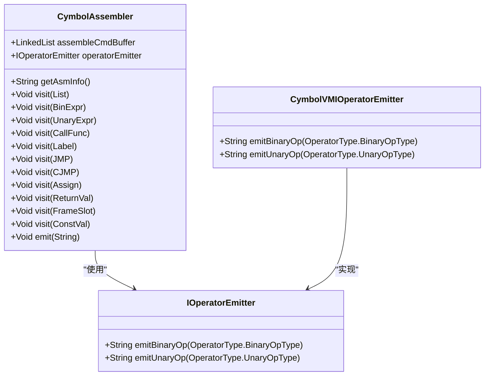
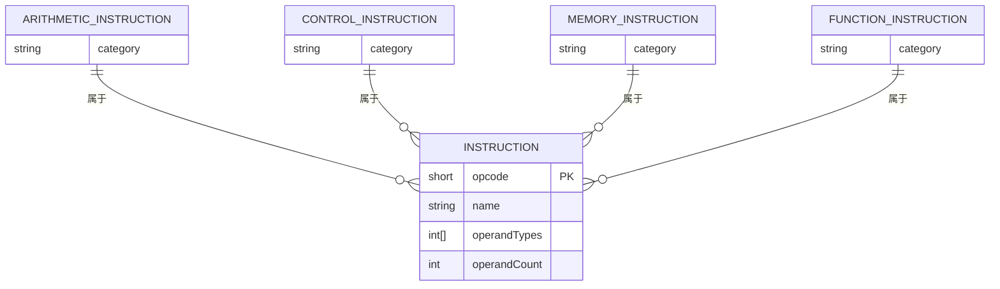
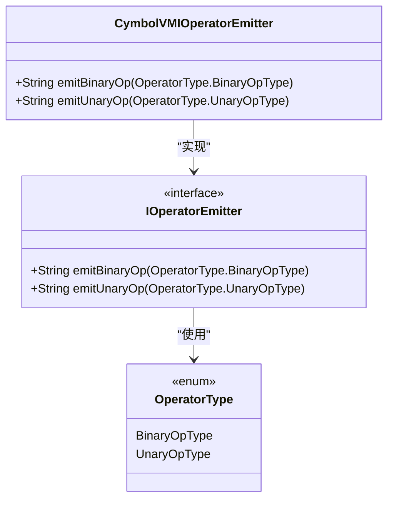
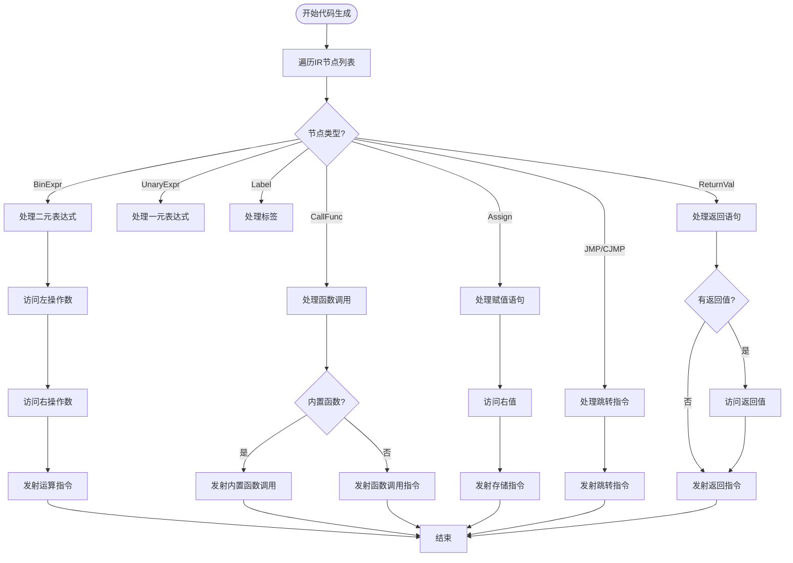
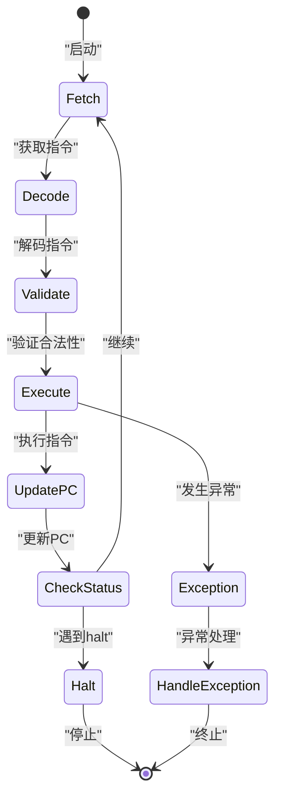
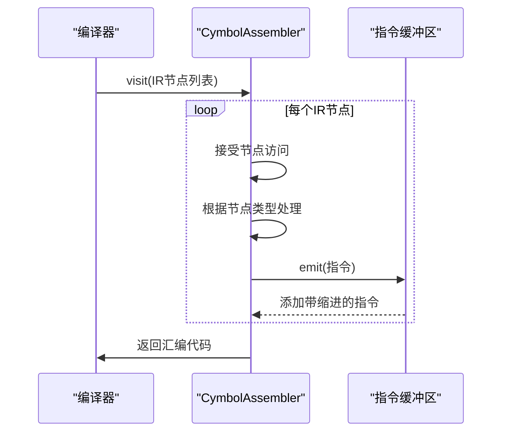
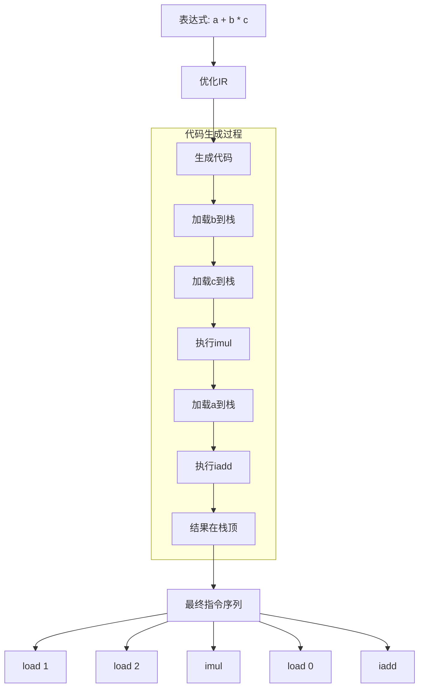
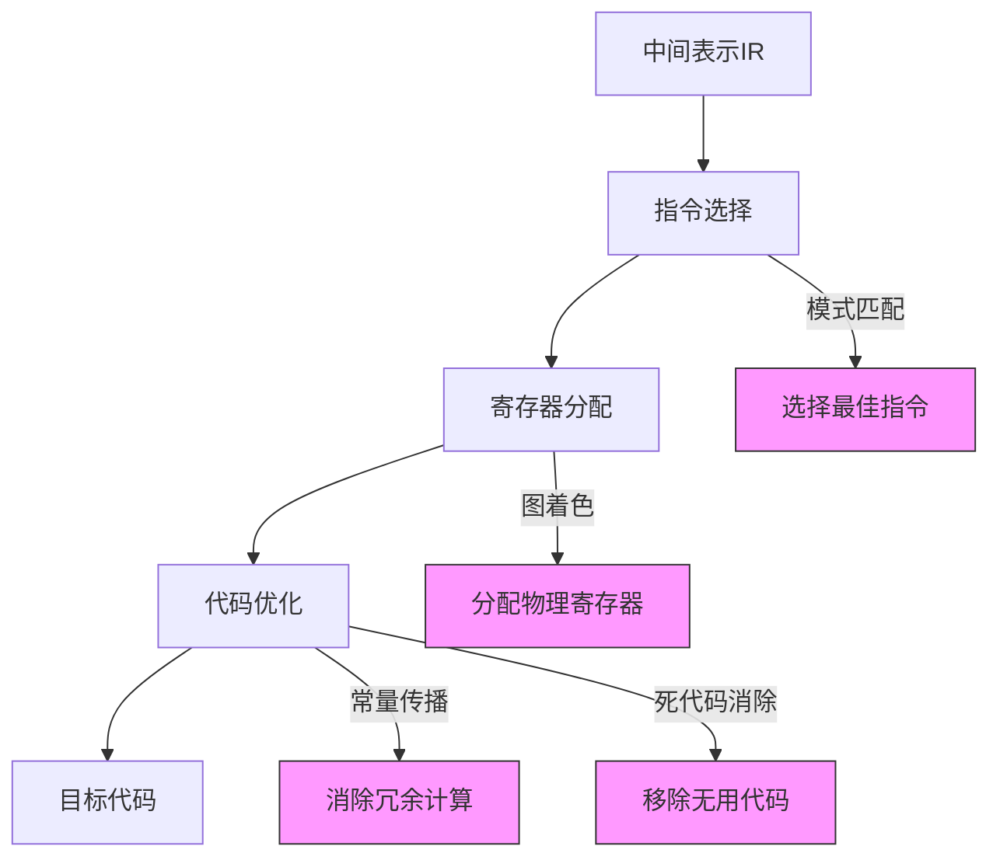

# 代码生成

<cite>
**本文档引用的文件**  
- [CymbolAssembler.java](file://ep20/src/main/java/org/teachfx/antlr4/ep20/pass/codegen/CymbolAssembler.java)
- [IOperatorEmitter.java](file://ep20/src/main/java/org/teachfx/antlr4/ep20/pass/codegen/IOperatorEmitter.java)
- [CymbolVMIOperatorEmitter.java](file://ep20/src/main/java/org/teachfx/antlr4/ep20/pass/codegen/CymbolVMIOperatorEmitter.java)
- [BytecodeDefinition.java](file://ep18/src/main/java/org/teachfx/antlr4/ep18/stackvm/BytecodeDefinition.java)
- [BinExpr.java](file://ep20/src/main/java/org/teachfx/antlr4/ep20/ir/expr/arith/BinExpr.java)
</cite>

## 目录
1. [引言](#引言)
2. [代码生成器架构](#代码生成器架构)
3. [虚拟机指令集架构](#虚拟机指令集架构)
4. [指令发射器扩展机制](#指令发射器扩展机制)
5. [代码生成过程详解](#代码生成过程详解)
6. [栈式虚拟机工作原理](#栈式虚拟机工作原理)
7. [调试信息生成机制](#调试信息生成机制)
8. [实际代码示例](#实际代码示例)
9. [高级实现技术](#高级实现技术)
10. [结论](#结论)

## 引言
本文档详细介绍了基于Antlr4实现的编程语言中的代码生成机制。重点阐述了如何将优化后的中间表示（IR）转换为栈式虚拟机的字节码指令，涵盖了从虚拟机指令定义到代码生成器实现的完整技术体系。文档既为初学者提供了栈式虚拟机工作原理的基础知识，也为高级用户深入解析了指令选择、寄存器分配和调试信息嵌入等实现技术。

## 代码生成器架构
代码生成器的核心是CymbolAssembler类，它实现了IRVisitor接口，通过访问者模式遍历优化后的中间表示（IR）并生成相应的汇编指令。该类维护一个指令缓冲区（assembleCmdBuffer），用于存储生成的汇编代码。

**图示来源**
- [CymbolAssembler.java](file://ep20/src/main/java/org/teachfx/antlr4/ep20/pass/codegen/CymbolAssembler.java#L1-L154)
- [IOperatorEmitter.java](file://ep20/src/main/java/org/teachfx/antlr4/ep20/pass/codegen/IOperatorEmitter.java#L1-L10)
- [CymbolVMIOperatorEmitter.java](file://ep20/src/main/java/org/teachfx/antlr4/ep20/pass/codegen/CymbolVMIOperatorEmitter.java#L1-L65)

**本节来源**
- [CymbolAssembler.java](file://ep20/src/main/java/org/teachfx/antlr4/ep20/pass/codegen/CymbolAssembler.java#L1-L154)

## 虚拟机指令集架构
BytecodeDefinition类定义了栈式虚拟机的完整指令集架构，包括算术运算、控制转移、函数调用和内存访问等指令。每条指令都有唯一的操作码（opcode）和相应的操作数类型定义。

**图示来源**
- [BytecodeDefinition.java](file://ep18/src/main/java/org/teachfx/antlr4/ep18/stackvm/BytecodeDefinition.java#L1-L137)

**本节来源**
- [BytecodeDefinition.java](file://ep18/src/main/java/org/teachfx/antlr4/ep18/stackvm/BytecodeDefinition.java#L1-L137)

## 指令发射器扩展机制
IOperatorEmitter接口定义了指令发射器的扩展机制，允许通过实现该接口来支持不同的目标架构。CymbolVMIOperatorEmitter类实现了该接口，将高级语言的运算符映射到具体的虚拟机指令。

**图示来源**
- [IOperatorEmitter.java](file://ep20/src/main/java/org/teachfx/antlr4/ep20/pass/codegen/IOperatorEmitter.java#L1-L10)
- [CymbolVMIOperatorEmitter.java](file://ep20/src/main/java/org/teachfx/antlr4/ep20/pass/codegen/CymbolVMIOperatorEmitter.java#L1-L65)

**本节来源**
- [IOperatorEmitter.java](file://ep20/src/main/java/org/teachfx/antlr4/ep20/pass/codegen/IOperatorEmitter.java#L1-L10)
- [CymbolVMIOperatorEmitter.java](file://ep20/src/main/java/org/teachfx/antlr4/ep20/pass/codegen/CymbolVMIOperatorEmitter.java#L1-L65)

## 代码生成过程详解
CymbolAssembler通过访问者模式遍历IR节点，将每种类型的IR节点转换为相应的汇编指令。对于二元表达式，先递归访问左右操作数，然后发射对应的运算指令。

**图示来源**
- [CymbolAssembler.java](file://ep20/src/main/java/org/teachfx/antlr4/ep20/pass/codegen/CymbolAssembler.java#L1-L154)

**本节来源**
- [CymbolAssembler.java](file://ep20/src/main/java/org/teachfx/antlr4/ep20/pass/codegen/CymbolAssembler.java#L1-L154)

## 栈式虚拟机工作原理
栈式虚拟机基于操作数栈执行指令，所有运算都从栈顶获取操作数并将结果压回栈中。虚拟机维护程序计数器（PC）、操作数栈指针（SP）和帧指针（FP）等寄存器。

**图示来源**
- [VM_Design.md](file://ep18/VM_Design.md#L1-L79)
- [VMInterpreter.java](file://ep18/src/main/java/org/teachfx/antlr4/ep18/VMInterpreter.java#L106-L148)

## 调试信息生成机制
虽然当前实现中没有显式的调试信息生成代码，但通过生成带有缩进的汇编代码，可以提供基本的调试支持。每条指令的缩进反映了其在控制流中的嵌套层次。

**图示来源**
- [CymbolAssembler.java](file://ep20/src/main/java/org/teachfx/antlr4/ep20/pass/codegen/CymbolAssembler.java#L1-L154)

**本节来源**
- [CymbolAssembler.java](file://ep20/src/main/java/org/teachfx/antlr4/ep20/pass/codegen/CymbolAssembler.java#L1-L154)

## 实际代码示例
以下示例展示了常见编程结构的代码生成过程。对于表达式`a + b * c`，代码生成器会按照运算符优先级生成相应的指令序列。

**图示来源**
- [CymbolAssembler.java](file://ep20/src/main/java/org/teachfx/antlr4/ep20/pass/codegen/CymbolAssembler.java#L1-L154)
- [BinExpr.java](file://ep20/src/main/java/org/teachfx/antlr4/ep20/ir/expr/arith/BinExpr.java#L1-L60)

## 高级实现技术
高级实现技术包括指令选择、寄存器分配和优化策略。虽然当前实现主要针对栈式虚拟机，但架构设计支持扩展到寄存器式虚拟机。

**图示来源**
- [CymbolAssembler.java](file://ep20/src/main/java/org/teachfx/antlr4/ep20/pass/codegen/CymbolAssembler.java#L1-L154)
- [IOperatorEmitter.java](file://ep20/src/main/java/org/teachfx/antlr4/ep20/pass/codegen/IOperatorEmitter.java#L1-L10)

## 结论
本文档全面介绍了基于Antlr4的代码生成机制，从虚拟机指令集定义到代码生成器实现，再到调试信息生成。CymbolAssembler通过访问者模式将优化后的IR转换为栈式虚拟机的字节码指令，IOperatorEmitter接口提供了指令发射器的扩展机制，BytecodeDefinition定义了完整的虚拟机指令集架构。该架构既适合初学者理解栈式虚拟机工作原理，也为高级用户提供了深入研究指令选择、寄存器分配和调试信息嵌入技术的基础。