# 代码生成器

<cite>
**本文档引用的文件**
- [CymbolAssembler.java](file://ep20/src/main/java/org/teachfx/antlr4/ep20/pass/codegen/CymbolAssembler.java)
- [IOperatorEmitter.java](file://ep20/src/main/java/org/teachfx/antlr4/ep20/pass/codegen/IOperatorEmitter.java)
- [CymbolVMIOperatorEmitter.java](file://ep20/src/main/java/org/teachfx/antlr4/ep20/pass/codegen/CymbolVMIOperatorEmitter.java)
- [BinExpr.java](file://ep20/src/main/java/org/teachfx/antlr4/ep20/ir/expr/arith/BinExpr.java)
- [Assign.java](file://ep20/src/main/java/org/teachfx/antlr4/ep20/ir/stmt/Assign.java)
- [CJMP.java](file://ep20/src/main/java/org/teachfx/antlr4/ep20/ir/stmt/CJMP.java)
- [ConstVal.java](file://ep20/src/main/java/org/teachfx/antlr4/ep20/ir/expr/val/ConstVal.java)
</cite>

## 目录
1. [简介](#简介)
2. [代码生成器架构](#代码生成器架构)
3. [CymbolAssembler遍历机制](#cymbolassembler遍历机制)
4. [指令发射逻辑](#指令发射逻辑)
5. [IR节点到字节码的映射](#ir节点到字节码的映射)
6. [可扩展的指令发射器架构](#可扩展的指令发射器架构)
7. [测试与验证](#测试与验证)
8. [性能分析](#性能分析)
9. [结论](#结论)

## 简介
本文档详细介绍了Cymbol语言编译器中的代码生成器组件，重点阐述了CymbolAssembler如何将优化后的中间表示（IR）转换为栈式虚拟机的字节码。文档涵盖了从IR遍历、指令发射到测试验证的完整流程，为初学者提供逐步解析，为高级用户提供深入的技术细节。

## 代码生成器架构
代码生成器是编译器后端的核心组件，负责将高级语言的中间表示转换为目标虚拟机的低级指令。Cymbol代码生成器采用访问者模式遍历IR树，通过指令发射器将每个IR节点映射为相应的字节码指令。

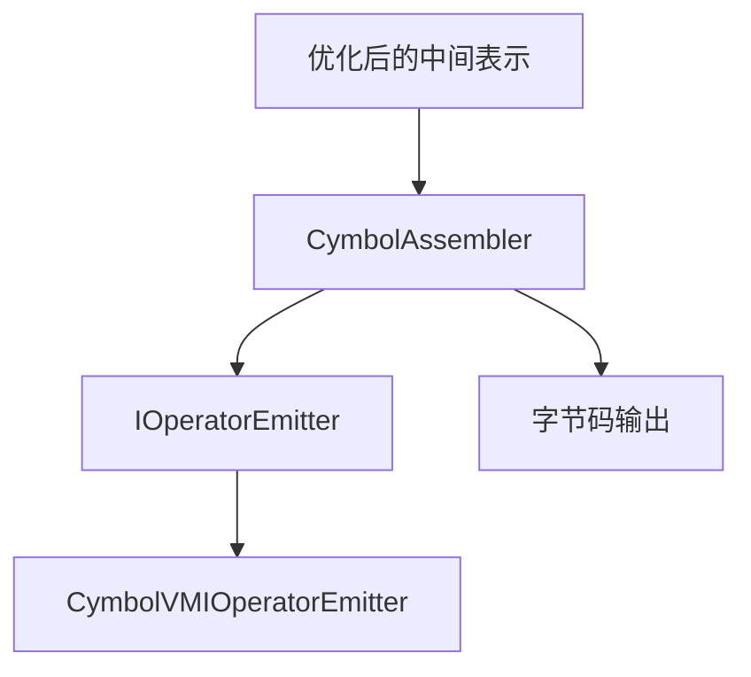

**图示来源**
- [CymbolAssembler.java](file://ep20/src/main/java/org/teachfx/antlr4/ep20/pass/codegen/CymbolAssembler.java#L17-L30)
- [IOperatorEmitter.java](file://ep20/src/main/java/org/teachfx/antlr4/ep20/pass/codegen/IOperatorEmitter.java#L1-L10)

## CymbolAssembler遍历机制
CymbolAssembler实现了IRVisitor接口，采用深度优先遍历策略处理中间表示树中的各个节点。该组件通过访问者模式递归地处理表达式和语句节点，确保正确的求值顺序和控制流。

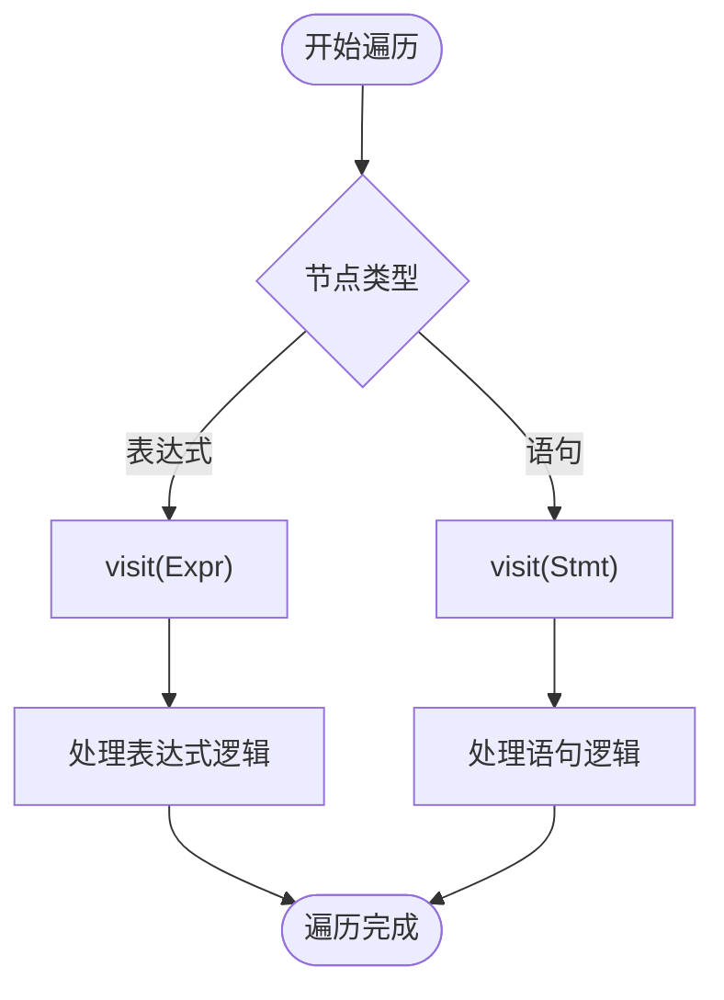

**图示来源**
- [CymbolAssembler.java](file://ep20/src/main/java/org/teachfx/antlr4/ep20/pass/codegen/CymbolAssembler.java#L35-L45)

**本节来源**
- [CymbolAssembler.java](file://ep20/src/main/java/org/teachfx/antlr4/ep20/pass/codegen/CymbolAssembler.java#L35-L45)

## 指令发射逻辑
指令发射是代码生成的核心过程，CymbolAssembler通过emit方法将虚拟机指令写入输出缓冲区。该过程包括指令格式化、缩进管理和缓冲区维护，确保生成的字节码具有良好的可读性。

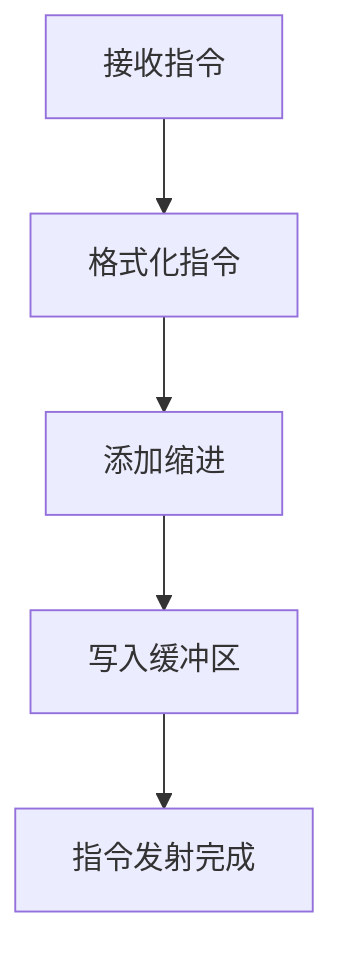

**图示来源**
- [CymbolAssembler.java](file://ep20/src/main/java/org/teachfx/antlr4/ep20/pass/codegen/CymbolAssembler.java#L145-L153)

**本节来源**
- [CymbolAssembler.java](file://ep20/src/main/java/org/teachfx/antlr4/ep20/pass/codegen/CymbolAssembler.java#L145-L153)

## IR节点到字节码的映射
代码生成器将不同类型的IR节点映射为相应的虚拟机指令，确保语义的正确转换。以下是主要IR节点的映射关系：

### 二元表达式映射
二元表达式节点（BinExpr）被转换为相应的算术或逻辑运算指令，操作数的求值顺序遵循从左到右的规则。

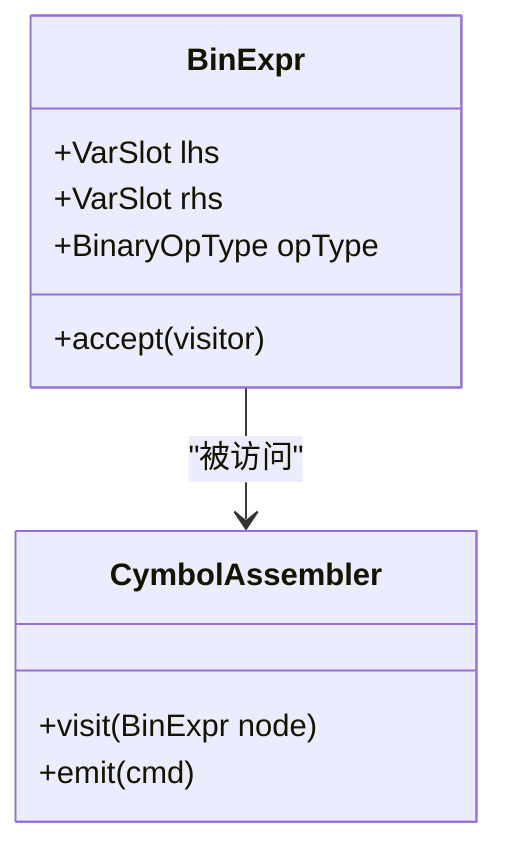

**图示来源**
- [BinExpr.java](file://ep20/src/main/java/org/teachfx/antlr4/ep20/ir/expr/arith/BinExpr.java#L1-L60)
- [CymbolAssembler.java](file://ep20/src/main/java/org/teachfx/antlr4/ep20/pass/codegen/CymbolAssembler.java#L47-L53)

### 赋值语句映射
赋值语句（Assign）的处理包括右值求值和左值存储两个步骤，确保表达式求值的正确顺序。

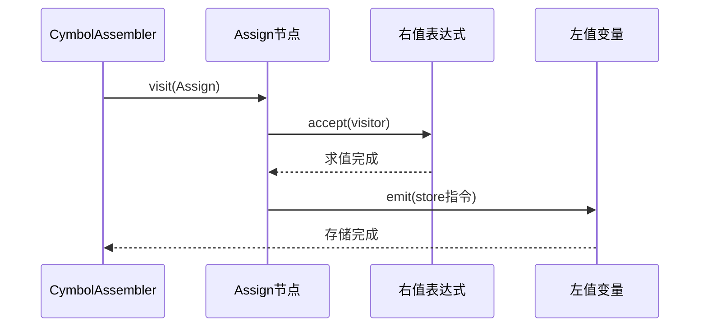

**图示来源**
- [Assign.java](file://ep20/src/main/java/org/teachfx/antlr4/ep20/ir/stmt/Assign.java#L1-L66)
- [CymbolAssembler.java](file://ep20/src/main/java/org/teachfx/antlr4/ep20/pass/codegen/CymbolAssembler.java#L91-L98)

### 条件跳转映射
条件跳转（CJMP）语句被转换为虚拟机的条件分支指令，实现控制流的正确转移。

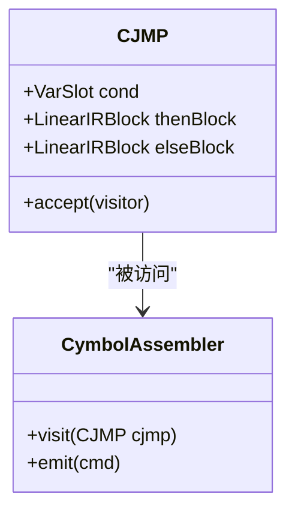

**图示来源**
- [CJMP.java](file://ep20/src/main/java/org/teachfx/antlr4/ep20/ir/stmt/CJMP.java#L1-L61)
- [CymbolAssembler.java](file://ep20/src/main/java/org/teachfx/antlr4/ep20/pass/codegen/CymbolAssembler.java#L85-L89)

**本节来源**
- [BinExpr.java](file://ep20/src/main/java/org/teachfx/antlr4/ep20/ir/expr/arith/BinExpr.java#L1-L60)
- [Assign.java](file://ep20/src/main/java/org/teachfx/antlr4/ep20/ir/stmt/Assign.java#L1-L66)
- [CJMP.java](file://ep20/src/main/java/org/teachfx/antlr4/ep20/ir/stmt/CJMP.java#L1-L61)
- [ConstVal.java](file://ep20/src/main/java/org/teachfx/antlr4/ep20/ir/expr/val/ConstVal.java#L1-L43)

## 可扩展的指令发射器架构
代码生成器采用可扩展的指令发射器架构，通过接口抽象实现指令集的灵活配置和扩展。

### IOperatorEmitter接口
IOperatorEmitter接口定义了指令发射的抽象方法，为不同目标架构的指令集实现提供了统一的接口。

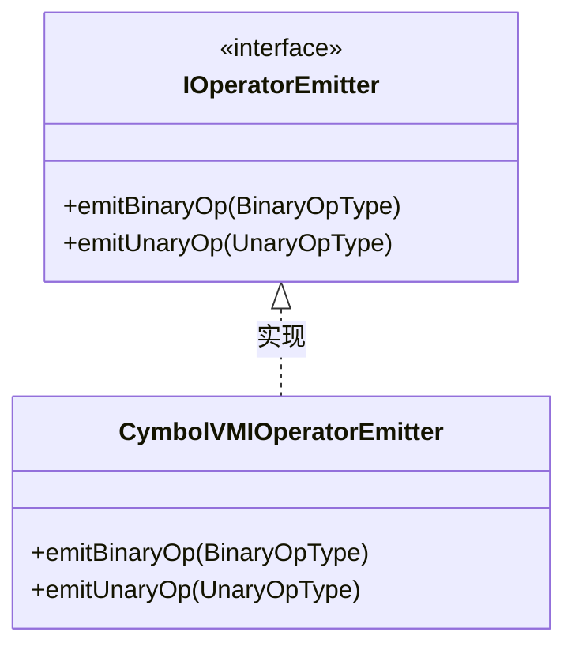

**图示来源**
- [IOperatorEmitter.java](file://ep20/src/main/java/org/teachfx/antlr4/ep20/pass/codegen/IOperatorEmitter.java#L1-L10)
- [CymbolVMIOperatorEmitter.java](file://ep20/src/main/java/org/teachfx/antlr4/ep20/pass/codegen/CymbolVMIOperatorEmitter.java#L1-L65)

### CymbolVMIOperatorEmitter实现
CymbolVMIOperatorEmitter是IOperatorEmitter接口的具体实现，负责将Cymbol语言的操作符映射为栈式虚拟机的特定指令。

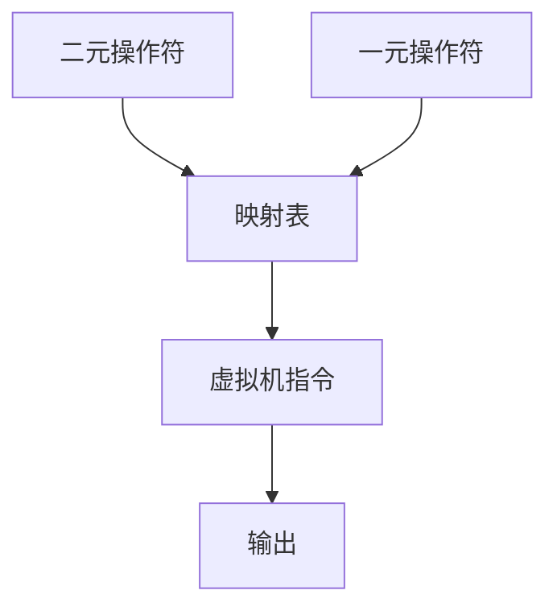

**图示来源**
- [CymbolVMIOperatorEmitter.java](file://ep20/src/main/java/org/teachfx/antlr4/ep20/pass/codegen/CymbolVMIOperatorEmitter.java#L1-L65)

**本节来源**
- [IOperatorEmitter.java](file://ep20/src/main/java/org/teachfx/antlr4/ep20/pass/codegen/IOperatorEmitter.java#L1-L10)
- [CymbolVMIOperatorEmitter.java](file://ep20/src/main/java/org/teachfx/antlr4/ep20/pass/codegen/CymbolVMIOperatorEmitter.java#L1-L65)

## 测试与验证
代码生成器的正确性通过多层次的测试用例进行验证，确保生成的字节码符合预期。

### 单元测试
单元测试针对代码生成器的各个组件进行验证，确保基本功能的正确性。

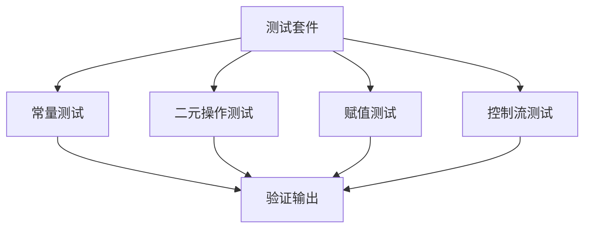

**图示来源**
- [CymbolAssemblerTest.java](file://ep20/src/test/java/org/teachfx/antlr4/ep20/pass/codegen/CymbolAssemblerTest.java#L1-L126)

### 端到端测试
端到端测试验证从源代码到字节码的完整编译流程，确保整个代码生成过程的正确性。

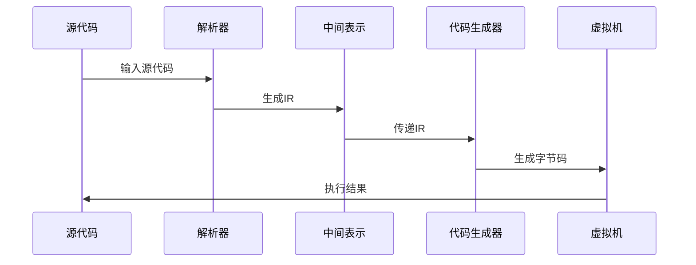

**图示来源**
- [EndToEndCompilationTest.java](file://ep20/src/test/java/org/teachfx/antlr4/ep20/pass/codegen/EndToEndCompilationTest.java#L35-L154)

**本节来源**
- [CymbolAssemblerTest.java](file://ep20/src/test/java/org/teachfx/antlr4/ep20/pass/codegen/CymbolAssemblerTest.java#L1-L126)
- [EndToEndCompilationTest.java](file://ep20/src/test/java/org/teachfx/antlr4/ep20/pass/codegen/EndToEndCompilationTest.java#L35-L154)

## 性能分析
代码生成器的性能通过基准测试进行评估，重点关注生成效率和内存使用情况。

### 生成效率
生成效率测试评估代码生成器处理不同规模源代码的性能表现。

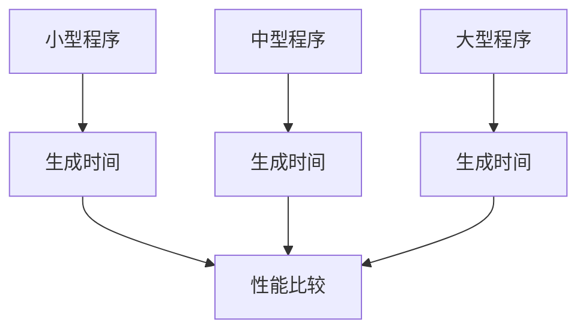

**图示来源**
- [PerformanceBenchmarkTest.java](file://ep19/src/test/java/org/teachfx/antlr4/ep19/PerformanceBenchmarkTest.java)

### 内存使用
内存使用分析监控代码生成过程中的内存分配和回收情况。

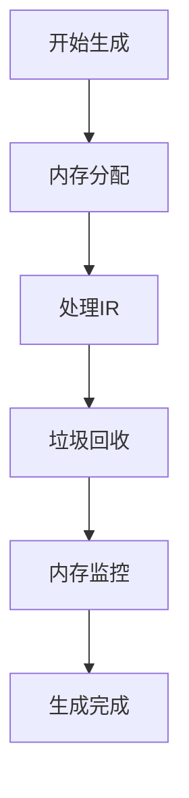

**图示来源**
- [PerformanceBenchmarkTest.java](file://ep19/src/test/java/org/teachfx/antlr4/ep19/PerformanceBenchmarkTest.java)

**本节来源**
- [PerformanceBenchmarkTest.java](file://ep19/src/test/java/org/teachfx/antlr4/ep19/PerformanceBenchmarkTest.java)

## 结论
Cymbol代码生成器通过精心设计的架构实现了从中间表示到字节码的高效转换。其模块化的指令发射器架构提供了良好的可扩展性，而全面的测试套件确保了生成代码的正确性。该实现为栈式虚拟机的代码生成提供了可靠的基础，同时为未来支持更多目标架构留下了扩展空间。