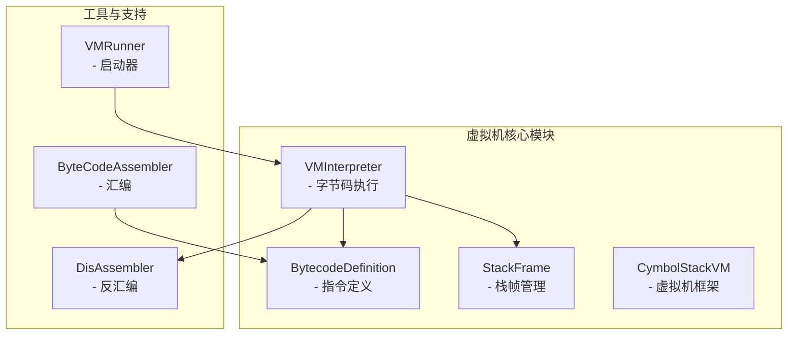
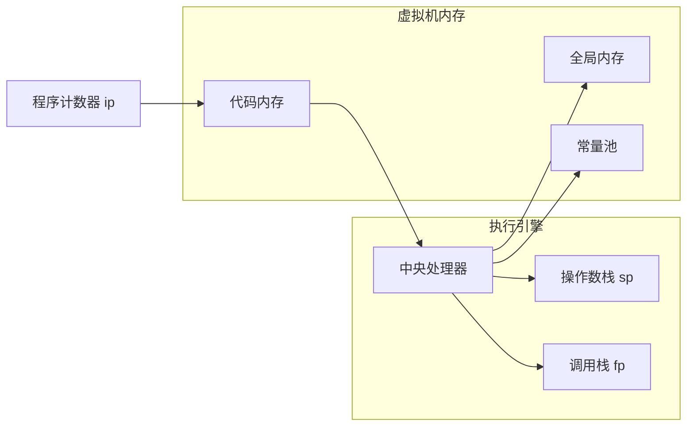
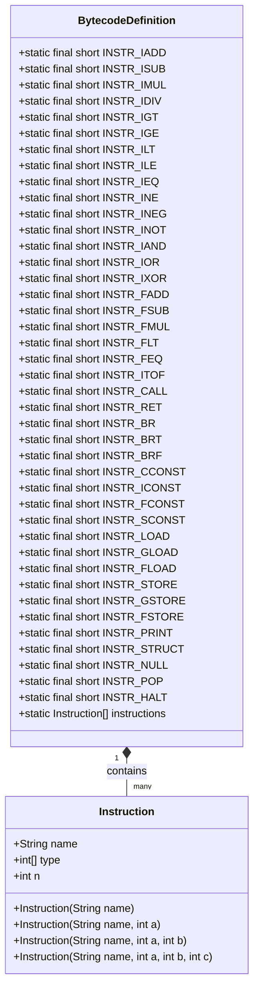
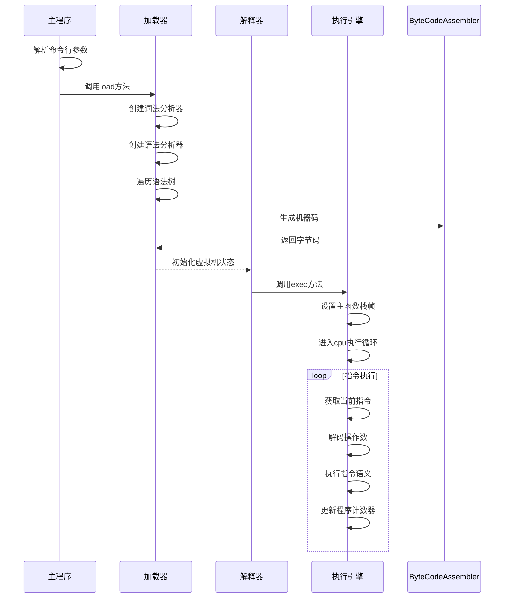
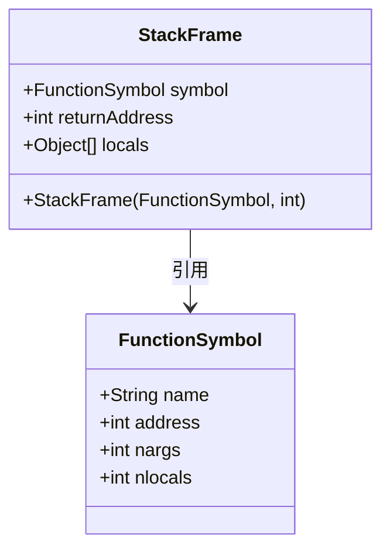
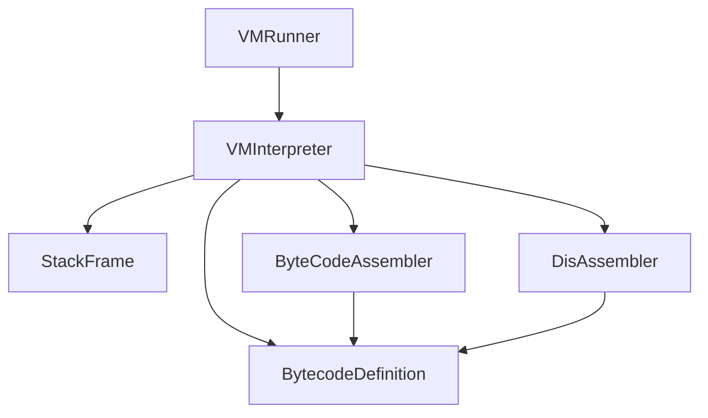

# 虚拟机指令

<cite>
**本文档中引用的文件**  
- [BytecodeDefinition.java](file://ep18/src/main/java/org/teachfx/antlr4/ep18/stackvm/BytecodeDefinition.java)
- [VMInterpreter.java](file://ep18/src/main/java/org/teachfx/antlr4/ep18/VMInterpreter.java)
- [VMRunner.java](file://ep18/src/main/java/org/teachfx/antlr4/ep18/VMRunner.java)
- [CymbolStackVM.java](file://ep18/src/main/java/org/teachfx/antlr4/ep18/stackvm/CymbolStackVM.java)
- [StackFrame.java](file://ep18/src/main/java/org/teachfx/antlr4/ep18/stackvm/StackFrame.java)
</cite>

## 目录
1. [简介](#简介)
2. [项目结构](#项目结构)
3. [核心组件](#核心组件)
4. [架构概述](#架构概述)
5. [详细组件分析](#详细组件分析)
6. [依赖分析](#依赖分析)
7. [性能考虑](#性能考虑)
8. [故障排除指南](#故障排除指南)
9. [结论](#结论)

## 简介
本文档详细介绍了基于栈的虚拟机指令集架构的设计与实现。重点分析了`BytecodeDefinition`中定义的各类指令，包括算术运算、逻辑运算、控制转移、函数调用和栈操作指令。文档解释了每条指令的二进制编码格式、操作数类型和执行语义，并通过实际代码示例展示了指令定义方式及在`VMInterpreter`中的执行流程。为初学者提供直观的栈式虚拟机工作原理解释，为高级用户提供指令编码优化、流水线设计和性能调优策略。

## 项目结构
本项目位于`ep18`目录下，主要包含虚拟机指令集、解释器和运行器的实现。核心功能集中在`stackvm`包中，包括字节码定义、反汇编器、栈帧管理等。`VMInterpreter`负责执行字节码，`VMRunner`用于启动虚拟机。

**图示来源**  
- [BytecodeDefinition.java](file://ep18/src/main/java/org/teachfx/antlr4/ep18/stackvm/BytecodeDefinition.java)
- [VMInterpreter.java](file://ep18/src/main/java/org/teachfx/antlr4/ep18/VMInterpreter.java)
- [StackFrame.java](file://ep18/src/main/java/org/teachfx/antlr4/ep18/stackvm/StackFrame.java)

**节来源**  
- [BytecodeDefinition.java](file://ep18/src/main/java/org/teachfx/antlr4/ep18/stackvm/BytecodeDefinition.java)
- [VMInterpreter.java](file://ep18/src/main/java/org/teachfx/antlr4/ep18/VMInterpreter.java)
- [VMRunner.java](file://ep18/src/main/java/org/teachfx/antlr4/ep18/VMRunner.java)

## 核心组件
核心组件包括指令定义、虚拟机解释器和栈帧管理。`BytecodeDefinition`类定义了所有指令的常量和元数据，`VMInterpreter`实现了指令的执行循环，`StackFrame`用于管理函数调用时的局部变量和返回地址。

**节来源**  
- [BytecodeDefinition.java](file://ep18/src/main/java/org/teachfx/antlr4/ep18/stackvm/BytecodeDefinition.java#L1-L136)
- [VMInterpreter.java](file://ep18/src/main/java/org/teachfx/antlr4/ep18/VMInterpreter.java#L1-L423)
- [StackFrame.java](file://ep18/src/main/java/org/teachfx/antlr4/ep18/stackvm/StackFrame.java#L1-L13)

## 架构概述
栈式虚拟机采用经典的冯·诺依曼架构，指令和数据共享同一内存空间。虚拟机通过程序计数器（ip）指向当前执行的指令，操作数栈（operands）用于临时存储计算结果，调用栈（calls）管理函数调用的上下文。

**图示来源**  
- [VMInterpreter.java](file://ep18/src/main/java/org/teachfx/antlr4/ep18/VMInterpreter.java#L1-L423)
- [StackFrame.java](file://ep18/src/main/java/org/teachfx/antlr4/ep18/stackvm/StackFrame.java#L1-L13)

## 详细组件分析

### 指令集定义分析
`BytecodeDefinition`类定义了虚拟机支持的所有指令，包括算术、逻辑、控制流和栈操作指令。每条指令都有唯一的操作码和操作数类型定义。

**图示来源**  
- [BytecodeDefinition.java](file://ep18/src/main/java/org/teachfx/antlr4/ep18/stackvm/BytecodeDefinition.java#L1-L136)

**节来源**  
- [BytecodeDefinition.java](file://ep18/src/main/java/org/teachfx/antlr4/ep18/stackvm/BytecodeDefinition.java#L1-L136)

### 虚拟机执行流程分析
`VMInterpreter`的执行流程从`main`方法开始，加载字节码文件，初始化虚拟机状态，然后进入指令执行循环。

**图示来源**  
- [VMInterpreter.java](file://ep18/src/main/java/org/teachfx/antlr4/ep18/VMInterpreter.java#L1-L423)
- [ByteCodeAssembler.java](file://ep18/src/main/java/org/teachfx/antlr4/ep18/stackvm/ByteCodeAssembler.java)

**节来源**  
- [VMInterpreter.java](file://ep18/src/main/java/org/teachfx/antlr4/ep18/VMInterpreter.java#L1-L423)

### 栈帧管理分析
`StackFrame`类用于管理函数调用时的执行上下文，包括局部变量、返回地址和函数符号。

**图示来源**  
- [StackFrame.java](file://ep18/src/main/java/org/teachfx/antlr4/ep18/stackvm/StackFrame.java#L1-L13)
- [FunctionSymbol.java](file://ep18/src/main/java/org/teachfx/antlr4/ep18/stackvm/FunctionSymbol.java)

**节来源**  
- [StackFrame.java](file://ep18/src/main/java/org/teachfx/antlr4/ep18/stackvm/StackFrame.java#L1-L13)

## 依赖分析
虚拟机各组件之间存在明确的依赖关系。`VMInterpreter`依赖于`BytecodeDefinition`获取指令定义，依赖`StackFrame`管理调用栈，依赖`DisAssembler`进行反汇编。

**图示来源**  
- [VMInterpreter.java](file://ep18/src/main/java/org/teachfx/antlr4/ep18/VMInterpreter.java)
- [BytecodeDefinition.java](file://ep18/src/main/java/org/teachfx/antlr4/ep18/stackvm/BytecodeDefinition.java)
- [StackFrame.java](file://ep18/src/main/java/org/teachfx/antlr4/ep18/stackvm/StackFrame.java)

**节来源**  
- [VMInterpreter.java](file://ep18/src/main/java/org/teachfx/antlr4/ep18/VMInterpreter.java#L1-L423)
- [BytecodeDefinition.java](file://ep18/src/main/java/org/teachfx/antlr4/ep18/stackvm/BytecodeDefinition.java#L1-L136)

## 性能考虑
虚拟机的性能主要受指令解码效率、内存访问模式和栈操作开销的影响。通过使用直接索引的switch-case语句实现指令分发，避免了复杂的解码过程。操作数栈采用预分配数组，避免了频繁的内存分配。

## 故障排除指南
当虚拟机执行出现问题时，可以使用`-trace`参数启用执行跟踪，查看每条指令执行前后的栈状态。使用`-dis`参数可以反汇编字节码，检查生成的指令是否正确。使用`-dump`参数可以转储内存状态，分析数据存储是否正确。

**节来源**  
- [VMInterpreter.java](file://ep18/src/main/java/org/teachfx/antlr4/ep18/VMInterpreter.java#L1-L423)

## 结论
本文档详细分析了栈式虚拟机的指令集架构和实现细节。通过`BytecodeDefinition`统一管理所有指令定义，`VMInterpreter`高效执行字节码，`StackFrame`正确管理函数调用上下文，构成了一个完整的虚拟机系统。该设计具有良好的扩展性，便于添加新的指令和优化执行性能。