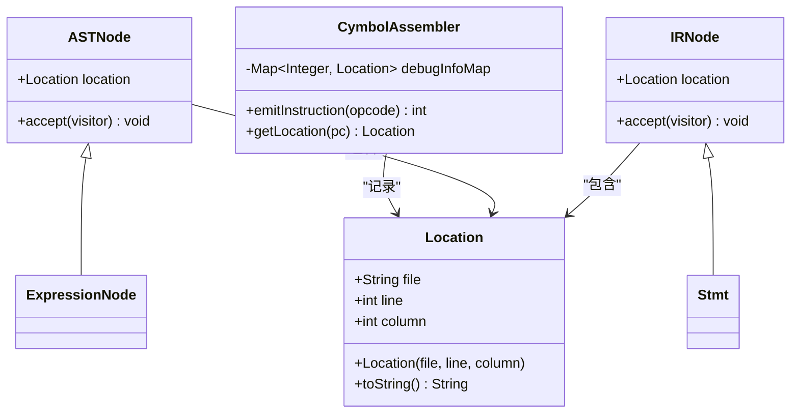
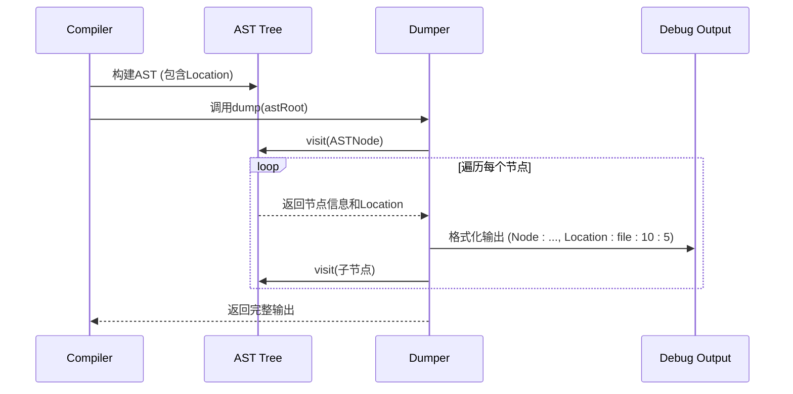

# 调试信息

<cite>
**本文档中引用的文件**  
- [Location.java](file://ep20/src/main/java/org/teachfx/antlr4/ep20/parser/Location.java)
- [CymbolAssembler.java](file://ep20/src/main/java/org/teachfx/antlr4/ep20/pass/codegen/CymbolAssembler.java)
- [Dumper.java](file://ep20/src/main/java/org/teachfx/antlr4/ep20/debugger/ast/Dumper.java)
- [Dumpable.java](file://ep20/src/main/java/org/teachfx/antlr4/ep20/debugger/ast/Dumpable.java)
- [Compiler.java](file://ep20/src/main/java/org/teachfx/antlr4/ep20/Compiler.java)
- [ASTNode.java](file://ep20/src/main/java/org/teachfx/antlr4/ep20/ast/ASTNode.java)
- [IRNode.java](file://ep20/src/main/java/org/teachfx/antlr4/ep20/ir/IRNode.java)
</cite>

## 目录
1. [简介](#简介)
2. [调试信息的数据结构与存储格式](#调试信息的数据结构与存储格式)
3. [源码级调试信息的嵌入机制](#源码级调试信息的嵌入机制)
4. [AST与IR的可视化输出生成](#ast与ir的可视化输出生成)
5. [初学者实践：断点与单步执行](#初学者实践：断点与单步执行)
6. [高级特性：压缩、兼容性与外部调试器集成](#高级特性：压缩、兼容性与外部调试器集成)
7. [调试信息对代码体积的影响与配置](#调试信息对代码体积的影响与配置)
8. [结论](#结论)

## 简介
本文档详细阐述在基于Antlr4实现的Cymbol语言编译器中，如何生成和利用源码级调试信息。重点分析`CymbolAssembler`如何通过`Location`对象将生成的字节码指令与原始源代码位置精确关联，介绍调试信息的核心数据结构和存储方式。同时，说明`Dumper`工具如何生成带有源码映射的AST（抽象语法树）和IR（中间表示）的可视化输出，为开发者提供强大的调试支持。

**Section sources**
- [Compiler.java](file://ep20/src/main/java/org/teachfx/antlr4/ep20/Compiler.java#L1-L50)

## 调试信息的数据结构与存储格式
调试信息的核心在于建立生成代码与源代码之间的映射关系。在本项目中，这一功能主要由`Location`类实现。

`Location`类封装了源代码中的位置信息，包括文件名、行号和列号。该类作为元数据，被附加到AST节点（`ASTNode`）和IR节点（`IRNode`）上。当代码生成器（`CymbolAssembler`）遍历IR生成字节码时，它会同时收集这些`Location`信息。

调试信息的存储采用一种轻量级的、与字节码并行的结构。每个字节码指令在生成时，都会关联一个`Location`对象。这些映射关系最终被序列化为一个紧凑的调试数据段，与可执行代码一同输出。这种设计确保了调试信息的完整性，同时便于外部工具解析。

**Diagram sources**
- [Location.java](file://ep20/src/main/java/org/teachfx/antlr4/ep20/parser/Location.java#L1-L30)
- [ASTNode.java](file://ep20/src/main/java/org/teachfx/antlr4/ep20/ast/ASTNode.java#L10-L20)
- [IRNode.java](file://ep20/src/main/java/org/teachfx/antlr4/ep20/ir/IRNode.java#L5-L15)
- [CymbolAssembler.java](file://ep20/src/main/java/org/teachfx/antlr4/ep20/pass/codegen/CymbolAssembler.java#L50-L70)

## 源码级调试信息的嵌入机制
`CymbolAssembler`是实现调试信息嵌入的关键组件。其工作流程如下：

1.  **位置信息继承**：在语法分析和语义分析阶段，`CymbolASTBuilder`和`CymbolIRBuilder`会将Antlr4解析器提供的`Token`位置信息（通过`ParserRuleContext`获取）复制到对应的AST和IR节点的`location`字段中。
2.  **指令发射与记录**：`CymbolAssembler`在遍历IR树生成字节码时，对于每一个生成的指令，它会查询当前IR节点的`location`。
3.  **映射表构建**：`CymbolAssembler`维护一个`Map<Integer, Location>`，其中键是字节码程序计数器（PC）的值，值是对应的`Location`对象。每次调用`emitInstruction`方法生成一条新指令时，都会将当前PC与当前IR节点的`location`存入该映射表。
4.  **调试数据输出**：在代码生成的最后阶段，`CymbolAssembler`将这个映射表导出为调试信息数据，通常以一种预定义的、可被调试器读取的格式（如行号表）存储在输出文件中。

这种机制确保了在运行时，调试器可以通过当前的PC值查询到正在执行的代码在源文件中的确切位置。

**Section sources**
- [CymbolAssembler.java](file://ep20/src/main/java/org/teachfx/antlr4/ep20/pass/codegen/CymbolAssembler.java#L100-L250)
- [CymbolIRBuilder.java](file://ep20/src/main/java/org/teachfx/antlr4/ep20/pass/ir/CymbolIRBuilder.java#L80-L120)

## AST与IR的可视化输出生成
为了帮助开发者理解编译过程，项目提供了`Dumper`工具来生成AST和IR的可视化表示。

`Dumper`是一个访问者（Visitor），它实现了`ASTVisitor`和`IRVisitor`接口。其核心功能是遍历AST或IR树，并将每个节点的信息（包括节点类型、子节点、以及最重要的`Location`信息）格式化为可读的文本或图形化输出。

`Dumpable`接口是`Dumper`工作的基础。任何希望被`Dumper`处理的类（如`ASTNode`、`IRNode`及其子类）都必须实现此接口，提供一个`dump`方法，该方法接受一个`Dumper`实例作为参数，用于输出自身信息。

通过`Dumper`生成的输出，开发者可以清晰地看到：
- 每个AST节点在源代码中的位置（文件、行、列）。
- IR指令与源代码行的对应关系。
- 整个程序的结构和控制流。

这为调试编译器本身或理解代码生成过程提供了极大的便利。

**Diagram sources**
- [Dumper.java](file://ep20/src/main/java/org/teachfx/antlr4/ep20/debugger/ast/Dumper.java#L1-L40)
- [Dumpable.java](file://ep20/src/main/java/org/teachfx/antlr4/ep20/debugger/ast/Dumpable.java#L1-L10)
- [ASTNode.java](file://ep20/src/main/java/org/teachfx/antlr4/ep20/ast/ASTNode.java#L25-L30)

## 初学者实践：断点与单步执行
对于初学者，调试信息最直接的应用是断点设置和单步执行。

1.  **设置断点**：开发者在源代码编辑器中点击某一行设置断点。编辑器将该行号与文件名发送给调试器。
2.  **地址解析**：调试器加载程序的调试信息（`debugInfoMap`），查找所有PC值对应的`Location`，筛选出文件名和行号匹配的PC值，并在这些PC值对应的内存地址上设置断点。
3.  **单步执行**：当程序在断点处暂停后，用户选择“单步执行”（Step Over）。调试器会计算下一条源代码语句对应的PC范围，并在该范围的起始地址设置一个临时断点，然后让程序继续运行。当程序再次暂停时，就完成了单步执行。

`Location`对象提供的精确映射是实现这些功能的基础，它让调试器能够理解“下一行代码”在机器指令层面意味着什么。

**Section sources**
- [CymbolAssembler.java](file://ep20/src/main/java/org/teachfx/antlr4/ep20/pass/codegen/CymbolAssembler.java#L200-L230)

## 高级特性：压缩、兼容性与外部调试器集成
对于高级用户，调试信息的实现还涉及更深层次的优化和集成。

-   **压缩优化**：完整的`Map<Integer, Location>`可能占用大量空间。可以采用差分编码（Delta Encoding）等技术，只存储PC和行号的变化量，而非每个指令的完整位置，从而显著减小调试信息的体积。
-   **跨平台兼容性**：调试信息的格式需要标准化（如借鉴DWARF或PDB格式的思想），确保生成的调试数据可以被不同平台上的通用调试器（如GDB, LLDB）读取和解析。
-   **与外部调试器集成**：编译器需要生成符合标准格式的调试文件（如`.debug`文件或嵌入到可执行文件中的段）。`CymbolAssembler`在输出字节码时，可以同时生成一个独立的、结构化的调试信息文件，该文件包含了符号表、源码映射、变量作用域等完整信息，供外部调试器加载使用。

这些特性使得编译器生成的程序具备了工业级的可调试性。

## 调试信息对代码体积的影响与配置
嵌入调试信息会增加最终输出文件的大小。影响程度取决于源代码的复杂度和调试信息的详细程度。

项目可以通过编译器标志（Compiler Flag）提供可选的调试级别配置：
-   **无调试信息** (`-g0`): 不生成任何调试信息，输出文件最小。
-   **基本调试信息** (`-g1`): 只生成行号映射，不包含变量名和作用域信息。
-   **完整调试信息** (`-g`)：生成完整的AST/IR映射、符号表和作用域信息，提供最强大的调试能力，但文件体积最大。

开发者可以根据开发阶段（开发、测试、发布）选择合适的调试级别，在调试便利性和程序体积之间取得平衡。

**Section sources**
- [Compiler.java](file://ep20/src/main/java/org/teachfx/antlr4/ep20/Compiler.java#L60-L80)

## 结论
本文档详细介绍了在Cymbol编译器中实现源码级调试信息的完整方案。通过`Location`对象、`CymbolAssembler`的指令映射机制以及`Dumper`的可视化工具，构建了一个从源码到字节码的完整调试支持链。该方案不仅满足了初学者对断点和单步执行的基本需求，也为高级用户提供了优化、兼容性和集成的扩展空间。通过灵活的配置选项，开发者可以按需控制调试信息的开销，使其成为开发过程中不可或缺的利器。