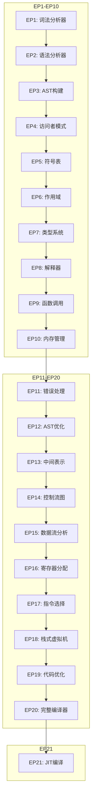
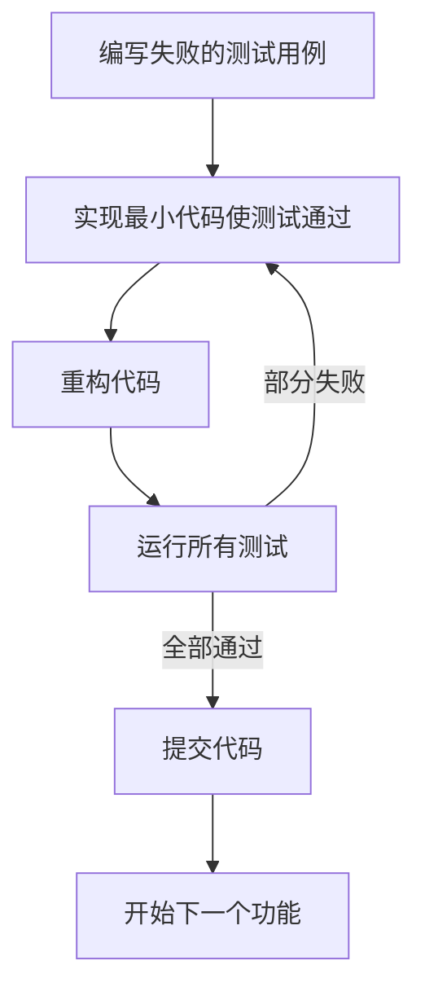
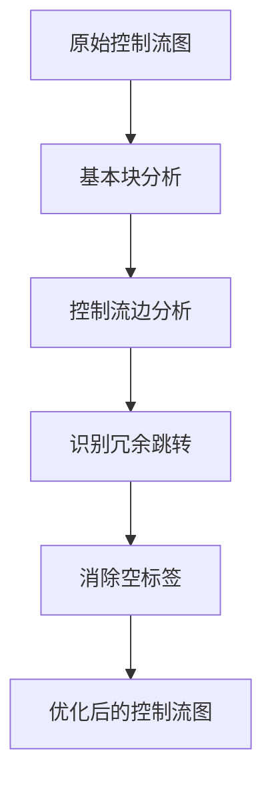
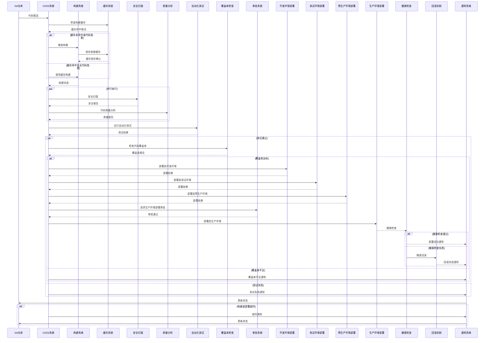

# 开发指南

<cite>
**本文档中引用的文件**
- [tdd_driven_todo_cases.md](file://ep19/tdd_driven_todo_cases.md)
- [README.md](file://README.md)
- [ep19/README.md](file://ep19/README.md)
- [ep20/README.md](file://ep20/README.md)
- [ep21/README.md](file://ep21/README.md)
- [ep19/src/main/java/org/teachfx/antlr4/ep19/pipeline/ConfigurableCompilerPipeline.java](file://ep19/src/main/java/org/teachfx/antlr4/ep19/pipeline/ConfigurableCompilerPipeline.java)
- [ep20/docs/compilation-sequence.md](file://ep20/docs/compilation-sequence.md)
- [ep20/docs/tdd_improvement_tasks.md](file://ep20/docs/tdd_improvement_tasks.md)
- [ep20/src/main/resources/log4j2.xml](file://ep20/src/main/resources/log4j2.xml)
- [ep21/src/main/resources/log4j2.xml](file://ep21/src/main/resources/log4j2.xml)
</cite>

## 目录
1. [简介](#简介)
2. [项目结构](#项目结构)
3. [开发环境设置](#开发环境设置)
4. [代码规范与提交流程](#代码规范与提交流程)
5. [测试驱动开发(TDD)实践](#测试驱动开发tdd实践)
6. [代码重构与新功能添加](#代码重构与新功能添加)
7. [语法扩展与优化算法](#语法扩展与优化算法)
8. [新贡献者入门路径](#新贡献者入门路径)
9. [架构决策与设计模式](#架构决策与设计模式)
10. [附录](#附录)

## 简介
本开发指南旨在为Cymbol编译器项目的贡献者提供全面的指导，涵盖从环境设置到高级架构决策的各个方面。项目通过21个演进阶段（EP1-EP21）展示了现代编译器的核心概念和技术，从简单的词法分析器逐步发展为完整的JIT编译器。本指南将详细介绍贡献流程、代码规范、开发工作流以及TDD实践在项目中的应用。

## 项目结构
Cymbol编译器项目采用Maven多模块结构，每个ep*目录代表一个独立的演进阶段，包含完整的源代码、测试代码和配置文件。项目结构清晰地展示了编译器从基础到高级功能的逐步演进过程。



**图源**
- [README.md](file://README.md)

**本节源**
- [README.md](file://README.md)

## 开发环境设置
### 环境要求
- **JDK 18+** (推荐OpenJDK 18或更高版本)
- **Maven 3.8+** 构建工具
- **Antlr4** 运行时支持 (通过Maven依赖管理)

### IDE配置
推荐使用IntelliJ IDEA或Eclipse进行开发，配置步骤如下：

1. **导入项目**：将整个项目作为Maven项目导入IDE
2. **ANTLR插件**：安装ANTLR插件以支持语法文件的高亮和代码生成
3. **代码格式化**：导入项目提供的代码格式化配置文件
4. **调试设置**：配置日志输出，使用`log4j2.xml`文件中的配置

```xml
<?xml version="1.0" encoding="UTF-8"?>
<Configuration status="INFO">
    <Appenders>
        <Console name="Console" target="SYSTEM_OUT">
            <PatternLayout pattern="%d{HH:mm:ss.SSS} [%t] %-5level %logger{36} - %msg%n"/>
        </Console>
        <File name="File" fileName="logs/app.log">
            <PatternLayout pattern="%d{HH:mm:ss.SSS} [%t] %-5level %logger{36} - %msg%n"/>
        </File>
    </Appenders>
    <Loggers>
        <Root level="info">
            <AppenderRef ref="Console"/>
            <AppenderRef ref="File"/>
        </Root>
    </Loggers>
</Configuration>
```

**图源**
- [ep20/src/main/resources/log4j2.xml](file://ep20/src/main/resources/log4j2.xml)
- [ep21/src/main/resources/log4j2.xml](file://ep21/src/main/resources/log4j2.xml)

### 构建过程
1. 克隆项目仓库后，在根目录执行：
```bash
mvn clean install
```
2. 构建特定模块（以ep20为例）：
```bash
cd ep20
mvn clean package
```

**本节源**
- [README_EN.md](file://README_EN.md)

## 代码规范与提交流程
### 代码规范
- **命名约定**：遵循Java命名规范，类名使用大驼峰，方法名使用小驼峰
- **注释要求**：关键方法和类必须有JavaDoc注释，复杂逻辑需添加行内注释
- **代码风格**：遵循项目统一的代码格式化规则
- **错误处理**：所有异常必须被捕获并记录，提供清晰的错误信息

### Pull Request流程
1. Fork项目仓库
2. 创建功能分支 (`git checkout -b feature/AmazingFeature`)
3. 实现功能并添加测试
4. 确保所有测试通过
5. 提交代码并推送分支
6. 创建Pull Request，详细描述变更内容
7. 等待代码审查和反馈
8. 根据反馈修改并重新提交
9. 合并到主分支

**本节源**
- [README.md](file://README.md)

## 测试驱动开发(TDD)实践
### TDD驱动开发方法
项目采用严格的测试驱动开发方法，遵循"红-绿-重构"循环。所有新功能和修复都必须先编写失败的测试用例，然后实现代码使测试通过，最后进行代码重构。



**图源**
- [tdd_driven_todo_cases.md](file://ep19/tdd_driven_todo_cases.md)

### tdd_driven_todo_cases.md中的任务驱动开发
`tdd_driven_todo_cases.md`文件详细记录了EP19阶段的测试失败分析和修复计划，展示了TDD实践的具体应用：

1. **问题分类**：将测试失败按类别分析，如数组支持、函数调用NPE、结构体字段访问等
2. **根因分析**：深入分析每个问题的根本原因
3. **修复计划**：制定详细的修复步骤和优先级
4. **实施验证**：逐项完成修复并验证测试通过

**本节源**
- [tdd_driven_todo_cases.md](file://ep19/tdd_driven_todo_cases.md)

## 代码重构与新功能添加
### 最佳实践
- **小步提交**：每次提交只包含一个逻辑变更
- **测试先行**：添加新功能前先编写测试用例
- **代码审查**：所有代码变更必须经过至少一名其他开发者的审查
- **文档同步**：代码变更后及时更新相关文档

### 扩展语法示例
要扩展语法，如添加新的运算符，需遵循以下步骤：
1. 在`.g4`语法文件中添加新的词法规则和语法规则
2. 重新生成解析器代码
3. 在相应的Visitor类中实现新语法的处理逻辑
4. 添加对应的测试用例
5. 更新文档

**本节源**
- [README.md](file://README.md)

## 语法扩展与优化算法
### 添加新优化算法
以EP20中的跳转优化为例，添加新的优化算法需要：
1. 在`pass/cfg`包中创建新的优化类
2. 实现`IFlowOptimizer`接口
3. 在编译流水线中注册新的优化阶段
4. 编写针对性的测试用例验证优化效果



**图源**
- [ep20/README.md](file://ep20/README.md)

### 实现新的代码生成目标
要实现新的代码生成目标，如生成LLVM IR：
1. 设计中间表示到目标代码的映射规则
2. 创建新的代码生成器类
3. 实现指令选择和寄存器分配算法
4. 集成到编译流水线中
5. 验证生成代码的正确性

**本节源**
- [ep20/README.md](file://ep20/README.md)

## 新贡献者入门路径
### 入门步骤
1. **环境准备**：按照[开发环境设置](#开发环境设置)配置开发环境
2. **选择任务**：从`ep20/docs/tdd_improvement_tasks.md`中选择适合的入门任务
3. **编写测试**：使用提供的测试模板编写测试用例
4. **实现功能**：根据测试要求实现代码
5. **提交代码**：遵循Git工作流程提交Pull Request

### 推荐学习路径
1. 从EP1开始，逐步理解编译器的各个组件
2. 阅读每个阶段的README文件，了解该阶段的目标和实现
3. 运行并调试测试用例，理解代码执行流程
4. 尝试修复简单的bug或添加小功能
5. 逐步参与更复杂的开发任务

**本节源**
- [ep20/docs/tdd_improvement_tasks.md](file://ep20/docs/tdd_improvement_tasks.md)

## 架构决策与设计模式
### 编译流水线设计
EP19引入了可配置的编译流水线设计，通过`ConfigurableCompilerPipeline`类实现了编译阶段的灵活配置：

```java
public class ConfigurableCompilerPipeline {
    private Function<CharStream, CommonTokenStream> lexicalAnalysisPhase;
    private Function<CommonTokenStream, ParseTree> syntaxAnalysisPhase;
    private Function<ParseTree, LocalDefine> symbolDefinitionPhase;
    private BiFunction<ParseTree, ScopeUtil, LocalResolver> symbolResolutionPhase;
    private TriFunction<ParseTree, ScopeUtil, LocalResolver, TypeCheckVisitor> typeCheckingPhase;
    private BiFunction<ParseTree, ScopeUtil, Object> interpretationPhase;
    
    // 设置各阶段实现的方法...
    public ConfigurableCompilerPipeline setLexicalAnalysisPhase(Function<CharStream, CommonTokenStream> lexicalAnalysisPhase) {
        this.lexicalAnalysisPhase = lexicalAnalysisPhase;
        return this;
    }
    // ...其他setter方法
}
```

这种设计模式允许开发者根据需要定制编译流程，支持不同阶段的替换和扩展。

**本节源**
- [ep19/src/main/java/org/teachfx/antlr4/ep19/pipeline/ConfigurableCompilerPipeline.java](file://ep19/src/main/java/org/teachfx/antlr4/ep19/pipeline/ConfigurableCompilerPipeline.java)

### 持续集成流程
项目采用完整的CI/CD流程，确保代码质量和稳定性：



**图源**
- [ep20/docs/compilation-sequence.md](file://ep20/docs/compilation-sequence.md)

## 结论
本开发指南为Cymbol编译器项目的贡献者提供了全面的指导，涵盖了从环境设置到高级架构决策的各个方面。通过遵循本指南中的实践和流程，新贡献者可以快速上手，资深开发者可以更好地理解项目架构和设计决策。项目采用的测试驱动开发方法和严格的代码质量控制确保了编译器的稳定性和可靠性。

## 附录
### 参考文档
- [项目总体介绍](docs/README.md)
- [开发指南](docs/开发指南.md)
- [架构设计](docs/架构设计.md)
- [测试策略](docs/测试策略.md)
- [EP20改进总结](ep20/docs/ep20-improvements-summary.md)
- [TDD实施步骤](ep20/docs/tdd_implementation_steps.md)

### 贡献要求
- 遵循项目编码规范
- 添加相应的测试用例
- 更新相关文档
- 确保所有测试通过

### 许可证
本项目采用BSD 3-Clause许可证，详情请见[LICENSE](LICENSE)文件。