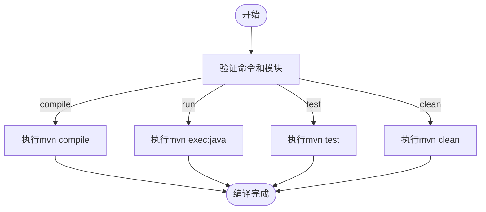
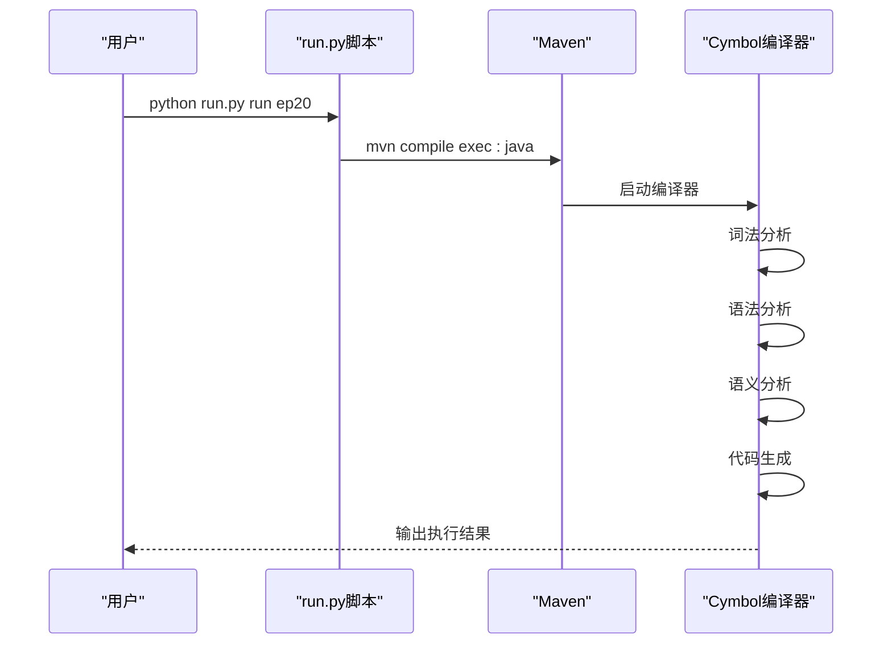

# 快速入门

<cite>
**本文档中引用的文件**  
- [run.py](file://scripts/run.py)
- [pom.xml](file://pom.xml)
- [ep20/pom.xml](file://ep20/pom.xml)
- [ep19/Compiler.java](file://ep19/src/main/java/org/teachfx/antlr4/ep19/Compiler.java)
- [ep20/README_ZH.md](file://ep20/README_ZH.md)
- [t.cymbol](file://ep20/src/main/resources/t.cymbol)
- [arith.cymbol](file://ep20/src/main/resources/arith.cymbol)
</cite>

## 目录
1. [环境搭建](#环境搭建)
2. [构建与运行流程](#构建与运行流程)
3. [使用run.py脚本执行编译器](#使用runpy脚本执行编译器)
4. [Maven构建命令详解](#maven构建命令详解)
5. [Cymbol程序示例](#cymbol程序示例)
6. [常见问题解决方案](#常见问题解决方案)
7. [基础使用示例](#基础使用示例)

## 环境搭建

在开始使用本项目之前，需要正确配置Java开发环境、Maven构建工具和ANTLR4运行时库。以下是详细的环境搭建步骤：

### Java开发环境安装
1. 下载并安装JDK 17或更高版本
2. 配置环境变量：
   - `JAVA_HOME`：指向JDK安装目录
   - 将`%JAVA_HOME%\bin`添加到`PATH`环境变量中
3. 验证安装：
```bash
java -version
javac -version
```

### Maven构建工具安装
1. 下载Maven 3.6.0或更高版本
2. 解压到指定目录
3. 配置环境变量：
   - `MAVEN_HOME`：指向Maven安装目录
   - 将`%MAVEN_HOME%\bin`添加到`PATH`环境变量中
4. 验证安装：
```bash
mvn -version
```

### ANTLR4运行时库配置
项目已通过Maven依赖管理自动包含ANTLR4运行时库。在`pom.xml`文件中，相关配置如下：
```xml
<dependency>
    <groupId>org.antlr</groupId>
    <artifactId>antlr4</artifactId>
    <version>4.13.2</version>
    <scope>compile</scope>
</dependency>
```

**Section sources**
- [pom.xml](file://pom.xml#L0-L34)
- [ep20/pom.xml](file://ep20/pom.xml#L36-L72)

## 构建与运行流程

项目的构建与运行遵循标准的Maven生命周期，主要包含编译、测试和执行三个阶段。

### 项目结构说明
项目采用多模块结构，每个`ep`目录代表一个独立的演进阶段。核心编译器功能主要在`ep20`模块中实现。

### 构建流程
1. 清理项目：`mvn clean`
2. 编译源码：`mvn compile`
3. 运行测试：`mvn test`
4. 打包应用：`mvn package`

### 运行流程
编译完成后，可以通过以下方式运行编译器：
```bash
# 直接运行
java -cp target/classes org.teachfx.antlr4.ep20.Compiler input.cymbol

# 使用Maven执行
mvn exec:java -Dexec.args="src/main/resources/t.cymbol"
```

**Section sources**
- [ep20/README_ZH.md](file://ep20/README_ZH.md#L0-L292)

## 使用run.py脚本执行编译器

`scripts/run.py`脚本提供了便捷的命令行接口来管理项目的构建和执行。

### 脚本功能
该脚本支持以下命令：
- `compile`：编译指定模块
- `run`：运行指定模块
- `test`：运行指定模块的测试
- `clean`：清理指定模块的编译文件
- `help`：显示帮助信息

### 使用方法
```bash
# 编译ep20模块
python scripts/run.py compile ep20

# 运行ep20模块
python scripts/run.py run ep20

# 运行ep20模块的测试
python scripts/run.py test ep20

# 清理ep20模块
python scripts/run.py clean ep20
```

### 参数配置
脚本支持额外参数传递。例如：
```bash
python scripts/run.py run ep20 src/main/resources/t.cymbol
```

### 输入文件准备
将Cymbol源代码文件保存为`.cymbol`扩展名，放置在`src/main/resources/`目录下。



**Diagram sources**
- [run.py](file://scripts/run.py#L0-L136)

**Section sources**
- [run.py](file://scripts/run.py#L0-L136)

## Maven构建命令详解

Maven提供了标准化的构建生命周期，以下是常用命令的详细说明。

### 常用构建命令
| 命令 | 说明 |
|------|------|
| `mvn clean` | 清理target目录 |
| `mvn compile` | 编译主源码 |
| `mvn test` | 编译并运行测试 |
| `mvn package` | 打包项目 |
| `mvn install` | 安装到本地仓库 |

### 模块化构建
由于项目采用多模块结构，可以使用`-pl`参数指定特定模块：
```bash
# 只构建ep20模块
mvn compile -pl ep20

# 构建ep20并运行其测试
mvn test -pl ep20
```

### ANTLR4插件配置
项目中的ANTLR4插件会自动处理语法文件的解析器生成：
```xml
<plugin>
    <groupId>org.antlr</groupId>
    <artifactId>antlr4-maven-plugin</artifactId>
    <version>4.13.2</version>
    <configuration>
        <visitor>true</visitor>
        <sourceDirectory>${basedir}/src/main/antlr4</sourceDirectory>
    </configuration>
</plugin>
```

**Section sources**
- [ep20/pom.xml](file://ep20/pom.xml#L0-L143)

## Cymbol程序示例

以下是一个简单的Cymbol程序示例，演示从源代码到执行的完整流程。

### 示例代码
```c
// t.cymbol
int main() {
    int a = 10;
    int b = 20;
    int c = a + b;
    print("Result: ");
    print(c);
    return 0;
}
```

### 执行流程
1. 创建`src/main/resources/t.cymbol`文件
2. 使用run.py脚本运行：
```bash
python scripts/run.py run ep20
```
3. 查看输出结果

### 复杂示例
```c
// arith.cymbol
int factorial(int n) {
    if (n <= 1) {
        return 1;
    }
    return n * factorial(n - 1);
}

int main() {
    int result = factorial(5);
    print("Factorial of 5 is: ");
    print(result);
    return 0;
}
```

**Section sources**
- [t.cymbol](file://ep20/src/main/resources/t.cymbol)
- [arith.cymbol](file://ep20/src/main/resources/arith.cymbol)

## 常见问题解决方案

### 环境变量配置问题
**问题**：命令行无法识别`java`或`mvn`命令  
**解决方案**：
1. 检查环境变量是否正确设置
2. 重启命令行终端
3. 验证路径是否包含空格或特殊字符

### 依赖下载失败
**问题**：Maven依赖下载失败或超时  
**解决方案**：
1. 检查网络连接
2. 配置Maven镜像源：
```xml
<mirror>
    <id>aliyunmaven</id>
    <mirrorOf>*</mirrorOf>
    <name>阿里云公共仓库</name>
    <url>https://maven.aliyun.com/repository/public</url>
</mirror>
```

### ANTLR4生成失败
**问题**：ANTLR4插件无法生成解析器  
**解决方案**：
1. 确认语法文件位置正确
2. 检查`pom.xml`中ANTLR4插件配置
3. 清理并重新编译：`mvn clean compile`

### 类路径问题
**问题**：找不到主类或资源文件  
**解决方案**：
1. 确认`run.main.entry`属性设置正确
2. 检查资源文件是否在`src/main/resources`目录下
3. 验证编译输出目录结构

**Section sources**
- [ep20/README_ZH.md](file://ep20/README_ZH.md#L0-L292)
- [ep20/pom.xml](file://ep20/pom.xml#L0-L143)

## 基础使用示例

### 快速体验编译器
1. 准备测试文件：
```bash
echo "int main() { print(\"Hello, Cymbol!\"); return 0; }" > test.cymbol
```

2. 运行编译器：
```bash
python scripts/run.py run ep20 test.cymbol
```

3. 预期输出：
```
Hello, Cymbol!
```

### 编译器功能演示
编译器支持多种命令行参数：
```bash
# 静态分析
python scripts/run.py run ep20 --static-analysis t.cymbol

# 编译并保存
python scripts/run.py run ep20 --compile t.cymbol output.bin

# 执行已编译文件
python scripts/run.py run ep20 --execute output.bin
```

### 调试技巧
1. 启用详细日志输出
2. 使用`mvn compile -X`查看详细构建过程
3. 检查`target/generated-sources/antlr4`目录确认解析器生成



**Diagram sources**
- [run.py](file://scripts/run.py#L0-L136)
- [ep19/Compiler.java](file://ep19/src/main/java/org/teachfx/antlr4/ep19/Compiler.java#L0-L39)

**Section sources**
- [run.py](file://scripts/run.py#L0-L136)
- [ep19/Compiler.java](file://ep19/src/main/java/org/teachfx/antlr4/ep19/Compiler.java#L0-L250)