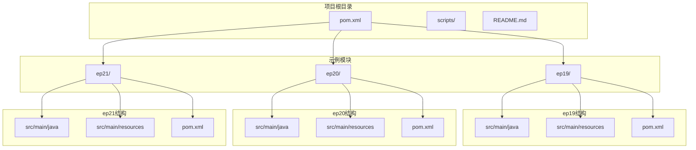
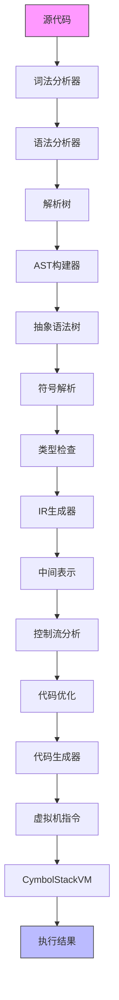
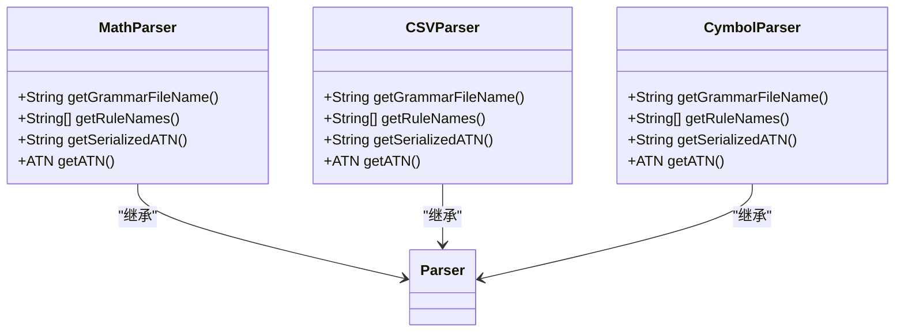
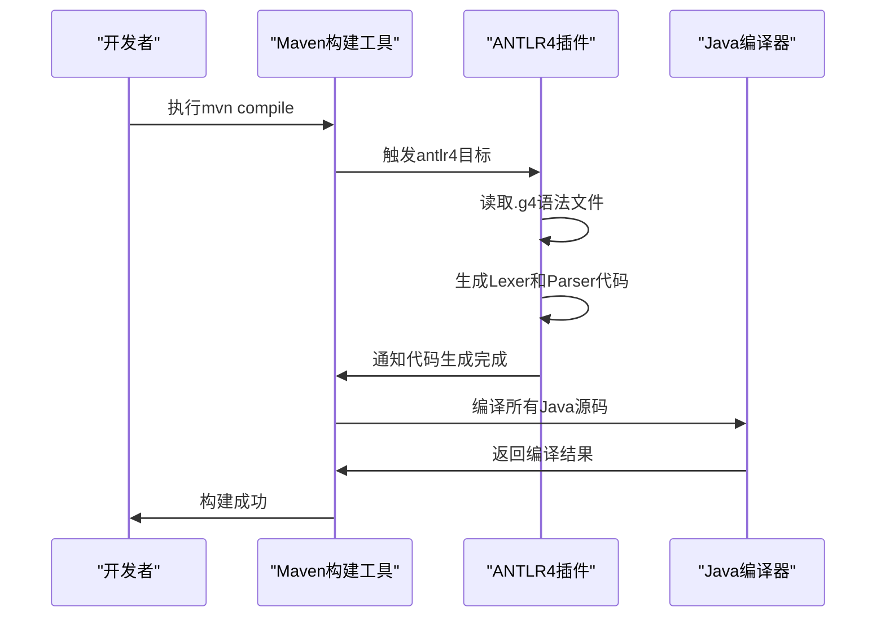
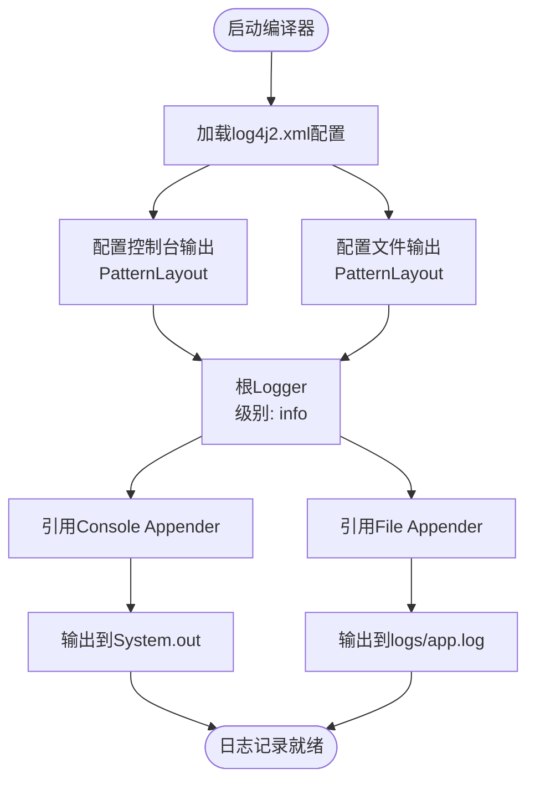
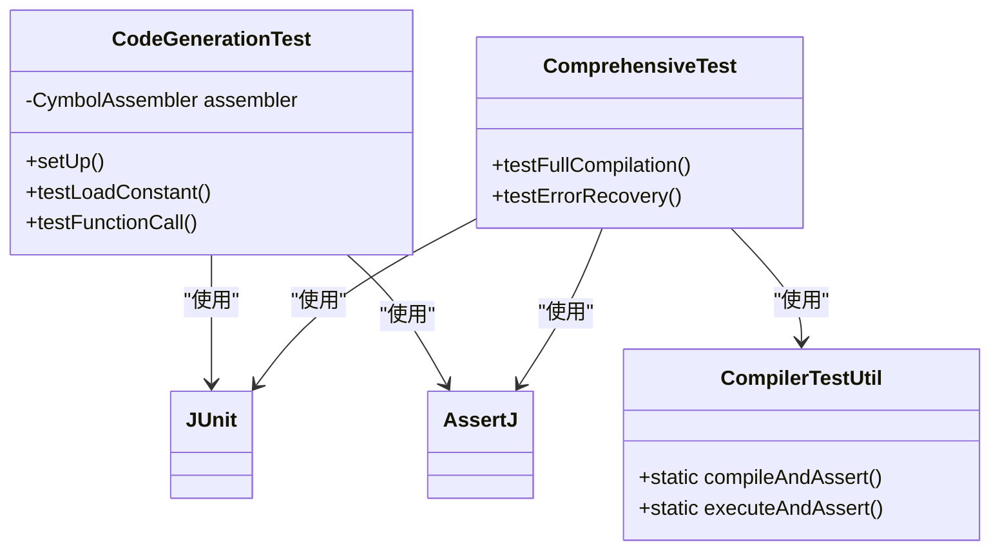
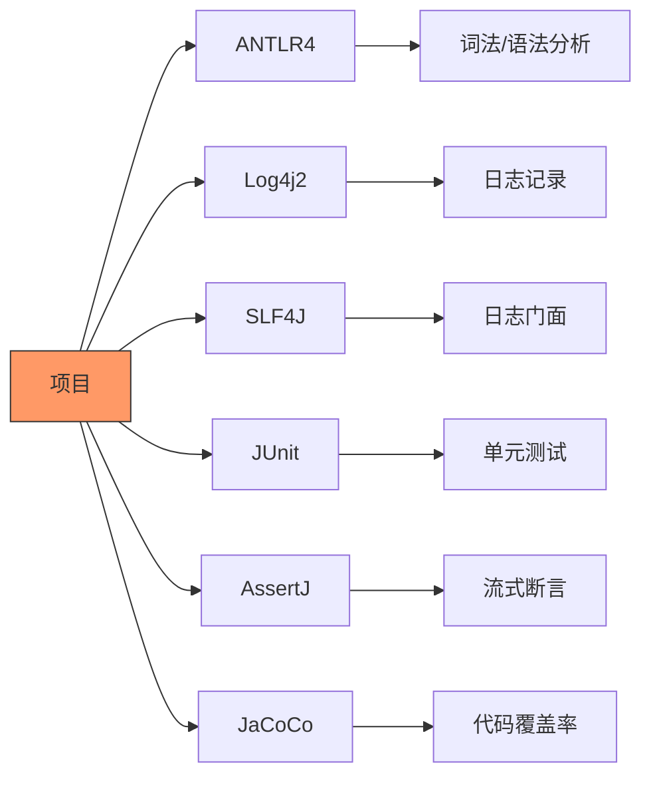

# 技术栈与依赖

<cite>
**本文档引用的文件**
- [pom.xml](file://pom.xml)
- [ep19/pom.xml](file://ep19/pom.xml)
- [ep20/pom.xml](file://ep20/pom.xml)
- [ep21/pom.xml](file://ep21/pom.xml)
- [ep19/src/main/resources/log4j2.xml](file://ep19/src/main/resources/log4j2.xml)
- [ep20/src/main/resources/log4j2.xml](file://ep20/src/main/resources/log4j2.xml)
- [ep21/src/main/resources/log4j2.xml](file://ep21/src/main/resources/log4j2.xml)
- [ep19/src/main/java/org/teachfx/antlr4/ep19/misc/CompilerLogger.java](file://ep19/src/main/java/org/teachfx/antlr4/ep19/misc/CompilerLogger.java)
- [ep19/src/main/java/org/teachfx/antlr4/ep19/Compiler.java](file://ep19/src/main/java/org/teachfx/antlr4/ep19/Compiler.java)
- [ep20/src/main/java/org/teachfx/antlr4/ep20/Compiler.java](file://ep20/src/main/java/org/teachfx/antlr4/ep20/Compiler.java)
- [ep21/src/main/java/org/teachfx/antlr4/ep21/Compiler.java](file://ep21/src/main/java/org/teachfx/antlr4/ep21/Compiler.java)
- [ep21/src/main/java/org/teachfx/antlr4/ep21/pass/ast/CymbolASTBuilder.java](file://ep21/src/main/java/org/teachfx/antlr4/ep21/pass/ast/CymbolASTBuilder.java)
</cite>

## 目录
1. [引言](#引言)
2. [项目结构](#项目结构)
3. [核心组件](#核心组件)
4. [架构概述](#架构概述)
5. [详细组件分析](#详细组件分析)
6. [依赖分析](#依赖分析)
7. [性能考虑](#性能考虑)
8. [故障排除指南](#故障排除指南)
9. [结论](#结论)
10. [附录](#附录)（如有必要）

## 引言
本文档详细介绍了基于ANTLR4实现编程语言的技术栈与依赖关系。通过分析一系列循序渐进的示例项目（ep1至ep21），展示了从基础语法解析到完整编译器构建的全过程。文档重点阐述了ANTLR4在词法和语法分析中的核心作用、Maven构建工具的配置细节、Log4j2日志框架的集成方式，以及JUnit、Mockito和AssertJ测试框架的使用模式。这些技术共同构成了一个完整的编译器开发技术生态，为语言实现提供了坚实的基础。

## 项目结构
本项目采用模块化设计，包含21个循序渐进的示例（ep1至ep21），每个示例专注于编译器开发的特定方面。项目根目录下的pom.xml文件定义了全局依赖和插件配置，而各个ep子目录下的pom.xml则针对具体示例进行定制化配置。源代码主要位于src/main/java目录下，遵循org.teachfx.antlr4.epXX的包命名规范。资源文件（如日志配置）存放在src/main/resources目录中。这种结构化的布局使得每个示例既独立又相互关联，便于学习和理解编译器开发的各个阶段。

**图示来源**
- [pom.xml](file://pom.xml)
- [ep19/pom.xml](file://ep19/pom.xml)
- [ep20/pom.xml](file://ep20/pom.xml)
- [ep21/pom.xml](file://ep21/pom.xml)

**本节来源**
- [pom.xml](file://pom.xml)
- [ep19/pom.xml](file://ep19/pom.xml)
- [ep20/pom.xml](file://ep20/pom.xml)
- [ep21/pom.xml](file://ep21/pom.xml)

## 核心组件
项目的核心组件围绕ANTLR4语法解析、抽象语法树（AST）构建、符号表管理、中间代码生成和虚拟机执行展开。ANTLR4负责将源代码文本转换为解析树，随后通过访问者模式构建AST。符号表组件（如GlobalScope、LocalScope）用于管理变量和函数的作用域。中间表示（IR）组件将AST转换为三地址码（TAC），并进行控制流分析（CFG）和优化。最后，代码生成器将IR转换为虚拟机指令，由CymbolStackVM执行。这些组件通过Compiler类协调工作，形成完整的编译流水线。

**本节来源**
- [ep19/src/main/java/org/teachfx/antlr4/ep19/Compiler.java](file://ep19/src/main/java/org/teachfx/antlr4/ep19/Compiler.java)
- [ep20/src/main/java/org/teachfx/antlr4/ep20/Compiler.java](file://ep20/src/main/java/org/teachfx/antlr4/ep20/Compiler.java)
- [ep21/src/main/java/org/teachfx/antlr4/ep21/Compiler.java](file://ep21/src/main/java/org/teachfx/antlr4/ep21/Compiler.java)

## 架构概述
系统采用分层架构，从源代码输入到虚拟机执行分为多个阶段：词法分析、语法分析、AST构建、语义分析（符号解析和类型检查）、中间代码生成、优化和代码生成。每个阶段由专门的组件负责，通过清晰的接口进行通信。ANTLR4生成的解析器和访问者是整个流程的起点，而Compiler类作为协调者，驱动整个编译过程。日志框架贯穿所有组件，提供详细的运行时信息。这种模块化设计使得系统易于扩展和维护，每个组件都可以独立开发和测试。

**图示来源**
- [ep21/src/main/java/org/teachfx/antlr4/ep21/Compiler.java](file://ep21/src/main/java/org/teachfx/antlr4/ep21/Compiler.java)
- [ep20/src/main/java/org/teachfx/antlr4/ep20/Compiler.java](file://ep20/src/main/java/org/teachfx/antlr4/ep20/Compiler.java)

## 详细组件分析
### ANTLR4语法解析组件分析
ANTLR4是本项目的核心技术，负责词法和语法分析。通过定义.g4语法文件，ANTLR4自动生成词法分析器（Lexer）和语法分析器（Parser）。这些生成的类能够将源代码文本分解为标记流，并根据语法规则构建解析树。`getGrammarFileName()`方法返回语法文件名，`getSerializedATN()`提供序列化的语法识别网络。生成的解析器和访问者类构成了编译流程的基础，使得开发者可以专注于语义处理而非繁琐的文本解析。

#### ANTLR4生成的解析器类图

**图示来源**
- [ep12/src/main/java/org/teachfx/antlr4/ep12/parser/MathLexer.java](file://ep12/src/main/java/org/teachfx/antlr4/ep12/parser/MathLexer.java#L118-L149)
- [ep10/src/main/java/org/teachfx/antlr4/CSVParser.java](file://ep10/src/main/java/org/teachfx/antlr4/CSVParser.java#L93-L145)
- [ep16/src/main/java/org/teachfx/antlr4/ep16/parser/CymbolParser.java](file://ep16/src/main/java/org/teachfx/antlr4/ep16/parser/CymbolParser.java#L57-L113)

### Maven构建工具分析
Maven作为项目的构建工具，通过pom.xml文件管理依赖和构建过程。项目配置了antlr4-maven-plugin插件，用于在编译前自动生成词法和语法分析器代码。`<visitor>true</visitor>`配置确保生成访问者模式的类。`<outputDirectory>`指定生成代码的输出目录。此外，项目还配置了maven-compiler-plugin来指定Java版本，以及maven-jar-plugin来打包可执行的JAR文件。这种自动化配置大大简化了开发流程，确保了代码生成的一致性和可靠性。

#### Maven插件配置序列图

**图示来源**
- [ep21/pom.xml](file://ep21/pom.xml#L37-L74)
- [ep15/pom.xml](file://ep15/pom.xml#L35-L64)

### Log4j2日志框架分析
Log4j2被集成到项目中，提供灵活的日志记录功能。通过src/main/resources目录下的log4j2.xml配置文件，定义了控制台和文件两个输出源（Appender）。日志格式包含时间戳、线程名、日志级别、类名和消息内容。`CompilerLogger`工具类封装了SLF4J API，提供了error、warning、info、debug和trace等不同级别的日志记录方法。这种分层的日志设计使得开发者可以轻松地调试编译器的各个阶段，同时将详细的调试信息与用户友好的错误消息区分开来。

#### 日志框架配置流程图

**图示来源**
- [ep21/src/main/resources/log4j2.xml](file://ep21/src/main/resources/log4j2.xml)
- [ep19/src/main/java/org/teachfx/antlr4/ep19/misc/CompilerLogger.java](file://ep19/src/main/java/org/teachfx/antlr4/ep19/misc/CompilerLogger.java)

### 测试框架使用分析
项目采用了JUnit 5作为核心测试框架，配合AssertJ提供流式断言，实现了全面的测试覆盖。测试代码位于src/test/java目录下，遵循标准的测试结构。`@Test`注解标识测试方法，`@BeforeEach`和`@AfterEach`用于设置和清理测试环境。AssertJ的`assertThat()`方法提供了丰富的断言选项，使得测试代码既简洁又易读。测试用例涵盖了从词法分析到代码生成的各个阶段，确保了编译器的正确性和稳定性。

#### 测试框架集成类图

**图示来源**
- [ep20/docs/tdd_test_case_guide.md](file://ep20/docs/tdd_test_case_guide.md#L273-L342)
- [pom.xml](file://pom.xml#L65-L103)

## 依赖分析
项目依赖关系清晰，分为核心依赖和测试依赖。核心依赖包括ANTLR4运行时库、Log4j2日志框架和SLF4J门面模式。测试依赖包括JUnit Jupiter引擎、AssertJ断言库和JaCoCo代码覆盖率工具。通过Maven的依赖管理机制，这些库被自动下载并集成到项目中。`<scope>test</scope>`确保测试依赖不会包含在最终的发布包中。这种明确的依赖划分保证了项目的稳定性和可维护性。

**图示来源**
- [pom.xml](file://pom.xml#L32-L67)
- [ep19/pom.xml](file://ep19/pom.xml#L66-L88)

**本节来源**
- [pom.xml](file://pom.xml)
- [ep19/pom.xml](file://ep19/pom.xml)

## 性能考虑
在编译器开发中，性能是一个关键考量因素。项目通过多种方式优化性能：使用访问者模式遍历AST，避免了递归调用的开销；在IR生成阶段进行基本块优化，减少了冗余代码；利用JaCoCo监控测试覆盖率，确保关键路径得到充分测试。此外，日志级别设置为info，避免了在生产环境中输出过多的调试信息。这些优化措施共同保证了编译器的高效运行。

## 故障排除指南
当遇到编译器问题时，首先检查日志输出。`CompilerLogger`会记录详细的错误和警告信息，包括错误位置和相关源码片段。对于语法错误，检查.g4文件的语法规则是否正确。对于生成代码的问题，验证pom.xml中的ANTLR4插件配置。测试失败时，查看具体的断言错误信息，并使用调试日志定位问题。通过系统化的排查方法，可以快速解决大多数开发中遇到的问题。

**本节来源**
- [ep19/src/main/java/org/teachfx/antlr4/ep19/misc/CompilerLogger.java](file://ep19/src/main/java/org/teachfx/antlr4/ep19/misc/CompilerLogger.java)
- [ep20/docs/tdd_test_case_guide.md](file://ep20/docs/tdd_test_case_guide.md#L413-L427)

## 结论
本文档全面介绍了基于ANTLR4实现编程语言的技术栈与依赖关系。通过分析Maven构建配置、ANTLR4语法解析、Log4j2日志集成和测试框架使用，展示了构建一个完整编译器所需的核心技术。这些技术的有机结合，为语言实现提供了强大的支持。未来的工作可以进一步探索更高级的优化技术、更复杂的语言特性，以及更好的开发工具集成，不断提升编译器的性能和可用性。