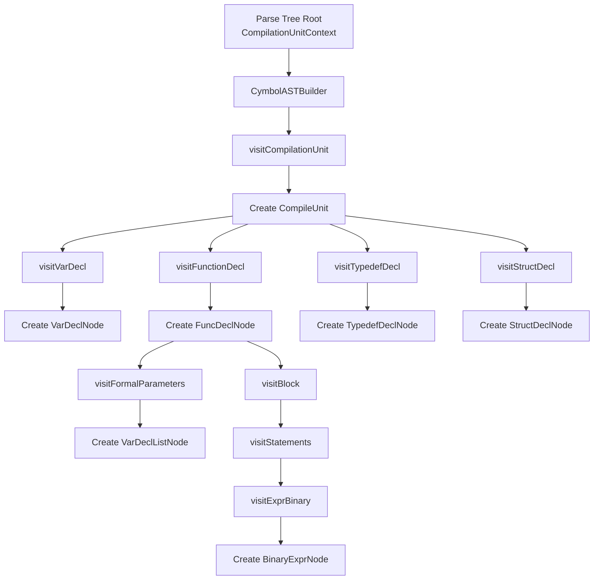
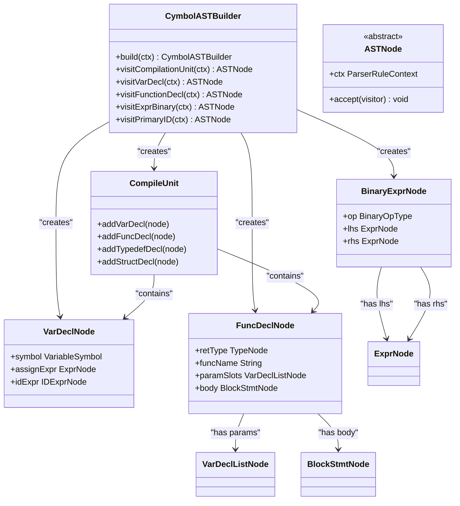
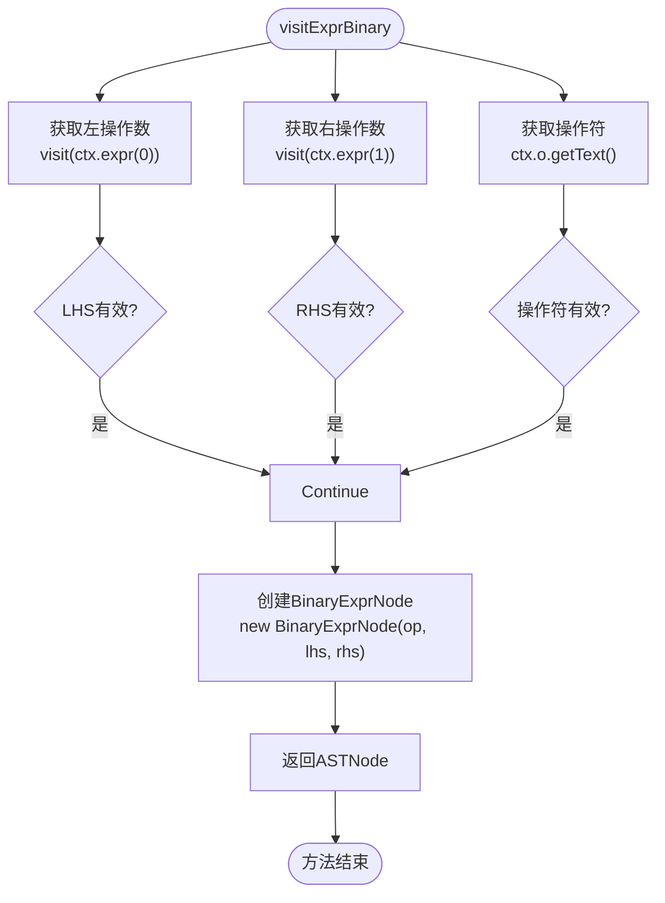
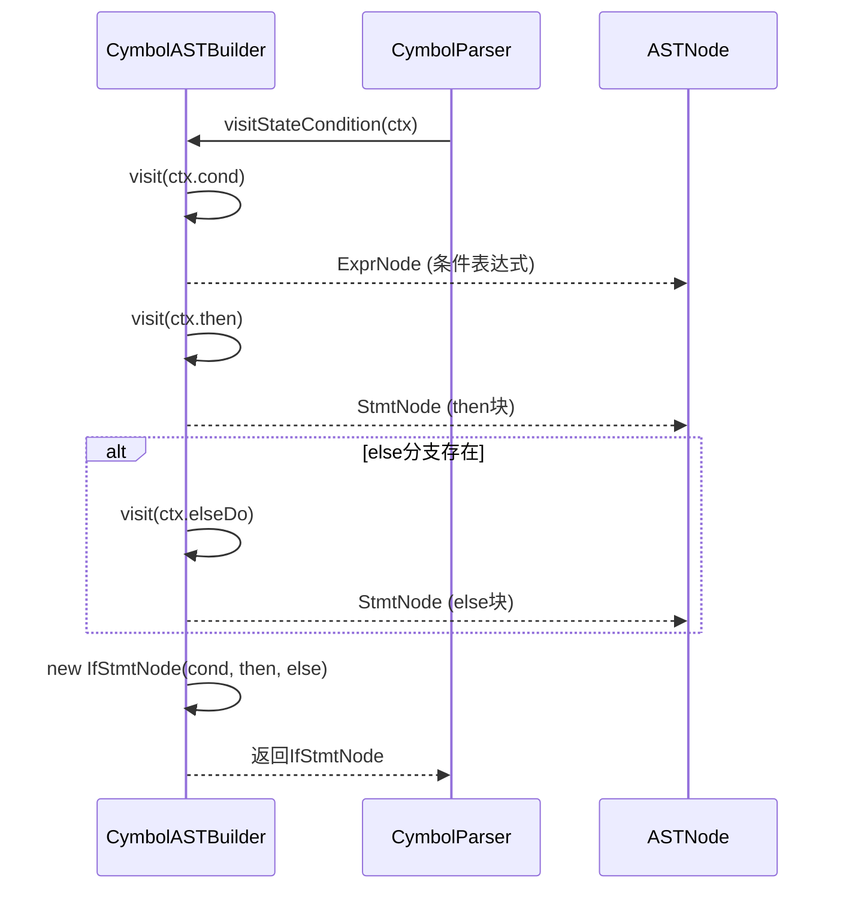
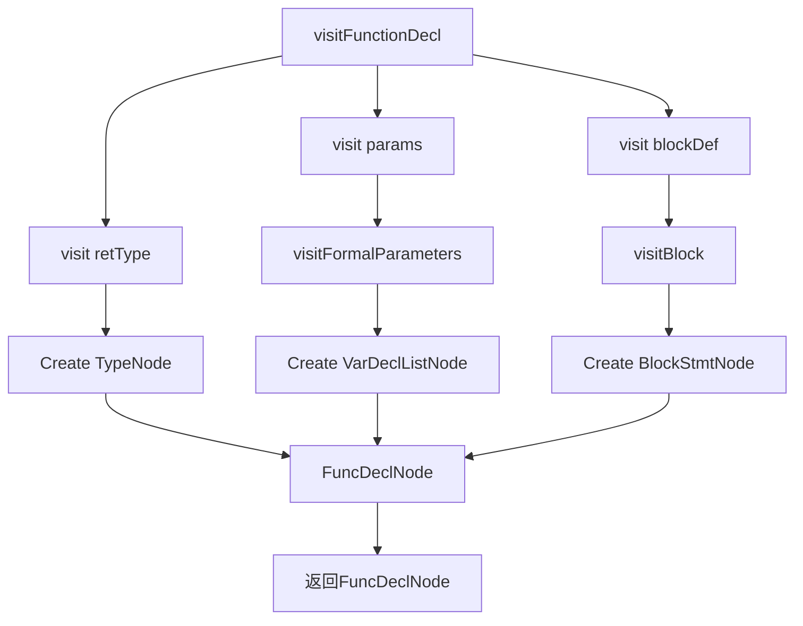
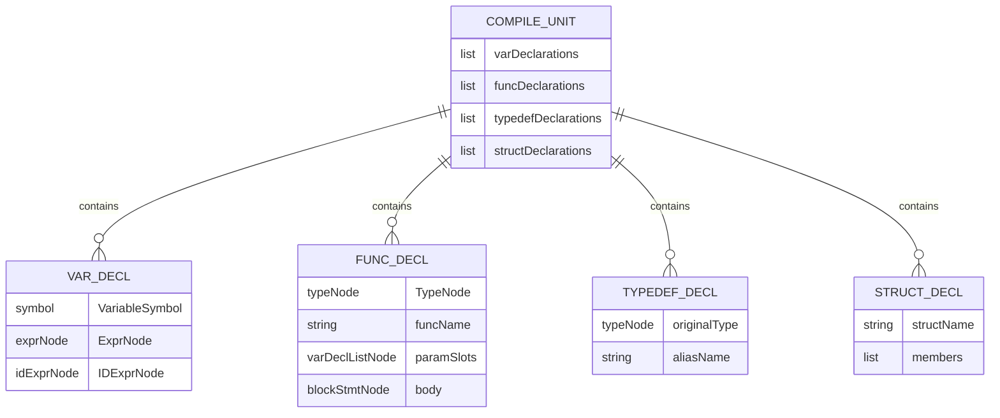
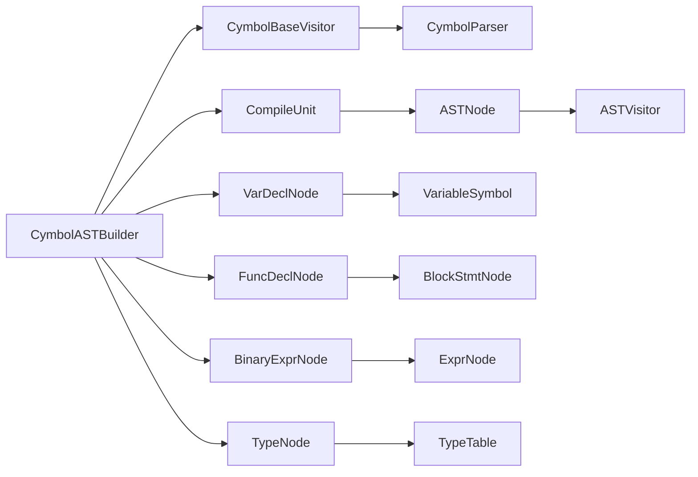

# AST构建

<cite>
**本文档中引用的文件**  
- [CymbolASTBuilder.java](file://ep20/src/main/java/org/teachfx/antlr4/ep20/pass/ast/CymbolASTBuilder.java)
- [ASTBaseVisitor.java](file://ep20/src/main/java/org/teachfx/antlr4/ep20/pass/ast/ASTBaseVisitor.java)
- [CompileUnit.java](file://ep20/src/main/java/org/teachfx/antlr4/ep20/ast/CompileUnit.java)
- [CymbolParser.java](file://ep20/src/main/java/org/teachfx/antlr4/ep20/parser/CymbolParser.java)
</cite>

## 目录
1. [简介](#简介)
2. [项目结构](#项目结构)
3. [核心组件](#核心组件)
4. [架构概述](#架构概述)
5. [详细组件分析](#详细组件分析)
6. [依赖分析](#依赖分析)
7. [性能考虑](#性能考虑)
8. [故障排除指南](#故障排除指南)
9. [结论](#结论)

## 简介
本文档详细介绍了在ANTLR4框架下实现编程语言时，如何将ANTLR生成的解析树转换为更简洁、语义更清晰的抽象语法树（AST）。重点分析了`CymbolASTBuilder`类如何通过继承`CymbolBaseVisitor`来遍历解析树并构建AST，以及`CompileUnit`作为编译单元的组织结构和构建流程。文档为初学者提供逐步构建流程解释，为高级用户提供错误处理和异常恢复机制的深入分析。

## 项目结构
项目采用模块化设计，每个实验（ep）代表一个独立的功能阶段。与AST构建直接相关的模块是`ep20`，其核心结构如下：

```
ep20/
├── src/main/java/org/teachfx/antlr4/ep20/
│   ├── ast/                    # AST节点定义
│   │   ├── decl/               # 声明节点（函数、变量等）
│   │   ├── expr/               # 表达式节点
│   │   ├── stmt/               # 语句节点
│   │   └── type/               # 类型节点
│   ├── parser/                 # ANTLR生成的解析器
│   │   ├── CymbolLexer.java
│   │   ├── CymbolParser.java
│   │   └── CymbolBaseVisitor.java
│   ├── pass/ast/               # AST构建相关类
│   │   ├── CymbolASTBuilder.java
│   │   └── ASTBaseVisitor.java
│   └── ast/CompileUnit.java    # 编译单元根节点
```

**Diagram sources**
- [CymbolASTBuilder.java](file://ep20/src/main/java/org/teachfx/antlr4/ep20/pass/ast/CymbolASTBuilder.java)
- [CompileUnit.java](file://ep20/src/main/java/org/teachfx/antlr4/ep20/ast/CompileUnit.java)

**Section sources**
- [CymbolASTBuilder.java](file://ep20/src/main/java/org/teachfx/antlr4/ep20/pass/ast/CymbolASTBuilder.java)
- [CompileUnit.java](file://ep20/src/main/java/org/teachfx/antlr4/ep20/ast/CompileUnit.java)

## 核心组件
本节分析AST构建过程中的核心组件，包括`CymbolASTBuilder`、`ASTBaseVisitor`和`CompileUnit`。

**Section sources**
- [CymbolASTBuilder.java](file://ep20/src/main/java/org/teachfx/antlr4/ep20/pass/ast/CymbolASTBuilder.java)
- [ASTBaseVisitor.java](file://ep20/src/main/java/org/teachfx/antlr4/ep20/pass/ast/ASTBaseVisitor.java)
- [CompileUnit.java](file://ep20/src/main/java/org/teachfx/antlr4/ep20/ast/CompileUnit.java)

## 架构概述
AST构建过程遵循访问者模式，`CymbolASTBuilder`作为具体的访问者，遍历由ANTLR生成的解析树，并为每个语法结构创建相应的AST节点。整个过程从`CompilationUnitContext`开始，递归构建出完整的AST。



**Diagram sources**
- [CymbolASTBuilder.java](file://ep20/src/main/java/org/teachfx/antlr4/ep20/pass/ast/CymbolASTBuilder.java)
- [CymbolParser.java](file://ep20/src/main/java/org/teachfx/antlr4/ep20/parser/CymbolParser.java)

## 详细组件分析
本节深入分析AST构建过程中的关键组件和转换逻辑。

### CymbolASTBuilder分析
`CymbolASTBuilder`是AST构建的核心类，它继承自ANTLR生成的`CymbolBaseVisitor`，并实现了`CymbolVisitor<ASTNode>`接口。它通过重写`visitXxx`方法，将解析树节点转换为对应的AST节点。

#### 节点转换逻辑


**Diagram sources**
- [CymbolASTBuilder.java](file://ep20/src/main/java/org/teachfx/antlr4/ep20/pass/ast/CymbolASTBuilder.java)
- [CompileUnit.java](file://ep20/src/main/java/org/teachfx/antlr4/ep20/ast/CompileUnit.java)

#### 表达式构建流程


**Diagram sources**
- [CymbolASTBuilder.java](file://ep20/src/main/java/org/teachfx/antlr4/ep20/pass/ast/CymbolASTBuilder.java)

#### 语句构建流程


**Diagram sources**
- [CymbolASTBuilder.java](file://ep20/src/main/java/org/teachfx/antlr4/ep20/pass/ast/CymbolASTBuilder.java)

#### 声明构建流程


**Diagram sources**
- [CymbolASTBuilder.java](file://ep20/src/main/java/org/teachfx/antlr4/ep20/pass/ast/CymbolASTBuilder.java)

### CompileUnit分析
`CompileUnit`是AST的根节点，负责组织和管理整个编译单元中的所有声明。



**Diagram sources**
- [CompileUnit.java](file://ep20/src/main/java/org/teachfx/antlr4/ep20/ast/CompileUnit.java)

**Section sources**
- [CymbolASTBuilder.java](file://ep20/src/main/java/org/teachfx/antlr4/ep20/pass/ast/CymbolASTBuilder.java)
- [CompileUnit.java](file://ep20/src/main/java/org/teachfx/antlr4/ep20/ast/CompileUnit.java)

## 依赖分析
AST构建过程涉及多个组件之间的协作，其依赖关系如下：



**Diagram sources**
- [CymbolASTBuilder.java](file://ep20/src/main/java/org/teachfx/antlr4/ep20/pass/ast/CymbolASTBuilder.java)
- [CompileUnit.java](file://ep20/src/main/java/org/teachfx/antlr4/ep20/ast/CompileUnit.java)

**Section sources**
- [CymbolASTBuilder.java](file://ep20/src/main/java/org/teachfx/antlr4/ep20/pass/ast/CymbolASTBuilder.java)
- [ASTBaseVisitor.java](file://ep20/src/main/java/org/teachfx/antlr4/ep20/pass/ast/ASTBaseVisitor.java)

## 性能考虑
虽然文档未直接提及性能优化，但`CymbolASTBuilder`的设计体现了良好的性能实践：
- 使用流式API（Stream API）处理参数列表和语句列表，提高代码可读性和潜在的并行处理能力
- 在构建AST时直接进行类型检查和符号创建，避免了后续遍历的开销
- 采用访问者模式，使得遍历和操作分离，便于扩展和维护

## 故障排除指南
当AST构建出现问题时，可以检查以下方面：
- 确保ANTLR生成的解析器（`CymbolParser`）与语法文件（`.g4`）同步
- 检查`CymbolASTBuilder`中的`visitXxx`方法是否覆盖了所有可能的语法结构
- 验证`CompileUnit`是否正确地收集了所有类型的声明
- 使用`ASTBaseVisitor`进行AST遍历，确保所有节点都能被正确访问

**Section sources**
- [CymbolASTBuilder.java](file://ep20/src/main/java/org/teachfx/antlr4/ep20/pass/ast/CymbolASTBuilder.java)
- [ASTBaseVisitor.java](file://ep20/src/main/java/org/teachfx/antlr4/ep20/pass/ast/ASTBaseVisitor.java)

## 结论
`CymbolASTBuilder`通过继承ANTLR的`CymbolBaseVisitor`，实现了从解析树到AST的高效转换。该过程以`CompileUnit`为根节点，系统地构建了变量、函数、类型定义和结构体等声明，以及表达式和语句等执行单元。这种设计不仅保持了代码的清晰性和可维护性，还为后续的语义分析和代码生成阶段奠定了坚实的基础。