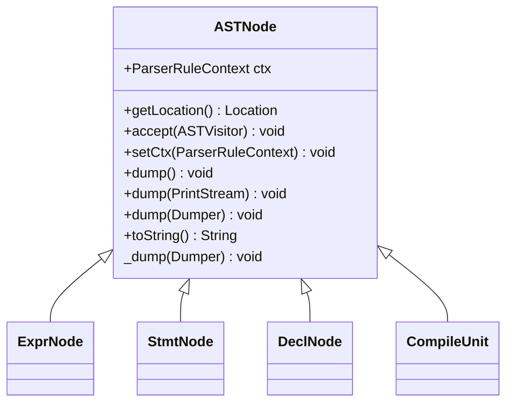
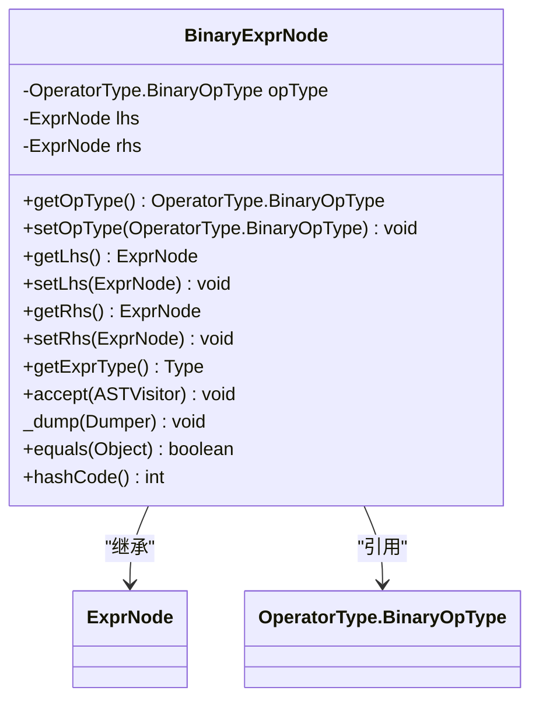
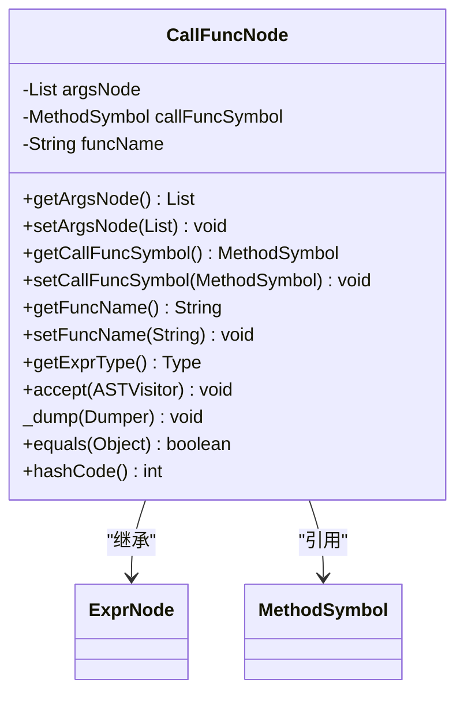
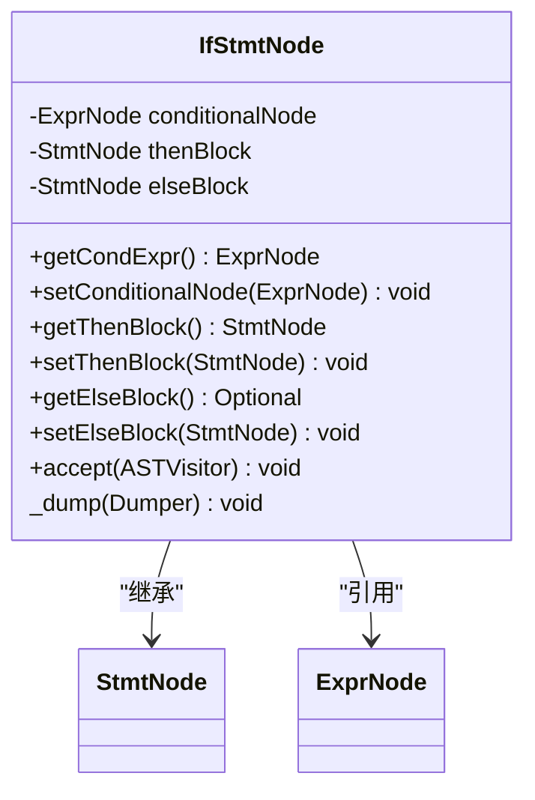
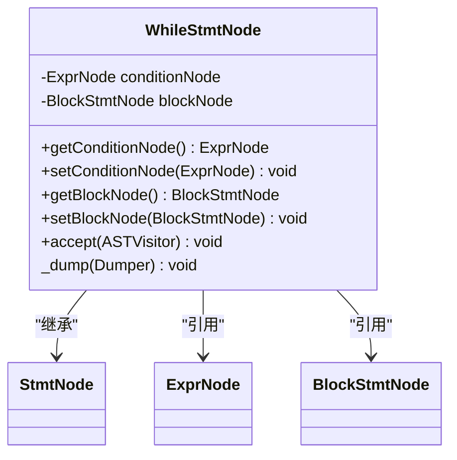
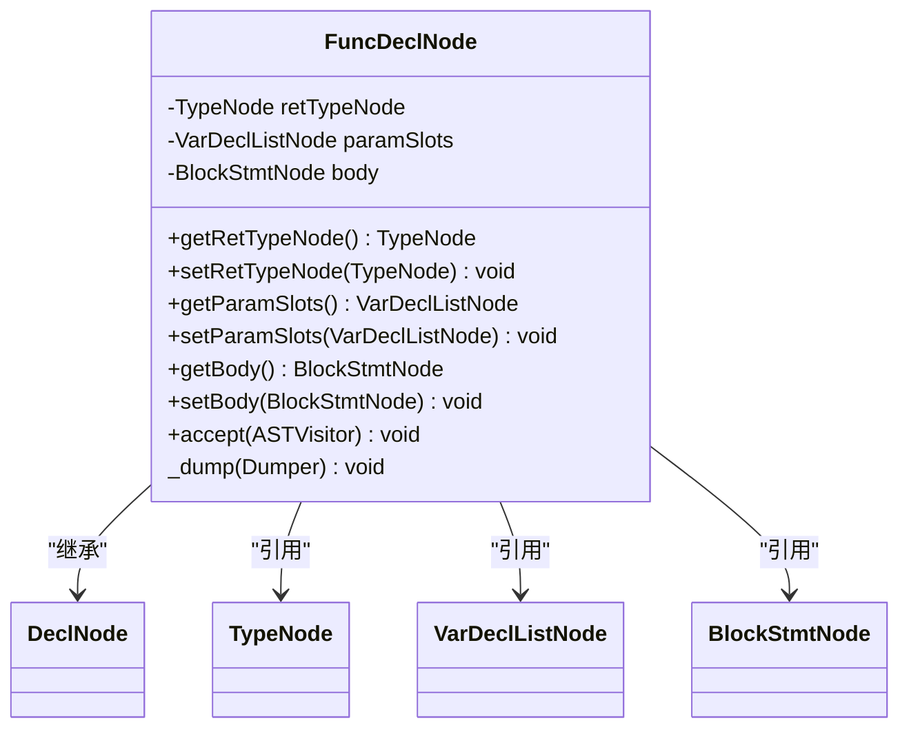
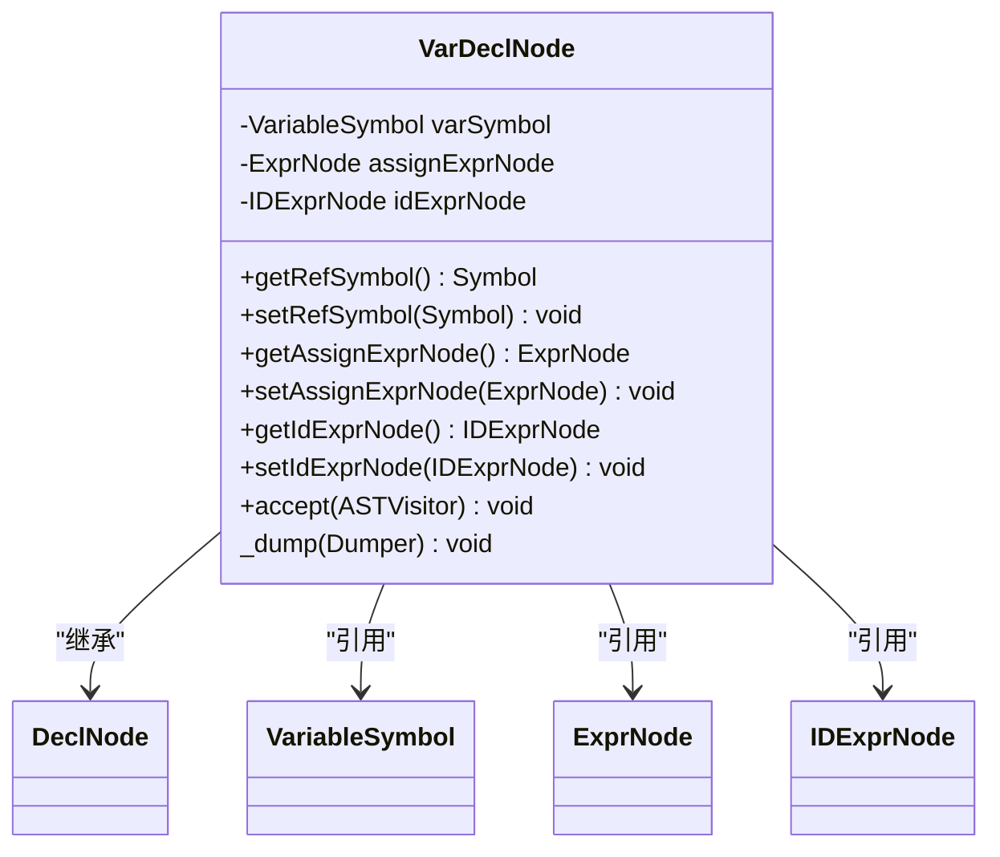
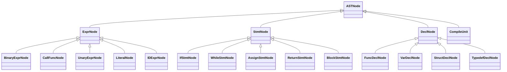
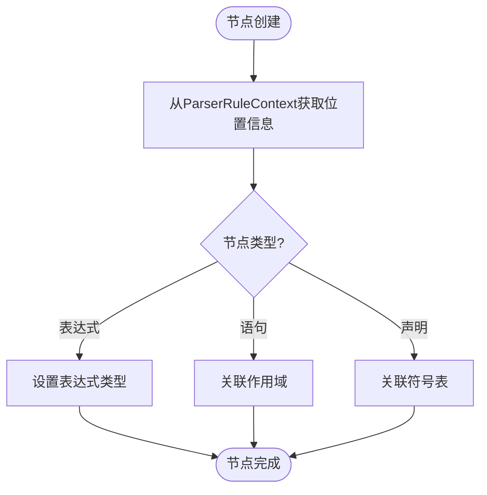

# AST节点类型

<cite>
**本文档中引用的文件**   
- [ASTNode.java](file://ep20\src\main\java\org\teachfx\antlr4\ep20\ast\ASTNode.java)
- [ExprNode.java](file://ep20\src\main\java\org\teachfx\antlr4\ep20\ast\expr\ExprNode.java)
- [StmtNode.java](file://ep20\src\main\java\org\teachfx\antlr4\ep20\ast\stmt\StmtNode.java)
- [DeclNode.java](file://ep20\src\main\java\org\teachfx\antlr4\ep20\ast\decl\DeclNode.java)
- [BinaryExprNode.java](file://ep20\src\main\java\org\teachfx\antlr4\ep20\ast\expr\BinaryExprNode.java)
- [CallFuncNode.java](file://ep20\src\main\java\org\teachfx\antlr4\ep20\ast\expr\CallFuncNode.java)
- [IfStmtNode.java](file://ep20\src\main\java\org\teachfx\antlr4\ep20\ast\stmt\IfStmtNode.java)
- [WhileStmtNode.java](file://ep20\src\main\java\org\teachfx\antlr4\ep20\ast\stmt\WhileStmtNode.java)
- [FuncDeclNode.java](file://ep20\src\main\java\org\teachfx\antlr4\ep20\ast\decl\FuncDeclNode.java)
- [VarDeclNode.java](file://ep20\src\main\java\org\teachfx\antlr4\ep20\ast\decl\VarDeclNode.java)
</cite>

## 目录
1. [简介](#简介)
2. [ASTNode基类设计](#astnode基类设计)
3. [表达式节点类型](#表达式节点类型)
4. [语句节点类型](#语句节点类型)
5. [声明节点类型](#声明节点类型)
6. [节点继承体系](#节点继承体系)
7. [节点属性与语义](#节点属性与语义)
8. [初学者指南](#初学者指南)
9. [高级开发指南](#高级开发指南)

## 简介
抽象语法树（AST）是编译器前端处理源代码的核心数据结构。本文档详细介绍了AST节点类型的设计与实现，重点分析了ASTNode基类的继承体系，以及表达式、语句和声明节点的具体实现。通过实际代码示例，展示不同类型节点的数据模型和关系，为初学者提供直观的节点分类解释，为高级用户提供节点扩展和自定义节点类型的开发方法。

## ASTNode基类设计

ASTNode是所有AST节点的基类，提供了基本的属性和方法，为整个AST体系提供了统一的基础。该类定义了节点与解析上下文的关联、位置信息获取、访问者模式支持和调试输出功能。

**图示来源**
- [ASTNode.java](file://ep20\src\main\java\org\teachfx\antlr4\ep20\ast\ASTNode.java#L1-L48)

**本节来源**
- [ASTNode.java](file://ep20\src\main\java\org\teachfx\antlr4\ep20\ast\ASTNode.java#L1-L48)

## 表达式节点类型

表达式节点表示语言中的各种表达式，如算术表达式、函数调用等。ExprNode类作为所有表达式节点的基类，定义了表达式类型和左值属性。

### 二元表达式节点

BinaryExprNode用于表示二元操作，如加法、减法、乘法和除法。该节点包含操作类型、左操作数和右操作数三个核心属性。

**图示来源**
- [BinaryExprNode.java](file://ep20\src\main\java\org\teachfx\antlr4\ep20\ast\expr\BinaryExprNode.java#L1-L96)

### 函数调用节点

CallFuncNode表示函数调用表达式，包含函数名、参数列表和被调用函数的符号引用。该节点的表达式类型由被调用函数的返回类型决定。

**图示来源**
- [CallFuncNode.java](file://ep20\src\main\java\org\teachfx\antlr4\ep20\ast\expr\CallFuncNode.java#L1-L76)

**本节来源**
- [ExprNode.java](file://ep20\src\main\java\org\teachfx\antlr4\ep20\ast\expr\ExprNode.java#L1-L41)
- [BinaryExprNode.java](file://ep20\src\main\java\org\teachfx\antlr4\ep20\ast\expr\BinaryExprNode.java#L1-L96)
- [CallFuncNode.java](file://ep20\src\main\java\org\teachfx\antlr4\ep20\ast\expr\CallFuncNode.java#L1-L76)

## 语句节点类型

语句节点表示程序中的各种语句，如条件语句、循环语句等。StmtNode类作为所有语句节点的基类，定义了作用域属性。

### 条件语句节点

IfStmtNode表示if-else条件语句，包含条件表达式、then分支和可选的else分支。该节点使用Optional类型来处理else分支可能为空的情况。

**图示来源**
- [IfStmtNode.java](file://ep20\src\main\java\org\teachfx\antlr4\ep20\ast\stmt\IfStmtNode.java#L1-L60)

### 循环语句节点

WhileStmtNode表示while循环语句，包含循环条件和循环体。循环体使用BlockStmtNode类型，表示一个语句块。

**图示来源**
- [WhileStmtNode.java](file://ep20\src\main\java\org\teachfx\antlr4\ep20\ast\stmt\WhileStmtNode.java#L1-L46)

**本节来源**
- [StmtNode.java](file://ep20\src\main\java\org\teachfx\antlr4\ep20\ast\stmt\StmtNode.java#L1-L22)
- [IfStmtNode.java](file://ep20\src\main\java\org\teachfx\antlr4\ep20\ast\stmt\IfStmtNode.java#L1-L60)
- [WhileStmtNode.java](file://ep20\src\main\java\org\teachfx\antlr4\ep20\ast\stmt\WhileStmtNode.java#L1-L46)

## 声明节点类型

声明节点表示程序中的各种声明，如变量声明、函数声明等。DeclNode类作为所有声明节点的基类，定义了声明名称和符号引用属性。

### 函数声明节点

FuncDeclNode表示函数声明，包含返回类型、函数名、参数列表和函数体。参数列表使用VarDeclListNode类型，表示多个变量声明的集合。

**图示来源**
- [FuncDeclNode.java](file://ep20\src\main\java\org\teachfx\antlr4\ep20\ast\decl\FuncDeclNode.java#L1-L63)

### 变量声明节点

VarDeclNode表示变量声明，包含变量符号、初始值表达式、标识符表达式和解析上下文。该节点将声明与符号表中的符号关联起来。

**图示来源**
- [VarDeclNode.java](file://ep20\src\main\java\org\teachfx\antlr4\ep20\ast\decl\VarDeclNode.java)

**本节来源**
- [DeclNode.java](file://ep20\src\main\java\org\teachfx\antlr4\ep20\ast\decl\DeclNode.java#L1-L36)
- [FuncDeclNode.java](file://ep20\src\main\java\org\teachfx\antlr4\ep20\ast\decl\FuncDeclNode.java#L1-L63)
- [VarDeclNode.java](file://ep20\src\main\java\org\teachfx\antlr4\ep20\ast\decl\VarDeclNode.java)

## 节点继承体系

AST节点体系采用层次化的继承结构，从ASTNode基类派生出三大主要类别：表达式节点、语句节点和声明节点。这种设计实现了代码的重用和类型的清晰划分。

**图示来源**
- [ASTNode.java](file://ep20\src\main\java\org\teachfx\antlr4\ep20\ast\ASTNode.java#L1-L48)
- [ExprNode.java](file://ep20\src\main\java\org\teachfx\antlr4\ep20\ast\expr\ExprNode.java#L1-L41)
- [StmtNode.java](file://ep20\src\main\java\org\teachfx\antlr4\ep20\ast\stmt\StmtNode.java#L1-L22)
- [DeclNode.java](file://ep20\src\main\java\org\teachfx\antlr4\ep20\ast\decl\DeclNode.java#L1-L36)

## 节点属性与语义

每个AST节点类型都有其特定的属性结构和语义含义。这些属性不仅存储了语法信息，还包含了语义分析所需的数据。

### 属性结构

- **ASTNode**: 包含解析上下文(ctx)和位置信息
- **ExprNode**: 包含表达式类型(exprType)和左值标志(isLValue)
- **StmtNode**: 包含作用域信息(scope)
- **DeclNode**: 包含声明名称(declName)和符号引用(refSymbol)

### 语义含义

- **表达式节点**: 表示计算过程，具有类型和值
- **语句节点**: 表示执行过程，控制程序流程
- **声明节点**: 表示命名实体，建立符号与AST的关联

**本节来源**
- [ASTNode.java](file://ep20\src\main\java\org\teachfx\antlr4\ep20\ast\ASTNode.java#L1-L48)
- [ExprNode.java](file://ep20\src\main\java\org\teachfx\antlr4\ep20\ast\expr\ExprNode.java#L1-L41)
- [StmtNode.java](file://ep20\src\main\java\org\teachfx\antlr4\ep20\ast\stmt\StmtNode.java#L1-L22)
- [DeclNode.java](file://ep20\src\main\java\org\teachfx\antlr4\ep20\ast\decl\DeclNode.java#L1-L36)

## 初学者指南

对于初学者，理解AST节点类型的关键是掌握其分类和基本用途。AST节点主要分为三大类：

1. **表达式节点**: 表示计算和值，如`a + b`、`func()`等
2. **语句节点**: 表示执行和控制流，如`if`、`while`、赋值等
3. **声明节点**: 表示命名和定义，如函数声明、变量声明等

每个节点都通过访问者模式(ASTVisitor)进行遍历和处理，这是编译器进行语义分析和代码生成的基础。

## 高级开发指南

对于高级用户，扩展和自定义AST节点类型需要遵循以下原则：

1. **继承适当基类**: 根据新节点的语义选择ExprNode、StmtNode或DeclNode作为基类
2. **实现必要方法**: 必须实现accept和_dump方法
3. **保持一致性**: 新节点的属性和方法设计应与其他节点保持风格一致
4. **更新访问者**: 在ASTVisitor接口中添加对应visit方法
5. **测试验证**: 编写单元测试确保新节点的正确性

通过遵循这些原则，可以安全地扩展AST体系，支持新的语言特性。