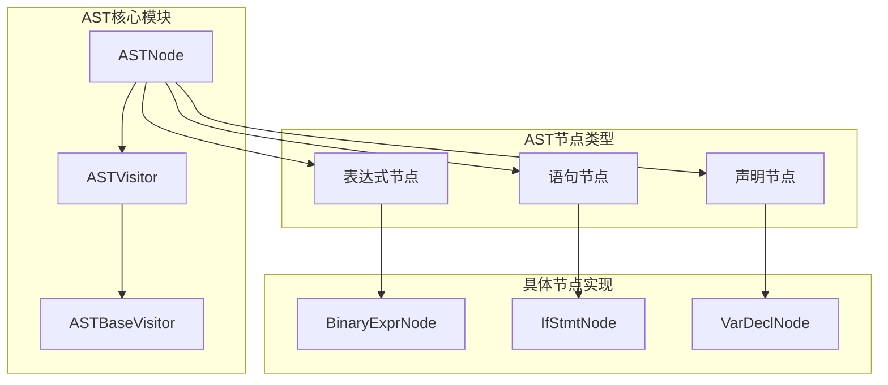
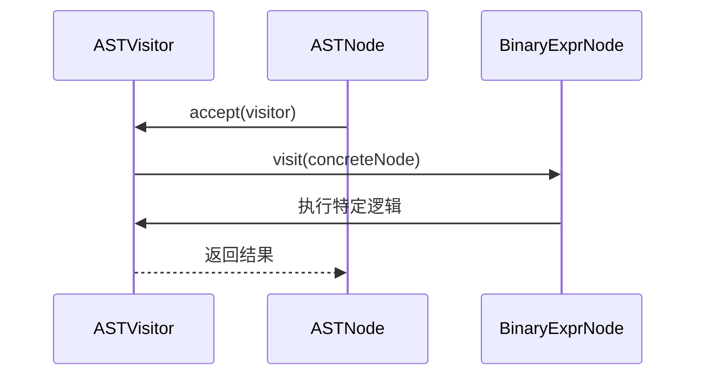
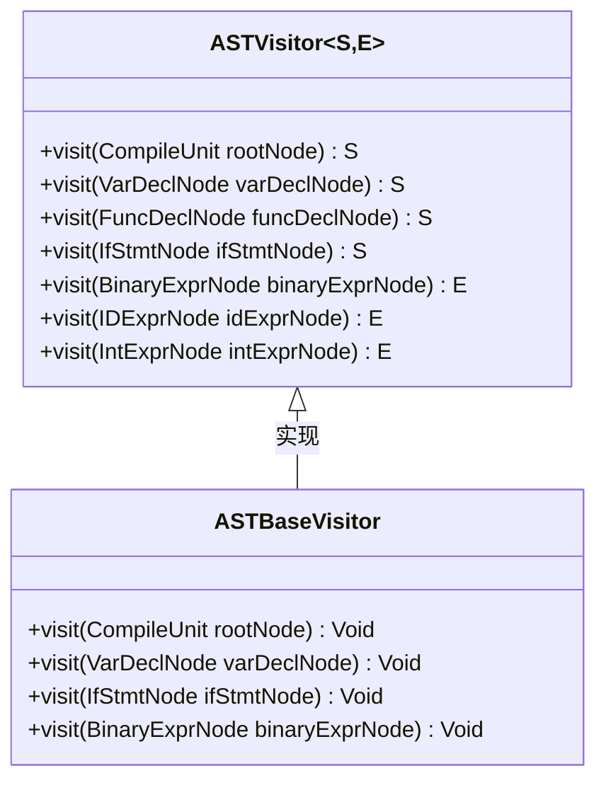
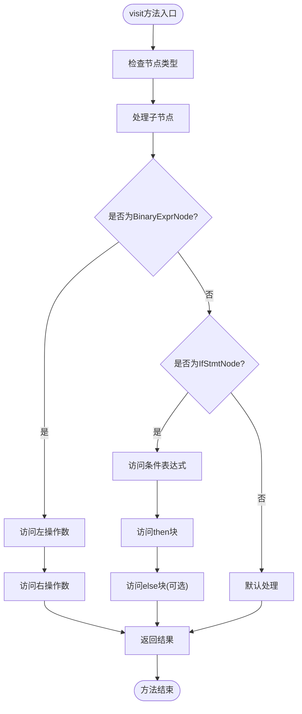
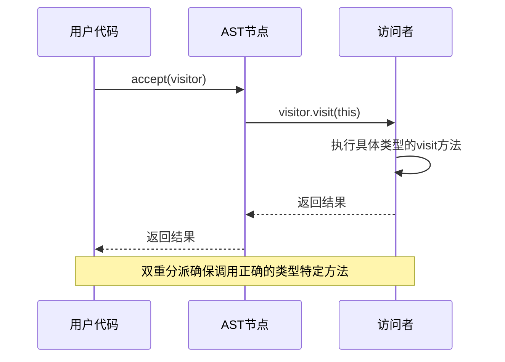
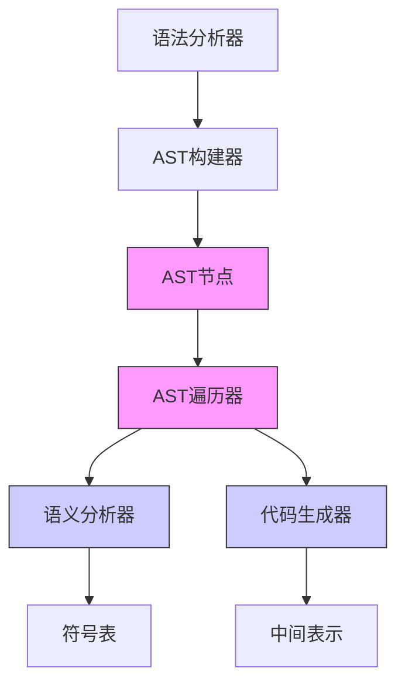

# AST遍历

<cite>
**本文档中引用的文件**
- [ASTVisitor.java](file://ep20/src/main/java/org/teachfx/antlr4/ep20/ast/ASTVisitor.java)
- [ASTBaseVisitor.java](file://ep20/src/main/java/org/teachfx/antlr4/ep20/pass/ast/ASTBaseVisitor.java)
- [ASTNode.java](file://ep20/src/main/java/org/teachfx/antlr4/ep20/ast/ASTNode.java)
- [BinaryExprNode.java](file://ep20/src/main/java/org/teachfx/antlr4/ep20/ast/expr/BinaryExprNode.java)
- [IfStmtNode.java](file://ep20/src/main/java/org/teachfx/antlr4/ep20/ast/stmt/IfStmtNode.java)
</cite>

## 目录
1. [简介](#简介)
2. [项目结构](#项目结构)
3. [核心组件](#核心组件)
4. [架构概述](#架构概述)
5. [详细组件分析](#详细组件分析)
6. [依赖分析](#依赖分析)
7. [性能考虑](#性能考虑)
8. [故障排除指南](#故障排除指南)
9. [结论](#结论)

## 简介
本文档详细介绍了抽象语法树（AST）遍历机制，重点阐述访问者模式在AST遍历中的应用。文档涵盖ASTVisitor接口的定义、ASTBaseVisitor的默认实现，以及双重分派机制如何实现类型安全的节点访问。通过实际代码示例展示如何实现自定义遍历器来执行语义分析、代码检查或AST转换。为初学者提供访问者模式的基本概念解释，为高级用户详细介绍遍历优化技术和多遍遍历器的设计模式。

## 项目结构
项目结构基于ANTLR4实现编程语言解析，包含多个演进阶段（ep1至ep21），每个阶段逐步增加语言特性和编译器功能。核心AST遍历机制在ep20阶段得到完整实现，包含AST节点定义、访问者接口和基础遍历器实现。

**Diagram sources**
- [ASTNode.java](file://ep20/src/main/java/org/teachfx/antlr4/ep20/ast/ASTNode.java)
- [ASTVisitor.java](file://ep20/src/main/java/org/teachfx/antlr4/ep20/ast/ASTVisitor.java)

**Section sources**
- [ASTNode.java](file://ep20/src/main/java/org/teachfx/antlr4/ep20/ast/ASTNode.java)
- [ASTVisitor.java](file://ep20/src/main/java/org/teachfx/antlr4/ep20/ast/ASTVisitor.java)

## 核心组件
核心组件包括AST节点基类、访问者接口和基础遍历器实现。ASTNode是所有AST节点的抽象基类，定义了基本属性和方法。ASTVisitor接口为所有节点类型定义了访问方法。ASTBaseVisitor提供了默认的遍历行为，可作为自定义遍历器的起点。

**Section sources**
- [ASTNode.java](file://ep20/src/main/java/org/teachfx/antlr4/ep20/ast/ASTNode.java)
- [ASTVisitor.java](file://ep20/src/main/java/org/teachfx/antlr4/ep20/ast/ASTVisitor.java)
- [ASTBaseVisitor.java](file://ep20/src/main/java/org/teachfx/antlr4/ep20/pass/ast/ASTBaseVisitor.java)

## 架构概述
AST遍历架构采用经典的访问者模式，通过双重分派机制实现类型安全的节点访问。当遍历器访问AST节点时，节点的accept方法调用遍历器的visit方法，从而确保调用正确的类型特定方法。

**Diagram sources**
- [ASTNode.java](file://ep20/src/main/java/org/teachfx/antlr4/ep20/ast/ASTNode.java)
- [ASTVisitor.java](file://ep20/src/main/java/org/teachfx/antlr4/ep20/ast/ASTVisitor.java)

## 详细组件分析

### ASTVisitor接口分析
ASTVisitor接口定义了对各种AST节点类型的访问方法，采用泛型S和E分别表示语句和表达式的返回类型。

**Diagram sources**
- [ASTVisitor.java](file://ep20/src/main/java/org/teachfx/antlr4/ep20/ast/ASTVisitor.java)
- [ASTBaseVisitor.java](file://ep20/src/main/java/org/teachfx/antlr4/ep20/pass/ast/ASTBaseVisitor.java)

### ASTBaseVisitor实现分析
ASTBaseVisitor提供了ASTVisitor接口的默认实现，为所有节点类型提供基础的遍历逻辑。

**Diagram sources**
- [ASTBaseVisitor.java](file://ep20/src/main/java/org/teachfx/antlr4/ep20/pass/ast/ASTBaseVisitor.java)

### 双重分派机制分析
双重分派机制确保在运行时调用正确的visit方法，实现类型安全的节点访问。

**Diagram sources**
- [ASTNode.java](file://ep20/src/main/java/org/teachfx/antlr4/ep20/ast/ASTNode.java)
- [ASTVisitor.java](file://ep20/src/main/java/org/teachfx/antlr4/ep20/ast/ASTVisitor.java)

**Section sources**
- [ASTNode.java](file://ep20/src/main/java/org/teachfx/antlr4/ep20/ast/ASTNode.java)
- [ASTVisitor.java](file://ep20/src/main/java/org/teachfx/antlr4/ep20/ast/ASTVisitor.java)
- [ASTBaseVisitor.java](file://ep20/src/main/java/org/teachfx/antlr4/ep20/pass/ast/ASTBaseVisitor.java)

## 依赖分析
AST遍历组件与其他编译器模块紧密协作，包括语法分析、语义分析和代码生成。

**Diagram sources**
- [ASTVisitor.java](file://ep20/src/main/java/org/teachfx/antlr4/ep20/ast/ASTVisitor.java)
- [ASTBaseVisitor.java](file://ep20/src/main/java/org/teachfx/antlr4/ep20/pass/ast/ASTBaseVisitor.java)

**Section sources**
- [ASTVisitor.java](file://ep20/src/main/java/org/teachfx/antlr4/ep20/ast/ASTVisitor.java)
- [ASTBaseVisitor.java](file://ep20/src/main/java/org/teachfx/antlr4/ep20/pass/ast/ASTBaseVisitor.java)

## 性能考虑
AST遍历的性能优化主要集中在减少方法调用开销和内存分配。通过避免不必要的对象创建和使用迭代而非递归可以提高性能。

## 故障排除指南
常见问题包括访问者方法未正确重写、节点类型检查失败和循环引用导致的栈溢出。

**Section sources**
- [ASTBaseVisitor.java](file://ep20/src/main/java/org/teachfx/antlr4/ep20/pass/ast/ASTBaseVisitor.java)
- [ASTNode.java](file://ep20/src/main/java/org/teachfx/antlr4/ep20/ast/ASTNode.java)

## 结论
AST遍历机制通过访问者模式实现了灵活且类型安全的树遍历。双重分派机制确保了运行时类型安全，而ASTBaseVisitor提供了可扩展的基础实现。这种设计模式使得添加新的分析或转换功能变得简单而安全。