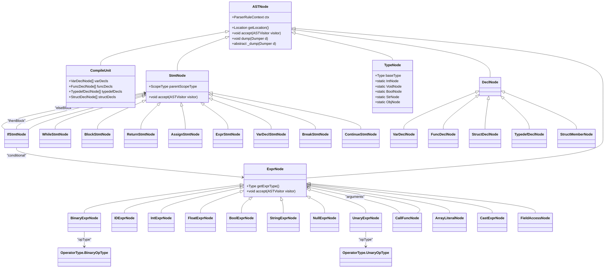
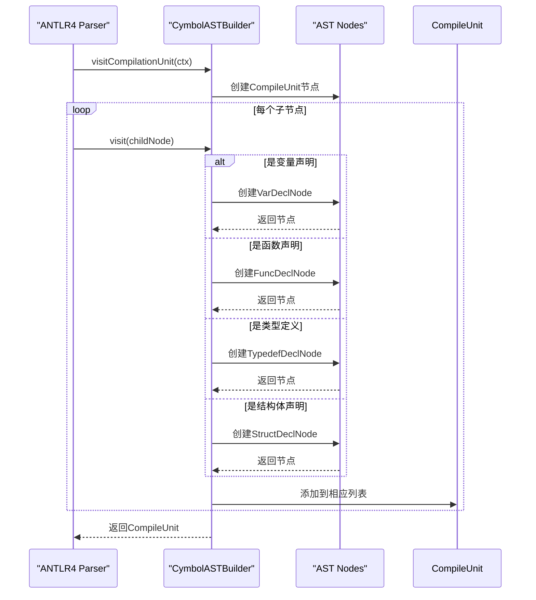
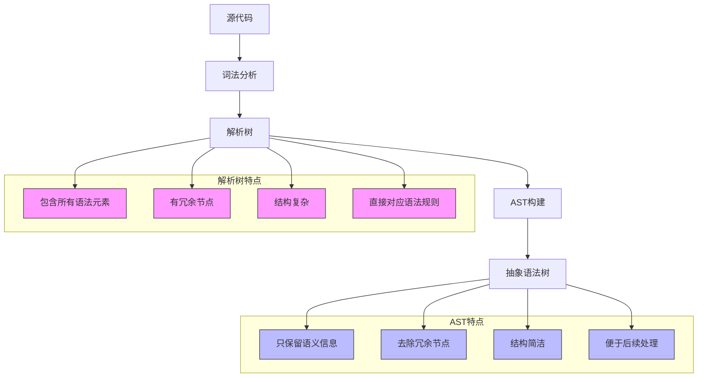
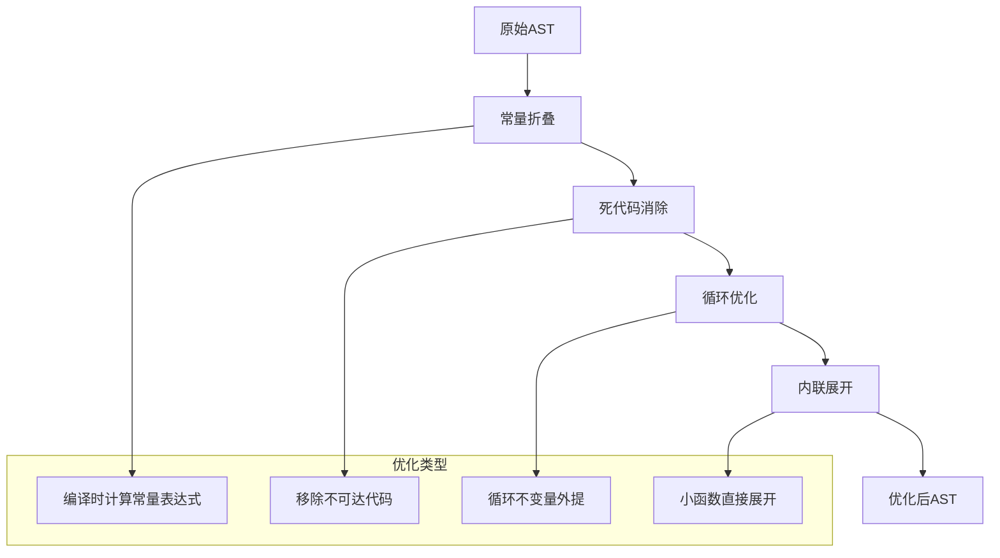

# 抽象语法树(AST)

<cite>
**本文档中引用的文件**
- [ASTNode.java](file://ep20/src/main/java/org/teachfx/antlr4/ep20/ast/ASTNode.java)
- [ASTVisitor.java](file://ep20/src/main/java/org/teachfx/antlr4/ep20/ast/ASTVisitor.java)
- [CymbolASTBuilder.java](file://ep20/src/main/java/org/teachfx/antlr4/ep20/pass/ast/CymbolASTBuilder.java)
- [BinaryExprNode.java](file://ep20/src/main/java/org/teachfx/antlr4/ep20/ast/expr/BinaryExprNode.java)
- [IfStmtNode.java](file://ep20/src/main/java/org/teachfx/antlr4/ep20/ast/stmt/IfStmtNode.java)
- [CallFuncNode.java](file://ep20/src/main/java/org/teachfx/antlr4/ep20/ast/expr/CallFuncNode.java)
</cite>

## 目录
1. [简介](#简介)
2. [AST节点类型体系](#ast节点类型体系)
3. [ASTNode基类设计](#astnode基类设计)
4. [AST构建过程](#ast构建过程)
5. [AST遍历机制](#ast遍历机制)
6. [具体节点实现示例](#具体节点实现示例)
7. [AST与解析树的区别](#ast与解析树的区别)
8. [高级主题](#高级主题)
9. [结论](#结论)

## 简介
抽象语法树（Abstract Syntax Tree, AST）是编译器和解释器中的核心数据结构，用于表示源代码的语法结构。与解析树相比，AST去除了语法分析中的冗余信息，只保留程序的语义结构。本文档详细介绍了基于ANTLR4的AST实现，重点分析节点类型、构建过程和遍历机制。

## AST节点类型体系



**图示来源**
- [ASTNode.java](file://ep20/src/main/java/org/teachfx/antlr4/ep20/ast/ASTNode.java)
- [expr包](file://ep20/src/main/java/org/teachfx/antlr4/ep20/ast/expr/)
- [stmt包](file://ep20/src/main/java/org/teachfx/antlr4/ep20/ast/stmt/)
- [decl包](file://ep20/src/main/java/org/teachfx/antlr4/ep20/ast/decl/)

**本节来源**
- [ASTNode.java](file://ep20/src/main/java/org/teachfx/antlr4/ep20/ast/ASTNode.java)
- [ASTVisitor.java](file://ep20/src/main/java/org/teachfx/antlr4/ep20/ast/ASTVisitor.java)

## ASTNode基类设计

`ASTNode`是所有AST节点的基类，定义了AST节点的基本属性和行为。该类是抽象类，所有具体的AST节点都继承自它。

```mermaid
classDiagram
class ASTNode {
+ParserRuleContext ctx
+Location getLocation()
+void accept(ASTVisitor visitor)
+void dump(Dumper d)
+abstract _dump(Dumper d)
}
note right of ASTNode
基类设计特点：
1. 封装了ANTLR4的ParserRuleContext
2. 提供了位置信息获取功能
3. 实现了访问者模式的accept方法
4. 提供了调试输出功能
end
```

**图示来源**
- [ASTNode.java](file://ep20/src/main/java/org/teachfx/antlr4/ep20/ast/ASTNode.java)

**本节来源**
- [ASTNode.java](file://ep20/src/main/java/org/teachfx/antlr4/ep20/ast/ASTNode.java)

## AST构建过程

AST的构建过程由`CymbolASTBuilder`类完成，该类继承自ANTLR4生成的`CymbolBaseVisitor`，实现了从解析树到AST的转换。



**图示来源**
- [CymbolASTBuilder.java](file://ep20/src/main/java/org/teachfx/antlr4/ep20/pass/ast/CymbolASTBuilder.java)

**本节来源**
- [CymbolASTBuilder.java](file://ep20/src/main/java/org/teachfx/antlr4/ep20/pass/ast/CymbolASTBuilder.java)

## AST遍历机制

AST的遍历采用访问者模式（Visitor Pattern），通过`ASTVisitor`接口定义了对各种节点的访问方法。

```mermaid
classDiagram
class ASTVisitor~S,E~ {
+S visit(CompileUnit rootNode)
+S visit(VarDeclNode varDeclNode)
+S visit(FuncDeclNode funcDeclNode)
+E visit(BinaryExprNode binaryExprNode)
+E visit(IDExprNode idExprNode)
+S visit(IfStmtNode ifStmtNode)
+S visit(WhileStmtNode whileStmtNode)
+default E visit(ExprNode node)
+default S visit(StmtNode node)
}
class CymbolASTVisitor {
+Object visit(CompileUnit node)
+Object visit(VarDeclNode node)
+Object visit(FuncDeclNode node)
+Object visit(BinaryExprNode node)
+Object visit(IfStmtNode node)
}
class EvalExprVisitor {
+Integer visit(BinaryExprNode node)
+Integer visit(IntExprNode node)
+Boolean visit(BoolExprNode node)
}
ASTVisitor <|.. CymbolASTVisitor
ASTVisitor <|.. EvalExprVisitor
note right of ASTVisitor
泛型设计：
- S : 语句节点返回类型
- E : 表达式节点返回类型
支持不同遍历器返回不同类型
end
```

**图示来源**
- [ASTVisitor.java](file://ep20/src/main/java/org/teachfx/antlr4/ep20/ast/ASTVisitor.java)

**本节来源**
- [ASTVisitor.java](file://ep20/src/main/java/org/teachfx/antlr4/ep20/ast/ASTVisitor.java)

## 具体节点实现示例

### 二元表达式节点

`BinaryExprNode`表示二元操作表达式，如加法、减法等。

```mermaid
classDiagram
class BinaryExprNode {
-BinaryOpType opType
-ExprNode lhs
-ExprNode rhs
+BinaryExprNode(opType, lhs, rhs, ctx)
+createAddNode(lhs, rhs, ctx)
+createMinNode(lhs, rhs, ctx)
+createMulNode(lhs, rhs, ctx)
+createDivNode(lhs, rhs, ctx)
+getExprType()
+accept(ASTVisitor visitor)
+_dump(Dumper d)
}
BinaryExprNode --> ExprNode : "继承"
BinaryExprNode --> BinaryOpType : "opType"
BinaryExprNode --> ExprNode : "lhs"
BinaryExprNode --> ExprNode : "rhs"
note right of BinaryExprNode
关键特性：
1. 封装了操作符类型
2. 包含左右操作数
3. 提供了工厂方法简化创建
4. 实现了类型推断
end
```

**图示来源**
- [BinaryExprNode.java](file://ep20/src/main/java/org/teachfx/antlr4/ep20/ast/expr/BinaryExprNode.java)

**本节来源**
- [BinaryExprNode.java](file://ep20/src/main/java/org/teachfx/antlr4/ep20/ast/expr/BinaryExprNode.java)

### 控制流语句节点

`IfStmtNode`表示if-else控制流语句。

```mermaid
classDiagram
class IfStmtNode {
-ExprNode conditionalNode
-StmtNode thenBlock
-StmtNode elseBlock
+IfStmtNode(cond, then, else, ctx)
+getCondExpr()
+getThenBlock()
+getElseBlock()
+accept(ASTVisitor visitor)
+_dump(Dumper d)
}
IfStmtNode --> ExprNode : "conditional"
IfStmtNode --> StmtNode : "thenBlock"
IfStmtNode --> StmtNode : "elseBlock"
note right of IfStmtNode
设计要点：
1. 条件表达式为必选
2. then分支为必选
3. else分支为可选使用Optional包装
4. 支持嵌套控制流
end
```

**图示来源**
- [IfStmtNode.java](file://ep20/src/main/java/org/teachfx/antlr4/ep20/ast/stmt/IfStmtNode.java)

**本节来源**
- [IfStmtNode.java](file://ep20/src/main/java/org/teachfx/antlr4/ep20/ast/stmt/IfStmtNode.java)

### 函数调用节点

`CallFuncNode`表示函数调用表达式。

```mermaid
classDiagram
class CallFuncNode {
-String funcName
-ExprNode[] arguments
+CallFuncNode(funcName, args, ctx)
+getFuncName()
+getArguments()
+accept(ASTVisitor visitor)
+_dump(Dumper d)
}
CallFuncNode --> ExprNode : "继承"
CallFuncNode --> ExprNode : "arguments"
note right of CallFuncNode
实现细节：
1. 存储函数名称
2. 存储参数表达式列表
3. 参数按顺序求值
4. 支持零个或多个参数
end
```

**图示来源**
- [CallFuncNode.java](file://ep20/src/main/java/org/teachfx/antlr4/ep20/ast/expr/CallFuncNode.java)

**本节来源**
- [CallFuncNode.java](file://ep20/src/main/java/org/teachfx/antlr4/ep20/ast/expr/CallFuncNode.java)

## AST与解析树的区别



**图示来源**
- [CymbolASTBuilder.java](file://ep20/src/main/java/org/teachfx/antlr4/ep20/pass/ast/CymbolASTBuilder.java)

**本节来源**
- [CymbolASTBuilder.java](file://ep20/src/main/java/org/teachfx/antlr4/ep20/pass/ast/CymbolASTBuilder.java)

## 高级主题

### AST优化技术



**本节来源**
- [CymbolASTBuilder.java](file://ep20/src/main/java/org/teachfx/antlr4/ep20/pass/ast/CymbolASTBuilder.java)

### 自定义遍历器开发

```mermaid
classDiagram
class ASTVisitor~S,E~ {
<<interface>>
+S visit(CompileUnit rootNode)
+E visit(BinaryExprNode binaryExprNode)
+S visit(IfStmtNode ifStmtNode)
}
class TypeChecker {
+Type visit(BinaryExprNode node)
+Type visit(IDExprNode node)
+Type visit(CallFuncNode node)
}
class CodeGenerator {
+String visit(BinaryExprNode node)
+String visit(IfStmtNode node)
+String visit(WhileStmtNode node)
}
class ASTDumper {
+Void visit(BinaryExprNode node)
+Void visit(IfStmtNode node)
+Void visit(VarDeclNode node)
}
ASTVisitor <|.. TypeChecker
ASTVisitor <|.. CodeGenerator
ASTVisitor <|.. ASTDumper
note right of TypeChecker
类型检查器：
- 验证表达式类型兼容性
- 检查函数调用参数
- 报告类型错误
end
note right of CodeGenerator
代码生成器：
- 生成目标代码
- 处理控制流转换
- 管理变量存储
end
note right of ASTDumper
AST转储器：
- 生成AST可视化
- 调试信息输出
- 结构验证
end
```

**图示来源**
- [ASTVisitor.java](file://ep20/src/main/java/org/teachfx/antlr4/ep20/ast/ASTVisitor.java)

**本节来源**
- [ASTVisitor.java](file://ep20/src/main/java/org/teachfx/antlr4/ep20/ast/ASTVisitor.java)

## 结论
抽象语法树是编译器架构中的关键组件，它将源代码转换为便于分析和处理的树形结构。通过`ASTNode`基类和继承体系，实现了类型安全的节点表示；通过`CymbolASTBuilder`，完成了从ANTLR4解析树到AST的转换；通过访问者模式，提供了灵活的遍历机制。这种设计既保持了代码的清晰性，又提供了足够的扩展性，为后续的语义分析、优化和代码生成奠定了坚实基础。