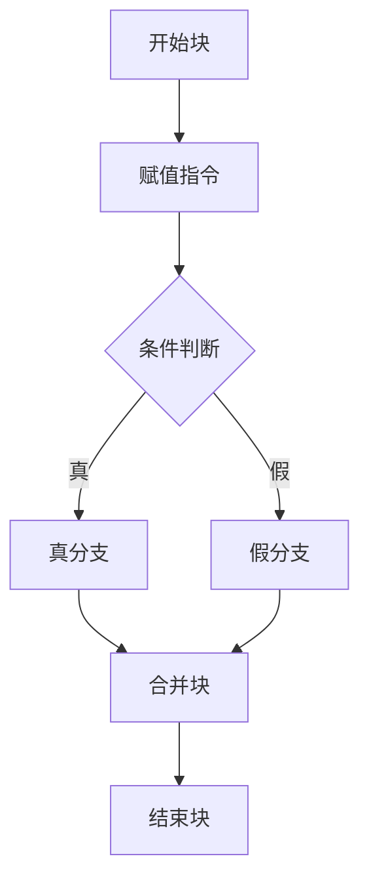

# 基本块

<cite>
**本文档中引用的文件**
- [BasicBlock.java](file://ep20/src/main/java/org/teachfx/antlr4/ep20/pass/cfg/BasicBlock.java)
- [CFG.java](file://ep20/src/main/java/org/teachfx/antlr4/ep20/pass/cfg/CFG.java)
- [CFGBuilder.java](file://ep20/src/main/java/org/teachfx/antlr4/ep20/pass/cfg/CFGBuilder.java)
- [LinearIRBlock.java](file://ep20/src/main/java/org/teachfx/antlr4/ep20/pass/cfg/LinearIRBlock.java)
- [BasicBlockTest.java](file://ep20/src/test/java/org/teachfx/antlr4/ep20/pass/cfg/BasicBlockTest.java)
</cite>

## 目录
1. [简介](#简介)
2. [基本块设计原理](#基本块设计原理)
3. [基本块划分算法](#基本块划分算法)
4. [入口/出口节点识别机制](#入口出口节点识别机制)
5. [IR指令列表管理](#ir指令列表管理)
6. [前驱块与后继块管理](#前驱块与后继块管理)
7. [基本块转换示例](#基本块转换示例)
8. [控制流分析中的作用](#控制流分析中的作用)
9. [优化技术](#优化技术)
10. [性能考虑](#性能考虑)

## 简介
基本块是编译器优化和控制流分析中的核心概念，作为程序执行的最小单位，它具有单一入口和单一出口的特性。在本项目中，基本块的实现主要位于`ep20`模块的`pass/cfg`包中，通过`BasicBlock`类来表示。该类封装了中间表示（IR）指令序列，并提供了对控制流图（CFG）中节点关系的管理功能。基本块的设计不仅支持传统的线性执行路径，还能够处理分支、跳转等复杂控制流结构，为后续的数据流分析和代码优化奠定了基础。

## 基本块设计原理
`BasicBlock`类的设计遵循了编译器中间表示的标准实践，其核心属性包括唯一标识符`id`、指令序列`codes`、块类型`kind`以及关联的标签`label`。每个基本块通过`id`进行唯一标识，便于在控制流图中进行快速查找和引用。指令序列`codes`存储了该块内的所有IR指令，这些指令按照程序执行顺序排列，确保了块内指令的线性执行特性。块类型`kind`用于区分不同类型的结束指令，如连续执行、条件跳转、无条件跳转或返回指令，这有助于编译器在生成控制流图时正确处理分支逻辑。标签`label`则用于标记基本块的起始位置，通常在生成汇编代码或进行调试时使用。此外，`BasicBlock`类还实现了`Comparable`接口，允许根据`id`对基本块进行排序，这在遍历控制流图时非常有用。

**Section sources**
- [BasicBlock.java](file://ep20/src/main/java/org/teachfx/antlr4/ep20/pass/cfg/BasicBlock.java#L15-L41)

## 基本块划分算法
基本块的划分算法基于线性IR序列，通过识别跳转指令和标签来确定基本块的边界。在`LinearIRBlock`类中，每条IR指令的添加都会触发对块类型`kind`的更新，当遇到`CJMP`（条件跳转）、`JMP`（无条件跳转）或`ReturnVal`（返回值）指令时，当前块的类型会被设置为相应的结束类型。`CFGBuilder`类负责构建控制流图，它通过递归遍历`LinearIRBlock`的后继块来生成基本块。在构建过程中，`buildFromLinearBlock`静态方法将`LinearIRBlock`转换为`BasicBlock`实例，同时保留了原始的指令序列和标签信息。对于跳转指令，`CFGBuilder`会创建相应的边连接，确保控制流图的完整性。这种划分算法能够准确地捕捉程序的控制流结构，为后续的优化和分析提供可靠的基础。

**Section sources**
- [LinearIRBlock.java](file://ep20/src/main/java/org/teachfx/antlr4/ep20/pass/cfg/LinearIRBlock.java#L150-L180)
- [CFGBuilder.java](file://ep20/src/main/java/org/teachfx/antlr4/ep20/pass/cfg/CFGBuilder.java#L20-L63)

## 入口/出口节点识别机制
入口和出口节点的识别是构建控制流图的关键步骤。在`CFG`类中，通过`nodes`列表和`edges`列表来维护基本块之间的连接关系。每个基本块的入口由其`id`和`label`共同标识，而出口则由其结束指令的类型决定。`getFrontier`方法用于获取指定节点的所有前驱节点，而`getSucceed`方法则用于获取所有后继节点。这些方法通过内部的`links`列表进行高效查询，该列表存储了每个节点的前驱和后继集合。在`CFGBuilder`的构建过程中，每当遇到跳转指令时，就会在`edges`列表中添加一条新的边，并更新相关节点的`links`信息。这种机制确保了控制流图的正确性和完整性，使得编译器能够准确地追踪程序的执行路径。

**Section sources**
- [CFG.java](file://ep20/src/main/java/org/teachfx/antlr4/ep20/pass/cfg/CFG.java#L50-L90)
- [CFGBuilder.java](file://ep20/src/main/java/org/teachfx/antlr4/ep20/pass/cfg/CFGBuilder.java#L40-L63)

## IR指令列表管理
`BasicBlock`类中的`codes`字段是一个`List<Loc<I>>`类型的列表，用于存储该块内的所有IR指令。`Loc`类封装了指令及其位置信息，使得编译器能够在生成代码或进行调试时准确地定位每条指令。`BasicBlock`提供了多种方法来操作指令列表，如`iterator`用于正向遍历指令，`backwardIterator`用于反向遍历，`allSeq`返回所有指令序列，`dropLabelSeq`返回除标签外的所有指令。这些方法为编译器的各个阶段提供了灵活的指令访问接口。此外，`getIRNodes`方法通过`StreamUtils.flatMap`将`Loc`列表转换为`IRNode`流，便于进行函数式编程操作。这种设计既保证了指令的有序性，又提供了高效的访问和操作能力。

**Section sources**
- [BasicBlock.java](file://ep20/src/main/java/org/teachfx/antlr4/ep20/pass/cfg/BasicBlock.java#L70-L100)

## 前驱块与后继块管理
前驱块和后继块的管理是控制流分析的核心。在`CFG`类中，`links`列表存储了每个节点的前驱和后继集合，通过`Pair<Set<Integer>, Set<Integer>>`结构实现。`getFrontier`和`getSucceed`方法分别用于获取指定节点的前驱和后继集合，这些集合在构建控制流图时被动态更新。`LinearIRBlock`类中的`successors`和`predecessors`列表直接维护了块之间的连接关系，`setLink`方法用于建立两个块之间的双向链接。这种设计使得编译器能够高效地查询和修改控制流图的结构，支持各种数据流分析算法的实现。例如，在进行活跃变量分析时，编译器可以通过遍历前驱和后继集合来传播变量的活跃信息。

**Section sources**
- [CFG.java](file://ep20/src/main/java/org/teachfx/antlr4/ep20/pass/cfg/CFG.java#L30-L50)
- [LinearIRBlock.java](file://ep20/src/main/java/org/teachfx/antlr4/ep20/pass/cfg/LinearIRBlock.java#L60-L80)

## 基本块转换示例
从线性IR序列到基本块的转换过程可以通过`BasicBlock.buildFromLinearBlock`方法来实现。该静态方法接收一个`LinearIRBlock`实例和一个缓存节点列表，返回一个对应的`BasicBlock`实例。转换过程中，`LinearIRBlock`的指令序列被映射到`BasicBlock`的`codes`列表中，同时保留了原始的标签和序号信息。对于跳转指令，`CFGBuilder`会在构建控制流图时自动处理，创建相应的边连接。例如，当遇到`JMP`指令时，`CFGBuilder`会添加一条从当前块到目标块的边，并设置适当的权重。这种转换机制确保了IR指令的完整性和控制流的正确性，为后续的优化和代码生成提供了坚实的基础。

**Diagram sources**
- [BasicBlock.java](file://ep20/src/main/java/org/teachfx/antlr4/ep20/pass/cfg/BasicBlock.java#L45-L55)
- [CFGBuilder.java](file://ep20/src/main/java/org/teachfx/antlr4/ep20/pass/cfg/CFGBuilder.java#L30-L40)

## 控制流分析中的作用
基本块在控制流分析中扮演着至关重要的角色。通过将程序分解为一系列基本块，编译器可以更有效地进行各种静态分析，如活跃变量分析、到达定义分析和支配关系分析。`BasicBlock`类中的`def`、`liveUse`、`liveIn`和`liveOut`集合专门用于支持数据流分析，它们分别表示该块中定义的变量、使用的变量、入口处的活跃变量和出口处的活跃变量。这些信息对于优化编译器的性能至关重要，例如，在进行常量传播或死代码消除时，编译器需要准确地知道哪些变量在何时是活跃的。此外，基本块的结构还支持循环检测和优化，通过识别回边和循环头，编译器可以应用循环不变代码外提等高级优化技术。

**Section sources**
- [BasicBlock.java](file://ep20/src/main/java/org/teachfx/antlr4/ep20/pass/cfg/BasicBlock.java#L20-L30)
- [CFG.java](file://ep20/src/main/java/org/teachfx/antlr4/ep20/pass/cfg/CFG.java#L100-L120)

## 优化技术
基本块的优化技术主要包括空块消除和冗余块合并。`BasicBlock`类提供了`isEmpty`方法来检测空块，`mergeNearBlock`方法用于合并相邻的基本块。当一个基本块为空或仅包含跳转指令时，编译器可以将其从控制流图中移除，从而简化程序结构。`mergeNearBlock`方法通过移除当前块的最后一条跳转指令，并将下一个块的指令序列（除标签外）合并到当前块中，实现块的合并。这种优化可以减少不必要的跳转，提高代码的执行效率。此外，`CFG`类还支持添加和应用各种优化器，通过`addOptimizer`和`applyOptimizers`方法，编译器可以灵活地组合不同的优化策略，实现更复杂的优化目标。

**Section sources**
- [BasicBlock.java](file://ep20/src/main/java/org/teachfx/antlr4/ep20/pass/cfg/BasicBlock.java#L110-L130)
- [CFG.java](file://ep20/src/main/java/org/teachfx/antlr4/ep20/pass/cfg/CFG.java#L150-L160)

## 性能考虑
在实现基本块和控制流图时，性能是一个重要的考虑因素。`BasicBlock`和`CFG`类的设计尽量减少了内存分配和对象创建的开销，例如，`codes`列表在构造时就被初始化为`ArrayList`，避免了后续的扩容操作。`links`列表使用`TreeSet`来存储前驱和后继集合，虽然插入和查询操作的时间复杂度为O(log n)，但保证了集合的有序性和唯一性，这对于后续的分析算法非常有利。此外，`CFGBuilder`在构建控制流图时使用了缓存机制，避免了重复处理相同的`LinearIRBlock`。这些设计选择在保证功能正确性的同时，尽可能地提高了编译器的运行效率，使其能够处理大规模的程序代码。

**Section sources**
- [BasicBlock.java](file://ep20/src/main/java/org/teachfx/antlr4/ep20/pass/cfg/BasicBlock.java#L10-L20)
- [CFG.java](file://ep20/src/main/java/org/teachfx/antlr4/ep20/pass/cfg/CFG.java#L40-L60)