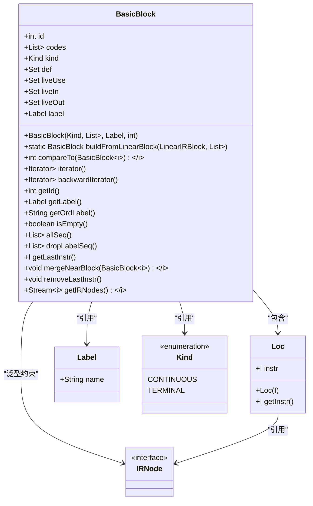
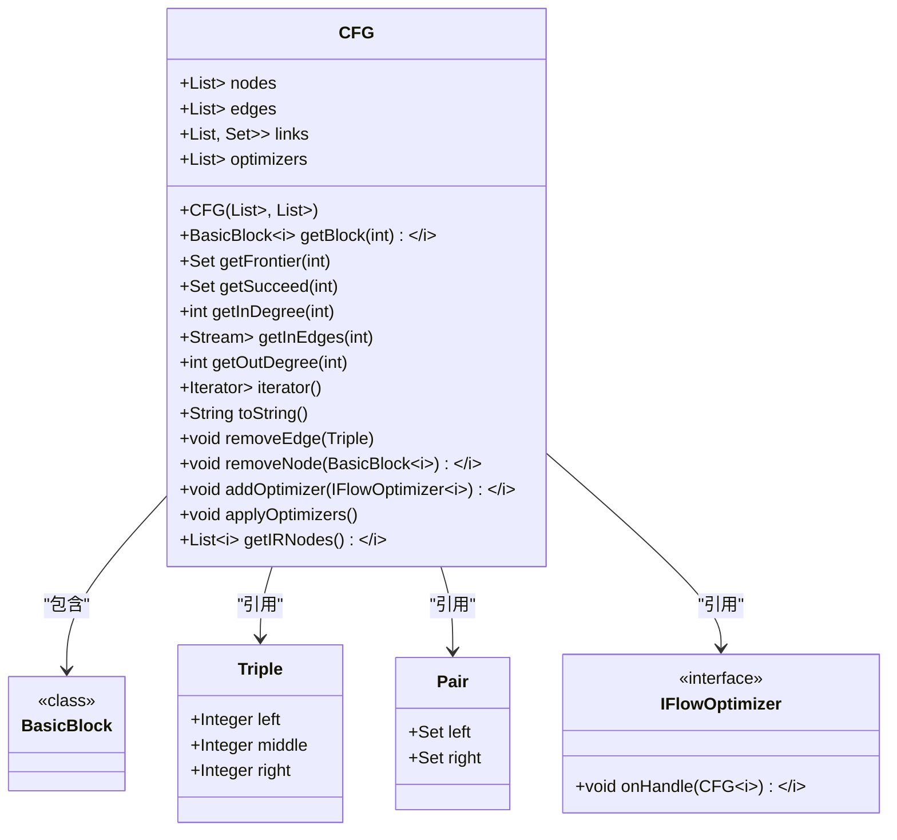
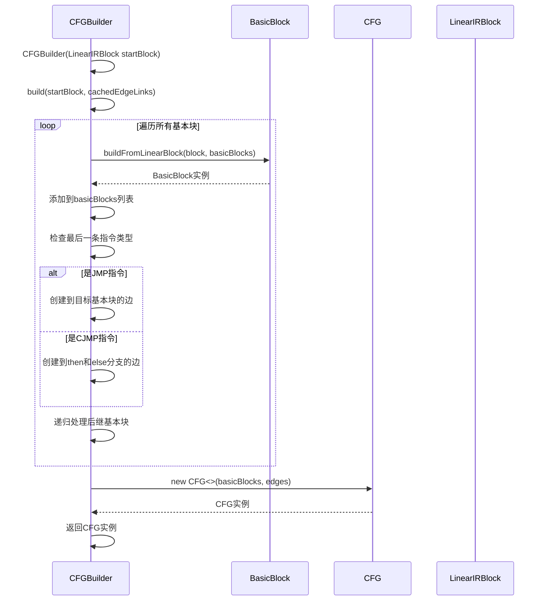
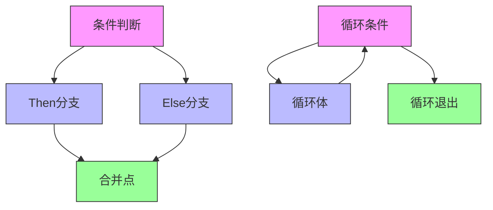
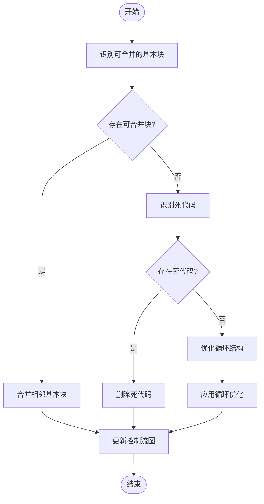

# 控制流图(CFG)

<cite>
**本文档中引用的文件**   
- [BasicBlock.java](file://ep20/src/main/java/org/teachfx/antlr4/ep20/pass/cfg/BasicBlock.java)
- [CFG.java](file://ep20/src/main/java/org/teachfx/antlr4/ep20/pass/cfg/CFG.java)
- [CFGBuilder.java](file://ep20/src/main/java/org/teachfx/antlr4/ep20/pass/cfg/CFGBuilder.java)
- [ControlFlowAnalysis.java](file://ep20/src/main/java/org/teachfx/antlr4/ep20/pass/cfg/ControlFlowAnalysis.java)
- [LivenessAnalysis.java](file://ep20/src/main/java/org/teachfx/antlr4/ep20/pass/cfg/LivenessAnalysis.java)
- [LinearIRBlock.java](file://ep20/src/main/java/org/teachfx/antlr4/ep20/pass/cfg/LinearIRBlock.java)
</cite>

## 目录
1. [简介](#简介)
2. [基本块划分](#基本块划分)
3. [控制流边构建](#控制流边构建)
4. [数据流分析机制](#数据流分析机制)
5. [BasicBlock类设计](#basicblock类设计)
6. [CFG类结构](#cfg类结构)
7. [CFGBuilder构建过程](#cfgbuilder构建过程)
8. [控制结构的CFG构建示例](#控制结构的cfg构建示例)
9. [入口/出口节点识别](#入口/出口节点识别)
10. [跳转指令处理](#跳转指令处理)
11. [复杂控制流处理](#复杂控制流处理)
12. [CFG优化技术](#cfg优化技术)

## 简介
控制流图（Control Flow Graph, CFG）是编译器优化和程序分析中的核心数据结构，用于表示程序执行路径的图形化表示。CFG将程序代码分解为基本块，并通过有向边表示控制流转移。本文档详细介绍了CFG的基本块划分、控制流边构建和数据流分析机制，重点说明BasicBlock类的设计和基本块划分算法，解释CFG类如何组织基本块集合和控制流边关系，描述CFGBuilder从线性IR生成控制流图的过程，并提供实际代码示例展示各种控制结构的CFG构建过程。

## 基本块划分
基本块（Basic Block）是程序中一个连续的指令序列，具有单一入口和单一出口，且执行时从入口到出口的路径是唯一的。基本块划分算法将线性中间表示（IR）代码分割为多个基本块，每个基本块包含一组连续的指令，这些指令在执行时不会被中断。基本块的划分遵循以下规则：指令序列的开始是程序的入口点或跳转目标，指令序列的结束是跳转指令或其前一条指令。通过这种方式，程序被分解为一系列基本块，为后续的控制流分析和优化提供基础。

**节来源**
- [BasicBlock.java](file://ep20/src/main/java/org/teachfx/antlr4/ep20/pass/cfg/BasicBlock.java#L15-L130)
- [LinearIRBlock.java](file://ep20/src/main/java/org/teachfx/antlr4/ep20/pass/cfg/LinearIRBlock.java)

## 控制流边构建
控制流边（Control Flow Edge）表示程序执行路径中基本块之间的转移关系。控制流边的构建基于基本块中最后一条指令的类型：如果最后一条指令是无条件跳转（JMP），则创建一条从当前基本块到目标基本块的边；如果是条件跳转（CJMP），则创建两条边，分别指向then分支和else分支的目标基本块。控制流边的权重用于表示不同类型的控制流转移，无条件跳转的权重为5，条件跳转的权重为10。通过遍历所有基本块并根据其最后一条指令创建相应的控制流边，最终形成完整的控制流图。

**节来源**
- [CFGBuilder.java](file://ep20/src/main/java/org/teachfx/antlr4/ep20/pass/cfg/CFGBuilder.java#L9-L62)
- [CFG.java](file://ep20/src/main/java/org/teachfx/antlr4/ep20/pass/cfg/CFG.java#L17-L157)

## 数据流分析机制
数据流分析（Data Flow Analysis）是编译器优化的重要技术，用于收集程序执行过程中变量的定义和使用信息。在CFG中，数据流分析通过遍历基本块并计算每个基本块的def（定义）集合、liveUse（活跃使用）集合、liveIn（入口活跃）集合和liveOut（出口活跃）集合来实现。这些集合用于确定变量在程序执行过程中的活跃性，为后续的寄存器分配和死代码消除等优化提供依据。数据流分析通常采用迭代算法，从出口基本块开始反向传播活跃信息，直到所有基本块的活跃集合收敛。

**节来源**
- [LivenessAnalysis.java](file://ep20/src/main/java/org/teachfx/antlr4/ep20/pass/cfg/LivenessAnalysis.java#L0-L147)
- [BasicBlock.java](file://ep20/src/main/java/org/teachfx/antlr4/ep20/pass/cfg/BasicBlock.java#L15-L130)

## BasicBlock类设计
BasicBlock类是控制流图中的基本组成单元，用于表示程序中的一个基本块。该类包含基本块的唯一标识符（id）、指令序列（codes）、基本块类型（kind）以及用于数据流分析的def、liveUse、liveIn和liveOut集合。BasicBlock类提供了多种方法来操作基本块，如获取基本块ID、获取标签、检查基本块是否为空、获取指令迭代器等。此外，BasicBlock类还支持向前和向后遍历指令序列，以及合并相邻基本块的功能。通过静态工厂方法buildFromLinearBlock，可以从线性IR块构建基本块实例。

**图来源**
- [BasicBlock.java](file://ep20/src/main/java/org/teachfx/antlr4/ep20/pass/cfg/BasicBlock.java#L15-L130)

**节来源**
- [BasicBlock.java](file://ep20/src/main/java/org/teachfx/antlr4/ep20/pass/cfg/BasicBlock.java#L15-L130)

## CFG类结构
CFG类是控制流图的核心数据结构，用于组织和管理基本块集合及其控制流关系。该类包含基本块列表（nodes）、控制流边列表（edges）以及用于快速查询前驱和后继节点的链接结构（links）。CFG类提供了多种方法来查询和操作控制流图，如获取指定ID的基本块、获取节点的前驱集合、获取节点的后继集合、获取节点的入度和出度等。此外，CFG类还支持添加和应用控制流优化器，以及生成控制流图的DOT格式表示。通过这些方法，CFG类为程序分析和优化提供了完整的接口。

**图来源**
- [CFG.java](file://ep20/src/main/java/org/teachfx/antlr4/ep20/pass/cfg/CFG.java#L17-L157)

**节来源**
- [CFG.java](file://ep20/src/main/java/org/teachfx/antlr4/ep20/pass/cfg/CFG.java#L17-L157)

## CFGBuilder构建过程
CFGBuilder类负责从线性中间表示（IR）构建控制流图。构建过程从起始基本块开始，递归遍历所有可达的基本块。对于每个基本块，首先创建对应的BasicBlock实例并添加到节点列表中，然后根据基本块的最后一条指令类型创建相应的控制流边。如果最后一条指令是无条件跳转（JMP），则创建一条到目标基本块的边；如果是条件跳转（CJMP），则创建两条边分别指向then分支和else分支的目标基本块。最后，递归处理所有后继基本块，确保所有可达的基本块都被包含在控制流图中。通过这种方式，CFGBuilder将线性IR转换为图形化的控制流表示。

**图来源**
- [CFGBuilder.java](file://ep20/src/main/java/org/teachfx/antlr4/ep20/pass/cfg/CFGBuilder.java#L9-L62)

**节来源**
- [CFGBuilder.java](file://ep20/src/main/java/org/teachfx/antlr4/ep20/pass/cfg/CFGBuilder.java#L9-L62)

## 控制结构的CFG构建示例
控制流图能够准确表示各种控制结构的执行路径。对于if-else语句，控制流图包含一个条件判断基本块，该基本块有两个后继：一个指向then分支的基本块，另一个指向else分支的基本块。then分支和else分支的基本块最终都指向合并点基本块。对于while循环，控制流图包含一个循环条件基本块，该基本块有两个后继：一个指向循环体基本块，另一个指向循环退出点。循环体基本块的最后一条指令是无条件跳转回循环条件基本块，形成循环结构。通过这些图形化表示，可以清晰地看到程序的执行路径和控制流转移。

**图来源**
- [CFGBuilder.java](file://ep20/src/main/java/org/teachfx/antlr4/ep20/pass/cfg/CFGBuilder.java#L9-L62)
- [CFG.java](file://ep20/src/main/java/org/teachfx/antlr4/ep20/pass/cfg/CFG.java#L17-L157)

## 入口/出口节点识别
入口节点和出口节点是控制流图中的特殊节点，分别表示程序的开始和结束。入口节点是控制流图中唯一没有前驱的基本块，通常是程序的起始基本块。出口节点是控制流图中没有后继的基本块，通常是包含return语句或程序结束指令的基本块。在CFG中，可以通过检查基本块的前驱集合和后继集合来识别入口和出口节点：前驱集合为空的基本块是入口节点，后继集合为空的基本块是出口节点。正确识别入口和出口节点对于程序分析和优化至关重要，因为它们定义了程序执行的起点和终点。

**节来源**
- [CFG.java](file://ep20/src/main/java/org/teachfx/antlr4/ep20/pass/cfg/CFG.java#L17-L157)
- [BasicBlock.java](file://ep20/src/main/java/org/teachfx/antlr4/ep20/pass/cfg/BasicBlock.java#L15-L130)

## 跳转指令处理
跳转指令是控制流转移的关键，正确处理跳转指令对于构建准确的控制流图至关重要。在CFGBuilder中，跳转指令的处理分为两种情况：无条件跳转（JMP）和条件跳转（CJMP）。对于无条件跳转，创建一条从当前基本块到目标基本块的控制流边；对于条件跳转，创建两条边，分别指向then分支和else分支的目标基本块。跳转指令的处理还需要考虑循环结构和异常处理等复杂情况。例如，在循环结构中，循环体的最后一条指令通常是无条件跳转回循环条件，形成循环边。通过精确处理各种跳转指令，可以确保控制流图准确反映程序的实际执行路径。

**节来源**
- [CFGBuilder.java](file://ep20/src/main/java/org/teachfx/antlr4/ep20/pass/cfg/CFGBuilder.java#L9-L62)
- [ControlFlowAnalysis.java](file://ep20/src/main/java/org/teachfx/antlr4/ep20/pass/cfg/ControlFlowAnalysis.java#L0-L68)

## 复杂控制流处理
复杂控制流包括异常处理、多路分支（switch语句）和函数调用等高级控制结构。对于异常处理，控制流图需要包含异常抛出点和异常处理程序之间的边，以及正常执行路径和异常路径的合并点。对于多路分支，控制流图包含一个分支条件基本块，该基本块有多个后继，分别指向不同的分支目标。函数调用的处理更为复杂，需要考虑调用点、被调用函数和返回点之间的控制流关系。在CFG中，这些复杂控制流通过特殊的边类型和节点属性来表示，确保能够准确捕捉程序的所有可能执行路径。

**节来源**
- [CFGBuilder.java](file://ep20/src/main/java/org/teachfx/antlr4/ep20/pass/cfg/CFGBuilder.java#L9-L62)
- [ControlFlowAnalysis.java](file://ep20/src/main/java/org/teachfx/antlr4/ep20/pass/cfg/ControlFlowAnalysis.java#L0-L68)

## CFG优化技术
控制流图优化是提高程序性能的重要手段，主要包括基本块合并、死代码消除和循环优化等技术。基本块合并将相邻的基本块合并为一个更大的基本块，减少控制流转移的开销。死代码消除通过数据流分析识别并删除永远不会执行的代码。循环优化包括循环展开、循环不变代码外提和循环融合等技术，旨在提高循环执行的效率。在CFG中，这些优化通过实现IFlowOptimizer接口的优化器类来完成。优化器遍历控制流图，应用特定的优化规则，并修改图的结构。通过应用一系列优化器，可以显著提高生成代码的质量和性能。

**图来源**
- [ControlFlowAnalysis.java](file://ep20/src/main/java/org/teachfx/antlr4/ep20/pass/cfg/ControlFlowAnalysis.java#L0-L68)
- [CFG.java](file://ep20/src/main/java/org/teachfx/antlr4/ep20/pass/cfg/CFG.java#L17-L157)

**节来源**
- [ControlFlowAnalysis.java](file://ep20/src/main/java/org/teachfx/antlr4/ep20/pass/cfg/ControlFlowAnalysis.java#L0-L68)
- [CFG.java](file://ep20/src/main/java/org/teachfx/antlr4/ep20/pass/cfg/CFG.java#L17-L157)