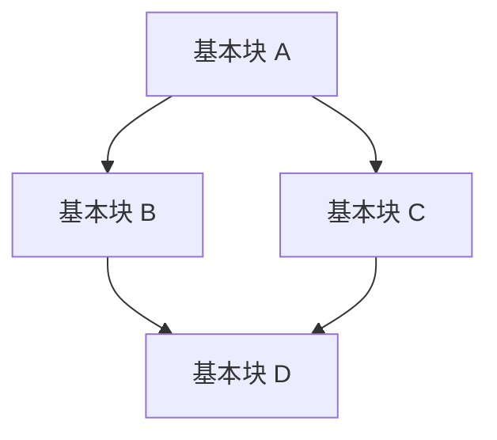
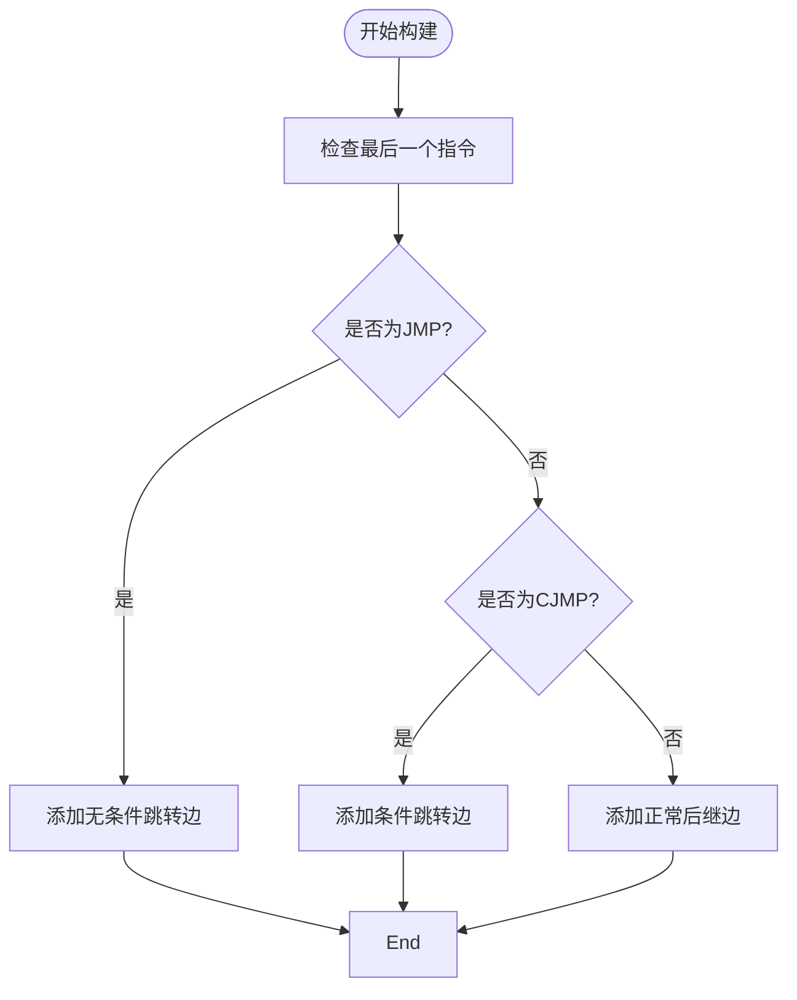
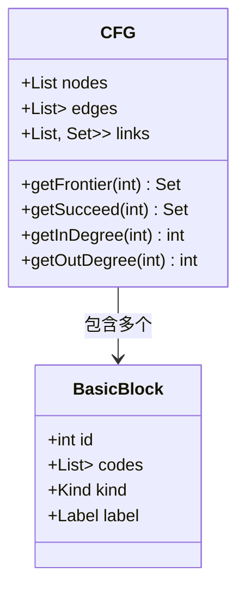
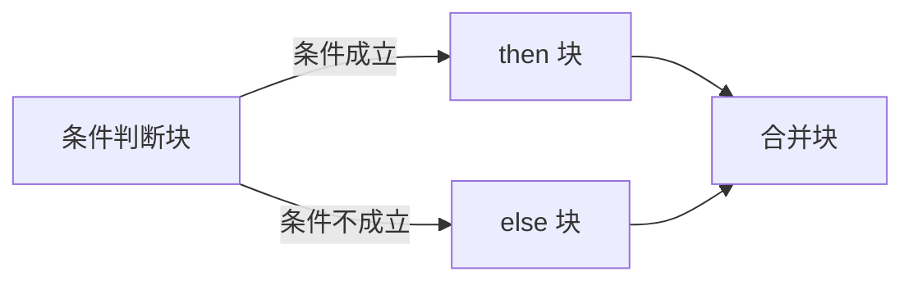
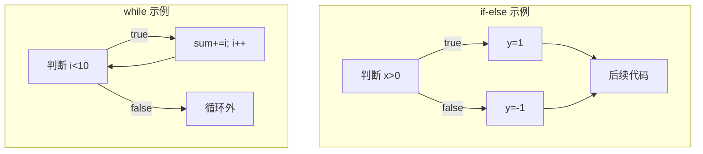
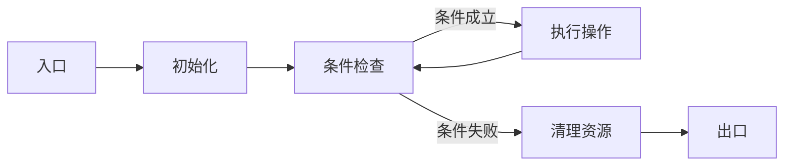
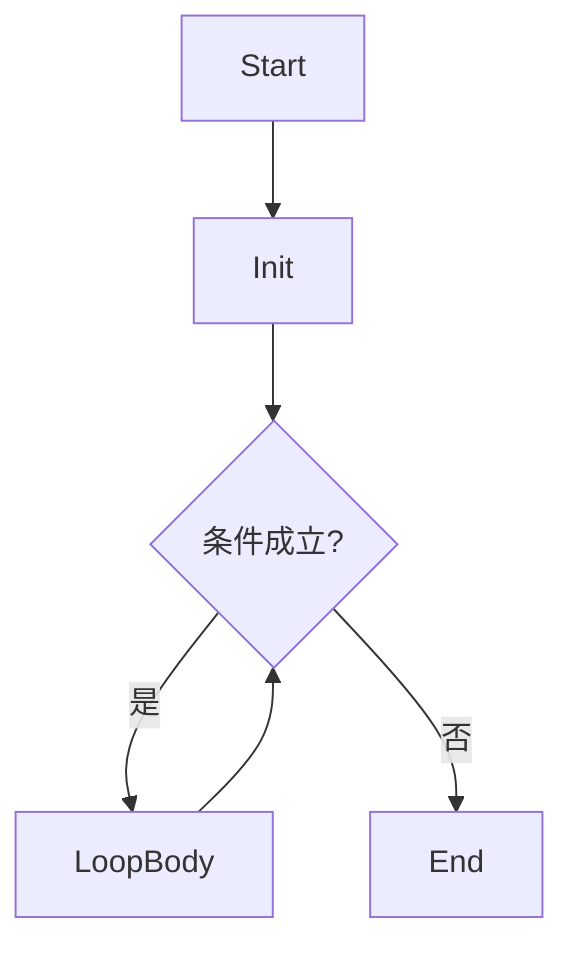
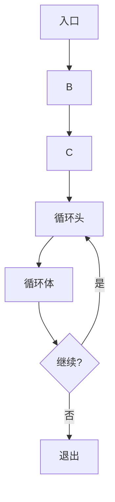
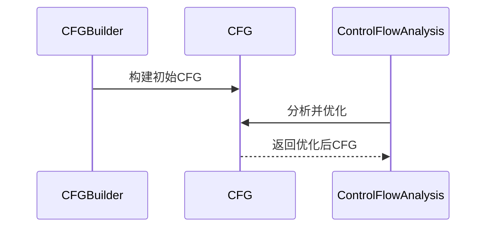

# 控制流边

<cite>
**本文档中引用的文件**  
- [CFG.java](file://ep20/src/main/java/org/teachfx/antlr4/ep20/pass/cfg/CFG.java)
- [CFGBuilder.java](file://ep20/src/main/java/org/teachfx/antlr4/ep20/pass/cfg/CFGBuilder.java)
- [BasicBlock.java](file://ep20/src/main/java/org/teachfx/antlr4/ep20/pass/cfg/BasicBlock.java)
- [ControlFlowAnalysis.java](file://ep20/src/main/java/org/teachfx/antlr4/ep20/pass/cfg/ControlFlowAnalysis.java)
- [JMP.java](file://ep20/src/main/java/org/teachfx/antlr4/ep20/ir/stmt/JMP.java)
- [CJMP.java](file://ep20/src/main/java/org/teachfx/antlr4/ep20/ir/stmt/CJMP.java)
</cite>

## 目录
1. [简介](#简介)
2. [控制流边的基本概念](#控制流边的基本概念)
3. [控制流边的构建机制](#控制流边的构建机制)
4. [控制流图（CFG）中的前驱-后继关系维护](#控制流图（cfg）中的前驱-后继关系维护)
5. [条件跳转、无条件跳转与函数调用的控制流边类型](#条件跳转、无条件跳转与函数调用的控制流边类型)
6. [实际代码结构中的控制流边示例](#实际代码结构中的控制流边示例)
7. [控制流边对程序执行路径的影响](#控制流边对程序执行路径的影响)
8. [面向初学者的控制流可视化解释](#面向初学者的控制流可视化解释)
9. [高级分析技术：支配关系与循环检测](#高级分析技术：支配关系与循环检测)
10. [优化策略与控制流分析](#优化策略与控制流分析)
11. [结论](#结论)

## 简介
控制流边是程序控制流图（Control Flow Graph, CFG）中的核心组成部分，用于表示基本块之间的执行转移关系。它们决定了程序在运行时可能经过的路径，并为编译器优化、静态分析和错误检测提供基础结构。本文将深入探讨控制流边的构建机制、其在CFG中的作用，以及如何通过不同语句（如if-else、while、switch）生成相应的控制流边。

**Section sources**
- [CFG.java](file://ep20/src/main/java/org/teachfx/antlr4/ep20/pass/cfg/CFG.java#L1-L158)
- [CJMP.java](file://ep20/src/main/java/org/teachfx/antlr4/ep20/ir/stmt/CJMP.java#L1-L60)

## 控制流边的基本概念
控制流边连接两个基本块，表示从一个基本块到另一个基本块的潜在执行转移。每条边都有明确的方向性，构成有向图的一部分。在本项目中，控制流边由三元组 `<起始节点, 终止节点, 权重>` 表示，存储于 `CFG` 类的 `edges` 列表中。

基本块（Basic Block）是一段顺序执行的指令序列，具有唯一的入口和出口。控制流边描述了这些块之间的跳转逻辑，例如条件分支、循环跳转或函数调用返回。



**Diagram sources**
- [CFG.java](file://ep20/src/main/java/org/teachfx/antlr4/ep20/pass/cfg/CFG.java#L15-L20)
- [BasicBlock.java](file://ep20/src/main/java/org/teachfx/antlr4/ep20/pass/cfg/BasicBlock.java#L1-L130)

## 控制流边的构建机制
控制流边的构建发生在中间表示（IR）阶段之后，由 `CFGBuilder` 类负责完成。该类遍历线性IR块（`LinearIRBlock`），根据其末尾指令类型创建对应的控制流边。

构建过程如下：
1. 从起始块开始递归遍历所有可达的基本块。
2. 对每个块，检查其最后一条指令。
3. 若为无条件跳转（`JMP`），则添加一条指向目标块的边。
4. 若为条件跳转（`CJMP`），则添加一条指向else块的边。
5. 遍历当前块的所有后继块，建立连接边。

边的权重用于区分不同类型的跳转（如5表示跳转目标，10表示正常后继）。



**Diagram sources**
- [CFGBuilder.java](file://ep20/src/main/java/org/teachfx/antlr4/ep20/pass/cfg/CFGBuilder.java#L1-L63)
- [JMP.java](file://ep20/src/main/java/org/teachfx/antlr4/ep20/ir/stmt/JMP.java#L1-L45)

## 控制流图（CFG）中的前驱-后继关系维护
`CFG` 类使用 `links` 列表维护每个基本块的前驱和后继集合。该列表索引对应基本块ID，值为包含前驱集和后继集的二元组。

- `getFrontier(id)`：获取指定ID基本块的所有前驱节点。
- `getSucceed(id)`：获取指定ID基本块的所有后继节点。
- `getInDegree(id)` 和 `getOutDegree(id)`：分别计算入度和出度，用于分析控制流复杂性。

当添加或删除边时，系统会同步更新 `edges` 列表和 `links` 结构，确保图的一致性。



**Diagram sources**
- [CFG.java](file://ep20/src/main/java/org/teachfx/antlr4/ep20/pass/cfg/CFG.java#L1-L158)
- [BasicBlock.java](file://ep20/src/main/java/org/teachfx/antlr4/ep20/pass/cfg/BasicBlock.java#L1-L130)

## 条件跳转、无条件跳转与函数调用的控制流边类型
### 条件跳转（CJMP）
由 `CJMP` 指令表示，生成两条控制流边：
- 隐式边：后续块（fall-through）
- 显式边：else块（由 `CJMP` 显式指定）

```java
if (cond) {
    // then 块
} else {
    // else 块
}
```
对应生成从条件判断块到then块和else块的两条边。

### 无条件跳转（JMP）
由 `JMP` 指令表示，生成一条指向目标块的边。常见于循环结束跳转、break语句或goto。

### 函数调用
函数调用本身不直接产生控制流边，但调用后的返回点构成新的控制流路径。在IR层面，调用通常被建模为特殊的跳转或调用指令，返回时连接回调用点的下一条指令。



**Diagram sources**
- [CJMP.java](file://ep20/src/main/java/org/teachfx/antlr4/ep20/ir/stmt/CJMP.java#L1-L60)
- [JMP.java](file://ep20/src/main/java/org/teachfx/antlr4/ep20/ir/stmt/JMP.java#L1-L45)

## 实际代码结构中的控制流边示例
### if-else 分支
```java
if (x > 0) {
    y = 1;
} else {
    y = -1;
}
```
生成三个基本块：条件判断块、then块、else块。控制流边为：
- 判断块 → then块（条件成立）
- 判断块 → else块（条件不成立）
- then块 → 合并块
- else块 → 合并块

### while 循环
```java
while (i < 10) {
    sum += i;
    i++;
}
```
包含：
- 循环头块（条件判断）
- 循环体块
- 循环退出块

控制流边：
- 头块 → 体块（条件成立）
- 体块 → 头块（循环继续）
- 头块 → 退出块（条件失败）

### switch 语句
多路分支，每个case生成一条从switch头到对应case块的边，default块也有一条边。



**Section sources**
- [CFGBuilder.java](file://ep20/src/main/java/org/teachfx/antlr4/ep20/pass/cfg/CFGBuilder.java#L1-L63)
- [ControlFlowAnalysis.java](file://ep20/src/main/java/org/teachfx/antlr4/ep20/pass/cfg/ControlFlowAnalysis.java#L1-L68)

## 控制流边对程序执行路径的影响
控制流边定义了程序所有可能的执行路径。通过遍历CFG，可以：
- 分析可达性：哪些代码永远不会被执行（死代码）
- 检测无限循环：是否存在无法退出的循环路径
- 路径覆盖测试：确保所有边都被测试到

每条边代表一次潜在的控制转移，影响程序的状态演化和最终行为。



**Diagram sources**
- [CFG.java](file://ep20/src/main/java/org/teachfx/antlr4/ep20/pass/cfg/CFG.java#L1-L158)

## 面向初学者的控制流可视化解释
想象程序执行像水流在管道网络中流动：
- 基本块 = 管道段
- 控制流边 = 连接管道的接头
- 条件分支 = T型三通阀，水流根据条件选择方向
- 循环 = 环形回路，水流可多次通过同一段管道

Mermaid图可直观展示这种流动过程，帮助理解程序执行流程。



## 高级分析技术：支配关系与循环检测
### 支配关系（Dominator）
若从入口到节点B的所有路径都必须经过节点A，则称A支配B。支配关系可用于：
- 优化变量生命周期
- 简化控制流
- 检测关键路径

### 循环检测
通过识别回边（back edge）——即指向已访问节点的边——可发现循环结构。循环头是回边的目标节点。

这些分析依赖于完整的控制流边信息，是高级优化（如循环展开、不变量外提）的基础。



**Section sources**
- [ControlFlowAnalysis.java](file://ep20/src/main/java/org/teachfx/antlr4/ep20/pass/cfg/ControlFlowAnalysis.java#L1-L68)

## 优化策略与控制流分析
`ControlFlowAnalysis` 类实现了基本的控制流优化：
- 删除冗余跳转：若JMP的目标就是下一个块，则删除该跳转。
- 合并基本块：若一个块只有一个前驱且该前驱只有一个后继，则可合并两块。

这些优化减少了控制流复杂性，提高后续分析效率。



**Diagram sources**
- [ControlFlowAnalysis.java](file://ep20/src/main/java/org/teachfx/antlr4/ep20/pass/cfg/ControlFlowAnalysis.java#L1-L68)
- [CFG.java](file://ep20/src/main/java/org/teachfx/antlr4/ep20/pass/cfg/CFG.java#L1-L158)

## 结论
控制流边是程序静态分析的核心数据结构，精确地刻画了代码的执行逻辑。通过理解其构建机制和在CFG中的作用，开发者不仅能更好地掌握编译器工作原理，还能利用这些信息进行性能优化、漏洞检测和代码重构。无论是初学者还是高级用户，深入理解控制流边都将极大提升对程序行为的认知能力。