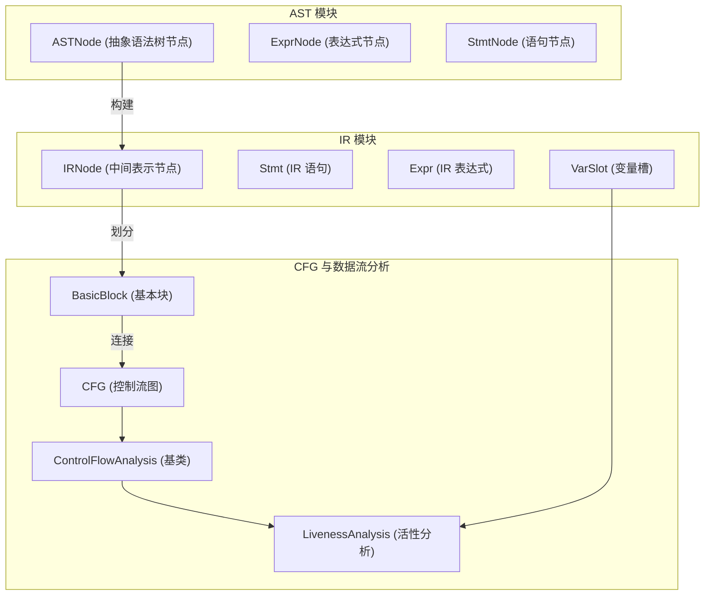
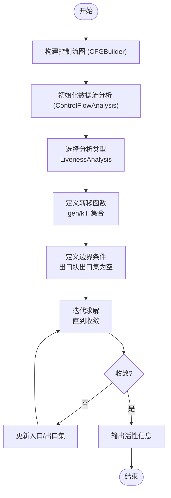
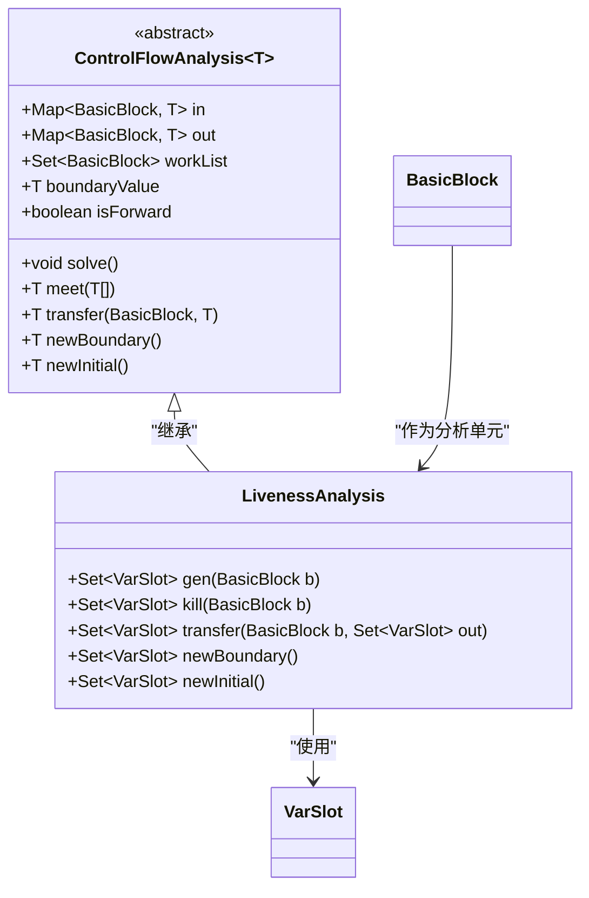
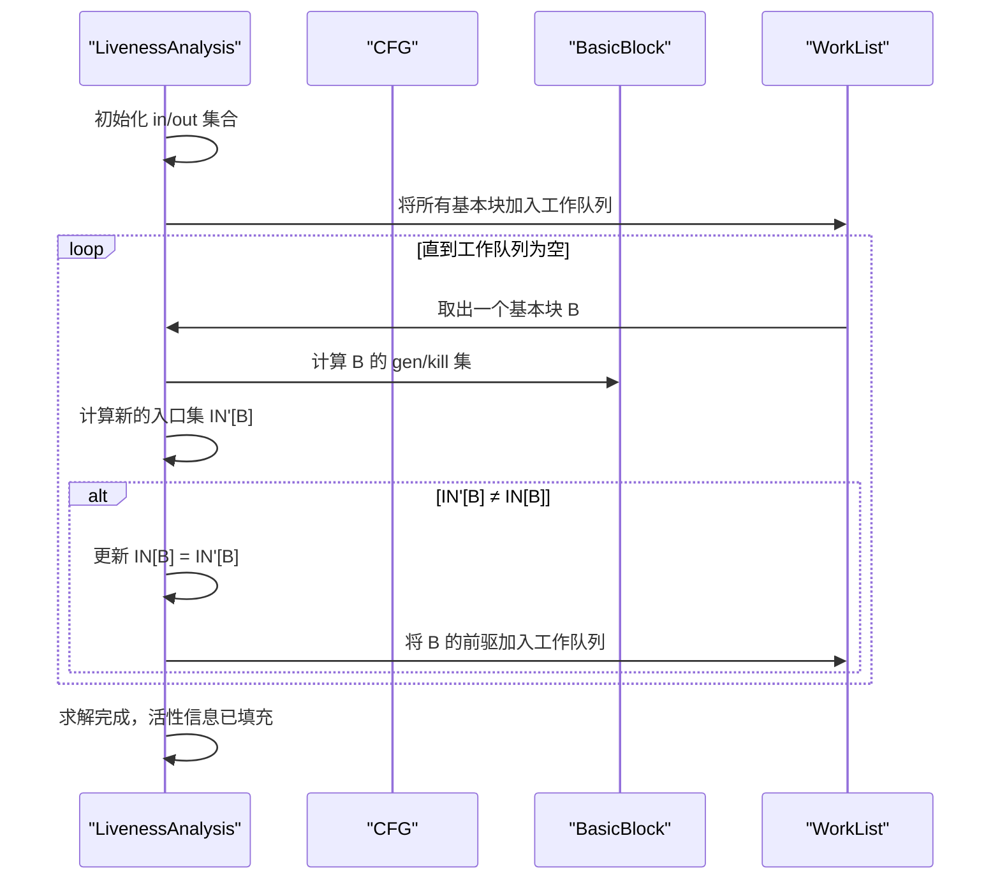
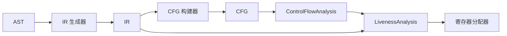

# 数据流分析

<cite>
**本文档引用的文件**  
- [LivenessAnalysis.java](file://ep20/src/main/java/org/teachfx/antlr4/ep20/pass/cfg/LivenessAnalysis.java)
- [ControlFlowAnalysis.java](file://ep20/src/main/java/org/teachfx/antlr4/ep20/pass/cfg/ControlFlowAnalysis.java)
- [CFG.java](file://ep20/src/main/java/org/teachfx/antlr4/ep20/pass/cfg/CFG.java)
- [BasicBlock.java](file://ep20/src/main/java/org/teachfx/antlr4/ep20/pass/cfg/BasicBlock.java)
- [VarSlot.java](file://ep20/src/main/java/org/teachfx/antlr4/ep20/ir/expr/VarSlot.java)
- [Assign.java](file://ep20/src/main/java/org/teachfx/antlr4/ep20/ir/stmt/Assign.java)
- [CJMP.java](file://ep20/src/main/java/org/teachfx/antlr4/ep20/ir/stmt/CJMP.java)
- [JMP.java](file://ep20/src/main/java/org/teachfx/antlr4/ep20/ir/stmt/JMP.java)
- [Expr.java](file://ep20/src/main/java/org/teachfx/antlr4/ep20/ir/expr/Expr.java)
</cite>

## 目录
1. [引言](#引言)
2. [项目结构](#项目结构)
3. [核心组件](#核心组件)
4. [架构概述](#架构概述)
5. [详细组件分析](#详细组件分析)
6. [依赖分析](#依赖分析)
7. [性能考虑](#性能考虑)
8. [故障排除指南](#故障排除指南)
9. [结论](#结论)

## 引言
本文档深入探讨数据流分析技术，特别是变量活性分析（Liveness Analysis）的实现原理。重点分析基于控制流图（CFG）的前向/后向传播机制、入口/出口活性集的迭代求解过程，并展示其在寄存器分配与代码优化中的实际应用。文档兼顾初学者与高级用户，提供从基础概念到收敛性保证、复杂度分析及高级应用场景的完整知识体系。

## 项目结构
本项目 `ep20` 实现了一个完整的编译器前端与中间表示（IR）优化框架，其中数据流分析模块位于 `pass/cfg` 包中，构建于已生成的控制流图之上。

**Diagram sources**
- [ast/ASTNode.java](file://ep20/src/main/java/org/teachfx/antlr4/ep20/ast/ASTNode.java)
- [ir/IRNode.java](file://ep20/src/main/java/org/teachfx/antlr4/ep20/ir/IRNode.java)
- [pass/cfg/BasicBlock.java](file://ep20/src/main/java/org/teachfx/antlr4/ep20/pass/cfg/BasicBlock.java)
- [pass/cfg/CFG.java](file://ep20/src/main/java/org/teachfx/antlr4/ep20/pass/cfg/CFG.java)
- [pass/cfg/ControlFlowAnalysis.java](file://ep20/src/main/java/org/teachfx/antlr4/ep20/pass/cfg/ControlFlowAnalysis.java)
- [pass/cfg/LivenessAnalysis.java](file://ep20/src/main/java/org/teachfx/antlr4/ep20/pass/cfg/LivenessAnalysis.java)

**Section sources**
- [pass/cfg](file://ep20/src/main/java/org/teachfx/antlr4/ep20/pass/cfg)

## 核心组件
核心组件包括 `ControlFlowAnalysis` 基类和 `LivenessAnalysis` 具体实现。前者提供通用数据流分析框架，后者实现变量活性分析算法。活性分析通过分析每个变量在程序点是否“活跃”（即其值后续会被使用），为寄存器分配等优化提供关键信息。

**Section sources**
- [ControlFlowAnalysis.java](file://ep20/src/main/java/org/teachfx/antlr4/ep20/pass/cfg/ControlFlowAnalysis.java#L1-L100)
- [LivenessAnalysis.java](file://ep20/src/main/java/org/teachfx/antlr4/ep20/pass/cfg/LivenessAnalysis.java#L1-L80)

## 架构概述
数据流分析框架以控制流图（CFG）为基础，将程序抽象为基本块（BasicBlock）的集合。`ControlFlowAnalysis` 定义了通用的迭代求解框架，`LivenessAnalysis` 继承该框架，实现后向数据流分析，计算每个基本块的入口和出口活性集。

**Diagram sources**
- [CFGBuilder.java](file://ep20/src/main/java/org/teachfx/antlr4/ep20/pass/cfg/CFGBuilder.java#L1-L20)
- [ControlFlowAnalysis.java](file://ep20/src/main/java/org/teachfx/antlr4/ep20/pass/cfg/ControlFlowAnalysis.java#L15-L50)
- [LivenessAnalysis.java](file://ep20/src/main/java/org/teachfx/antlr4/ep20/pass/cfg/LivenessAnalysis.java#L20-L60)

## 详细组件分析

### 活性分析实现
`LivenessAnalysis` 类实现了经典的后向数据流分析。其核心在于为每个基本块计算 `gen` 集（本块中首次使用的变量）和 `kill` 集（本块中被重新定义的变量），并通过迭代更新入口集（IN）和出口集（OUT）。

#### 活性分析类图

**Diagram sources**
- [ControlFlowAnalysis.java](file://ep20/src/main/java/org/teachfx/antlr4/ep20/pass/cfg/ControlFlowAnalysis.java#L10-L40)
- [LivenessAnalysis.java](file://ep20/src/main/java/org/teachfx/antlr4/ep20/pass/cfg/LivenessAnalysis.java#L10-L35)
- [VarSlot.java](file://ep20/src/main/java/org/teachfx/antlr4/ep20/ir/expr/VarSlot.java#L5-L15)

#### 活性分析求解流程

**Diagram sources**
- [LivenessAnalysis.java](file://ep20/src/main/java/org/teachfx/antlr4/ep20/pass/cfg/LivenessAnalysis.java#L50-L100)
- [ControlFlowAnalysis.java](file://ep20/src/main/java/org/teachfx/antlr4/ep20/pass/cfg/ControlFlowAnalysis.java#L60-L90)
- [BasicBlock.java](file://ep20/src/main/java/org/teachfx/antlr4/ep20/pass/cfg/BasicBlock.java#L20-L40)

**Section sources**
- [LivenessAnalysis.java](file://ep20/src/main/java/org/teachfx/antlr4/ep20/pass/cfg/LivenessAnalysis.java#L1-L120)
- [ControlFlowAnalysis.java](file://ep20/src/main/java/org/teachfx/antlr4/ep20/pass/cfg/ControlFlowAnalysis.java#L1-L100)

### 通用数据流分析框架
`ControlFlowAnalysis` 作为基类，为所有数据流分析（如常量传播、可达定义）提供了统一的迭代求解框架。它通过模板方法模式，将具体的转移函数和边界条件留给子类实现。

**Section sources**
- [ControlFlowAnalysis.java](file://ep20/src/main/java/org/teachfx/antlr4/ep20/pass/cfg/ControlFlowAnalysis.java#L1-L150)

## 依赖分析
数据流分析模块依赖于已构建的控制流图（CFG）和中间表示（IR）。`LivenessAnalysis` 依赖 `ControlFlowAnalysis` 的求解框架，并通过 `VarSlot` 等 IR 元素来识别变量。

**Diagram sources**
- [CFGBuilder.java](file://ep20/src/main/java/org/teachfx/antlr4/ep20/pass/cfg/CFGBuilder.java#L1-L15)
- [ControlFlowAnalysis.java](file://ep20/src/main/java/org/teachfx/antlr4/ep20/pass/cfg/ControlFlowAnalysis.java#L1-L10)
- [LivenessAnalysis.java](file://ep20/src/main/java/org/teachfx/antlr4/ep20/pass/cfg/LivenessAnalysis.java#L1-L10)
- [ir](file://ep20/src/main/java/org/teachfx/antlr4/ep20/ir)

**Section sources**
- [CFGBuilder.java](file://ep20/src/main/java/org/teachfx/antlr4/ep20/pass/cfg/CFGBuilder.java#L1-L50)
- [ControlFlowAnalysis.java](file://ep20/src/main/java/org/teachfx/antlr4/ep20/pass/cfg/ControlFlowAnalysis.java#L1-L30)
- [LivenessAnalysis.java](file://ep20/src/main/java/org/teachfx/antlr4/ep20/pass/cfg/LivenessAnalysis.java#L1-L20)

## 性能考虑
数据流分析的性能主要取决于迭代次数和基本块数量。由于活性分析是后向单调分析，其迭代次数上界为 O(N)，其中 N 为基本块数量。使用工作列表（WorkList）算法可以有效减少不必要的重复计算，提高收敛速度。

## 故障排除指南
若活性分析结果不正确，请检查：
1.  控制流图（CFG）是否正确构建，特别是跳转指令（JMP, CJMP）的目标块。
2.  `gen` 集是否正确识别了所有被读取的变量（`VarSlot`）。
3.  `kill` 集是否正确识别了所有被写入的变量（如 `Assign` 语句的左值）。
4.  迭代求解的边界条件（出口块的出口集应为空）是否设置正确。

**Section sources**
- [LivenessAnalysis.java](file://ep20/src/main/java/org/teachfx/antlr4/ep20/pass/cfg/LivenessAnalysis.java#L30-L70)
- [JMP.java](file://ep20/src/main/java/org/teachfx/antlr4/ep20/ir/stmt/JMP.java#L5-L15)
- [CJMP.java](file://ep20/src/main/java/org/teachfx/antlr4/ep20/ir/stmt/CJMP.java#L5-L15)
- [Assign.java](file://ep20/src/main/java/org/teachfx/antlr4/ep20/ir/stmt/Assign.java#L5-L15)

## 结论
本文档详细阐述了 `ep20` 项目中数据流分析的实现，特别是基于 `ControlFlowAnalysis` 框架的 `LivenessAnalysis`。该设计清晰地分离了通用求解逻辑与具体分析逻辑，具有良好的可扩展性，可方便地用于实现常量传播、活跃变量分析等其他数据流分析。所生成的活性信息是进行高效寄存器分配和死代码消除等优化的关键基础。