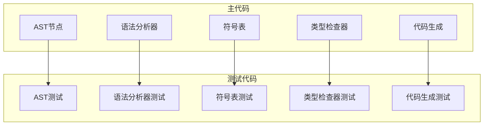
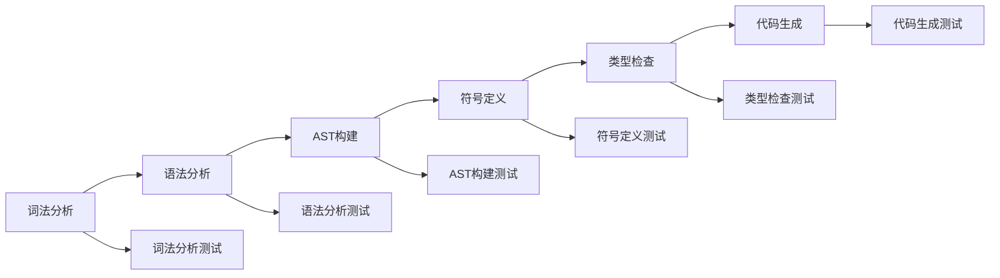
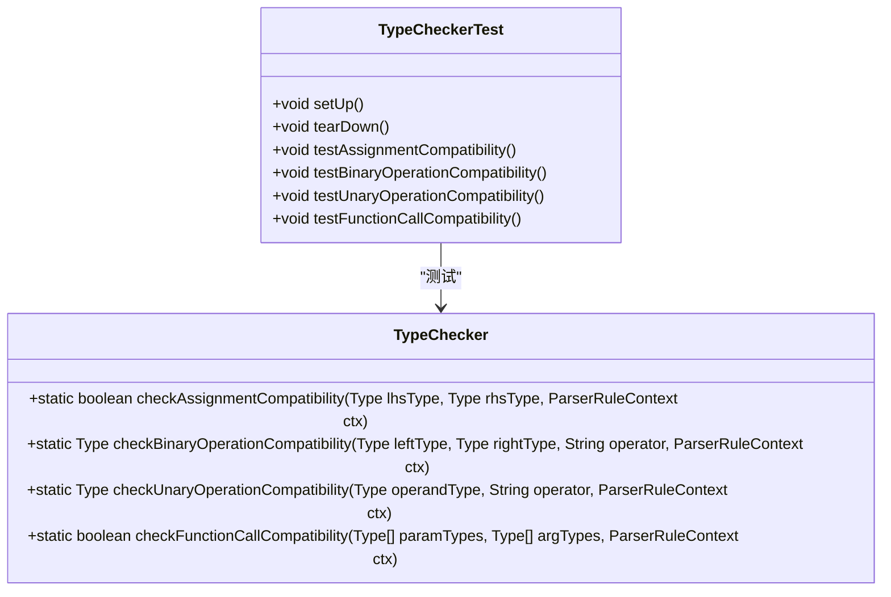
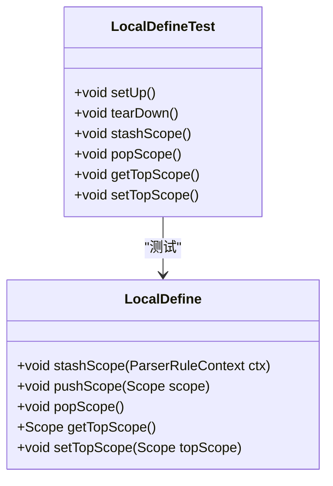
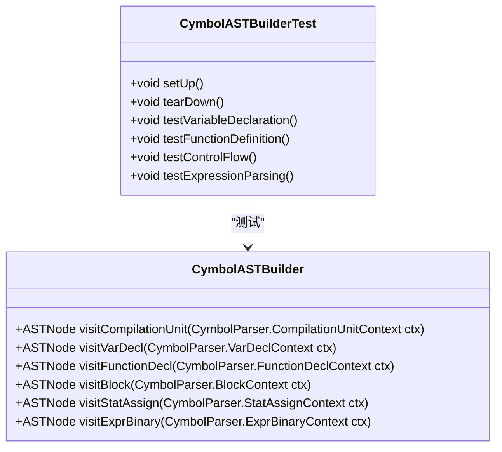
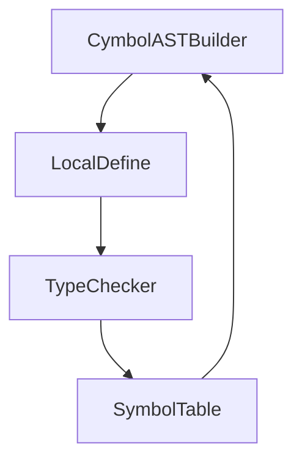

# 单元测试

<cite>
**本文档中引用的文件**  
- [TypeCheckerTest.java](file://ep20/src/test/java/org/teachfx/antlr4/ep20/pass/sematic/TypeCheckerTest.java)
- [LocalDefineTest.java](file://ep20/src/test/java/org/teachfx/antlr4/ep20/pass/symtab/LocalDefineTest.java)
- [TypeChecker.java](file://ep19/src/main/java/org/teachfx/antlr4/ep19/symtab/TypeChecker.java)
- [CymbolASTBuilder.java](file://ep20/src/main/java/org/teachfx/antlr4/ep20/pass/ast/CymbolASTBuilder.java)
- [LocalDefine.java](file://ep20/src/main/java/org/teachfx/antlr4/ep20/pass/symtab/LocalDefine.java)
</cite>

## 目录
1. [简介](#简介)
2. [项目结构](#项目结构)
3. [核心组件](#核心组件)
4. [架构概述](#架构概述)
5. [详细组件分析](#详细组件分析)
6. [依赖分析](#依赖分析)
7. [性能考虑](#性能考虑)
8. [故障排除指南](#故障排除指南)
9. [结论](#结论)

## 简介
本文档详细介绍了如何验证编译器各个独立组件的正确性，重点聚焦于单元测试的实现。文档涵盖了类型检查器、符号定义和AST构建的测试方法，展示了如何使用JUnit和AssertJ编写有效的单元测试。通过实际代码示例，说明了边界条件测试、异常测试和模拟对象的使用。为初学者提供了测试断言的最佳实践，为高级用户介绍了测试覆盖率工具的使用和持续集成中的单元测试配置。

## 项目结构
项目结构遵循模块化设计，每个模块负责编译器的不同阶段。核心模块包括语法分析、语义分析、符号表管理和代码生成。测试代码位于`src/test`目录下，与主代码分离，确保测试的独立性和可维护性。

**图示来源**  
- [TypeCheckerTest.java](file://ep20/src/test/java/org/teachfx/antlr4/ep20/pass/sematic/TypeCheckerTest.java)
- [LocalDefineTest.java](file://ep20/src/test/java/org/teachfx/antlr4/ep20/pass/symtab/LocalDefineTest.java)

**章节来源**  
- [TypeCheckerTest.java](file://ep20/src/test/java/org/teachfx/antlr4/ep20/pass/sematic/TypeCheckerTest.java)
- [LocalDefineTest.java](file://ep20/src/test/java/org/teachfx/antlr4/ep20/pass/symtab/LocalDefineTest.java)

## 核心组件
核心组件包括类型检查器、符号定义器和AST构建器。这些组件通过单元测试验证其正确性，确保编译器的每个阶段都能正确处理输入并生成预期输出。

**章节来源**  
- [TypeChecker.java](file://ep19/src/main/java/org/teachfx/antlr4/ep19/symtab/TypeChecker.java)
- [CymbolASTBuilder.java](file://ep20/src/main/java/org/teachfx/antlr4/ep20/pass/ast/CymbolASTBuilder.java)
- [LocalDefine.java](file://ep20/src/main/java/org/teachfx/antlr4/ep20/pass/symtab/LocalDefine.java)

## 架构概述
编译器的架构分为多个阶段，每个阶段都有相应的测试用例。从词法分析到代码生成，每个阶段的输出都通过单元测试验证其正确性。

**图示来源**  
- [CymbolASTBuilder.java](file://ep20/src/main/java/org/teachfx/antlr4/ep20/pass/ast/CymbolASTBuilder.java)
- [LocalDefine.java](file://ep20/src/main/java/org/teachfx/antlr4/ep20/pass/symtab/LocalDefine.java)
- [TypeChecker.java](file://ep19/src/main/java/org/teachfx/antlr4/ep19/symtab/TypeChecker.java)

## 详细组件分析
### 类型检查器测试
`TypeCheckerTest`类验证类型检查器的各种场景，包括类型匹配、类型推导和错误报告。测试用例覆盖了赋值兼容性、二元操作兼容性、一元操作兼容性和函数调用兼容性。

**图示来源**  
- [TypeChecker.java](file://ep19/src/main/java/org/teachfx/antlr4/ep19/symtab/TypeChecker.java)
- [TypeCheckerTest.java](file://ep20/src/test/java/org/teachfx/antlr4/ep20/pass/sematic/TypeCheckerTest.java)

**章节来源**  
- [TypeChecker.java](file://ep19/src/main/java/org/teachfx/antlr4/ep19/symtab/TypeChecker.java)
- [TypeCheckerTest.java](file://ep20/src/test/java/org/teachfx/antlr4/ep20/pass/sematic/TypeCheckerTest.java)

### 符号定义测试
`LocalDefineTest`类验证符号定义的正确性，包括作用域管理和符号解析。测试用例覆盖了作用域的创建、符号的定义和解析。

**图示来源**  
- [LocalDefine.java](file://ep20/src/main/java/org/teachfx/antlr4/ep20/pass/symtab/LocalDefine.java)
- [LocalDefineTest.java](file://ep20/src/test/java/org/teachfx/antlr4/ep20/pass/symtab/LocalDefineTest.java)

**章节来源**  
- [LocalDefine.java](file://ep20/src/main/java/org/teachfx/antlr4/ep20/pass/symtab/LocalDefine.java)
- [LocalDefineTest.java](file://ep20/src/test/java/org/teachfx/antlr4/ep20/pass/symtab/LocalDefineTest.java)

### AST构建测试
`CymbolASTBuilderTest`类验证AST构建的准确性，包括各种语法结构的正确解析。测试用例覆盖了变量声明、函数定义、控制流语句和表达式的解析。

**图示来源**  
- [CymbolASTBuilder.java](file://ep20/src/main/java/org/teachfx/antlr4/ep20/pass/ast/CymbolASTBuilder.java)
- [CymbolASTBuilderTest.java](file://ep20/src/test/java/org/teachfx/antlr4/ep20/pass/ast/CymbolASTBuilderTest.java)

**章节来源**  
- [CymbolASTBuilder.java](file://ep20/src/main/java/org/teachfx/antlr4/ep20/pass/ast/CymbolASTBuilder.java)
- [CymbolASTBuilderTest.java](file://ep20/src/test/java/org/teachfx/antlr4/ep20/pass/ast/CymbolASTBuilderTest.java)

## 依赖分析
组件之间的依赖关系通过测试用例验证，确保每个组件都能正确地与其他组件交互。依赖分析包括符号表与类型检查器之间的交互，以及AST构建器与符号定义器之间的交互。

**图示来源**  
- [CymbolASTBuilder.java](file://ep20/src/main/java/org/teachfx/antlr4/ep20/pass/ast/CymbolASTBuilder.java)
- [LocalDefine.java](file://ep20/src/main/java/org/teachfx/antlr4/ep20/pass/symtab/LocalDefine.java)
- [TypeChecker.java](file://ep19/src/main/java/org/teachfx/antlr4/ep19/symtab/TypeChecker.java)
- [SymbolTable.java](file://ep20/src/main/java/org/teachfx/antlr4/ep20/symtab/SymbolTable.java)

**章节来源**  
- [CymbolASTBuilder.java](file://ep20/src/main/java/org/teachfx/antlr4/ep20/pass/ast/CymbolASTBuilder.java)
- [LocalDefine.java](file://ep20/src/main/java/org/teachfx/antlr4/ep20/pass/symtab/LocalDefine.java)
- [TypeChecker.java](file://ep19/src/main/java/org/teachfx/antlr4/ep19/symtab/TypeChecker.java)
- [SymbolTable.java](file://ep20/src/main/java/org/teachfx/antlr4/ep20/symtab/SymbolTable.java)

## 性能考虑
单元测试不仅验证功能正确性，还考虑性能。测试用例包括边界条件测试和异常测试，确保编译器在极端情况下仍能正确运行。

## 故障排除指南
当测试失败时，首先检查测试用例的输入是否正确，然后检查被测试组件的实现。使用调试工具逐步执行代码，观察变量的值和程序的执行流程。

**章节来源**  
- [TypeCheckerTest.java](file://ep20/src/test/java/org/teachfx/antlr4/ep20/pass/sematic/TypeCheckerTest.java)
- [LocalDefineTest.java](file://ep20/src/test/java/org/teachfx/antlr4/ep20/pass/symtab/LocalDefineTest.java)

## 结论
通过详细的单元测试，可以确保编译器各个组件的正确性。测试用例覆盖了功能、性能和边界条件，为编译器的稳定性和可靠性提供了保障。持续集成中的单元测试配置进一步提高了开发效率和代码质量。