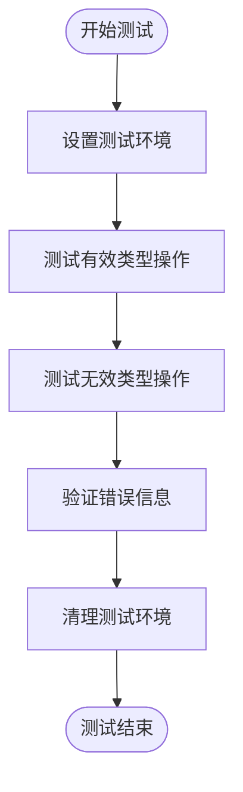
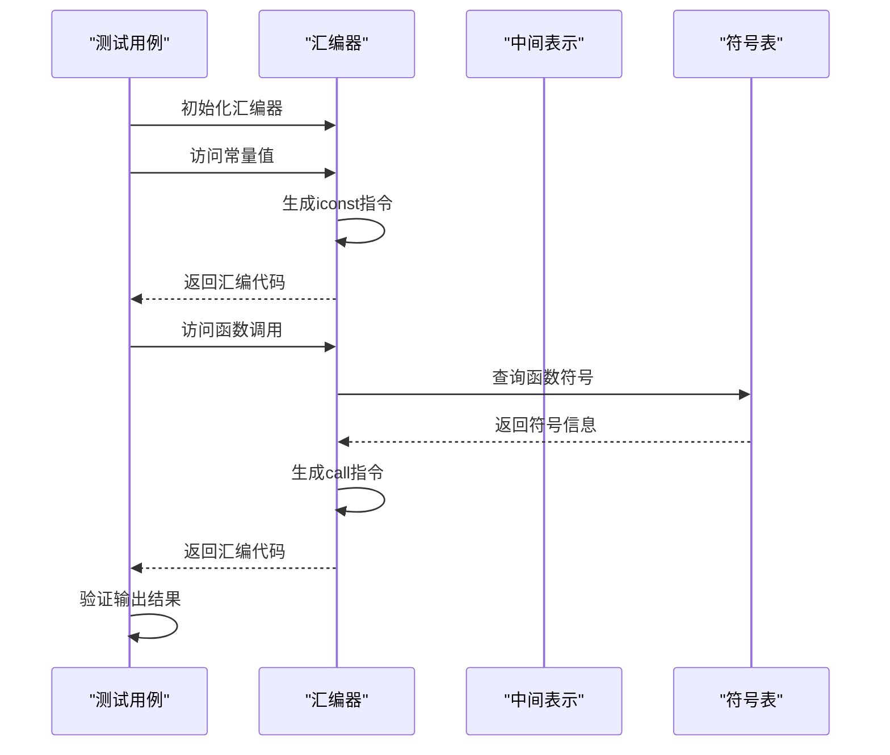
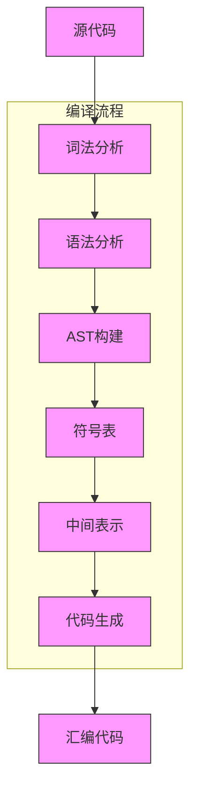
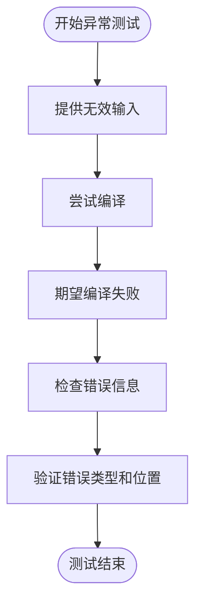
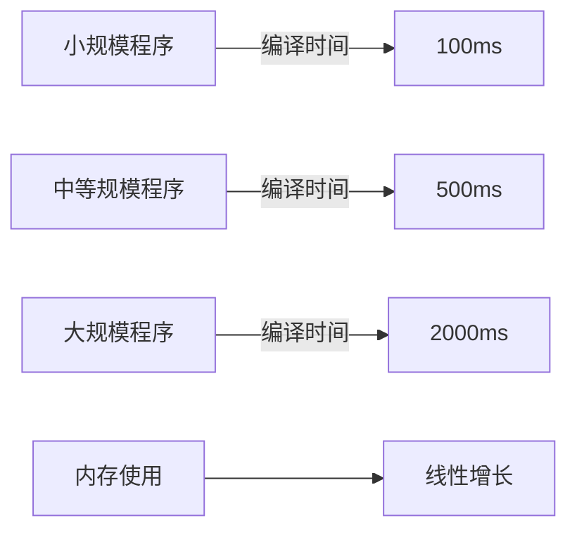

# 测试策略

<cite>
**本文档中引用的文件**  
- [TypeCheckerTest.java](file://ep20/src/test/java/org/teachfx/antlr4/ep20/pass/sematic/TypeCheckerTest.java)
- [CymbolAssemblerTest.java](file://ep20/src/test/java/org/teachfx/antlr4/ep20/pass/codegen/CymbolAssemblerTest.java)
- [EndToEndCompilationTest.java](file://ep20/src/test/java/org/teachfx/antlr4/ep20/pass/codegen/EndToEndCompilationTest.java)
- [TypeSystemTest.java](file://ep19/src/test/java/org/teachfx/antlr4/ep19/TypeSystemTest.java)
- [IntegrationTest.java](file://ep19/src/test/java/org/teachfx/antlr4/ep19/IntegrationTest.java)
- [PerformanceBenchmarkTest.java](file://ep19/src/test/java/org/teachfx/antlr4/ep19/PerformanceBenchmarkTest.java)
</cite>

## 目录
1. [简介](#简介)
2. [单元测试](#单元测试)
3. [集成测试](#集成测试)
4. [端到端测试](#端到端测试)
5. [测试用例设计模式](#测试用例设计模式)
6. [测试驱动开发](#测试驱动开发)
7. [测试覆盖率与持续集成](#测试覆盖率与持续集成)
8. [结论](#结论)

## 简介
本文档全面介绍在Antlr4实现编程语言项目中的测试策略。重点阐述单元测试、集成测试和端到端测试的实现方法，涵盖从单个组件验证到完整编译流程确认的多层次测试体系。通过分析TypeCheckerTest、CymbolAssemblerTest和EndToEndCompilationTest等具体测试类，展示如何系统性地验证编译器各阶段的正确性。

## 单元测试
单元测试用于验证编译器中单个组件的功能正确性，重点关注边界条件和错误处理场景。在本项目中，`TypeCheckerTest`类展示了类型检查器的单元测试实现。

**图示来源**  
- [TypeCheckerTest.java](file://ep20/src/test/java/org/teachfx/antlr4/ep20/pass/sematic/TypeCheckerTest.java#L1-L14)

**本节来源**  
- [TypeCheckerTest.java](file://ep20/src/test/java/org/teachfx/antlr4/ep20/pass/sematic/TypeCheckerTest.java#L1-L14)
- [TypeSystemTest.java](file://ep19/src/test/java/org/teachfx/antlr4/ep19/TypeSystemTest.java#L1-L149)

## 集成测试
集成测试验证多个组件协同工作的正确性。`CymbolAssemblerTest`类展示了汇编器与其他组件（如IR生成器、符号表）的集成测试。

**图示来源**  
- [CymbolAssemblerTest.java](file://ep20/src/test/java/org/teachfx/antlr4/ep20/pass/codegen/CymbolAssemblerTest.java#L1-L127)

**本节来源**  
- [CymbolAssemblerTest.java](file://ep20/src/test/java/org/teachfx/antlr4/ep20/pass/codegen/CymbolAssemblerTest.java#L1-L127)
- [IntegrationTest.java](file://ep19/src/test/java/org/teachfx/antlr4/ep19/IntegrationTest.java#L1-L165)

## 端到端测试
端到端测试验证完整编译流程的正确性，从源代码输入到可执行代码输出的全过程。`EndToEndCompilationTest`类展示了完整的编译流水线测试。

**图示来源**  
- [EndToEndCompilationTest.java](file://ep20/src/test/java/org/teachfx/antlr4/ep20/pass/codegen/EndToEndCompilationTest.java#L1-L220)

**本节来源**  
- [EndToEndCompilationTest.java](file://ep20/src/test/java/org/teachfx/antlr4/ep20/pass/codegen/EndToEndCompilationTest.java#L1-L220)

## 测试用例设计模式
本项目展示了多种测试用例设计模式，包括参数化测试、异常测试和性能基准测试。

### 参数化测试
使用不同的输入数据验证相同的功能逻辑，如测试各种算术运算。

### 异常测试
验证编译器在错误输入情况下的行为，如类型不匹配、除零错误等。

**图示来源**  
- [TypeSystemTest.java](file://ep19/src/test/java/org/teachfx/antlr4/ep19/TypeSystemTest.java#L1-L149)

### 性能基准测试
`PerformanceBenchmarkTest`类提供了性能基准测试框架，测量不同规模程序的编译时间和内存使用。

**图示来源**  
- [PerformanceBenchmarkTest.java](file://ep19/src/test/java/org/teachfx/antlr4/ep19/PerformanceBenchmarkTest.java#L1-L325)

**本节来源**  
- [TypeSystemTest.java](file://ep19/src/test/java/org/teachfx/antlr4/ep19/TypeSystemTest.java#L1-L149)
- [PerformanceBenchmarkTest.java](file://ep19/src/test/java/org/teachfx/antlr4/ep19/PerformanceBenchmarkTest.java#L1-L325)

## 测试驱动开发
测试驱动开发（TDD）是一种软件开发方法，先编写测试用例，再编写实现代码。本项目通过`tdd_driven_todo_cases.md`等文件展示了TDD实践。

### TDD循环
1. 编写失败的测试用例
2. 编写最简单的实现使测试通过
3. 重构代码以提高质量
4. 重复上述步骤

### 初学者指南
- 从简单的单元测试开始
- 使用清晰的测试命名
- 保持测试独立性和可重复性
- 先测试边界条件

**本节来源**  
- [tdd_driven_todo_cases.md](file://ep19/tdd_driven_todo_cases.md)

## 测试覆盖率与持续集成
### 测试覆盖率分析
使用工具测量代码被测试覆盖的程度，确保关键路径都有相应的测试用例。

### 持续集成配置
在CI/CD管道中集成自动化测试，确保每次代码提交都经过完整的测试验证。

### 测试自动化最佳实践
- 保持测试快速和可靠
- 使用测试夹具管理测试状态
- 定期审查和维护测试用例
- 监控测试执行时间和趋势

**本节来源**  
- [pom.xml](file://ep20/pom.xml)
- [README.md](file://ep20/README.md)

## 结论
本项目的测试策略涵盖了从单元测试到端到端测试的完整层次，确保编译器各组件的正确性和整体流程的可靠性。通过采用测试驱动开发、性能基准测试和持续集成等现代软件工程实践，建立了高质量的编译器实现。建议继续完善测试覆盖率，特别是在错误恢复和复杂语言特性方面。