# 端到端测试

<cite>
**本文档中引用的文件**  
- [EndToEndCompilationTest.java](file://ep20\src\test\java\org\teachfx\antlr4\ep20\pass\codegen\EndToEndCompilationTest.java)
- [ComprehensiveTest.java](file://ep19\src\test\java\org\teachfx\antlr4\ep19\ComprehensiveTest.java)
- [IntegrationTest.java](file://ep19\src\test\java\org\teachfx\antlr4\ep19\IntegrationTest.java)
- [Compiler.java](file://ep20\src\main\java\org\teachfx\antlr4\ep20\Compiler.java)
- [PerformanceBenchmarkTest.java](file://ep19\src\test\java\org\teachfx\antlr4\ep19\PerformanceBenchmarkTest.java)
</cite>

## 目录
1. [简介](#简介)
2. [核心测试组件分析](#核心测试组件分析)
3. [EndToEndCompilationTest详解](#endtoendcompilationtest详解)
4. [ComprehensiveTest详解](#comprehensivetest详解)
5. [IntegrationTest详解](#integrationtest详解)
6. [性能基准测试](#性能基准测试)
7. [测试环境配置与自动化](#测试环境配置与自动化)
8. [端到端测试设计实践](#端到端测试设计实践)
9. [结论](#结论)

## 简介
端到端测试是验证编译器完整功能的关键环节，它确保从源代码输入到虚拟机字节码输出的整个编译流程正确无误。本文档详细介绍了如何通过不同类型的测试来验证编译器的词法分析、语法分析、语义分析和代码生成各阶段的正确性。我们将深入分析`EndToEndCompilationTest`、`ComprehensiveTest`和`IntegrationTest`等核心测试类，展示它们如何协同工作以确保编译器的稳定性和可靠性。同时，为初学者提供端到端测试的基本概念，并为高级用户提供测试数据管理、测试环境配置和自动化测试流水线的搭建指导。

## 核心测试组件分析
端到端测试框架由多个核心组件构成，这些组件共同协作以验证编译器的完整功能。`EndToEndCompilationTest`负责验证从源代码到汇编代码的完整编译流程，`ComprehensiveTest`专注于复杂程序的处理能力，`IntegrationTest`则测试编译器与虚拟机的集成。这些测试组件通过调用编译器的核心类`Compiler`来执行编译任务，并验证生成的字节码是否能够正确执行。

**Section sources**
- [EndToEndCompilationTest.java](file://ep20\src\test\java\org\teachfx\antlr4\ep20\pass\codegen\EndToEndCompilationTest.java#L1-L220)
- [ComprehensiveTest.java](file://ep19\src\test\java\org\teachfx\antlr4\ep19\ComprehensiveTest.java#L1-L227)
- [IntegrationTest.java](file://ep19\src\test\java\org\teachfx\antlr4\ep19\IntegrationTest.java#L1-L165)
- [Compiler.java](file://ep20\src\main\java\org\teachfx\antlr4\ep20\Compiler.java#L1-L161)

## EndToEndCompilationTest详解
`EndToEndCompilationTest`是验证编译器完整编译流程的核心测试类。它通过模拟从源代码输入到虚拟机字节码输出的全过程，确保编译器在各个阶段都能正确处理代码。

### 测试简单程序
该测试验证编译器能否正确编译一个简单的程序并生成正确的汇编代码。测试用例包含变量声明和返回语句，验证生成的汇编代码中是否包含相应的指令。

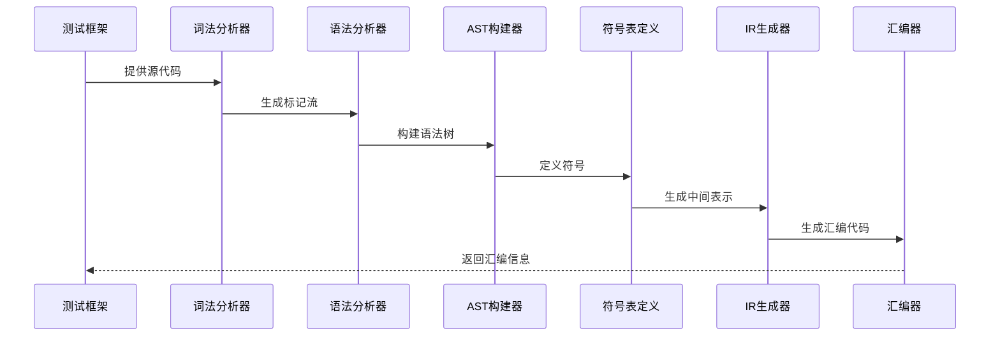

**Diagram sources**
- [EndToEndCompilationTest.java](file://ep20\src\test\java\org\teachfx\antlr4\ep20\pass\codegen\EndToEndCompilationTest.java#L35-L55)

### 测试函数调用
该测试验证编译器能否正确处理函数调用。测试用例包含一个加法函数和主函数中的函数调用，验证生成的汇编代码中是否包含函数定义和调用指令。

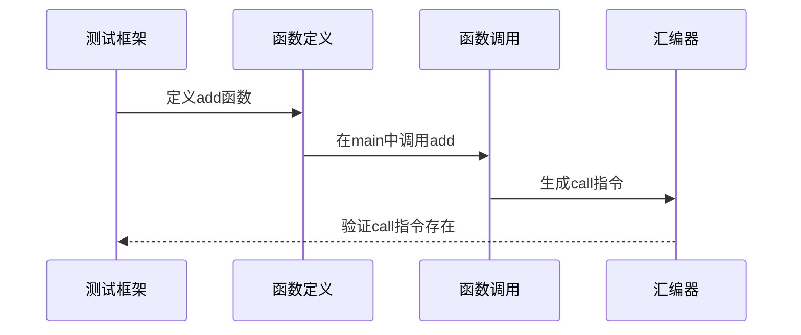

**Diagram sources**
- [EndToEndCompilationTest.java](file://ep20\src\test\java\org\teachfx\antlr4\ep20\pass\codegen\EndToEndCompilationTest.java#L57-L77)

### 测试条件语句
该测试验证编译器能否正确处理条件语句。测试用例包含if-else结构，验证生成的汇编代码中是否包含比较指令和条件跳转指令。

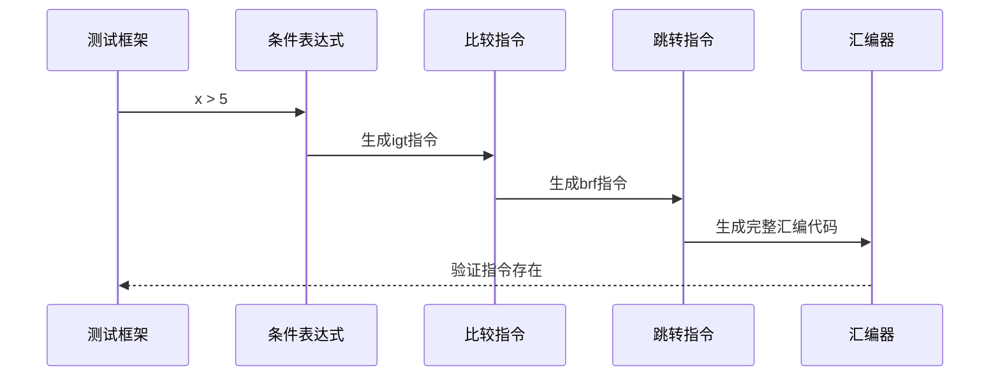

**Diagram sources**
- [EndToEndCompilationTest.java](file://ep20\src\test\java\org\teachfx\antlr4\ep20\pass\codegen\EndToEndCompilationTest.java#L79-L99)

### 测试循环语句
该测试验证编译器能否正确处理循环语句。测试用例包含while循环，验证生成的汇编代码中是否包含循环控制指令。

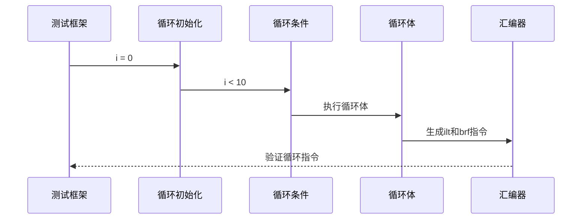

**Diagram sources**
- [EndToEndCompilationTest.java](file://ep20\src\test\java\org\teachfx\antlr4\ep20\pass\codegen\EndToEndCompilationTest.java#L101-L121)

### 测试复杂程序
该测试验证编译器能否正确处理递归函数等复杂程序。测试用例包含阶乘函数的递归实现，验证生成的汇编代码中是否包含递归调用和数学运算指令。

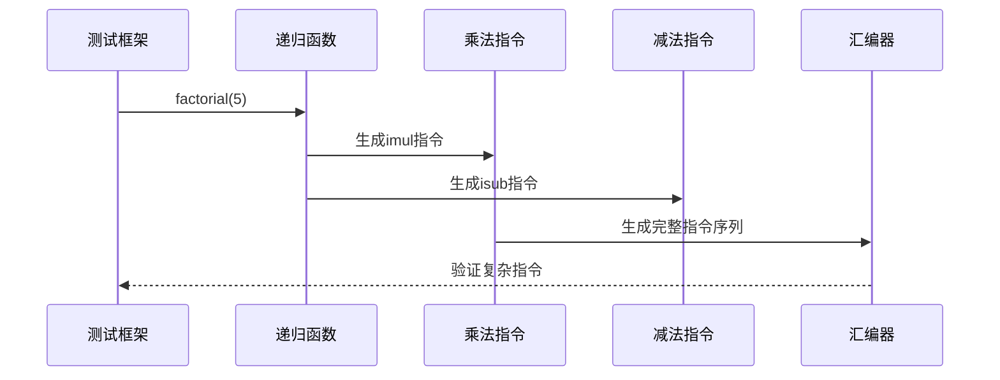

**Diagram sources**
- [EndToEndCompilationTest.java](file://ep20\src\test\java\org\teachfx\antlr4\ep20\pass\codegen\EndToEndCompilationTest.java#L123-L143)

**Section sources**
- [EndToEndCompilationTest.java](file://ep20\src\test\java\org\teachfx\antlr4\ep20\pass\codegen\EndToEndCompilationTest.java#L1-L220)

## ComprehensiveTest详解
`ComprehensiveTest`专注于验证编译器对复杂程序的处理能力，包括类型检查、复杂表达式和控制流等边缘情况。

### 类型检查测试
该测试验证编译器的类型系统是否正确工作，包括隐式类型转换、赋值兼容性、函数调用参数匹配等。

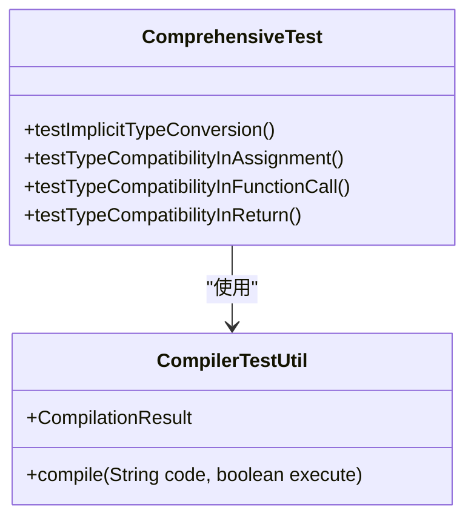

**Diagram sources**
- [ComprehensiveTest.java](file://ep19\src\test\java\org\teachfx\antlr4\ep19\ComprehensiveTest.java#L45-L105)

### 复杂表达式测试
该测试验证编译器能否正确处理复杂的算术表达式和布尔表达式，包括嵌套的if语句和循环。

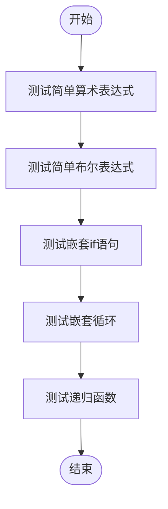

**Diagram sources**
- [ComprehensiveTest.java](file://ep19\src\test\java\org\teachfx\antlr4\ep19\ComprehensiveTest.java#L107-L165)

### 错误条件测试
该测试验证编译器能否正确检测和报告各种错误条件，如未定义变量、未定义函数、参数数量不匹配等。

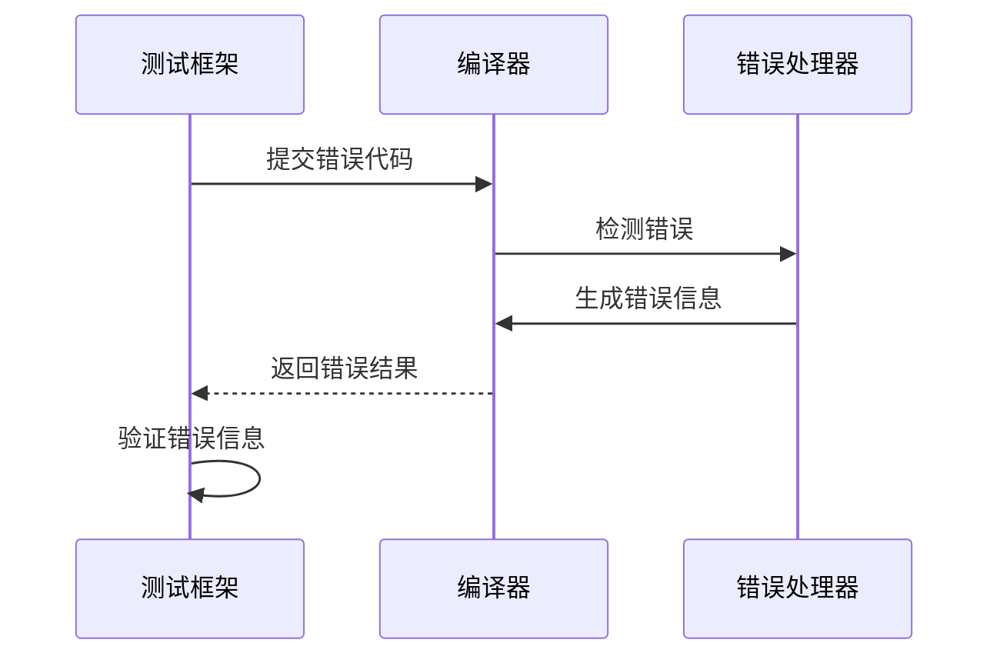

**Diagram sources**
- [ComprehensiveTest.java](file://ep19\src\test\java\org\teachfx\antlr4\ep19\ComprehensiveTest.java#L167-L227)

**Section sources**
- [ComprehensiveTest.java](file://ep19\src\test\java\org\teachfx\antlr4\ep19\ComprehensiveTest.java#L1-L227)

## IntegrationTest详解
`IntegrationTest`验证编译器与虚拟机的集成，确保生成的字节码能够正确执行。

### 基本功能测试
该测试验证编译器能否正确编译和执行基本的算术运算、变量声明和函数调用。

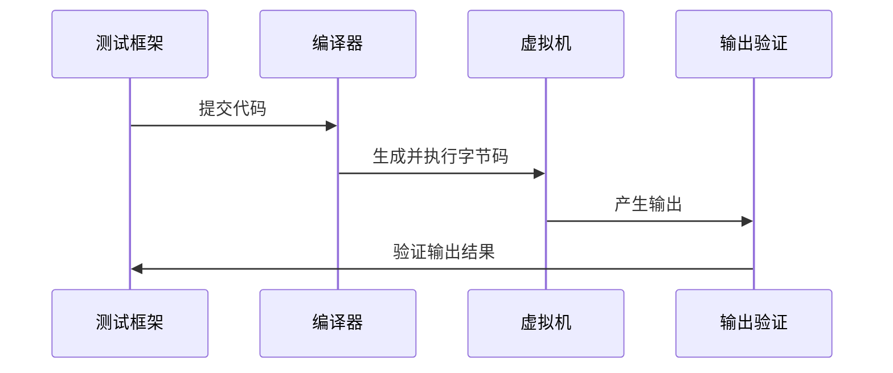

**Diagram sources**
- [IntegrationTest.java](file://ep19\src\test\java\org\teachfx\antlr4\ep19\IntegrationTest.java#L25-L85)

### 结构体测试
该测试验证编译器对结构体的处理能力，包括结构体声明、字段访问和方法调用。

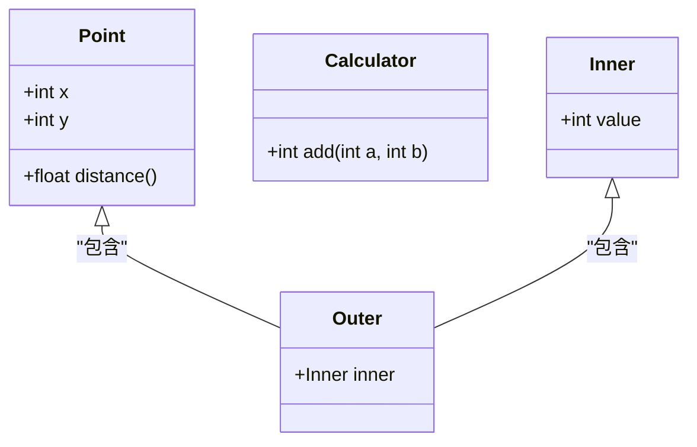

**Diagram sources**
- [IntegrationTest.java](file://ep19\src\test\java\org\teachfx\antlr4\ep19\IntegrationTest.java#L87-L115)

### 复杂程序测试
该测试验证编译器能否正确处理包含结构体、递归函数和复杂控制流的综合程序。

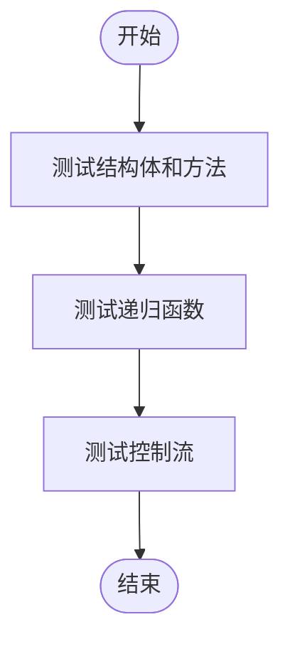

**Diagram sources**
- [IntegrationTest.java](file://ep19\src\test\java\org\teachfx\antlr4\ep19\IntegrationTest.java#L117-L165)

**Section sources**
- [IntegrationTest.java](file://ep19\src\test\java\org\teachfx\antlr4\ep19\IntegrationTest.java#L1-L165)

## 性能基准测试
`PerformanceBenchmarkTest`用于测量编译器在不同程序规模下的性能表现，包括编译时间和内存使用。

### 性能测量方法
该测试通过生成不同规模的程序来测量编译器的性能，包括小型、中型和大型程序。

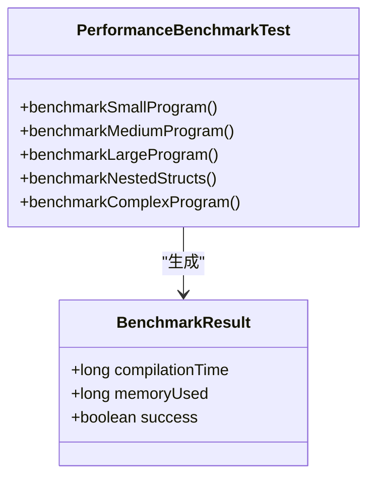

**Diagram sources**
- [PerformanceBenchmarkTest.java](file://ep19\src\test\java\org\teachfx\antlr4\ep19\PerformanceBenchmarkTest.java#L1-L325)

### 程序生成策略
该测试使用程序生成策略来创建不同复杂度的测试用例，包括变量声明、操作和嵌套结构体。

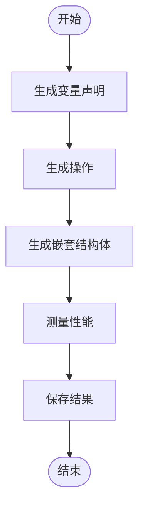

**Diagram sources**
- [PerformanceBenchmarkTest.java](file://ep19\src\test\java\org\teachfx\antlr4\ep19\PerformanceBenchmarkTest.java#L1-L325)

**Section sources**
- [PerformanceBenchmarkTest.java](file://ep19\src\test\java\org\teachfx\antlr4\ep19\PerformanceBenchmarkTest.java#L1-L325)

## 测试环境配置与自动化
为了有效执行端到端测试，需要配置适当的测试环境并建立自动化测试流水线。

### 测试环境配置
测试环境需要包含编译器、虚拟机、测试框架和必要的依赖库。配置文件应包含编译器选项、虚拟机参数和测试设置。

```mermaid
graph TB
subgraph "测试环境"
Compiler[编译器]
VM[虚拟机]
TestFramework[测试框架]
Dependencies[依赖库]
end
Compiler --> VM : "生成字节码"
TestFramework --> Compiler : "调用编译"
TestFramework --> VM : "执行字节码"
Dependencies --> Compiler : "提供支持"
```

**Diagram sources**
- [Compiler.java](file://ep20\src\main\java\org\teachfx\antlr4\ep20\Compiler.java#L1-L161)

### 自动化测试流水线
自动化测试流水线应包括代码编译、测试执行、结果收集和报告生成等步骤。


**Diagram sources**
- [Compiler.java](file://ep20\src\main\java\org\teachfx\antlr4\ep20\Compiler.java#L1-L161)

**Section sources**
- [Compiler.java](file://ep20\src\main\java\org\teachfx\antlr4\ep20\Compiler.java#L1-L161)

## 端到端测试设计实践
设计有效的端到端测试需要遵循一些最佳实践，以确保测试的全面性和有效性。

### 测试用例设计
测试用例应覆盖各种语言特性和边缘情况，包括正常情况、错误情况和边界条件。

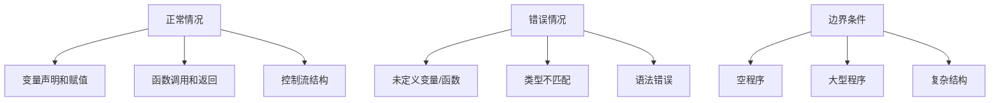

### 测试数据管理
测试数据应组织良好，便于维护和扩展。可以使用数据驱动测试方法来提高测试效率。

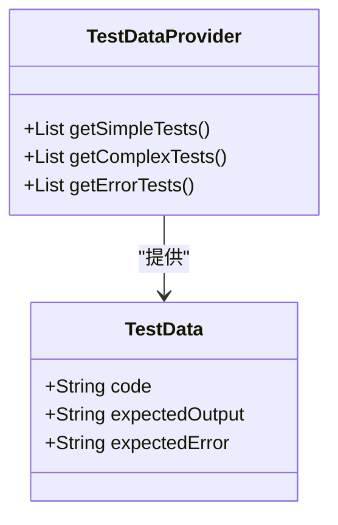

**Section sources**
- [EndToEndCompilationTest.java](file://ep20\src\test\java\org\teachfx\antlr4\ep20\pass\codegen\EndToEndCompilationTest.java#L1-L220)
- [ComprehensiveTest.java](file://ep19\src\test\java\org\teachfx\antlr4\ep19\ComprehensiveTest.java#L1-L227)
- [IntegrationTest.java](file://ep19\src\test\java\org\teachfx\antlr4\ep19\IntegrationTest.java#L1-L165)

## 结论
端到端测试是确保编译器质量和可靠性的关键环节。通过`EndToEndCompilationTest`、`ComprehensiveTest`和`IntegrationTest`等测试组件的协同工作，我们可以全面验证编译器从源代码输入到虚拟机字节码输出的完整流程。性能基准测试帮助我们监控编译器的性能表现，而良好的测试环境配置和自动化流水线则提高了测试效率。遵循最佳实践设计测试用例和管理测试数据，可以确保测试的全面性和有效性。这些测试不仅验证了编译器的正确性，还为未来的改进和优化提供了坚实的基础。