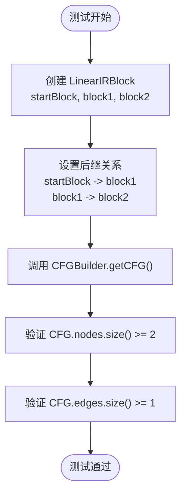

# 集成测试

<cite>
**本文档中引用的文件**  
- [CymbolAssemblerTest.java](file://ep20\src\test\java\org\teachfx\antlr4\ep20\pass\codegen\CymbolAssemblerTest.java)
- [CFGBuilderTest.java](file://ep20\src\test\java\org\teachfx\antlr4\ep20\pass\cfg\CFGBuilderTest.java)
- [CymbolIRBuilder.java](file://ep20\src\main\java\org\teachfx\antlr4\ep20\pass\ir\CymbolIRBuilder.java)
- [CymbolASTBuilder.java](file://ep20\src\main\java\org\teachfx\antlr4\ep20\pass\ast\CymbolASTBuilder.java)
</cite>

## 目录
1. [引言](#引言)
2. [项目结构](#项目结构)
3. [核心组件](#核心组件)
4. [架构概述](#架构概述)
5. [详细组件分析](#详细组件分析)
6. [依赖分析](#依赖分析)
7. [性能考虑](#性能考虑)
8. [故障排除指南](#故障排除指南)
9. [结论](#结论)

## 引言
本文档旨在深入探讨编译器开发中的集成测试策略，重点分析如何验证多个编译阶段组件之间的协同工作。我们将详细解析 `CymbolAssemblerTest`、`CFGBuilderTest` 和 `CymbolIRBuilder` 的测试机制，展示如何确保代码生成器、控制流图构建器和中间表示生成器在复杂数据流环境下的正确性。文档为初学者提供集成测试的基本概念，同时为高级用户提供测试桩和模拟对象的使用策略。

## 项目结构
项目 `ep20` 实现了一个完整的编译器流水线，其结构清晰地划分为不同的编译阶段。核心功能位于 `pass` 包下，包括抽象语法树（AST）构建、中间表示（IR）生成、控制流图（CFG）构建和代码生成等关键阶段。测试代码与主代码并行组织，确保每个组件的功能都能被独立和集成地验证。

**图源**  
- [CymbolASTBuilder.java](file://ep20\src\main\java\org\teachfx\antlr4\ep20\pass\ast\CymbolASTBuilder.java)
- [CymbolIRBuilder.java](file://ep20\src\main\java\org\teachfx\antlr4\ep20\pass\ir\CymbolIRBuilder.java)
- [CFGBuilder.java](file://ep20\src\main\java\org\teachfx\antlr4\ep20\pass\cfg\CFGBuilder.java)
- [CymbolAssembler.java](file://ep20\src\main\java\org\teachfx\antlr4\ep20\pass\codegen\CymbolAssembler.java)

**节源**  
- [CymbolASTBuilder.java](file://ep20\src\main\java\org\teachfx\antlr4\ep20\pass\ast\CymbolASTBuilder.java)
- [CymbolIRBuilder.java](file://ep20\src\main\java\org\teachfx\antlr4\ep20\pass\ir\CymbolIRBuilder.java)

## 核心组件
本节分析编译器流水线中的三个核心组件：`CymbolASTBuilder`、`CymbolIRBuilder` 和 `CymbolAssembler`。`CymbolASTBuilder` 负责将 ANTLR 生成的解析树转换为自定义的抽象语法树（AST），为后续阶段提供结构化的程序表示。`CymbolIRBuilder` 实现了 `ASTVisitor` 接口，遍历 AST 并生成三地址码形式的中间表示（IR），这是优化和代码生成的基础。`CymbolAssembler` 则将 IR 节点转换为特定虚拟机的汇编指令，完成从高级语言到低级指令的映射。

**节源**  
- [CymbolASTBuilder.java](file://ep20\src\main\java\org\teachfx\antlr4\ep20\pass\ast\CymbolASTBuilder.java)
- [CymbolIRBuilder.java](file://ep20\src\main\java\org\teachfx\antlr4\ep20\pass\ir\CymbolIRBuilder.java)
- [CymbolAssembler.java](file://ep20\src\main\java\org\teachfx\antlr4\ep20\pass\codegen\CymbolAssembler.java)

## 架构概述
编译器的架构遵循经典的多阶段流水线设计。前端负责词法和语法分析，生成解析树。`CymbolASTBuilder` 作为第一个中间阶段，将解析树转换为更易于处理的 AST。`CymbolIRBuilder` 随后将 AST 转换为线性的中间表示（IR），并构建基本块。`CFGBuilder` 基于线性 IR 构建控制流图（CFG），为数据流分析和优化提供基础。最后，`CymbolAssembler` 遍历 IR 节点，生成最终的汇编代码。集成测试确保了这些阶段之间的数据传递和转换逻辑是正确的。

**图源**  
- [CymbolASTBuilder.java](file://ep20\src\main\java\org\teachfx\antlr4\ep20\pass\ast\CymbolASTBuilder.java)
- [CymbolIRBuilder.java](file://ep20\src\main\java\org\teachfx\antlr4\ep20\pass\ir\CymbolIRBuilder.java)
- [CFGBuilder.java](file://ep20\src\main\java\org\teachfx\antlr4\ep20\pass\cfg\CFGBuilder.java)
- [CymbolAssembler.java](file://ep20\src\main\java\org\teachfx\antlr4\ep20\pass\codegen\CymbolAssembler.java)

## 详细组件分析

### CymbolAssemblerTest 分析
`CymbolAssemblerTest` 类通过单元测试验证了代码生成器与 IR 构建器的集成。测试用例使用 JUnit 5 和 Mockito 框架，通过模拟 `MethodSymbol` 对象来区分内置函数和用户定义函数的调用。测试验证了 `CymbolAssembler` 能够正确地将不同类型的 `IRNode` 转换为相应的汇编指令，例如，`ConstVal` 节点被转换为 `iconst`、`sconst` 或 `bconst` 指令，`CallFunc` 节点根据函数类型被转换为 `call` 或直接的 `print` 指令。

**图源**  
- [CymbolAssemblerTest.java](file://ep20\src\test\java\org\teachfx\antlr4\ep20\pass\codegen\CymbolAssemblerTest.java)
- [CymbolAssembler.java](file://ep20\src\main\java\org\teachfx\antlr4\ep20\pass\codegen\CymbolAssembler.java)

**节源**  
- [CymbolAssemblerTest.java](file://ep20\src\test\java\org\teachfx\antlr4\ep20\pass\codegen\CymbolAssemblerTest.java)

### CFGBuilderTest 分析
`CFGBuilderTest` 类验证了控制流图构建器与 IR 的集成。测试通过手动构建线性的 `LinearIRBlock` 链来模拟 IR 生成器的输出，然后将其传递给 `CFGBuilder`。测试用例检查了 `CFGBuilder` 是否能正确地将线性 IR 转换为包含节点（`BasicBlock`）和边（`Edge`）的图结构。例如，`testSimpleLinearFlow` 测试创建了一个简单的线性控制流（start -> block1 -> block2），并验证生成的 CFG 具有正确的节点和边数量。`testEdgeWeightConsistency` 测试则确保了所有控制流边的权重（weight）都是非负的，这反映了图的正确性。

**图源**  
- [CFGBuilderTest.java](file://ep20\src\test\java\org\teachfx\antlr4\ep20\pass\cfg\CFGBuilderTest.java)
- [CFGBuilder.java](file://ep20\src\main\java\org\teachfx\antlr4\ep20\pass\cfg\CFGBuilder.java)

**节源**  
- [CFGBuilderTest.java](file://ep20\src\test\java\org\teachfx\antlr4\ep20\pass\cfg\CFGBuilderTest.java)

### CymbolIRBuilderTest 分析
虽然 `CymbolIRBuilderTest.java` 文件未找到，但通过分析 `CymbolIRBuilder.java` 的实现，可以推断其集成测试的重点。`CymbolIRBuilder` 作为 `ASTVisitor`，将 AST 节点转换为 IR 节点。集成测试的关键在于验证这种转换的正确性。例如，一个 `BinaryExprNode`（如 `a + b`）应该被正确地转换为一个 `BinExpr` IR 节点，并生成正确的三地址码（如 `t1 = a + b`）。测试需要确保操作数（`a` 和 `b`）被正确地压入求值栈，操作执行后结果被正确地分配给一个临时变量（`t1`），并且栈状态得到正确维护。此外，对于 `IfStmtNode` 和 `WhileStmtNode`，测试需要验证生成的 `CJMP` 和 `JMP` 指令是否正确地连接了基本块，从而形成准确的控制流。

**图源**  
- [CymbolIRBuilder.java](file://ep20\src\main\java\org\teachfx\antlr4\ep20\pass\ir\CymbolIRBuilder.java)
- [BinaryExprNode.java](file://ep20\src\main\java\org\teachfx\antlr4\ep20\ast\expr\BinaryExprNode.java)
- [IfStmtNode.java](file://ep20\src\main\java\org\teachfx\antlr4\ep20\ast\stmt\IfStmtNode.java)

**节源**  
- [CymbolIRBuilder.java](file://ep20\src\main\java\org\teachfx\antlr4\ep20\pass\ir\CymbolIRBuilder.java)

## 依赖分析
编译器各组件之间存在明确的依赖关系。`CymbolAssemblerTest` 依赖于 `CymbolAssembler` 和 `IRNode` 的具体实现，特别是 `ConstVal` 和 `CallFunc` 等子类。`CFGBuilderTest` 依赖于 `LinearIRBlock` 和 `BasicBlock` 等 IR 表示类。`CymbolIRBuilder` 是一个核心枢纽，它依赖于 AST 节点（如 `BinaryExprNode`、`IfStmtNode`）来读取程序结构，并依赖于 IR 节点（如 `BinExpr`、`CJMP`）来生成中间代码。这些依赖关系清晰地定义了集成测试的边界和范围。

**图源**  
- [CymbolAssemblerTest.java](file://ep20\src\test\java\org\teachfx\antlr4\ep20\pass\codegen\CymbolAssemblerTest.java)
- [CFGBuilderTest.java](file://ep20\src\test\java\org\teachfx\antlr4\ep20\pass\cfg\CFGBuilderTest.java)
- [CymbolIRBuilder.java](file://ep20\src\main\java\org\teachfx\antlr4\ep20\pass\ir\CymbolIRBuilder.java)

**节源**  
- [CymbolAssemblerTest.java](file://ep20\src\test\java\org\teachfx\antlr4\ep20\pass\codegen\CymbolAssemblerTest.java)
- [CFGBuilderTest.java](file://ep20\src\test\java\org\teachfx\antlr4\ep20\pass\cfg\CFGBuilderTest.java)
- [CymbolIRBuilder.java](file://ep20\src\main\java\org\teachfx\antlr4\ep20\pass\ir\CymbolIRBuilder.java)

## 性能考虑
集成测试本身不直接涉及性能优化，但它们为性能分析奠定了基础。通过确保 IR 生成和 CFG 构建的正确性，开发者可以在此基础上安全地实施优化，如常量折叠、死代码消除和循环优化。`CymbolIRBuilder` 中的 `evalExprStack` 和临时变量管理机制对生成代码的效率有直接影响。未来的测试可以扩展以测量不同代码模式下生成的 IR 大小和执行时间，从而指导优化工作。

## 故障排除指南
当集成测试失败时，应遵循以下步骤进行排查：
1.  **检查依赖项**：确保被测试的组件（如 `CymbolAssembler`）的依赖项（如 `MethodSymbol`）被正确地模拟或初始化。
2.  **审查输入**：检查测试用例提供的输入（如 AST 节点或 IR 块）是否符合预期。
3.  **验证转换逻辑**：在 `CymbolIRBuilder` 或 `CymbolAssembler` 中，检查 `visit` 方法的实现，确保它正确地处理了输入节点并生成了预期的输出。
4.  **检查状态管理**：对于涉及状态的组件（如 `evalExprStack` 或 `currentBlock`），验证状态是否在操作前后被正确地更新和维护。
5.  **利用日志**：启用 `CymbolIRBuilder` 中的 `logger.debug` 语句，可以跟踪代码生成过程中的详细信息，帮助定位问题。

**节源**  
- [CymbolAssemblerTest.java](file://ep20\src\test\java\org\teachfx\antlr4\ep20\pass\codegen\CymbolAssemblerTest.java)
- [CFGBuilderTest.java](file://ep20\src\test\java\org\teachfx\antlr4\ep20\pass\cfg\CFGBuilderTest.java)
- [CymbolIRBuilder.java](file://ep20\src\main\java\org\teachfx\antlr4\ep20\pass\ir\CymbolIRBuilder.java)

## 结论
本文档详细阐述了在 `ep20` 编译器项目中如何设计和实现集成测试。通过分析 `CymbolAssemblerTest`、`CFGBuilderTest` 和 `CymbolIRBuilder`，我们展示了如何验证编译器不同阶段（代码生成、控制流分析、中间表示生成）之间的集成。这些测试确保了数据在组件间正确传递，指令序列和控制流图准确无误。为初学者提供了理解集成测试重要性的框架，为高级用户展示了使用模拟对象和状态验证等高级测试技术的实践方法。一个健全的集成测试套件是构建可靠、可维护编译器的关键。