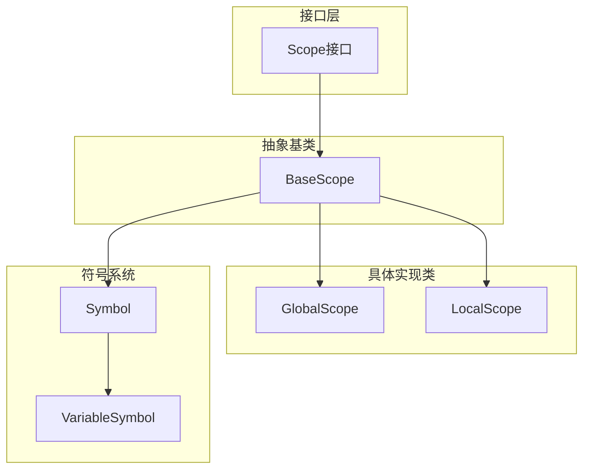
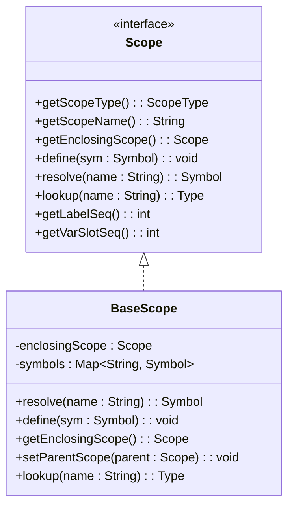
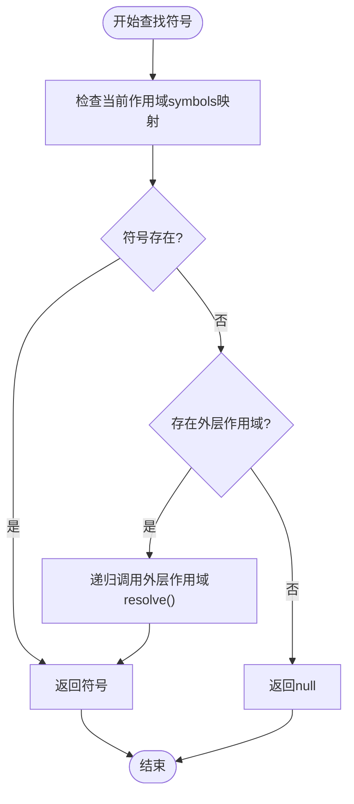
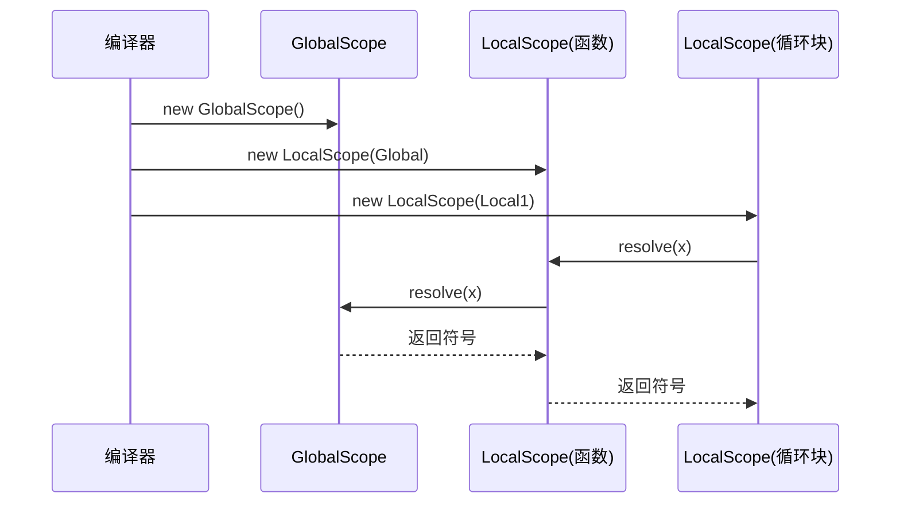

# 作用域系统

<cite>
**本文档中引用的文件**  
- [BaseScope.java](file://ep20/src/main/java/org/teachfx/antlr4/ep20/symtab/scope/BaseScope.java)
- [GlobalScope.java](file://ep20/src/main/java/org/teachfx/antlr4/ep20/symtab/scope/GlobalScope.java)
- [LocalScope.java](file://ep20/src/main/java/org/teachfx/antlr4/ep20/symtab/scope/LocalScope.java)
- [Scope.java](file://ep20/src/main/java/org/teachfx/antlr4/ep20/symtab/scope/Scope.java)
- [Symbol.java](file://ep20/src/main/java/org/teachfx/antlr4/ep20/symtab/symbol/Symbol.java)
- [VariableSymbol.java](file://ep20/src/main/java/org/teachfx/antlr4/ep20/symtab/symbol/VariableSymbol.java)
</cite>

## 目录
1. [简介](#简介)
2. [作用域系统架构](#作用域系统架构)
3. [核心组件分析](#核心组件分析)
4. [作用域层次结构与继承关系](#作用域层次结构与继承关系)
5. [符号存储与查找机制](#符号存储与查找机制)
6. [作用域链的创建与关联机制](#作用域链的创建与关联机制)
7. [作用域生命周期管理](#作用域生命周期管理)
8. [变量可见性与嵌套规则](#变量可见性与嵌套规则)
9. [性能优化与异常处理](#性能优化与异常处理)
10. [结论](#结论)

## 简介
作用域系统是编程语言实现中的核心组成部分，负责管理变量、函数和其他符号的声明与可见性。本系统基于ANTLR4构建，采用面向对象的设计模式，通过`Scope`接口和`BaseScope`基类实现统一的行为规范，并由`GlobalScope`和`LocalScope`具体类实现全局与局部作用域的差异化行为。该设计支持函数定义、循环块和条件语句中的嵌套作用域管理。

## 作用域系统架构
作用域系统采用分层架构设计，以接口定义通用行为，基类提供共享实现，具体子类扩展特定功能。整个系统围绕符号表（Symbol Table）机制展开，确保程序中每个标识符在正确的作用域内被解析和使用。



**图示来源**  
- [Scope.java](file://ep20/src/main/java/org/teachfx/antlr4/ep20/symtab/scope/Scope.java)
- [BaseScope.java](file://ep20/src/main/java/org/teachfx/antlr4/ep20/symtab/scope/BaseScope.java)
- [GlobalScope.java](file://ep20/src/main/java/org/teachfx/antlr4/ep20/symtab/scope/GlobalScope.java)
- [LocalScope.java](file://ep20/src/main/java/org/teachfx/antlr4/ep20/symtab/scope/LocalScope.java)

**本节来源**  
- [Scope.java](file://ep20/src/main/java/org/teachfx/antlr4/ep20/symtab/scope/Scope.java)
- [BaseScope.java](file://ep20/src/main/java/org/teachfx/antlr4/ep20/symtab/scope/BaseScope.java)

## 核心组件分析
作用域系统的核心组件包括作用域接口、基类、具体作用域实现以及符号类体系。这些组件协同工作，形成完整的符号解析环境。

### Scope接口定义
`Scope`接口定义了所有作用域必须实现的通用行为，包括作用域类型获取、父作用域访问、符号定义与解析、名称查询等。此外还包含用于代码生成的标签和变量槽位管理方法。

**本节来源**  
- [Scope.java](file://ep20/src/main/java/org/teachfx/antlr4/ep20/symtab/scope/Scope.java#L1-L35)

### BaseScope基类
`BaseScope`作为所有作用域的抽象基类，提供了符号存储（`symbols`映射）、作用域嵌套（`enclosingScope`）、符号定义与解析的默认实现。它在构造时预定义基本类型（int、float、void、boolean）和内置函数（如print），确保语言基础功能可用。



**图示来源**  
- [BaseScope.java](file://ep20/src/main/java/org/teachfx/antlr4/ep20/symtab/scope/BaseScope.java#L1-L71)
- [Scope.java](file://ep20/src/main/java/org/teachfx/antlr4/ep20/symtab/scope/Scope.java#L1-L35)

**本节来源**  
- [BaseScope.java](file://ep20/src/main/java/org/teachfx/antlr4/ep20/symtab/scope/BaseScope.java#L1-L71)

## 作用域层次结构与继承关系
系统采用继承机制实现作用域的层次化设计。`GlobalScope`和`LocalScope`均继承自`BaseScope`，共享其符号管理能力，同时各自实现特定行为。

```mermaid
classDiagram
class BaseScope {
<<abstract>>
}
class GlobalScope
class LocalScope
BaseScope <|-- GlobalScope
BaseScope <|-- LocalScope
GlobalScope : +getScopeName() : String
GlobalScope : +getLabelSeq() : int
GlobalScope : +getVarSlotSeq() : int
LocalScope : +getScopeName() : String
LocalScope : +define(sym : Symbol) : void
LocalScope : +getVarSlotSeq() : int
LocalScope : +setBaseVarSlotSeq(base : int) : int
```

**图示来源**  
- [BaseScope.java](file://ep20/src/main/java/org/teachfx/antlr4/ep20/symtab/scope/BaseScope.java#L1-L71)
- [GlobalScope.java](file://ep20/src/main/java/org/teachfx/antlr4/ep20/symtab/scope/GlobalScope.java#L1-L36)
- [LocalScope.java](file://ep20/src/main/java/org/teachfx/antlr4/ep20/symtab/scope/LocalScope.java#L1-L52)

**本节来源**  
- [GlobalScope.java](file://ep20/src/main/java/org/teachfx/antlr4/ep20/symtab/scope/GlobalScope.java#L1-L36)
- [LocalScope.java](file://ep20/src/main/java/org/teachfx/antlr4/ep20/symtab/scope/LocalScope.java#L1-L52)

## 符号存储与查找机制
作用域系统通过`LinkedHashMap<String, Symbol>`实现符号的高效存储与查找。符号解析遵循“当前作用域→外层作用域”的链式查找策略，支持嵌套环境下的变量访问。

### 符号查找流程


**图示来源**  
- [BaseScope.java](file://ep20/src/main/java/org/teachfx/antlr4/ep20/symtab/scope/BaseScope.java#L25-L35)

**本节来源**  
- [BaseScope.java](file://ep20/src/main/java/org/teachfx/antlr4/ep20/symtab/scope/BaseScope.java#L25-L35)
- [Symbol.java](file://ep20/src/main/java/org/teachfx/antlr4/ep20/symtab/symbol/Symbol.java#L1-L93)

## 作用域链的创建与关联机制
作用域链通过构造函数参数建立父子关系。全局作用域无父作用域，而局部作用域在创建时接收其外层作用域作为参数，形成链式结构。

### 作用域链构建示例


**图示来源**  
- [GlobalScope.java](file://ep20/src/main/java/org/teachfx/antlr4/ep20/symtab/scope/GlobalScope.java#L1-L36)
- [LocalScope.java](file://ep20/src/main/java/org/teachfx/antlr4/ep20/symtab/scope/LocalScope.java#L1-L52)

**本节来源**  
- [LocalScope.java](file://ep20/src/main/java/org/teachfx/antlr4/ep20/symtab/scope/LocalScope.java#L1-L52)

## 作用域生命周期管理
作用域的生命周期与其语法结构紧密相关。全局作用域伴随程序始终存在；函数作用域在函数定义时创建，调用时激活；循环和条件语句的作用域在进入块时创建，退出时销毁。

### 生命周期管理策略
| 作用域类型 | 创建时机 | 销毁时机 | 管理方式 |
|----------|--------|--------|--------|
| 全局作用域 | 编译器初始化 | 程序结束 | 单例持有 |
| 函数作用域 | 函数声明解析 | 函数符号表构建完成 | 栈式管理 |
| 局部块作用域 | 进入{...}块 | 退出块 | 栈式推入/弹出 |

**本节来源**  
- [LocalScope.java](file://ep20/src/main/java/org/teachfx/antlr4/ep20/symtab/scope/LocalScope.java#L1-L52)
- [BaseScope.java](file://ep20/src/main/java/org/teachfx/antlr4/ep20/symtab/scope/BaseScope.java#L1-L71)

## 变量可见性与嵌套规则
变量可见性遵循“就近原则”：优先查找当前作用域，未找到则逐层向外查找。不允许同层作用域重复定义相同名称的变量。

### 变量可见性规则


**本节来源**  
- [BaseScope.java](file://ep20/src/main/java/org/teachfx/antlr4/ep20/symtab/scope/BaseScope.java#L25-L35)
- [VariableSymbol.java](file://ep20/src/main/java/org/teachfx/antlr4/ep20/symtab/symbol/VariableSymbol.java#L1-L19)

## 性能优化与异常处理
系统通过有序映射（`LinkedHashMap`）保证符号插入顺序，便于调试信息输出。符号查找采用短路策略，一旦找到即返回，避免不必要的遍历。

### 异常处理机制
- **重复定义检测**：`define()`方法未显式检查重名，依赖上层语义分析器在插入前判断。
- **未定义符号处理**：`resolve()`返回null表示未找到，由调用方决定是否报错。
- **空指针防护**：对外层作用域判空，防止递归查找时发生NPE。

**本节来源**  
- [BaseScope.java](file://ep20/src/main/java/org/teachfx/antlr4/ep20/symtab/scope/BaseScope.java#L37-L45)
- [Symbol.java](file://ep20/src/main/java/org/teachfx/antlr4/ep20/symtab/symbol/Symbol.java#L1-L93)

## 结论
本作用域系统通过清晰的继承结构和接口抽象，实现了灵活且可扩展的符号管理机制。`BaseScope`提供通用功能，`GlobalScope`和`LocalScope`分别处理全局与局部环境，配合`Symbol`体系完成变量、函数等实体的建模。该设计支持复杂的嵌套结构，为编译器的语义分析阶段提供了坚实基础。