# 符号定义

<cite>
**本文档中引用的文件**  
- [LocalDefine.java](file://ep19/src/main/java/org/teachfx/antlr4/ep19/pass/LocalDefine.java)
- [VariableSymbol.java](file://ep19/src/main/java/org/teachfx/antlr4/ep19/symtab/symbol/VariableSymbol.java)
- [MethodSymbol.java](file://ep19/src/main/java/org/teachfx/antlr4/ep19/symtab/symbol/MethodSymbol.java)
- [StructSymbol.java](file://ep19/src/main/java/org/teachfx/antlr4/ep19/symtab/symbol/StructSymbol.java)
- [Scope.java](file://ep19/src/main/java/org/teachfx/antlr4/ep19/symtab/scope/Scope.java)
- [BaseScope.java](file://ep19/src/main/java/org/teachfx/antlr4/ep19/symtab/scope/BaseScope.java)
- [GlobalScope.java](file://ep19/src/main/java/org/teachfx/antlr4/ep19/symtab/scope/GlobalScope.java)
- [LocalScope.java](file://ep19/src/main/java/org/teachfx/antlr4/ep19/symtab/scope/LocalScope.java)
</cite>

## 目录
1. [引言](#引言)
2. [符号定义概述](#符号定义概述)
3. [LocalDefine访问者分析](#localdefine访问者分析)
4. [核心符号类型详解](#核心符号类型详解)
5. [作用域管理机制](#作用域管理机制)
6. [符号创建流程](#符号创建流程)
7. [符号冲突检测](#符号冲突检测)
8. [高级符号扩展](#高级符号扩展)
9. [结论](#结论)

## 引言
符号定义是编译器前端的重要阶段，负责在AST遍历过程中收集变量、函数和结构体的声明信息。本文档详细阐述LocalDefine访问者如何实现符号收集，分析VariableSymbol、MethodSymbol和StructSymbol等符号类型的属性定义和创建过程。

## 符号定义概述
符号定义阶段的主要任务是在抽象语法树（AST）遍历过程中，识别并收集程序中所有声明的符号信息，包括变量、函数和结构体。这些符号信息被组织在作用域层次结构中，为后续的类型检查和代码生成提供基础。

**符号定义阶段的关键功能包括**：
- 建立作用域层次结构
- 收集变量、函数和结构体声明
- 维护符号的名称、类型、作用域和位置信息
- 检测重复声明和符号冲突

**Section sources**
- [LocalDefine.java](file://ep19/src/main/java/org/teachfx/antlr4/ep19/pass/LocalDefine.java#L31-L324)

## LocalDefine访问者分析
LocalDefine类是实现符号定义的核心访问者，继承自CymbolASTVisitor，通过遍历AST来收集符号信息。

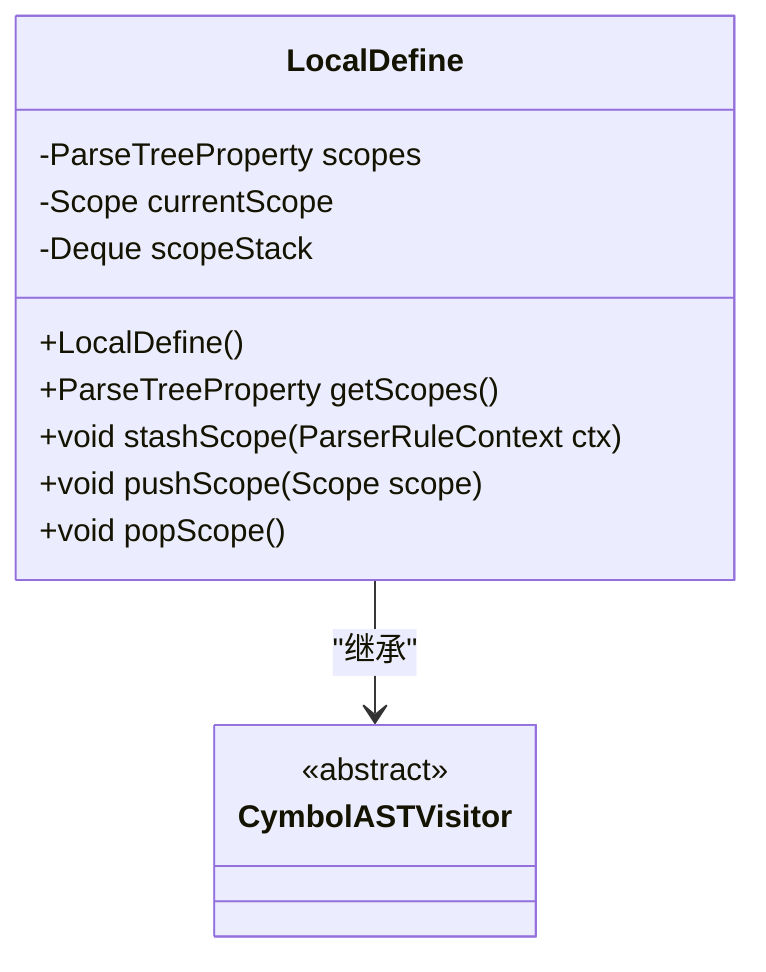

**Diagram sources**
- [LocalDefine.java](file://ep19/src/main/java/org/teachfx/antlr4/ep19/pass/LocalDefine.java#L31-L324)

### LocalDefine初始化
LocalDefine构造函数初始化全局作用域，并在其中注册基本类型和内置函数。

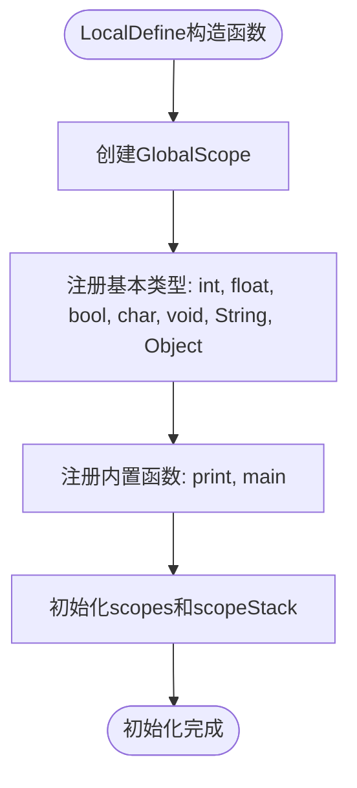

**Diagram sources**
- [LocalDefine.java](file://ep19/src/main/java/org/teachfx/antlr4/ep19/pass/LocalDefine.java#L31-L78)

**Section sources**
- [LocalDefine.java](file://ep19/src/main/java/org/teachfx/antlr4/ep19/pass/LocalDefine.java#L31-L78)

### 作用域管理方法
LocalDefine提供了三个核心方法来管理作用域：

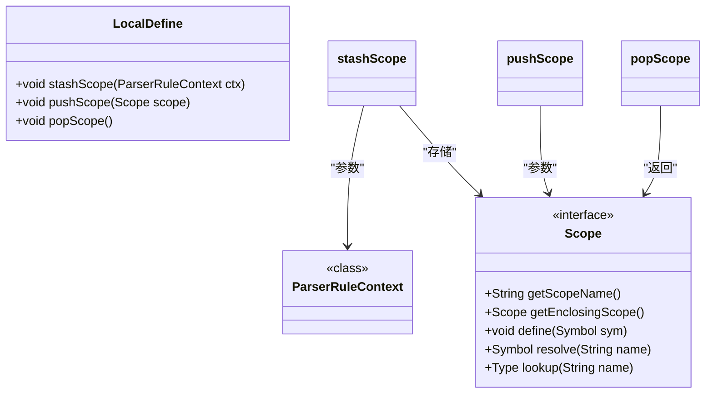

**Diagram sources**
- [LocalDefine.java](file://ep19/src/main/java/org/teachfx/antlr4/ep19/pass/LocalDefine.java#L300-L324)
- [Scope.java](file://ep19/src/main/java/org/teachfx/antlr4/ep19/symtab/scope/Scope.java#L0-L19)

**Section sources**
- [LocalDefine.java](file://ep19/src/main/java/org/teachfx/antlr4/ep19/pass/LocalDefine.java#L300-L324)

## 核心符号类型详解
### VariableSymbol分析
VariableSymbol类表示变量符号，继承自Symbol基类。

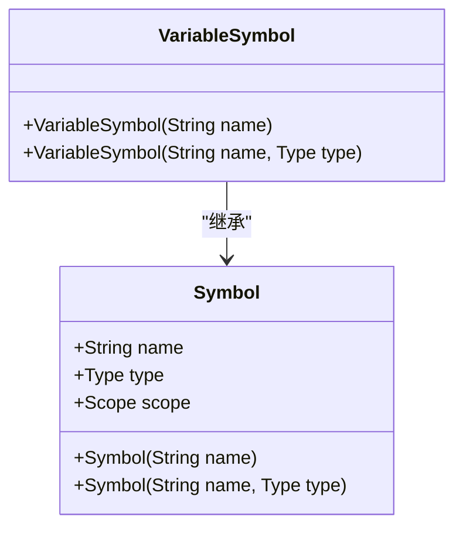

**Diagram sources**
- [VariableSymbol.java](file://ep19/src/main/java/org/teachfx/antlr4/ep19/symtab/symbol/VariableSymbol.java#L2-L12)

**Section sources**
- [VariableSymbol.java](file://ep19/src/main/java/org/teachfx/antlr4/ep19/symtab/symbol/VariableSymbol.java#L2-L12)

### MethodSymbol分析
MethodSymbol类表示方法符号，继承自ScopedSymbol并实现Type接口。

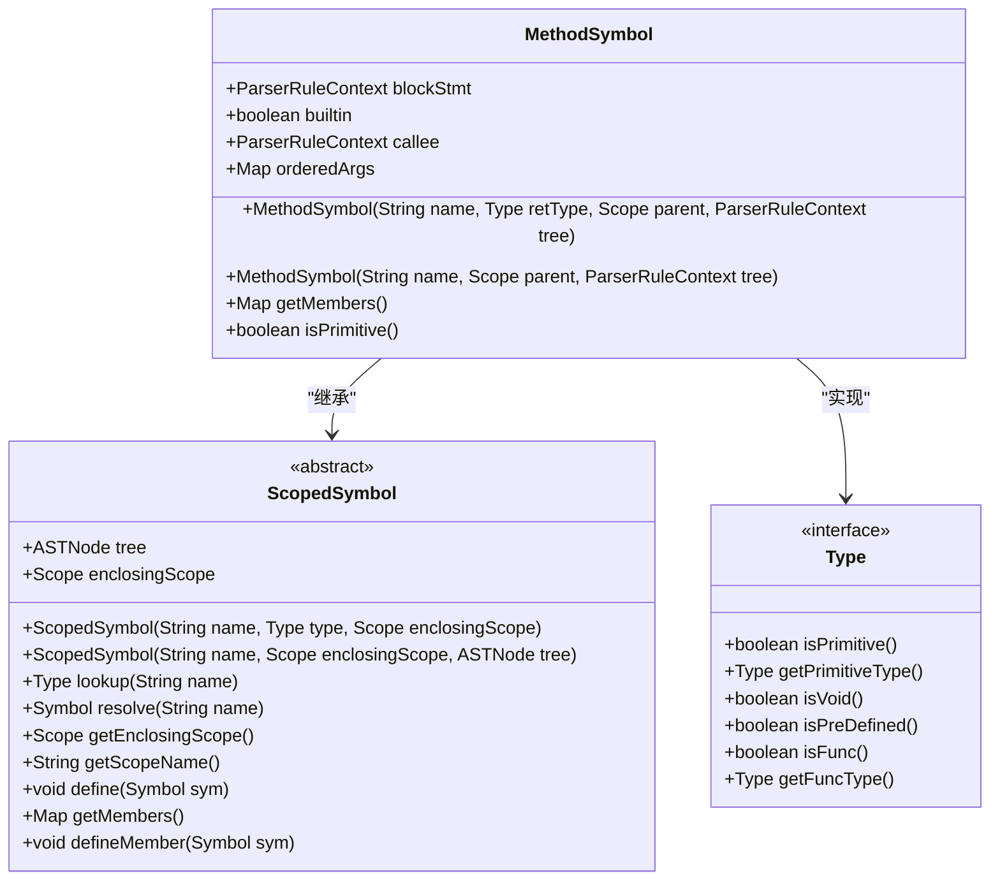

**Diagram sources**
- [MethodSymbol.java](file://ep19/src/main/java/org/teachfx/antlr4/ep19/symtab/symbol/MethodSymbol.java#L7-L38)

**Section sources**
- [MethodSymbol.java](file://ep19/src/main/java/org/teachfx/antlr4/ep19/symtab/symbol/MethodSymbol.java#L7-L38)

### StructSymbol分析
StructSymbol类表示结构体符号，继承自ScopedSymbol并实现Type接口。

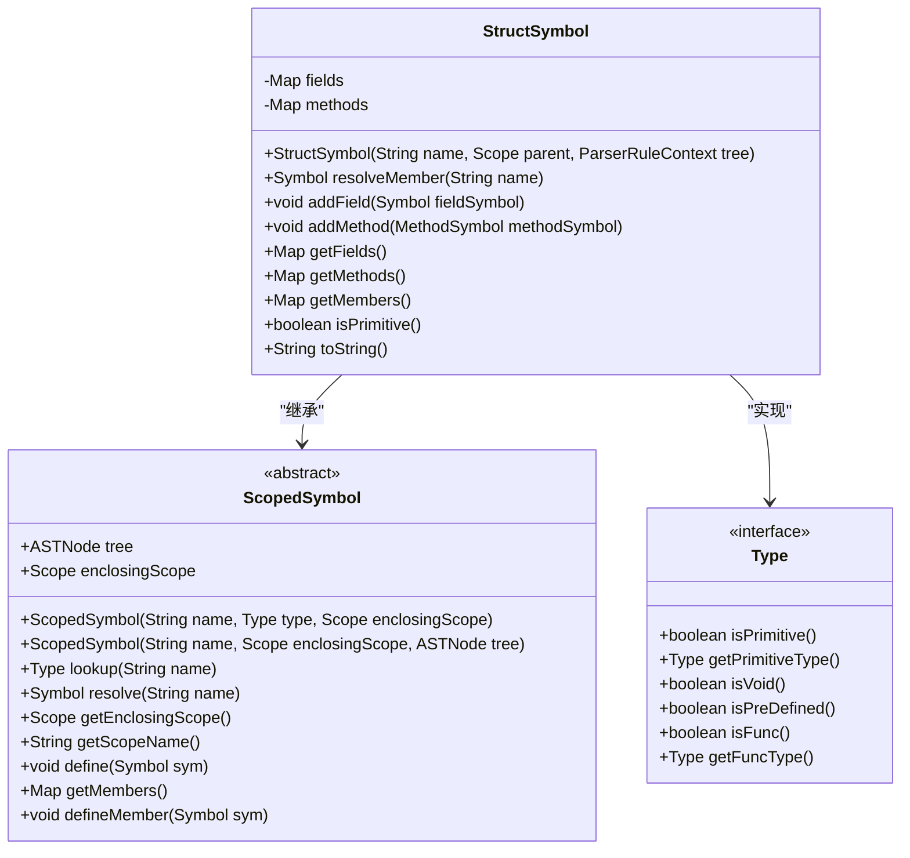

**Diagram sources**
- [StructSymbol.java](file://ep19/src/main/java/org/teachfx/antlr4/ep19/symtab/symbol/StructSymbol.java#L10-L100)

**Section sources**
- [StructSymbol.java](file://ep19/src/main/java/org/teachfx/antlr4/ep19/symtab/symbol/StructSymbol.java#L10-L100)

## 作用域管理机制
### 作用域层次结构
符号系统采用层次化的作用域管理，包括全局作用域、局部作用域和结构体作用域。

```mermaid
graph TD
GlobalScope[GlobalScope] --> BaseScope[BaseScope]
LocalScope[LocalScope] --> BaseScope[BaseScope]
StructSymbol[StructSymbol] --> ScopedSymbol[ScopedSymbol]
MethodSymbol[MethodSymbol] --> ScopedSymbol[ScopedSymbol]
BaseScope --> Scope[Scope]
ScopedSymbol --> Scope[Scope]
Scope --> define[define(Symbol sym)]
Scope --> resolve[resolve(String name)]
Scope --> getEnclosingScope[getEnclosingScope()]
Scope --> getScopeName[getScopeName()]
```

**Diagram sources**
- [GlobalScope.java](file://ep19/src/main/java/org/teachfx/antlr4/ep19/symtab/scope/GlobalScope.java#L0-L15)
- [LocalScope.java](file://ep19/src/main/java/org/teachfx/antlr4/ep19/symtab/scope/LocalScope.java#L0-L13)
- [BaseScope.java](file://ep19/src/main/java/org/teachfx/antlr4/ep19/symtab/scope/BaseScope.java#L0-L67)

**Section sources**
- [GlobalScope.java](file://ep19/src/main/java/org/teachfx/antlr4/ep19/symtab/scope/GlobalScope.java#L0-L15)
- [LocalScope.java](file://ep19/src/main/java/org/teachfx/antlr4/ep19/symtab/scope/LocalScope.java#L0-L13)
- [BaseScope.java](file://ep19/src/main/java/org/teachfx/antlr4/ep19/symtab/scope/BaseScope.java#L0-L67)

### 作用域遍历流程
LocalDefine通过访问不同类型的AST节点来管理作用域。

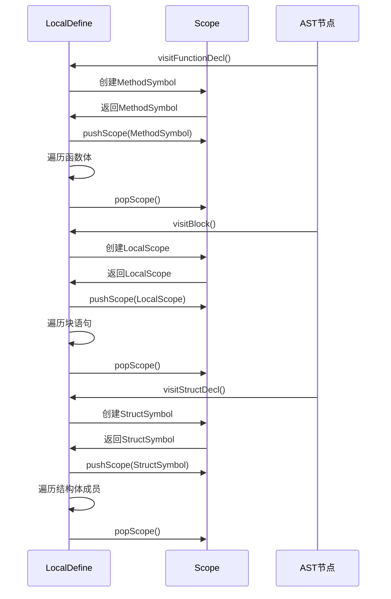

**Diagram sources**
- [LocalDefine.java](file://ep19/src/main/java/org/teachfx/antlr4/ep19/pass/LocalDefine.java#L100-L150)

**Section sources**
- [LocalDefine.java](file://ep19/src/main/java/org/teachfx/antlr4/ep19/pass/LocalDefine.java#L100-L150)

## 符号创建流程
### 变量符号创建
当遇到变量声明时，LocalDefine会创建VariableSymbol并将其添加到当前作用域。

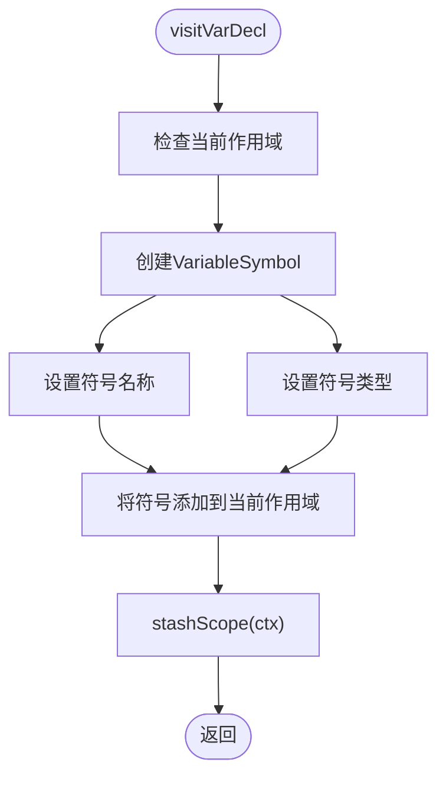

**Diagram sources**
- [LocalDefine.java](file://ep19/src/main/java/org/teachfx/antlr4/ep19/pass/LocalDefine.java#L80-L85)

**Section sources**
- [LocalDefine.java](file://ep19/src/main/java/org/teachfx/antlr4/ep19/pass/LocalDefine.java#L80-L85)

### 函数符号创建
函数声明的处理流程包括创建方法符号、设置作用域和遍历函数体。

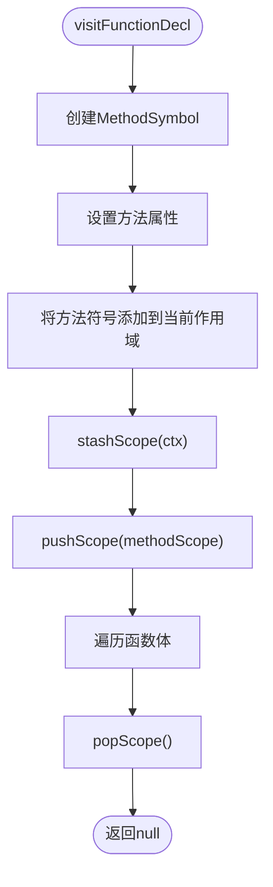

**Diagram sources**
- [LocalDefine.java](file://ep19/src/main/java/org/teachfx/antlr4/ep19/pass/LocalDefine.java#L100-L115)

**Section sources**
- [LocalDefine.java](file://ep19/src/main/java/org/teachfx/antlr4/ep19/pass/LocalDefine.java#L100-L115)

### 结构体符号创建
结构体声明的处理涉及创建结构体符号、处理成员和管理作用域。

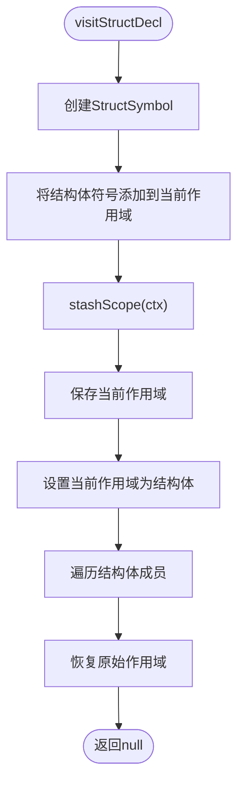

**Diagram sources**
- [LocalDefine.java](file://ep19/src/main/java/org/teachfx/antlr4/ep19/pass/LocalDefine.java#L87-L100)

**Section sources**
- [LocalDefine.java](file://ep19/src/main/java/org/teachfx/antlr4/ep19/pass/LocalDefine.java#L87-L100)

## 符号冲突检测
### 重复声明检测
符号系统通过作用域的define方法来检测重复声明。

```mermaid
flowchart TD
Start([define(Symbol sym)]) --> CheckExist["检查符号是否已存在"]
CheckExist --> Exists{"符号已存在?"}
Exists --> |是| HandleConflict["处理冲突: 抛出错误或覆盖"]
Exists --> |否| AddSymbol["将符号添加到作用域映射"]
AddSymbol --> SetScope["设置符号的作用域"]
SetScope --> End([完成])
```

**Diagram sources**
- [BaseScope.java](file://ep19/src/main/java/org/teachfx/antlr4/ep19/symtab/scope/BaseScope.java#L40-L50)

**Section sources**
- [BaseScope.java](file://ep19/src/main/java/org/teachfx/antlr4/ep19/symtab/scope/BaseScope.java#L40-L50)

### 作用域内符号解析
符号解析遵循词法作用域规则，从内层作用域向外层作用域查找。

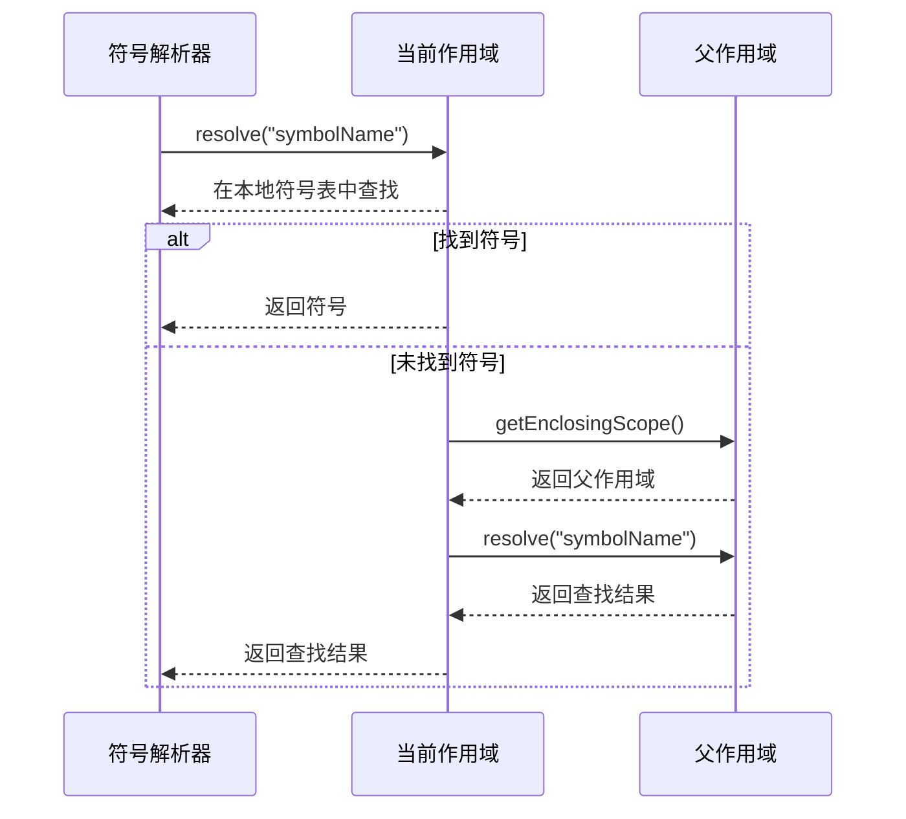

**Diagram sources**
- [BaseScope.java](file://ep19/src/main/java/org/teachfx/antlr4/ep19/symtab/scope/BaseScope.java#L30-L40)

**Section sources**
- [BaseScope.java](file://ep19/src/main/java/org/teachfx/antlr4/ep19/symtab/scope/BaseScope.java#L30-L40)

## 高级符号扩展
### 自定义符号类型
系统支持通过继承Symbol基类来创建自定义符号类型。

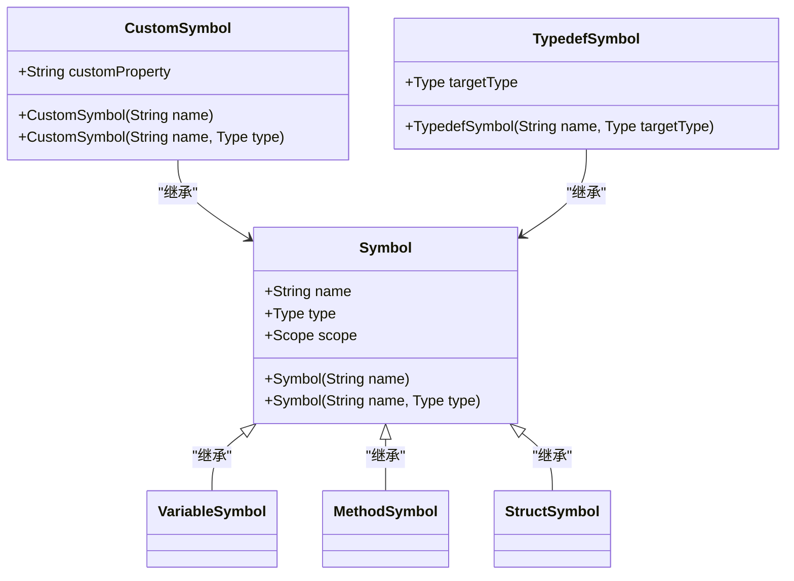

**Diagram sources**
- [VariableSymbol.java](file://ep19/src/main/java/org/teachfx/antlr4/ep19/symtab/symbol/VariableSymbol.java#L2-L12)
- [MethodSymbol.java](file://ep19/src/main/java/org/teachfx/antlr4/ep19/symtab/symbol/MethodSymbol.java#L7-L38)
- [StructSymbol.java](file://ep19/src/main/java/org/teachfx/antlr4/ep19/symtab/symbol/StructSymbol.java#L10-L100)

**Section sources**
- [VariableSymbol.java](file://ep19/src/main/java/org/teachfx/antlr4/ep19/symtab/symbol/VariableSymbol.java#L2-L12)
- [MethodSymbol.java](file://ep19/src/main/java/org/teachfx/antlr4/ep19/symtab/symbol/MethodSymbol.java#L7-L38)
- [StructSymbol.java](file://ep19/src/main/java/org/teachfx/antlr4/ep19/symtab/symbol/StructSymbol.java#L10-L100)

### 符号元数据扩展
符号对象可以扩展以包含额外的元数据信息。

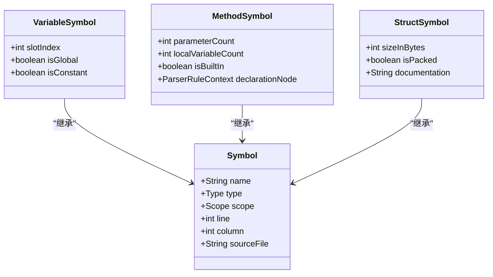

**Diagram sources**
- [VariableSymbol.java](file://ep19/src/main/java/org/teachfx/antlr4/ep19/symtab/symbol/VariableSymbol.java#L2-L12)
- [MethodSymbol.java](file://ep19/src/main/java/org/teachfx/antlr4/ep19/symtab/symbol/MethodSymbol.java#L7-L38)
- [StructSymbol.java](file://ep19/src/main/java/org/teachfx/antlr4/ep19/symtab/symbol/StructSymbol.java#L10-L100)

**Section sources**
- [VariableSymbol.java](file://ep19/src/main/java/org/teachfx/antlr4/ep19/symtab/symbol/VariableSymbol.java#L2-L12)
- [MethodSymbol.java](file://ep19/src/main/java/org/teachfx/antlr4/ep19/symtab/symbol/MethodSymbol.java#L7-L38)
- [StructSymbol.java](file://ep19/src/main/java/org/teachfx/antlr4/ep19/symtab/symbol/StructSymbol.java#L10-L100)

## 结论
符号定义是编译器前端的关键阶段，通过LocalDefine访问者在AST遍历过程中收集变量、函数和结构体的声明信息。系统采用层次化的作用域管理机制，确保符号的正确解析和冲突检测。VariableSymbol、MethodSymbol和StructSymbol等核心符号类型提供了丰富的属性定义，支持后续的类型检查和代码生成。通过继承和扩展机制，系统可以支持自定义符号类型和元数据扩展，为编译器的进一步开发提供了灵活的基础。