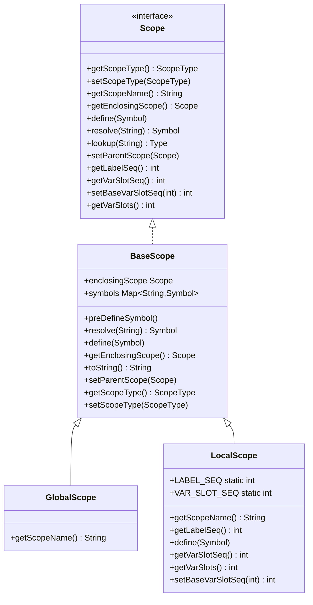
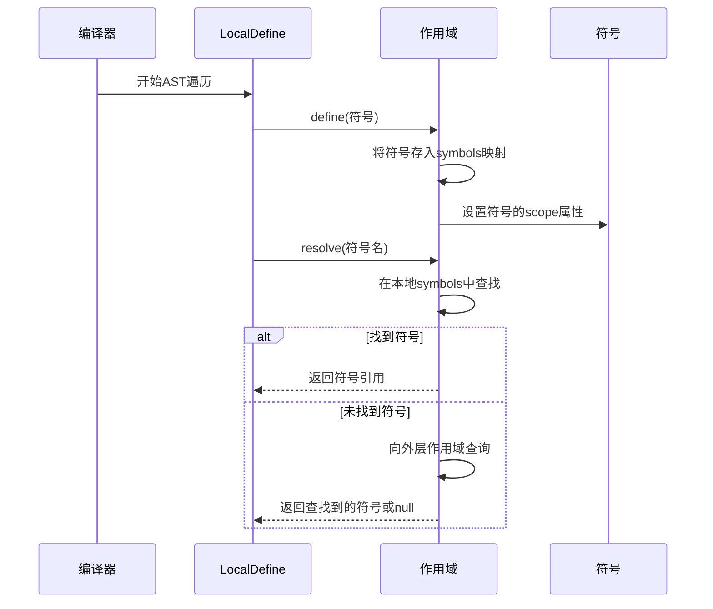
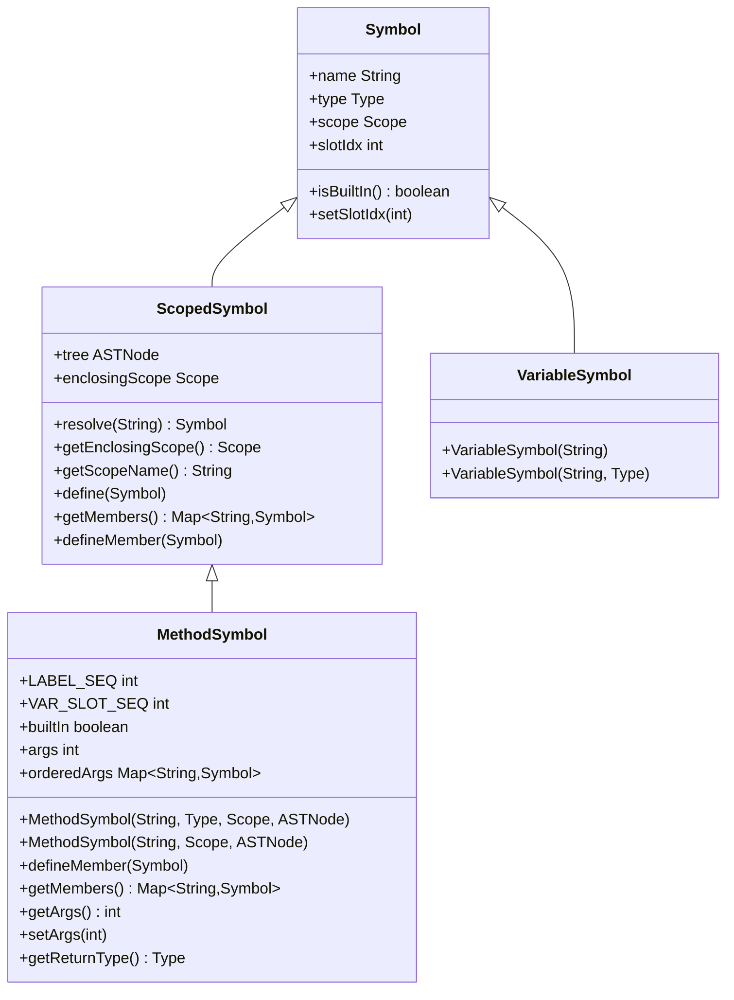
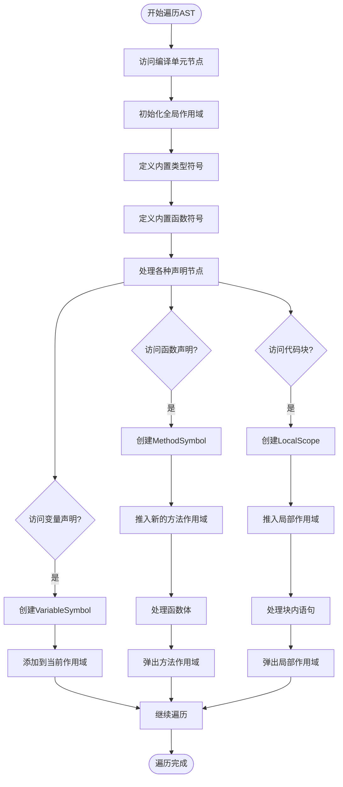
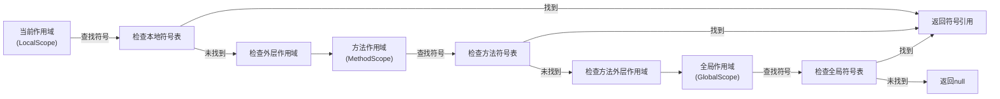
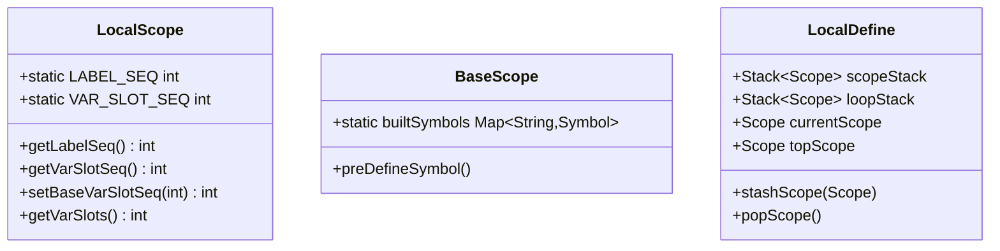
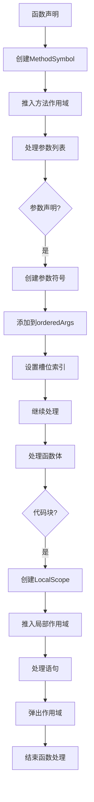

# 符号表管理

<cite>
**本文档中引用的文件**  
- [ScopedSymbol.java](file://ep20/src/main/java/org/teachfx/antlr4/ep20/symtab/symbol/ScopedSymbol.java)
- [Scope.java](file://ep20/src/main/java/org/teachfx/antlr4/ep20/symtab/scope/Scope.java)
- [BaseScope.java](file://ep20/src/main/java/org/teachfx/antlr4/ep20/symtab/scope/BaseScope.java)
- [GlobalScope.java](file://ep20/src/main/java/org/teachfx/antlr4/ep20/symtab/scope/GlobalScope.java)
- [LocalScope.java](file://ep20/src/main/java/org/teachfx/antlr4/ep20/symtab/scope/LocalScope.java)
- [MethodSymbol.java](file://ep20/src/main/java/org/teachfx/antlr4/ep20/symtab/symbol/MethodSymbol.java)
- [VariableSymbol.java](file://ep20/src/main/java/org/teachfx/antlr4/ep20/symtab/symbol/VariableSymbol.java)
- [LocalDefine.java](file://ep20/src/main/java/org/teachfx/antlr4/ep20/pass/symtab/LocalDefine.java)
</cite>

## 目录
1. [简介](#简介)
2. [作用域系统设计](#作用域系统设计)
3. [符号定义与解析机制](#符号定义与解析机制)
4. [符号类型实现](#符号类型实现)
5. [AST遍历与符号收集](#ast遍历与符号收集)
6. [作用域链查找过程](#作用域链查找过程)
7. [性能优化策略](#性能优化策略)
8. [复杂作用域场景处理](#复杂作用域场景处理)
9. [结论](#结论)

## 简介
本文档全面介绍基于Antlr4实现的编程语言中的符号表管理系统。重点阐述作用域系统的设计原理、符号定义与解析机制，以及在AST遍历过程中如何建立和维护符号信息。通过分析GlobalScope和LocalScope的层次结构，解释变量、函数等符号的生命周期管理，并为不同层次的用户提供从基础概念到高级优化的完整指导。

## 作用域系统设计

符号表管理系统采用层次化的作用域设计，通过作用域链实现符号的继承与查找。系统核心由Scope接口和BaseScope抽象类构成，提供了作用域的基本行为定义。

**图示来源**  
- [Scope.java](file://ep20/src/main/java/org/teachfx/antlr4/ep20/symtab/scope/Scope.java#L1-L35)
- [BaseScope.java](file://ep20/src/main/java/org/teachfx/antlr4/ep20/symtab/scope/BaseScope.java#L1-L70)
- [GlobalScope.java](file://ep20/src/main/java/org/teachfx/antlr4/ep20/symtab/scope/GlobalScope.java#L1-L14)
- [LocalScope.java](file://ep20/src/main/java/org/teachfx/antlr4/ep20/symtab/scope/LocalScope.java#L1-L51)

**本节来源**  
- [Scope.java](file://ep20/src/main/java/org/teachfx/antlr4/ep20/symtab/scope/Scope.java#L1-L35)
- [BaseScope.java](file://ep20/src/main/java/org/teachfx/antlr4/ep20/symtab/scope/BaseScope.java#L1-L70)

## 符号定义与解析机制

符号表系统通过define和resolve方法实现符号的定义与解析。当在作用域中定义符号时，系统会将其存储在本地符号映射中，并建立与作用域的关联关系。

**图示来源**  
- [BaseScope.java](file://ep20/src/main/java/org/teachfx/antlr4/ep20/symtab/scope/BaseScope.java#L39-L66)
- [ScopedSymbol.java](file://ep20/src/main/java/org/teachfx/antlr4/ep20/symtab/symbol/ScopedSymbol.java#L1-L69)

**本节来源**  
- [BaseScope.java](file://ep20/src/main/java/org/teachfx/antlr4/ep20/symtab/scope/BaseScope.java#L39-L66)
- [ScopedSymbol.java](file://ep20/src/main/java/org/teachfx/antlr4/ep20/symtab/symbol/ScopedSymbol.java#L1-L69)

## 符号类型实现

系统定义了多种符号类型来表示不同的程序实体，包括变量符号、方法符号等。这些符号类型继承自基础符号类，并扩展了特定的属性和行为。

### 变量符号
VariableSymbol类表示程序中的变量声明，包含变量名、类型信息和在内存中的槽位索引。

### 方法符号
MethodSymbol类表示函数或方法定义，不仅包含返回类型信息，还维护参数列表的有序映射。

**图示来源**  
- [Symbol.java](file://ep20/src/main/java/org/teachfx/antlr4/ep20/symtab/symbol/Symbol.java)
- [ScopedSymbol.java](file://ep20/src/main/java/org/teachfx/antlr4/ep20/symtab/symbol/ScopedSymbol.java#L1-L69)
- [VariableSymbol.java](file://ep20/src/main/java/org/teachfx/antlr4/ep20/symtab/symbol/VariableSymbol.java)
- [MethodSymbol.java](file://ep20/src/main/java/org/teachfx/antlr4/ep20/symtab/symbol/MethodSymbol.java#L1-L148)

**本节来源**  
- [MethodSymbol.java](file://ep20/src/main/java/org/teachfx/antlr4/ep20/symtab/symbol/MethodSymbol.java#L1-L148)
- [VariableSymbol.java](file://ep20/src/main/java/org/teachfx/antlr4/ep20/symtab/symbol/VariableSymbol.java)

## AST遍历与符号收集

LocalDefine类负责在AST遍历过程中收集符号信息并建立作用域关系。它通过访问者模式遍历语法树，在遇到声明节点时创建相应的符号对象。

**图示来源**  
- [LocalDefine.java](file://ep20/src/main/java/org/teachfx/antlr4/ep20/pass/symtab/LocalDefine.java#L1-L41)
- [LocalScope.java](file://ep20/src/main/java/org/teachfx/antlr4/ep20/symtab/scope/LocalScope.java#L1-L51)

**本节来源**  
- [LocalDefine.java](file://ep20/src/main/java/org/teachfx/antlr4/ep20/pass/symtab/LocalDefine.java#L1-L41)

## 作用域链查找过程

符号解析采用作用域链查找机制，从当前作用域开始，逐级向上查找，直到找到匹配的符号或到达全局作用域。

**图示来源**  
- [BaseScope.java](file://ep20/src/main/java/org/teachfx/antlr4/ep20/symtab/scope/BaseScope.java#L39-L66)
- [ScopedSymbol.java](file://ep20/src/main/java/org/teachfx/antlr4/ep20/symtab/symbol/ScopedSymbol.java#L1-L69)

**本节来源**  
- [BaseScope.java](file://ep20/src/main/java/org/teachfx/antlr4/ep20/symtab/scope/BaseScope.java#L39-L66)

## 性能优化策略

符号表系统采用了多种性能优化策略，包括静态序列号管理、内置符号预定义和作用域栈优化。

### 静态序列号管理
LocalScope类使用静态变量LABEL_SEQ和VAR_SLOT_SEQ来生成唯一的标签和变量槽位序列号，避免了重复计算。

### 内置符号预定义
BaseScope在初始化时预定义了所有内置类型符号，减少了运行时查找开销。

### 作用域栈优化
LocalDefine使用栈结构来管理作用域的推入和弹出，确保了作用域切换的高效性。

**图示来源**  
- [LocalScope.java](file://ep20/src/main/java/org/teachfx/antlr4/ep20/symtab/scope/LocalScope.java#L1-L51)
- [BaseScope.java](file://ep20/src/main/java/org/teachfx/antlr4/ep20/symtab/scope/BaseScope.java#L1-L70)
- [LocalDefine.java](file://ep20/src/main/java/org/teachfx/antlr4/ep20/pass/symtab/LocalDefine.java#L1-L41)

**本节来源**  
- [LocalScope.java](file://ep20/src/main/java/org/teachfx/antlr4/ep20/symtab/scope/LocalScope.java#L1-L51)

## 复杂作用域场景处理

系统能够处理多种复杂的作用域场景，包括嵌套作用域、循环作用域和函数参数作用域。

### 嵌套作用域处理
当遇到嵌套的代码块时，系统会创建新的LocalScope并将其作为当前作用域的子作用域。

### 循环作用域管理
系统使用专门的loopStack来管理循环语句的作用域，确保break和continue语句能够正确跳转。

### 函数参数作用域
函数声明时，参数会被添加到方法符号的orderedArgs映射中，形成有序的参数列表。

**图示来源**  
- [MethodSymbol.java](file://ep20/src/main/java/org/teachfx/antlr4/ep20/symtab/symbol/MethodSymbol.java#L1-L148)
- [LocalScope.java](file://ep20/src/main/java/org/teachfx/antlr4/ep20/symtab/scope/LocalScope.java#L1-L51)
- [LocalDefine.java](file://ep20/src/main/java/org/teachfx/antlr4/ep20/pass/symtab/LocalDefine.java#L1-L41)

**本节来源**  
- [MethodSymbol.java](file://ep20/src/main/java/org/teachfx/antlr4/ep20/symtab/symbol/MethodSymbol.java#L1-L148)

## 结论
本文档详细介绍了基于Antlr4实现的符号表管理系统，涵盖了作用域设计、符号定义与解析、AST遍历等多个方面。通过层次化的作用域结构和高效的作用域链查找机制，系统能够准确管理程序中的各种符号。对于初学者，理解作用域和生命周期的基本概念是掌握符号表管理的关键；对于高级用户，性能优化策略和复杂作用域场景的处理方法提供了深入优化的方向。该符号表管理系统为编译器的后续阶段（如类型检查、代码生成）提供了坚实的基础。