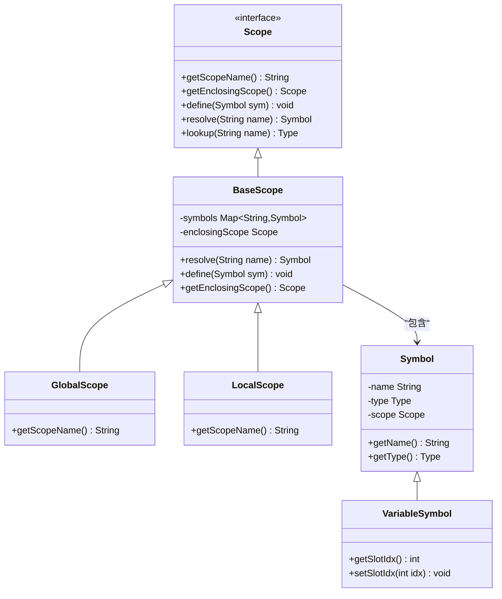
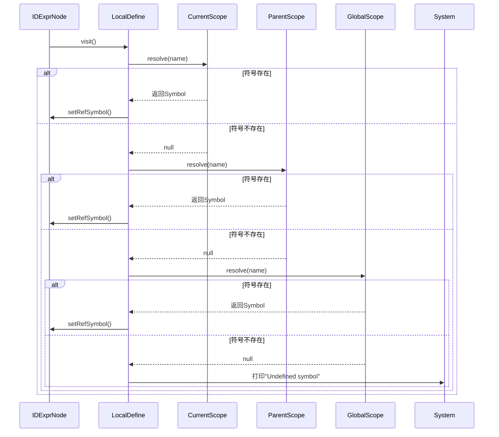

# 符号解析

<cite>
**本文档引用的文件**   
- [IDExprNode.java](file://ep20/src/main/java/org/teachfx/antlr4/ep20/ast/expr/IDExprNode.java)
- [LocalDefine.java](file://ep20/src/main/java/org/teachfx/antlr4/ep20/pass/symtab/LocalDefine.java)
- [Scope.java](file://ep20/src/main/java/org/teachfx/antlr4/ep20/symtab/scope/Scope.java)
- [BaseScope.java](file://ep19/src/main/java/org/teachfx/antlr4/ep19/symtab/scope/BaseScope.java)
- [VarDeclNode.java](file://ep20/src/main/java/org/teachfx/antlr4/ep20/ast/decl/VarDeclNode.java)
- [CymbolIRBuilder.java](file://ep21/src/main/java/org/teachfx/antlr4/ep21/pass/ir/CymbolIRBuilder.java)
- [ScopeUtil.java](file://ep19/src/main/java/org/teachfx/antlr4/ep19/misc/ScopeUtil.java)
</cite>

## 目录
1. [简介](#简介)
2. [作用域与符号表基础](#作用域与符号表基础)
3. [符号解析过程](#符号解析过程)
4. [IDExprNode与符号查找](#idexprnode与符号查找)
5. [类型信息获取与作用域边界处理](#类型信息获取与作用域边界处理)
6. [错误报告机制](#错误报告机制)
7. [高级特性](#高级特性)
8. [总结](#总结)

## 简介
符号解析是编译器语义分析阶段的关键步骤，负责将程序中的标识符引用与其声明进行绑定。本文档详细说明在基于Antlr4实现的编程语言中，如何通过作用域链完成符号解析，包括从局部到全局的作用域查找机制、符号绑定过程以及错误处理策略。

## 作用域与符号表基础

**图示来源**
- [Scope.java](file://ep20/src/main/java/org/teachfx/antlr4/ep20/symtab/scope/Scope.java#L0-L35)
- [BaseScope.java](file://ep19/src/main/java/org/teachfx/antlr4/ep19/symtab/scope/BaseScope.java#L39-L66)
- [Symbol.java](file://ep20/src/main/java/org/teachfx/antlr4/ep20/symtab/symbol/Symbol.java#L55-L92)

**本节来源**
- [Scope.java](file://ep20/src/main/java/org/teachfx/antlr4/ep20/symtab/scope/Scope.java#L0-L35)
- [BaseScope.java](file://ep19/src/main/java/org/teachfx/antlr4/ep19/symtab/scope/BaseScope.java#L39-L66)

## 符号解析过程
符号解析采用作用域链查找机制，从当前局部作用域开始，逐级向上查找至全局作用域。当遇到标识符引用时，编译器会从当前作用域的符号表开始搜索，若未找到则继续在父作用域中查找，直到全局作用域。

解析过程遵循以下步骤：
1. 从当前节点获取对应的作用域
2. 在当前作用域中查找符号
3. 若未找到且存在父作用域，则递归向上查找
4. 若到达全局作用域仍未找到，则报告"未知符号"错误

这种层级查找机制确保了变量的就近绑定原则，同时支持变量遮蔽（shadowing）语义。

**本节来源**
- [ScopeUtil.java](file://ep19/src/main/java/org/teachfx/antlr4/ep19/misc/ScopeUtil.java#L61-L112)
- [BaseScope.java](file://ep19/src/main/java/org/teachfx/antlr4/ep19/symtab/scope/BaseScope.java#L39-L66)

## IDExprNode与符号查找

**图示来源**
- [IDExprNode.java](file://ep20/src/main/java/org/teachfx/antlr4/ep20/ast/expr/IDExprNode.java#L0-L70)
- [LocalDefine.java](file://ep20/src/main/java/org/teachfx/antlr4/ep20/pass/symtab/LocalDefine.java#L39-L79)

**本节来源**
- [IDExprNode.java](file://ep20/src/main/java/org/teachfx/antlr4/ep20/ast/expr/IDExprNode.java#L0-L70)
- [LocalDefine.java](file://ep20/src/main/java/org/teachfx/antlr4/ep20/pass/symtab/LocalDefine.java#L39-L79)

## 类型信息获取与作用域边界处理
在符号解析过程中，不仅要完成标识符与声明的绑定，还需要获取相关的类型信息。`lookup`方法专门用于查询符号的类型，而`resolve`方法返回完整的符号对象。

作用域边界处理通过`getEnclosingScope()`方法实现，每个作用域都持有对其外围作用域的引用，形成作用域链。当解析器需要处理嵌套作用域（如函数内部、循环内部）时，会创建新的局部作用域并将其父作用域设置为当前作用域。

对于变量声明，系统会创建`VariableSymbol`对象并将其注册到当前作用域中；对于函数声明，则创建`MethodSymbol`并建立函数作用域。这种机制确保了不同作用域内的同名变量可以独立存在。

**本节来源**
- [Scope.java](file://ep20/src/main/java/org/teachfx/antlr4/ep20/symtab/scope/Scope.java#L0-L35)
- [VarDeclNode.java](file://ep20/src/main/java/org/teachfx/antlr4/ep20/ast/decl/VarDeclNode.java#L41-L66)
- [LocalDefine.java](file://ep20/src/main/java/org/teachfx/antlr4/ep20/pass/symtab/LocalDefine.java#L39-L79)

## 错误报告机制
当符号解析失败时，系统会触发错误报告机制。在`LocalDefine`访问器中，如果`resolve`方法返回null，表明在所有作用域中都未找到匹配的符号声明，此时会输出"Undefined symbol"错误信息。

错误报告包含未定义符号的名称，帮助开发者快速定位问题。该机制在编译时捕获符号引用错误，防止程序在运行时因未定义变量而崩溃。错误处理是静态语义分析的重要组成部分，确保了程序的类型安全和引用完整性。

**本节来源**
- [LocalDefine.java](file://ep20/src/main/java/org/teachfx/antlr4/ep20/pass/symtab/LocalDefine.java#L39-L79)
- [ScopeUtil.java](file://ep19/src/main/java/org/teachfx/antlr4/ep19/misc/ScopeUtil.java#L61-L112)

## 高级特性

### 性能优化
符号表采用哈希映射（HashMap）实现，确保符号查找的时间复杂度为O(1)。作用域链的层级结构避免了全局搜索，进一步提升了查找效率。对于频繁访问的内置类型（如int、float），系统在初始化时预先注册，减少运行时查找开销。

### 模糊查找
当前实现主要支持精确匹配查找。对于更复杂的语言特性，可扩展为支持名称相似度匹配或上下文感知的模糊查找，用于提供智能代码补全建议。

### 重载解析
虽然基础实现主要处理简单符号绑定，但通过扩展`MethodSymbol`类，可支持函数重载解析。重载解析需要考虑参数类型、数量等特征，选择最匹配的函数声明。

**本节来源**
- [SymbolTable.java](file://ep14/src/main/java/org/teachfx/antlr4/ep14/symtab/SymbolTable.java#L0-L49)
- [LocalDefine.java](file://ep20/src/main/java/org/teachfx/antlr4/ep20/pass/symtab/LocalDefine.java#L39-L79)

## 总结
符号解析是连接语法分析与语义分析的桥梁，通过作用域链机制实现了标识符引用与声明的正确绑定。`IDExprNode`作为标识符表达式的抽象语法树节点，通过`LocalDefine`访问器触发符号查找过程，最终与`VariableSymbol`等符号对象建立关联。该机制不仅确保了程序的语义正确性，还为后续的类型检查、代码生成等阶段提供了必要的信息支持。