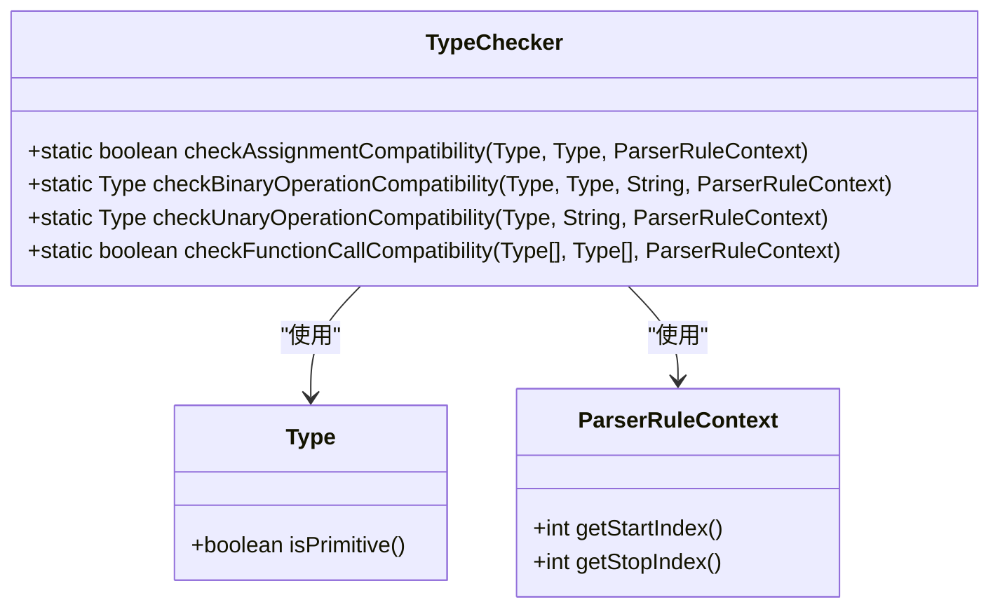
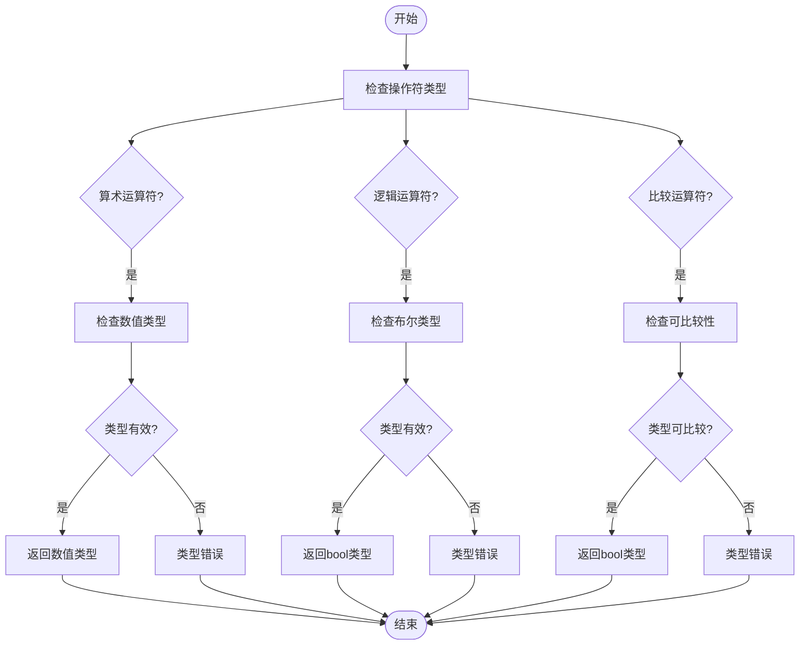
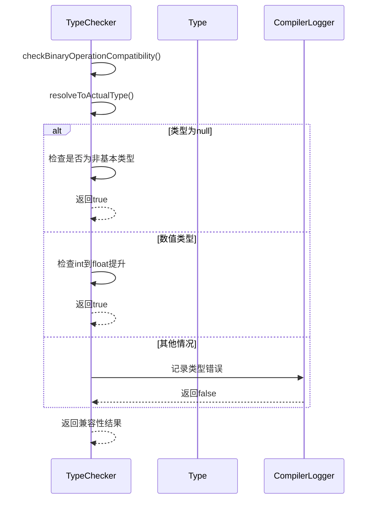
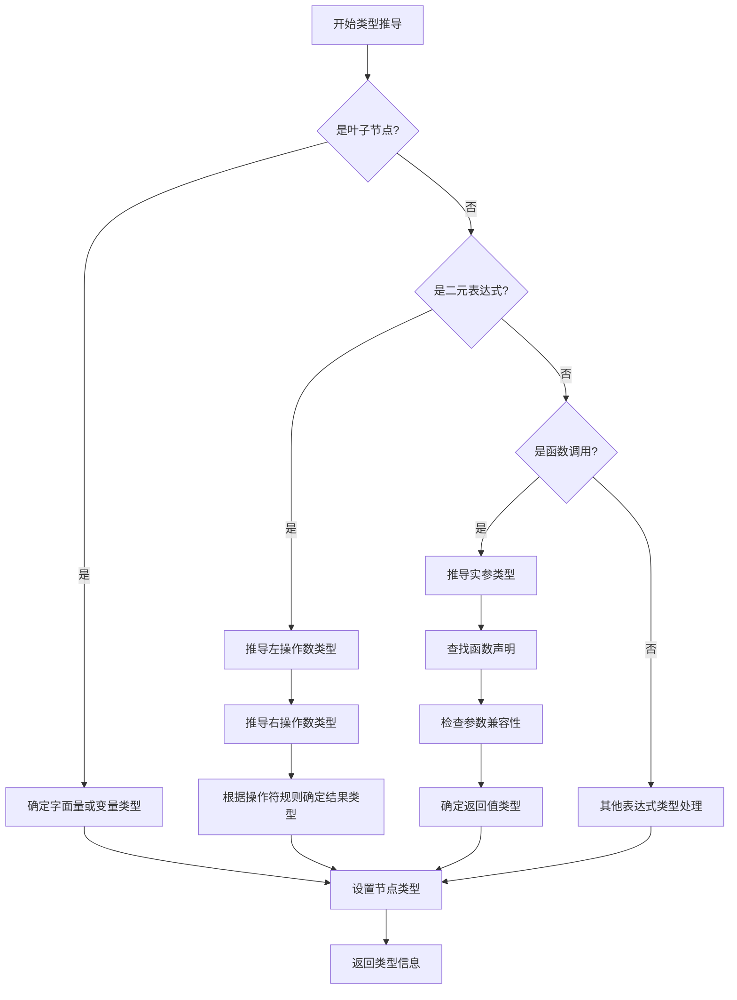

# 类型推导

<cite>
**本文档中引用的文件**
- [TypeChecker.java](file://ep19/src/main/java/org/teachfx/antlr4/ep19/symtab/TypeChecker.java)
- [ExprNode.java](file://ep20/src/main/java/org/teachfx/antlr4/ep20/ast/expr/ExprNode.java)
- [BinaryExprNode.java](file://ep20/src/main/java/org/teachfx/antlr4/ep20/ast/expr/BinaryExprNode.java)
- [TypeTable.java](file://ep20/src/main/java/org/teachfx/antlr4/ep20/symtab/type/TypeTable.java)
- [Symbol.java](file://ep20/src/main/java/org/teachfx/antlr4/ep20/symtab/symbol/Symbol.java)
</cite>

## 目录
1. [引言](#引言)
2. [类型推导基础](#类型推导基础)
3. [表达式类型推导算法](#表达式类型推导算法)
4. [二元运算符类型推导](#二元运算符类型推导)
5. [隐式转换与精度提升](#隐式转换与精度提升)
6. [复杂表达式处理](#复杂表达式处理)
7. [类型推导流程可视化](#类型推导流程可视化)
8. [类型推导与类型检查协同](#类型推导与类型检查协同)
9. [结论](#结论)

## 引言
类型推导是编译器在不显式声明类型的情况下，自动确定表达式和变量类型的机制。在本项目中，类型推导系统是编译器前端的重要组成部分，负责从抽象语法树（AST）的叶子节点开始，自底向上推导表达式的类型。该系统确保了程序的类型安全，为后续的代码生成和优化提供了基础。

## 类型推导基础
类型推导系统基于抽象语法树（AST）结构，从叶子节点开始向上推导类型。每个表达式节点都包含类型信息，通过访问者模式遍历AST来收集和计算类型。

### 字面量类型确定
字面量的类型在词法分析阶段就已经确定。例如，整数字面量被推导为`int`类型，浮点数字面量被推导为`float`类型，字符串字面量被推导为`String`类型。

### 变量引用类型查找
变量引用的类型通过符号表查找确定。当遇到变量引用时，类型推导器在当前作用域的符号表中查找变量声明，获取其声明的类型。

### 复合表达式类型计算
复合表达式的类型通过其子表达式的类型和操作符规则计算得出。例如，两个`int`类型的加法表达式结果类型为`int`。

**Section sources**
- [ExprNode.java](file://ep20/src/main/java/org/teachfx/antlr4/ep20/ast/expr/ExprNode.java#L25-L30)

## 表达式类型推导算法
表达式类型推导算法采用自底向上的方法，从AST的叶子节点开始，逐步向上推导每个节点的类型。

### 自底向上推导流程
类型推导器从AST的叶子节点（如字面量、变量引用）开始，这些节点的类型可以直接确定。然后向上处理内部节点（如二元表达式、函数调用），根据子节点的类型和操作规则计算当前节点的类型。

### TypeChecker实现
`TypeChecker`类是类型推导的核心实现，提供了各种类型检查和推导的静态方法。

**Diagram sources**
- [TypeChecker.java](file://ep19/src/main/java/org/teachfx/antlr4/ep19/symtab/TypeChecker.java#L11-L316)

**Section sources**
- [TypeChecker.java](file://ep19/src/main/java/org/teachfx/antlr4/ep19/symtab/TypeChecker.java#L11-L316)

## 二元运算符类型推导
二元运算符的类型推导遵循特定的规则，根据操作符类型和操作数类型确定结果类型。

### 算术运算类型推导
算术运算符（+、-、*、/）的类型推导规则如下：
- 当两个操作数都是`int`类型时，结果为`int`类型
- 当任一操作数是`float`类型时，结果为`float`类型（精度提升）
- 支持字符串连接，当任一操作数是`String`类型时，结果为`String`类型

### 逻辑运算类型推导
逻辑运算符（&&、||）要求操作数都是`bool`类型，结果也是`bool`类型。

### 比较运算类型推导
比较运算符（==、!=、<、>、<=、>=）的类型推导规则：
- 数值类型之间可以比较，结果为`bool`类型
- 相同类型的对象可以比较相等性
- `null`可以与任何非基本类型比较

**Diagram sources**
- [TypeChecker.java](file://ep19/src/main/java/org/teachfx/antlr4/ep19/symtab/TypeChecker.java#L107-L192)

**Section sources**
- [TypeChecker.java](file://ep19/src/main/java/org/teachfx/antlr4/ep19/symtab/TypeChecker.java#L107-L192)

## 隐式转换与精度提升
类型推导系统支持有限的隐式转换和精度提升规则，以提高语言的灵活性。

### 数值类型提升
在算术运算中，当`int`和`float`类型操作时，`int`类型会隐式提升为`float`类型，确保计算精度。

### null类型兼容性
`null`值可以赋值给任何非基本类型，这是类型系统中的特殊规则。

### 类型兼容性检查
类型兼容性检查通过`areTypesCompatible`方法实现，考虑了类型相同、数值提升和`null`兼容性等情况。

**Diagram sources**
- [TypeChecker.java](file://ep19/src/main/java/org/teachfx/antlr4/ep19/symtab/TypeChecker.java#L30-L67)

**Section sources**
- [TypeChecker.java](file://ep19/src/main/java/org/teachfx/antlr4/ep19/symtab/TypeChecker.java#L30-L67)

## 复杂表达式处理
类型推导器能够处理嵌套的复杂表达式和函数调用。

### 嵌套表达式推导
对于嵌套表达式，类型推导器按层次逐级推导，内层表达式的结果类型作为外层表达式的输入类型。

### 函数调用类型推导
函数调用的类型推导包括：
1. 推导实参的类型
2. 在符号表中查找函数声明
3. 检查参数类型兼容性
4. 确定返回值类型

**Section sources**
- [TypeChecker.java](file://ep19/src/main/java/org/teachfx/antlr4/ep19/symtab/TypeChecker.java#L214-L265)

## 类型推导流程可视化
为帮助初学者理解类型推导过程，以下是简化的流程图。

**Diagram sources**
- [TypeChecker.java](file://ep19/src/main/java/org/teachfx/antlr4/ep19/symtab/TypeChecker.java#L11-L316)

## 类型推导与类型检查协同
类型推导与类型检查是协同工作的两个阶段。

### 协同工作机制
1. **类型推导阶段**：确定每个表达式的类型
2. **类型检查阶段**：验证类型使用是否符合语言规则
3. **错误报告**：发现类型错误时，通过`CompilerLogger`记录错误信息

### 编译流程集成
类型推导是编译流程中的关键步骤，位于符号解析之后，代码生成之前。

**Diagram sources**
- [TypeChecker.java](file://ep19/src/main/java/org/teachfx/antlr4/ep19/symtab/TypeChecker.java#L11-L316)

**Section sources**
- [TypeChecker.java](file://ep19/src/main/java/org/teachfx/antlr4/ep19/symtab/TypeChecker.java#L11-L316)

## 结论
类型推导系统是编译器的重要组成部分，它通过自底向上的方法从AST叶子节点开始推导表达式类型。系统支持字面量类型确定、变量引用查找、复合表达式计算，以及二元运算符的类型推导规则。隐式转换和精度提升机制提高了语言的灵活性。类型推导与类型检查协同工作，确保了程序的类型安全。该实现为编译器提供了可靠的类型系统基础。