# 类型检查

<cite>
**本文档中引用的文件**  
- [TypeChecker.java](file://ep19\src\main\java\org\teachfx\antlr4\ep19\symtab\TypeChecker.java)
- [TypeCheckVisitor.java](file://ep19\src\main\java\org\teachfx\antlr4\ep19\pass\TypeCheckVisitor.java)
- [Type.java](file://ep19\src\main\java\org\teachfx\antlr4\ep19\symtab\Type.java)
- [TypeTable.java](file://ep19\src\main\java\org\teachfx\antlr4\ep19\symtab\TypeTable.java)
- [VariableSymbol.java](file://ep19\src\main\java\org\teachfx\antlr4\ep19\symtab\symbol\VariableSymbol.java)
</cite>

## 目录
1. [简介](#简介)
2. [类型检查架构](#类型检查架构)
3. [核心组件分析](#核心组件分析)
4. [类型兼容性判断机制](#类型兼容性判断机制)
5. [表达式类型推断](#表达式类型推断)
6. [语句类型验证](#语句类型验证)
7. [函数调用匹配](#函数调用匹配)
8. [错误报告与恢复策略](#错误报告与恢复策略)
9. [类型检查流程解析](#类型检查流程解析)
10. [高级类型推导机制](#高级类型推导机制)

## 简介
本文档详细介绍了基于ANTLR4实现的静态类型检查器的内部机制。重点阐述了类型检查器如何遍历抽象语法树（AST）执行类型验证，包括表达式类型推断、语句类型验证和函数调用匹配等核心功能。文档还深入解析了类型兼容性判断算法、错误报告机制以及为初学者和高级用户提供的不同类型检查流程。

## 类型检查架构

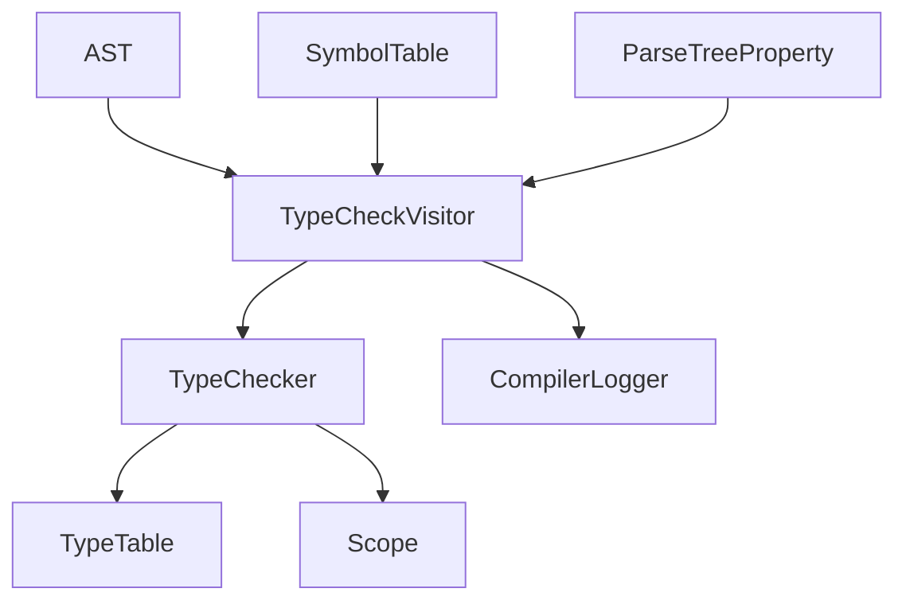

**图示来源**  
- [TypeCheckVisitor.java](file://ep19\src\main\java\org\teachfx\antlr4\ep19\pass\TypeCheckVisitor.java#L1-L50)
- [TypeChecker.java](file://ep19\src\main\java\org\teachfx\antlr4\ep19\symtab\TypeChecker.java#L1-L50)

## 核心组件分析

### TypeCheckVisitor 组件分析

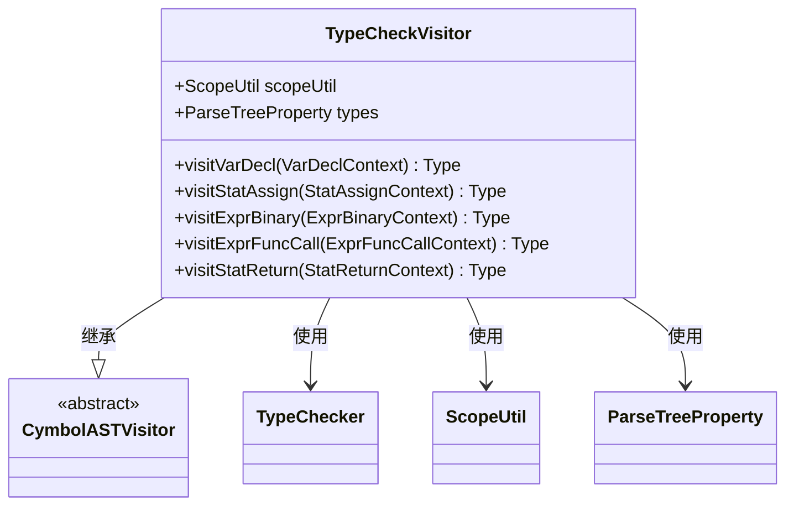

**图示来源**  
- [TypeCheckVisitor.java](file://ep19\src\main\java\org\teachfx\antlr4\ep19\pass\TypeCheckVisitor.java#L20-L40)

**本节来源**  
- [TypeCheckVisitor.java](file://ep19\src\main\java\org\teachfx\antlr4\ep19\pass\TypeCheckVisitor.java#L1-L100)

### TypeChecker 组件分析

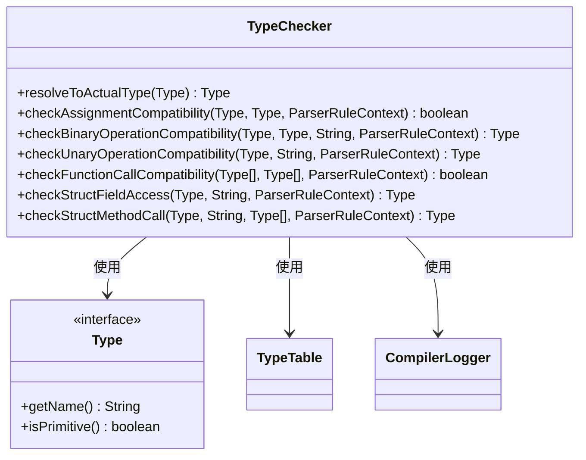

**图示来源**  
- [TypeChecker.java](file://ep19\src\main\java\org\teachfx\antlr4\ep19\symtab\TypeChecker.java#L15-L30)

**本节来源**  
- [TypeChecker.java](file://ep19\src\main\java\org\teachfx\antlr4\ep19\symtab\TypeChecker.java#L1-L100)

## 类型兼容性判断机制

### 类型兼容性检查流程

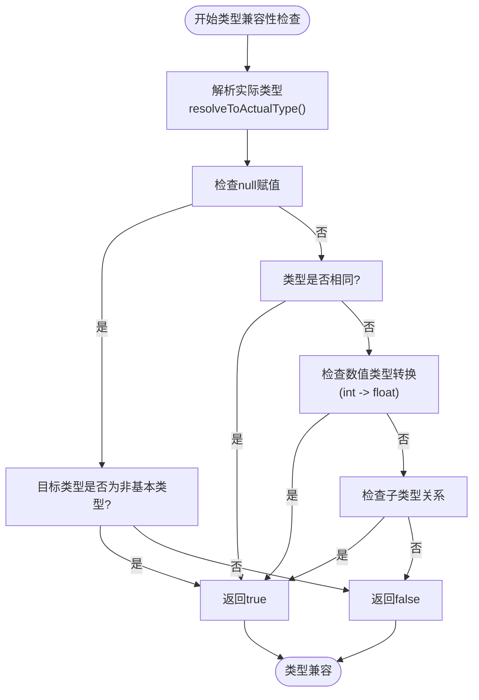

**图示来源**  
- [TypeChecker.java](file://ep19\src\main\java\org\teachfx\antlr4\ep19\symtab\TypeChecker.java#L50-L100)

**本节来源**  
- [TypeChecker.java](file://ep19\src\main\java\org\teachfx\antlr4\ep19\symtab\TypeChecker.java#L50-L150)

## 表达式类型推断

### 二元表达式类型推断

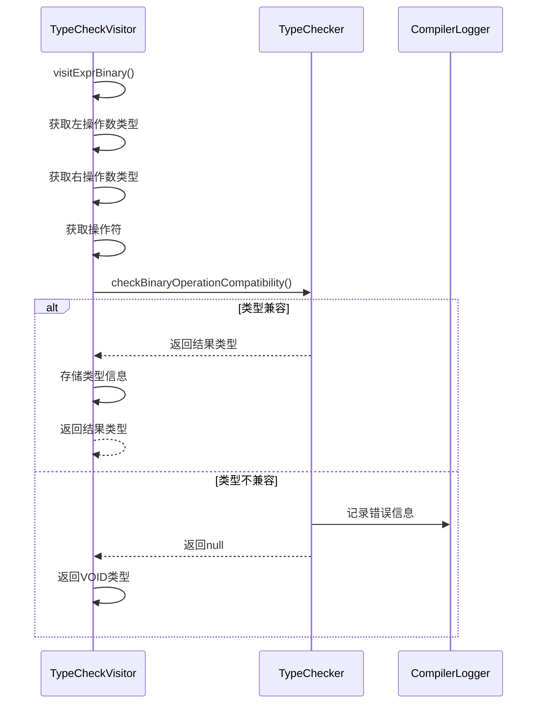

**图示来源**  
- [TypeCheckVisitor.java](file://ep19\src\main\java\org\teachfx\antlr4\ep19\pass\TypeCheckVisitor.java#L100-L130)
- [TypeChecker.java](file://ep19\src\main\java\org\teachfx\antlr4\ep19\symtab\TypeChecker.java#L150-L200)

**本节来源**  
- [TypeCheckVisitor.java](file://ep19\src\main\java\org\teachfx\antlr4\ep19\pass\TypeCheckVisitor.java#L100-L150)
- [TypeChecker.java](file://ep19\src\main\java\org\teachfx\antlr4\ep19\symtab\TypeChecker.java#L150-L250)

### 一元表达式类型推断

```mermaid
flowchart TD
Start([一元表达式类型推断]) --> GetOperand["获取操作数类型"]
GetOperand --> CheckOperator["检查操作符类型"]
CheckOperator --> |负号(-)| CheckNumeric["是否为数值类型?"]
CheckOperator --> |逻辑非(!)| CheckBoolean["是否为布尔类型?"]
CheckNumeric --> |是| ReturnSame["返回相同类型"]
CheckNumeric --> |否| LogError["记录错误: 不支持负号操作"]
CheckBoolean --> |是| ReturnBoolean["返回布尔类型"]
CheckBoolean --> |否| LogError["记录错误: 不支持逻辑非操作"]
LogError --> ReturnVoid["返回VOID类型"]
ReturnSame --> End([成功])
ReturnBoolean --> End
ReturnVoid --> End
```

**图示来源**  
- [TypeChecker.java](file://ep19\src\main\java\org\teachfx\antlr4\ep19\symtab\TypeChecker.java#L250-L300)

## 语句类型验证

### 赋值语句验证流程

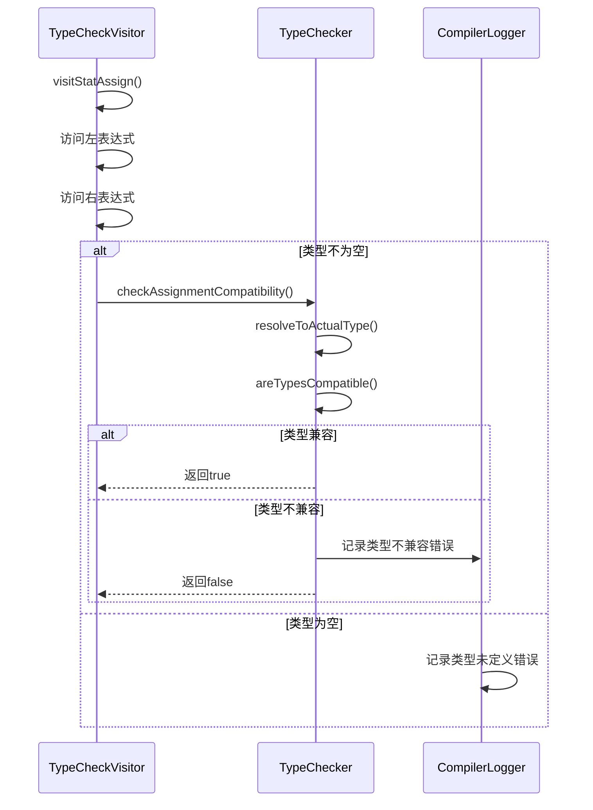

**图示来源**  
- [TypeCheckVisitor.java](file://ep19\src\main\java\org\teachfx\antlr4\ep19\pass\TypeCheckVisitor.java#L70-L90)
- [TypeChecker.java](file://ep19\src\main\java\org\teachfx\antlr4\ep19\symtab\TypeChecker.java#L30-L70)

**本节来源**  
- [TypeCheckVisitor.java](file://ep19\src\main\java\org\teachfx\antlr4\ep19\pass\TypeCheckVisitor.java#L70-L100)
- [TypeChecker.java](file://ep19\src\main\java\org\teachfx\antlr4\ep19\symtab\TypeChecker.java#L30-L100)

### 返回语句验证流程

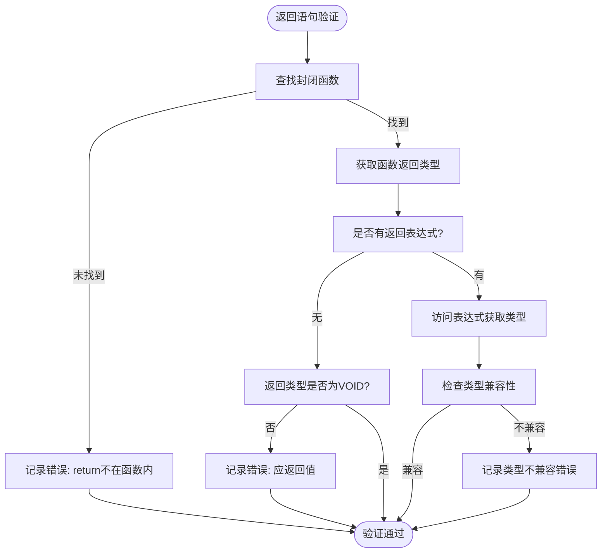

**图示来源**  
- [TypeCheckVisitor.java](file://ep19\src\main\java\org\teachfx\antlr4\ep19\pass\TypeCheckVisitor.java#L450-L500)

## 函数调用匹配

### 函数调用类型检查

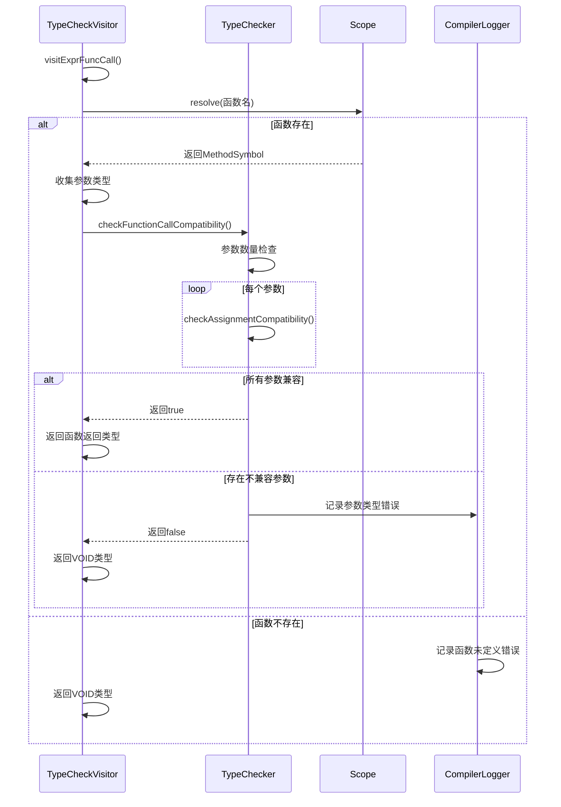

**图示来源**  
- [TypeCheckVisitor.java](file://ep19\src\main\java\org\teachfx\antlr4\ep19\pass\TypeCheckVisitor.java#L200-L280)
- [TypeChecker.java](file://ep19\src\main\java\org\teachfx\antlr4\ep19\symtab\TypeChecker.java#L200-L250)

**本节来源**  
- [TypeCheckVisitor.java](file://ep19\src\main\java\org\teachfx\antlr4\ep19\pass\TypeCheckVisitor.java#L200-L300)
- [TypeChecker.java](file://ep19\src\main\java\org\teachfx\antlr4\ep19\symtab\TypeChecker.java#L200-L300)

## 错误报告与恢复策略

### 错误报告机制

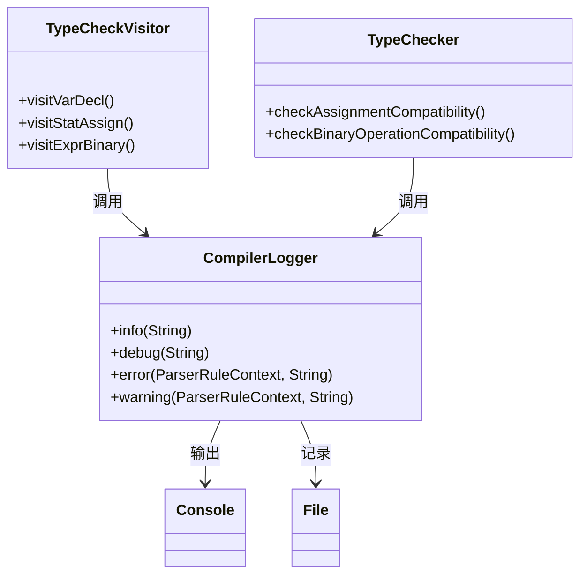

**图示来源**  
- [TypeCheckVisitor.java](file://ep19\src\main\java\org\teachfx\antlr4\ep19\pass\TypeCheckVisitor.java#L20-L30)
- [TypeChecker.java](file://ep19\src\main\java\org\teachfx\antlr4\ep19\symtab\TypeChecker.java#L20-L30)

**本节来源**  
- [TypeCheckVisitor.java](file://ep19\src\main\java\org\teachfx\antlr4\ep19\pass\TypeCheckVisitor.java#L50-L100)
- [TypeChecker.java](file://ep19\src\main\java\org\teachfx\antlr4\ep19\symtab\TypeChecker.java#L20-L50)

### 错误恢复策略

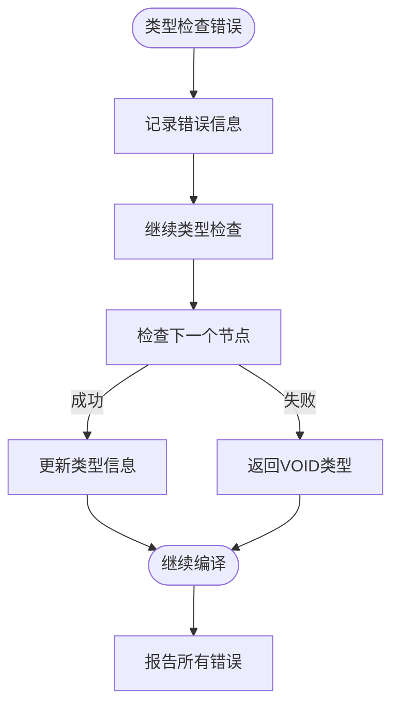

**图示来源**  
- [TypeCheckVisitor.java](file://ep19\src\main\java\org\teachfx\antlr4\ep19\pass\TypeCheckVisitor.java)

## 类型检查流程解析

### 初学者类型检查流程

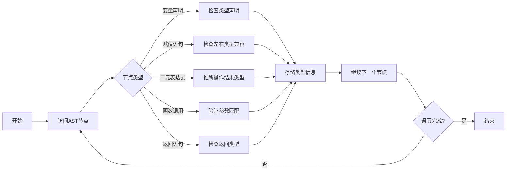

**本节来源**  
- [TypeCheckVisitor.java](file://ep19\src\main\java\org\teachfx\antlr4\ep19\pass\TypeCheckVisitor.java)

## 高级类型推导机制

### 复杂表达式类型推导

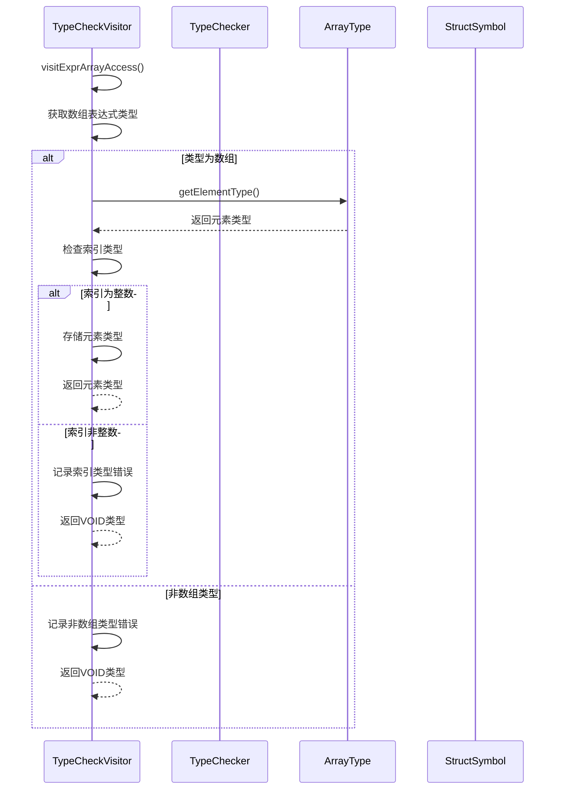

**图示来源**  
- [TypeCheckVisitor.java](file://ep19\src\main\java\org\teachfx\antlr4\ep19\pass\TypeCheckVisitor.java#L350-L400)

**本节来源**  
- [TypeCheckVisitor.java](file://ep19\src\main\java\org\teachfx\antlr4\ep19\pass\TypeCheckVisitor.java#L350-L450)

### 多态操作符处理

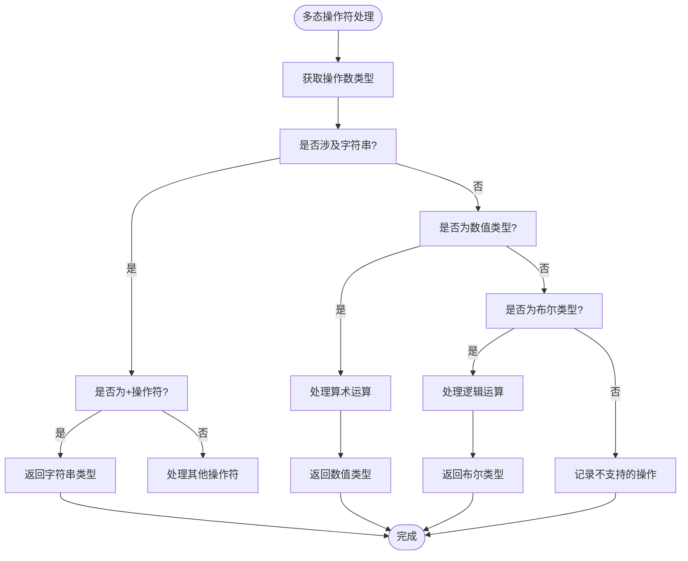

**图示来源**  
- [TypeChecker.java](file://ep19\src\main\java\org\teachfx\antlr4\ep19\symtab\TypeChecker.java#L150-L250)

**本节来源**  
- [TypeChecker.java](file://ep19\src\main\java\org\teachfx\antlr4\ep19\symtab\TypeChecker.java#L150-L300)