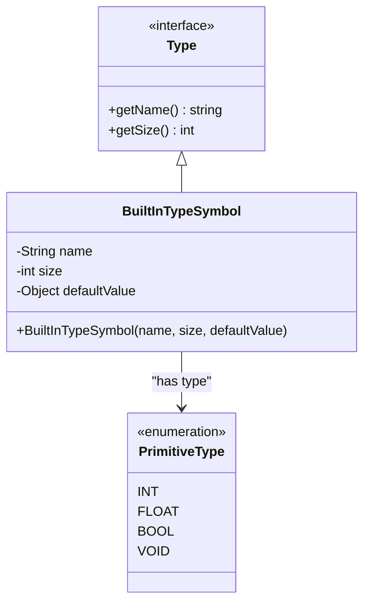
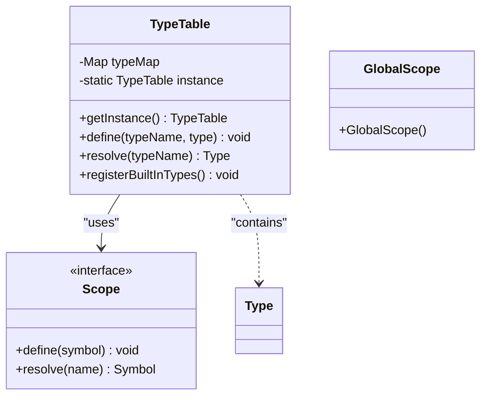
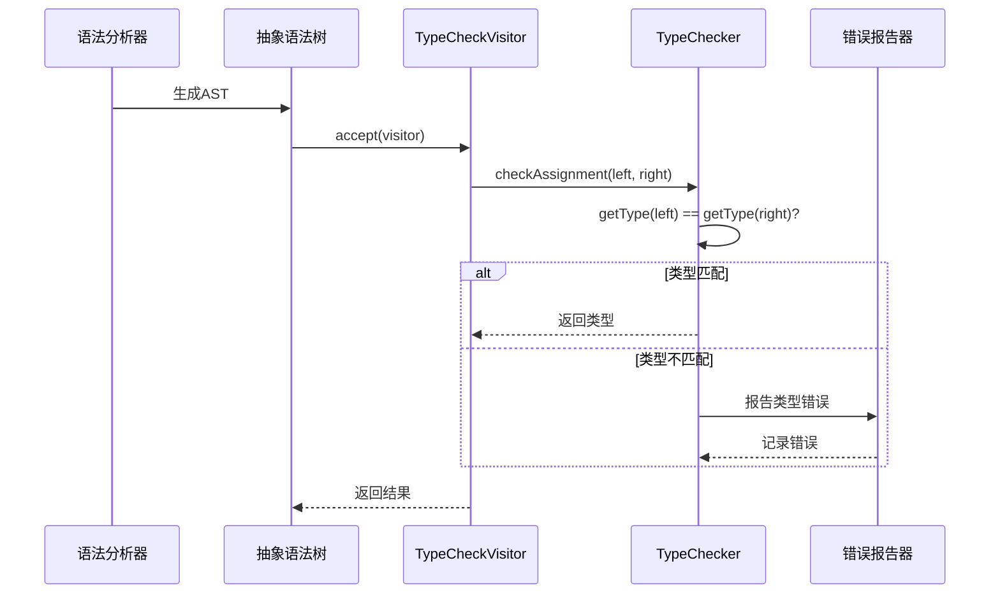
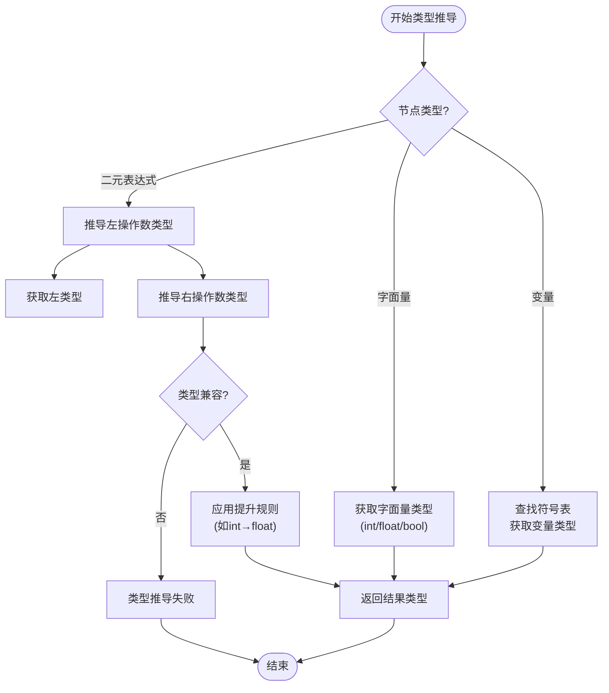
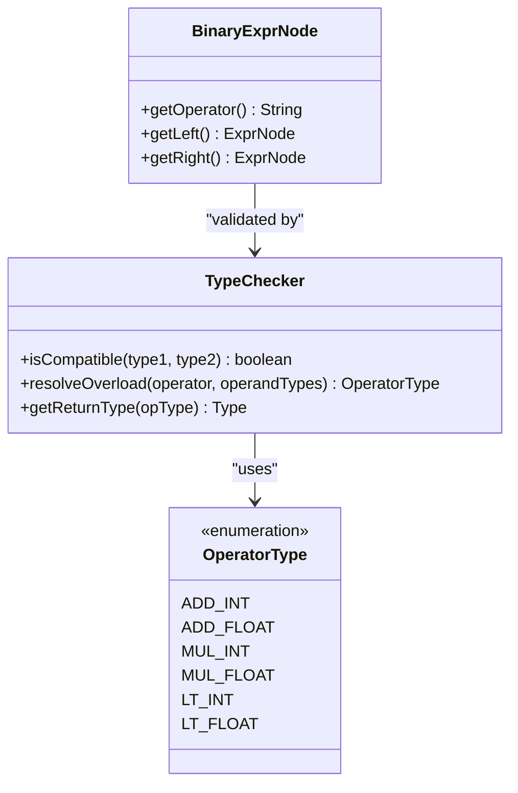
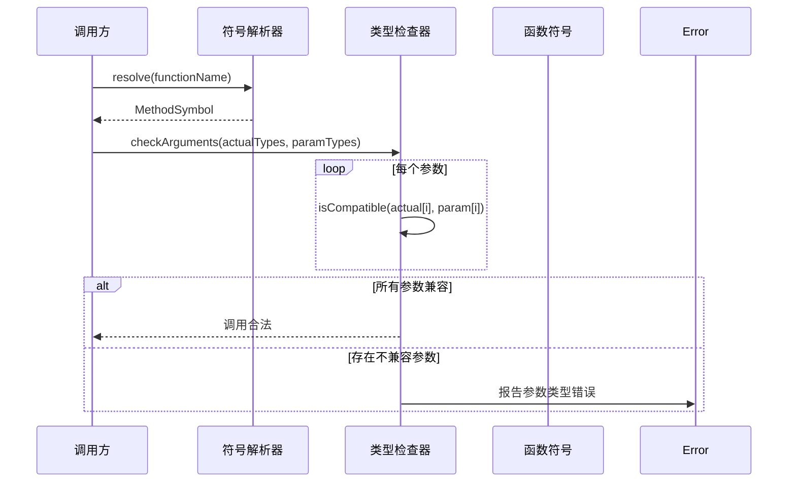
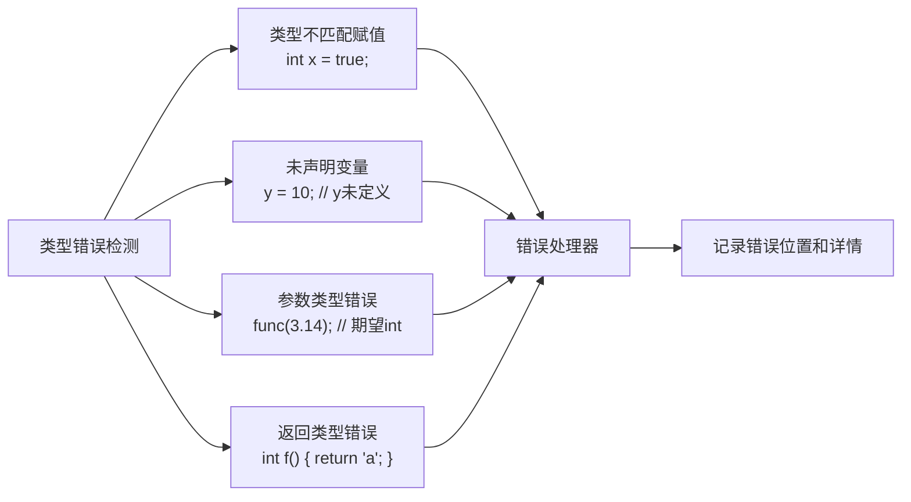
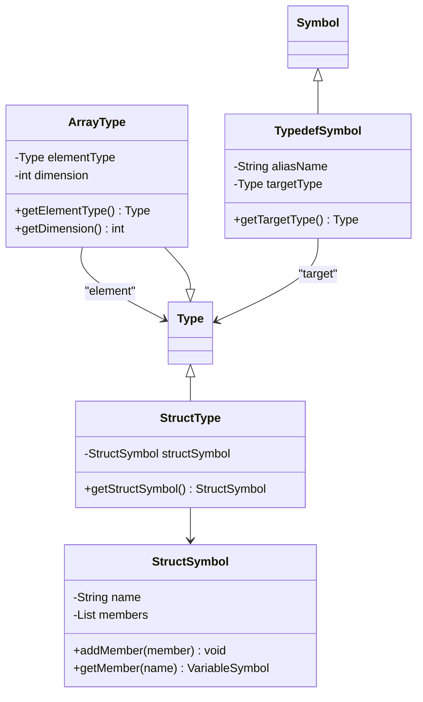

# 类型系统

<cite>
**本文档中引用的文件**  
- [BuiltInTypeSymbol.java](file://ep19/src/main/java/org/teachfx/antlr4/ep19/symtab/symbol/BuiltInTypeSymbol.java)
- [TypeTable.java](file://ep19/src/main/java/org/teachfx/antlr4/ep19/symtab/TypeTable.java)
- [TypeChecker.java](file://ep19/src/main/java/org/teachfx/antlr4/ep19/symtab/TypeChecker.java)
- [TypeCheckVisitor.java](file://ep19/src/main/java/org/teachfx/antlr4/ep19/pass/TypeCheckVisitor.java)
- [Type.java](file://ep19/src/main/java/org/teachfx/antlr4/ep19/symtab/Type.java)
- [VariableSymbol.java](file://ep19/src/main/java/org/teachfx/antlr4/ep19/symtab/symbol/VariableSymbol.java)
- [MethodSymbol.java](file://ep19/src/main/java/org/teachfx/antlr4/ep19/symtab/symbol/MethodSymbol.java)
- [StructSymbol.java](file://ep19/src/main/java/org/teachfx/antlr4/ep19/symtab/symbol/StructSymbol.java)
- [ArrayType.java](file://ep19/src/main/java/org/teachfx/antlr4/ep19/symtab/type/ArrayType.java)
- [PrimitiveType.java](file://ep19/src/main/java/org/teachfx/antlr4/ep19/symtab/symbol/PrimitiveType.java)
</cite>

## 目录
1. [简介](#简介)
2. [类型定义与内置类型](#类型定义与内置类型)
3. [类型注册表：TypeTable](#类型注册表typetable)
4. [类型检查机制](#类型检查机制)
5. [类型推导算法](#类型推导算法)
6. [类型兼容性与运算符重载](#类型兼容性与运算符重载)
7. [函数调用类型匹配](#函数调用类型匹配)
8. [常见类型错误检测](#常见类型错误检测)
9. [复杂类型处理](#复杂类型处理)
10. [类型系统扩展方法](#类型系统扩展方法)
11. [结论](#结论)

## 简介
本文档详细阐述了基于Antlr4实现的编程语言类型系统，涵盖类型定义、类型检查、类型推导等核心机制。系统设计遵循静态类型检查原则，支持基础类型、数组、结构体等复杂类型，并提供类型兼容性判断与函数调用匹配功能。文档面向初学者和高级用户，既解释基础概念，也深入分析实现细节。

## 类型定义与内置类型
类型系统通过`Type`接口定义类型抽象，所有具体类型实现该接口。预定义类型由`BuiltInTypeSymbol`类实现，封装了`int`、`float`、`bool`、`void`等基本类型。

`BuiltInTypeSymbol`作为`VariableSymbol`的子类，在构造时注册到全局作用域，并通过单例模式确保类型唯一性。每种内置类型具有名称、大小和默认值等属性，例如`int`类型大小为4字节，初始值为0。

**图示来源**
- [Type.java](file://ep19/src/main/java/org/teachfx/antlr4/ep19/symtab/Type.java)
- [BuiltInTypeSymbol.java](file://ep19/src/main/java/org/teachfx/antlr4/ep19/symtab/symbol/BuiltInTypeSymbol.java)
- [PrimitiveType.java](file://ep19/src/main/java/org/teachfx/antlr4/ep19/symtab/symbol/PrimitiveType.java)

**本节来源**
- [BuiltInTypeSymbol.java](file://ep19/src/main/java/org/teachfx/antlr4/ep19/symtab/symbol/BuiltInTypeSymbol.java)
- [Type.java](file://ep19/src/main/java/org/teachfx/antlr4/ep19/symtab/Type.java)

## 类型注册表：TypeTable
`TypeTable`是类型系统的注册中心，负责管理所有已定义类型的全局唯一实例。它采用哈希表结构存储类型名称到类型对象的映射，确保类型在程序中只存在一个实例。

`TypeTable`在编译器初始化时创建，并预注册所有内置类型。当解析器遇到类型声明（如`struct`或`typedef`）时，会通过`TypeTable`注册新类型。类型查找操作支持作用域链查询，优先在局部作用域查找，未找到则回退到全局作用域。

**图示来源**
- [TypeTable.java](file://ep19/src/main/java/org/teachfx/antlr4/ep19/symtab/TypeTable.java)
- [Scope.java](file://ep19/src/main/java/org/teachfx/antlr4/ep19/symtab/scope/Scope.java)

**本节来源**
- [TypeTable.java](file://ep19/src/main/java/org/teachfx/antlr4/ep19/symtab/TypeTable.java)

## 类型检查机制
类型检查由`TypeChecker`类实现，作为编译器语义分析阶段的核心组件。`TypeChecker`通过访问者模式遍历抽象语法树（AST），对每个表达式和语句执行类型验证。

`TypeCheckVisitor`继承自语法生成的`CymbolBaseVisitor`，重写各类节点的访问方法。在访问变量声明、赋值语句、函数调用等节点时，调用`TypeChecker`的相应方法进行类型匹配验证。检查失败时，通过`ErrorIssuer`报告类型错误。

**图示来源**
- [TypeCheckVisitor.java](file://ep19/src/main/java/org/teachfx/antlr4/ep19/pass/TypeCheckVisitor.java)
- [TypeChecker.java](file://ep19/src/main/java/org/teachfx/antlr4/ep19/symtab/TypeChecker.java)

**本节来源**
- [TypeChecker.java](file://ep19/src/main/java/org/teachfx/antlr4/ep19/symtab/TypeChecker.java)
- [TypeCheckVisitor.java](file://ep19/src/main/java/org/teachfx/antlr4/ep19/pass/TypeCheckVisitor.java)

## 类型推导算法
类型推导主要应用于表达式和函数返回值场景。系统采用自底向上的推导策略：从叶子节点（如字面量、变量）获取类型，逐层向上计算复合表达式的类型。

对于二元运算表达式，类型推导规则如下：
1. 若两个操作数类型相同，则结果类型为该类型
2. 若存在隐式类型转换（如`int`到`float`），则结果类型为更宽泛的类型
3. 若类型不兼容且无可转换路径，则推导失败

函数返回类型推导基于`return`语句中的表达式类型。若函数包含多个`return`语句，则所有返回类型必须兼容，最终类型为最宽泛的公共类型。

**图示来源**
- [TypeChecker.java](file://ep19/src/main/java/org/teachfx/antlr4/ep19/symtab/TypeChecker.java)
- [TypeCheckVisitor.java](file://ep19/src/main/java/org/teachfx/antlr4/ep19/pass/TypeCheckVisitor.java)

**本节来源**
- [TypeChecker.java](file://ep19/src/main/java/org/teachfx/antlr4/ep19/symtab/TypeChecker.java)

## 类型兼容性与运算符重载
类型兼容性判断由`TypeChecker.isCompatible()`方法实现，支持以下规则：
- 相同类型完全兼容
- `int`可隐式转换为`float`
- `bool`与其他数值类型不兼容
- 数组类型需维度和元素类型均相同
- 结构体类型需名称和成员完全匹配

运算符重载通过`OperatorType`枚举定义，每种运算符关联其操作数类型和返回类型。例如加法运算符支持`int+int→int`和`float+float→float`两种重载形式。类型检查时，根据操作数实际类型选择匹配的重载版本。

**图示来源**
- [TypeChecker.java](file://ep19/src/main/java/org/teachfx/antlr4/ep19/symtab/TypeChecker.java)
- [OperatorType.java](file://ep20/src/main/java/org/teachfx/antlr4/ep20/symtab/type/OperatorType.java)

**本节来源**
- [TypeChecker.java](file://ep19/src/main/java/org/teachfx/antlr4/ep19/symtab/TypeChecker.java)

## 函数调用类型匹配
函数调用类型检查分为两步：函数名解析和参数类型匹配。首先在作用域链中查找函数符号，然后验证实参类型与形参类型的兼容性。

`MethodSymbol`类存储函数的名称、返回类型和参数类型列表。调用时，`TypeChecker`逐个比较实际参数与形式参数的类型，允许隐式类型转换（如`int`传给`float`参数），但禁止不安全转换。

**图示来源**
- [MethodSymbol.java](file://ep19/src/main/java/org/teachfx/antlr4/ep19/symtab/symbol/MethodSymbol.java)
- [TypeChecker.java](file://ep19/src/main/java/org/teachfx/antlr4/ep19/symtab/TypeChecker.java)

**本节来源**
- [MethodSymbol.java](file://ep19/src/main/java/org/teachfx/antlr4/ep19/symtab/symbol/MethodSymbol.java)
- [TypeChecker.java](file://ep19/src/main/java/org/teachfx/antlr4/ep19/symtab/TypeChecker.java)

## 常见类型错误检测
类型系统能够检测多种常见错误：

**类型不匹配赋值**
当赋值语句右侧表达式类型与左侧变量类型不兼容时触发。例如将`bool`值赋给`int`变量。

**未声明变量使用**
在符号表中查找变量符号失败时报告此错误。作用域链遍历完成后仍未找到符号即视为未声明。

**函数参数类型不匹配**
实际参数类型与函数声明的形参类型不兼容。系统会列出期望类型和实际类型供调试。

**返回类型不匹配**
函数返回表达式的类型与声明的返回类型不兼容。`void`函数包含`return expr`语句也会被检测。

**本节来源**
- [TypeCheckVisitor.java](file://ep19/src/main/java/org/teachfx/antlr4/ep19/pass/TypeCheckVisitor.java)
- [ErrorIssuer.java](file://ep20/src/main/java/org/teachfx/antlr4/ep20/driver/ErrorIssuer.java)

## 复杂类型处理
### 数组类型
`ArrayType`类表示数组类型，包含元素类型和维度信息。多维数组通过嵌套`ArrayType`实现。数组访问表达式`arr[i]`的类型为元素类型。

### 结构体类型
`StructSymbol`管理结构体定义，包含名称和成员变量列表。`StructType`封装结构体类型信息。结构体成员访问`obj.field`的类型为对应字段的类型。

### 类型别名
`TypedefSymbol`支持类型别名机制，允许为现有类型创建新名称。类型别名在类型检查时会展开为原始类型进行比较。

**图示来源**
- [ArrayType.java](file://ep19/src/main/java/org/teachfx/antlr4/ep19/symtab/type/ArrayType.java)
- [StructSymbol.java](file://ep19/src/main/java/org/teachfx/antlr4/ep19/symtab/symbol/StructSymbol.java)
- [TypedefSymbol.java](file://ep19/src/main/java/org/teachfx/antlr4/ep19/symtab/symbol/TypedefSymbol.java)

**本节来源**
- [ArrayType.java](file://ep19/src/main/java/org/teachfx/antlr4/ep19/symtab/type/ArrayType.java)
- [StructSymbol.java](file://ep19/src/main/java/org/teachfx/antlr4/ep19/symtab/symbol/StructSymbol.java)
- [TypedefSymbol.java](file://ep19/src/main/java/org/teachfx/antlr4/ep19/symtab/symbol/TypedefSymbol.java)

## 类型系统扩展方法
类型系统设计具有良好的扩展性：
1. **新增内置类型**：继承`BuiltInTypeSymbol`并注册到`TypeTable`
2. **支持新运算符**：在`OperatorType`中添加枚举值并实现类型规则
3. **扩展类型转换**：修改`isCompatible()`方法添加新的隐式转换规则
4. **引入泛型**：扩展`Type`接口支持类型参数，修改`MethodSymbol`支持泛型函数

扩展时需同步更新`TypeChecker`和`TypeCheckVisitor`以支持新特性，确保类型安全。

**本节来源**
- [Type.java](file://ep19/src/main/java/org/teachfx/antlr4/ep19/symtab/Type.java)
- [TypeChecker.java](file://ep19/src/main/java/org/teachfx/antlr4/ep19/symtab/TypeChecker.java)

## 结论
本文档全面解析了基于Antlr4实现的类型系统，涵盖从基础类型定义到复杂类型处理的完整机制。系统通过`BuiltInTypeSymbol`和`TypeTable`实现类型管理，利用`TypeChecker`执行静态检查，并支持类型推导与兼容性判断。设计具有良好的模块化和扩展性，为构建安全可靠的编译器奠定了坚实基础。