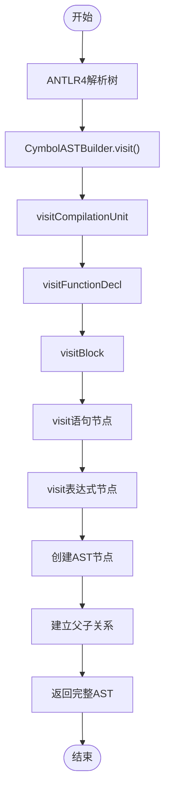
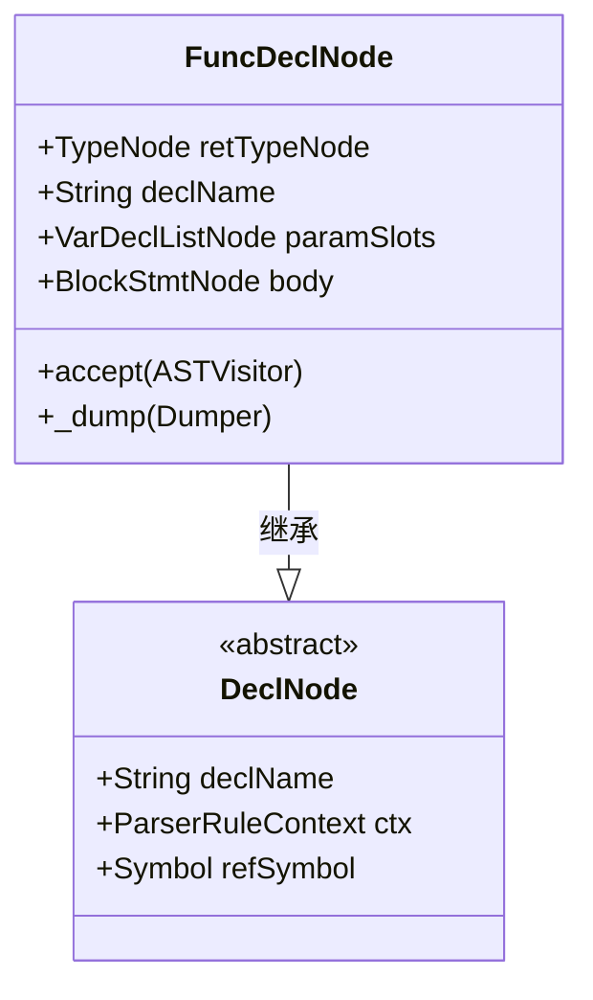
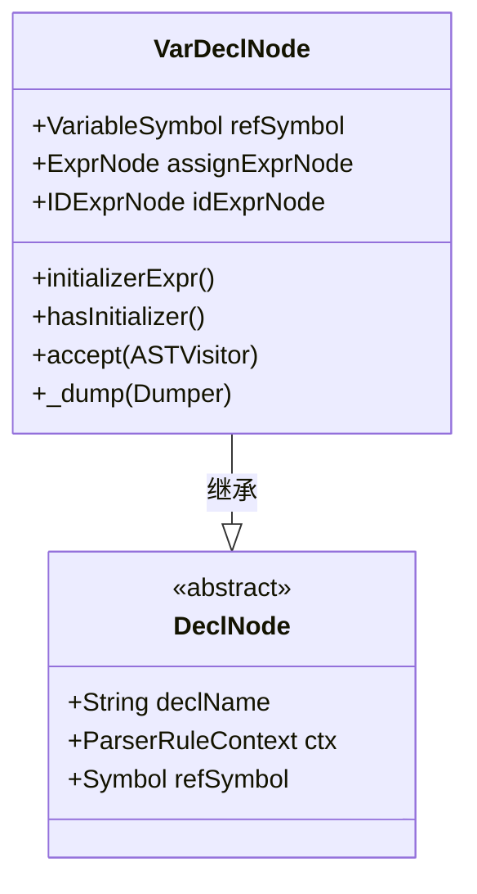
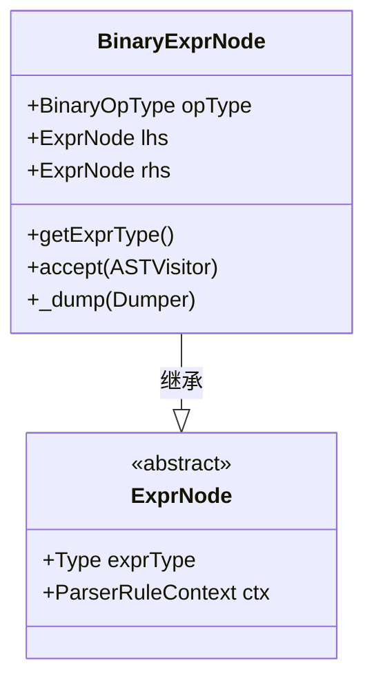
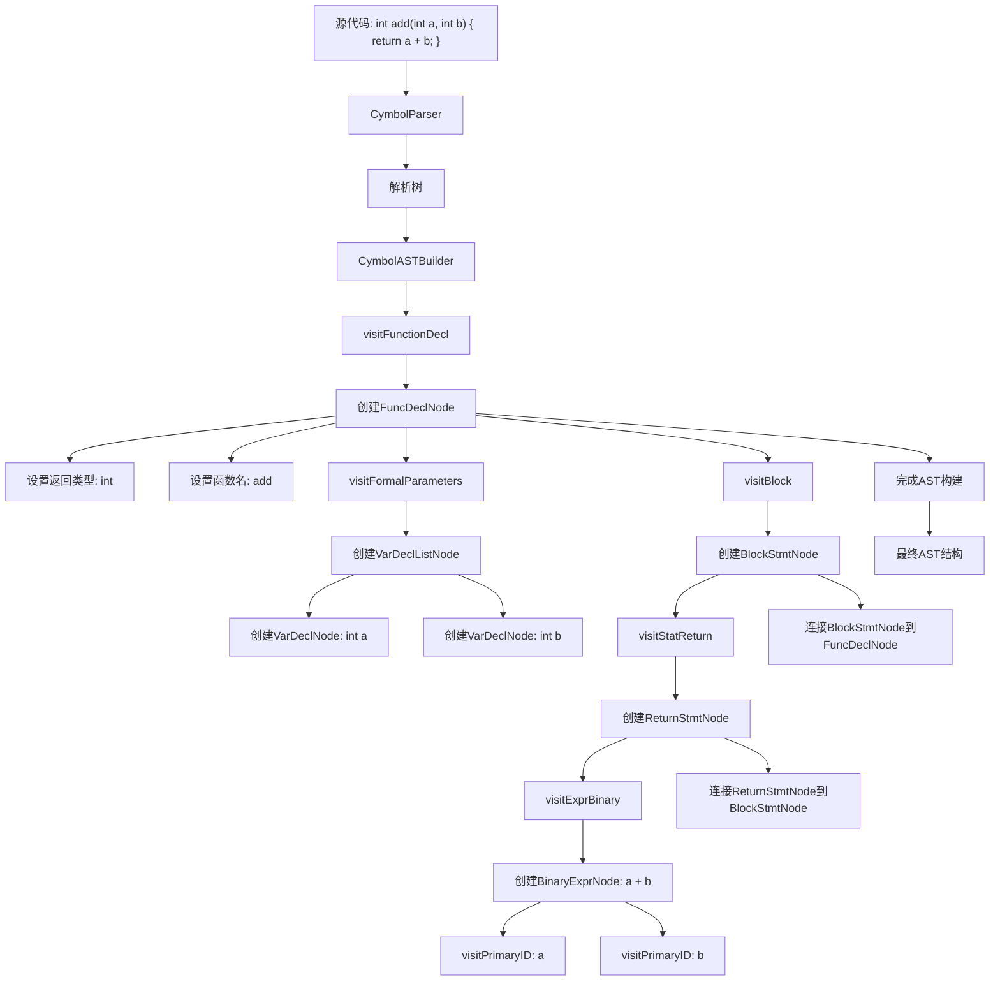
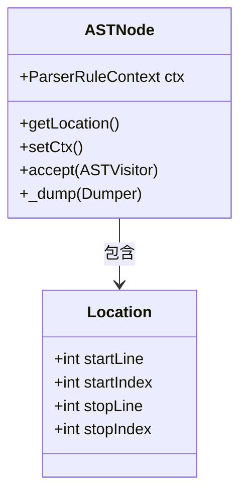
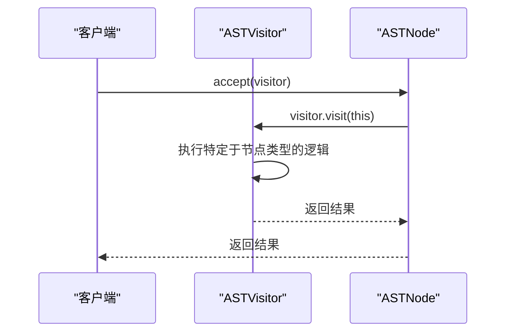

# AST数据流

<cite>
**本文档中引用的文件**   
- [CymbolASTBuilder.java](file://ep20/src/main/java/org/teachfx/antlr4/ep20/pass/ast/CymbolASTBuilder.java)
- [ASTNode.java](file://ep20/src/main/java/org/teachfx/antlr4/ep20/ast/ASTNode.java)
- [FuncDeclNode.java](file://ep20/src/main/java/org/teachfx/antlr4/ep20/ast/decl/FuncDeclNode.java)
- [VarDeclNode.java](file://ep20/src/main/java/org/teachfx/antlr4/ep20/ast/decl/VarDeclNode.java)
- [BinaryExprNode.java](file://ep20/src/main/java/org/teachfx/antlr4/ep20/ast/expr/BinaryExprNode.java)
- [ASTVisitor.java](file://ep20/src/main/java/org/teachfx/antlr4/ep20/ast/ASTVisitor.java)
</cite>

## 目录
1. [简介](#简介)
2. [AST构建流程](#ast构建流程)
3. [核心AST节点类型](#核心ast节点类型)
4. [函数声明的AST转换示例](#函数声明的ast转换示例)
5. [作用域与位置信息处理](#作用域与位置信息处理)
6. [AST遍历与访问者模式](#ast遍历与访问者模式)
7. [AST不可变性与线程安全性](#ast不可变性与线程安全性)

## 简介
Cymbol编译器的抽象语法树（AST）数据流过程始于ANTLR4生成的解析树，通过CymbolASTBuilder将解析树转换为结构化的ASTNode层次结构。该过程实现了从源代码到可分析、可转换的树形数据结构的完整转换，为后续的语义分析、类型检查和代码生成奠定了基础。

## AST构建流程

CymbolASTBuilder作为AST构建的核心组件，继承自CymbolBaseVisitor并实现CymbolVisitor接口，通过访问者模式遍历ANTLR4生成的解析树。构建过程始于visitCompilationUnit方法，该方法创建CompileUnit根节点并递归处理所有子节点。

构建流程遵循自底向上的原则：从叶节点（如标识符、字面量）开始，逐步构建表达式、语句，最终形成完整的函数和变量声明。每个visit方法负责将特定的解析上下文转换为对应的AST节点，并建立父子关系。



**图示来源**
- [CymbolASTBuilder.java](file://ep20/src/main/java/org/teachfx/antlr4/ep20/pass/ast/CymbolASTBuilder.java#L25-L317)

**本节来源**
- [CymbolASTBuilder.java](file://ep20/src/main/java/org/teachfx/antlr4/ep20/pass/ast/CymbolASTBuilder.java#L25-L317)

## 核心AST节点类型

### 函数声明节点（FuncDeclNode）
FuncDeclNode表示函数声明，包含返回类型、函数名、参数列表和函数体。该节点在visitFunctionDecl方法中创建，通过visitFormalParameters处理参数列表，通过visitBlock处理函数体。



**图示来源**
- [FuncDeclNode.java](file://ep20/src/main/java/org/teachfx/antlr4/ep20/ast/decl/FuncDeclNode.java#L8-L62)

### 变量声明节点（VarDeclNode）
VarDeclNode表示变量声明，包含变量符号、初始化表达式和标识符节点。该节点在visitVarDecl方法中创建，同时建立与VariableSymbol的引用关系。



**图示来源**
- [VarDeclNode.java](file://ep20/src/main/java/org/teachfx/antlr4/ep20/ast/decl/VarDeclNode.java#L11-L66)

### 二元表达式节点（BinaryExprNode）
BinaryExprNode表示二元运算表达式，包含左操作数、右操作数和运算符类型。该节点在visitExprBinary方法中创建，支持加、减、乘、除等运算。



**图示来源**
- [BinaryExprNode.java](file://ep20/src/main/java/org/teachfx/antlr4/ep20/ast/expr/BinaryExprNode.java#L10-L95)

**本节来源**
- [FuncDeclNode.java](file://ep20/src/main/java/org/teachfx/antlr4/ep20/ast/decl/FuncDeclNode.java#L8-L62)
- [VarDeclNode.java](file://ep20/src/main/java/org/teachfx/antlr4/ep20/ast/decl/VarDeclNode.java#L11-L66)
- [BinaryExprNode.java](file://ep20/src/main/java/org/teachfx/antlr4/ep20/ast/expr/BinaryExprNode.java#L10-L95)

## 函数声明的AST转换示例

考虑以下Cymbol函数声明：
```cymbol
int add(int a, int b) {
    return a + b;
}
```

其AST转换过程如下：



**图示来源**
- [CymbolASTBuilder.java](file://ep20/src/main/java/org/teachfx/antlr4/ep20/pass/ast/CymbolASTBuilder.java#L25-L317)

**本节来源**
- [CymbolASTBuilder.java](file://ep20/src/main/java/org/teachfx/antlr4/ep20/pass/ast/CymbolASTBuilder.java#L25-L317)

## 作用域与位置信息处理

### 作用域信息传递
AST节点通过setParentScopeType方法设置作用域类型，区分函数作用域和块作用域。在visitBlock和visitStatBlock方法中，分别设置ScopeType.FuncScope和ScopeType.BlockScope。

### 位置信息保留
ASTNode基类通过ParserRuleContext保留源代码位置信息。getLocation方法从解析上下文中提取行号和字符索引，为错误报告和调试提供精确的位置信息。



**图示来源**
- [ASTNode.java](file://ep20/src/main/java/org/teachfx/antlr4/ep20/ast/ASTNode.java#L8-L46)

**本节来源**
- [ASTNode.java](file://ep20/src/main/java/org/teachfx/antlr4/ep20/ast/ASTNode.java#L8-L46)
- [CymbolASTBuilder.java](file://ep20/src/main/java/org/teachfx/antlr4/ep20/pass/ast/CymbolASTBuilder.java#L25-L317)

## AST遍历与访问者模式

ASTVisitor接口采用双重分派模式实现类型安全的AST遍历。接口定义了visit方法的重载，每个AST节点类型都有对应的访问方法。



访问者模式的优势：
- **开放/封闭原则**：添加新操作无需修改AST节点类
- **类型安全**：编译时检查访问方法的存在
- **关注点分离**：将算法与数据结构分离

**图示来源**
- [ASTVisitor.java](file://ep20/src/main/java/org/teachfx/antlr4/ep20/ast/ASTVisitor.java#L11-L122)

**本节来源**
- [ASTVisitor.java](file://ep20/src/main/java/org/teachfx/antlr4/ep20/ast/ASTVisitor.java#L11-L122)
- [ASTNode.java](file://ep20/src/main/java/org/teachfx/antlr4/ep20/ast/ASTNode.java#L8-L46)

## AST不可变性与线程安全性

### 不可变性保证
AST节点在构建完成后被视为不可变对象。虽然提供了setter方法，但这些方法主要用于构建阶段，在语义分析和代码生成阶段，AST被视为只读结构。

### 线程安全性
由于AST在构建后不再修改，多个线程可以安全地并发遍历同一AST。访问者模式的实现确保了遍历操作的线程安全性，每个访问者实例维护自己的状态。

### 设计原则
- **构建后冻结**：构建完成后不应修改AST结构
- **状态分离**：将可变状态（如符号表）与AST分离
- **函数式风格**：鼓励使用返回新节点的转换操作而非就地修改

**本节来源**
- [ASTNode.java](file://ep20/src/main/java/org/teachfx/antlr4/ep20/ast/ASTNode.java#L8-L46)
- [ASTVisitor.java](file://ep20/src/main/java/org/teachfx/antlr4/ep20/ast/ASTVisitor.java#L11-L122)