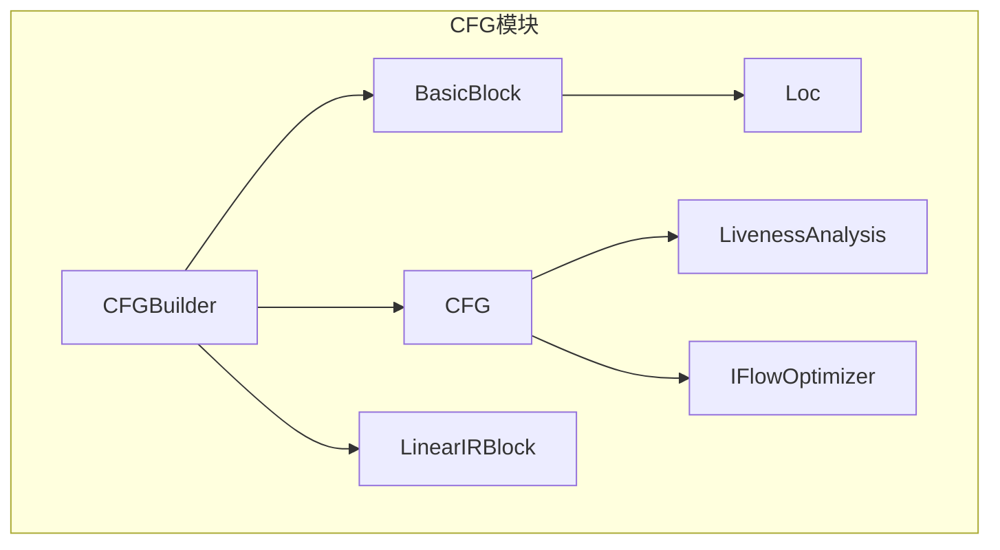
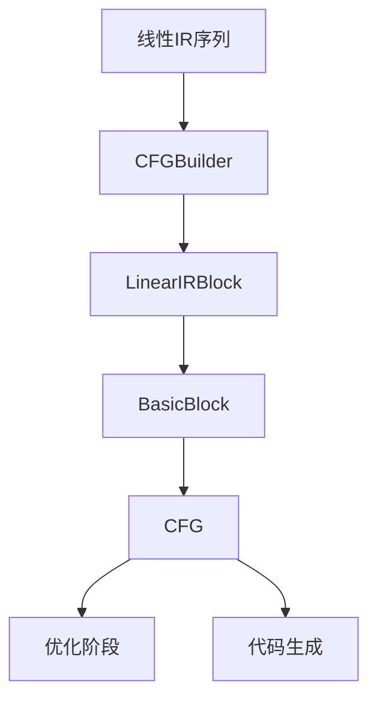
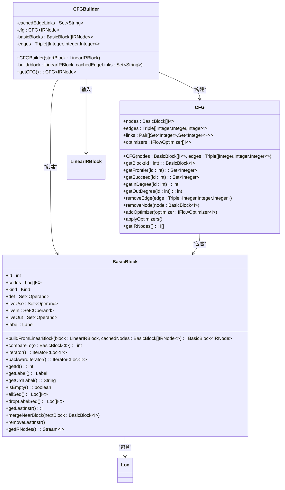
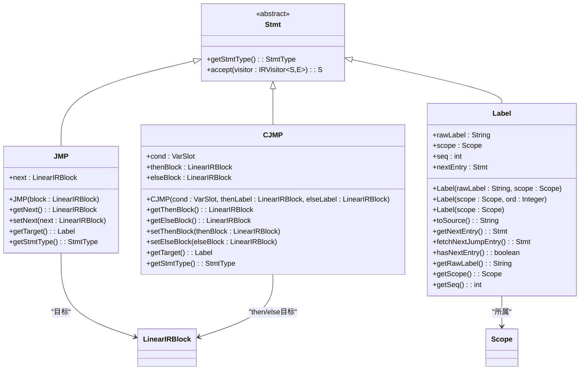
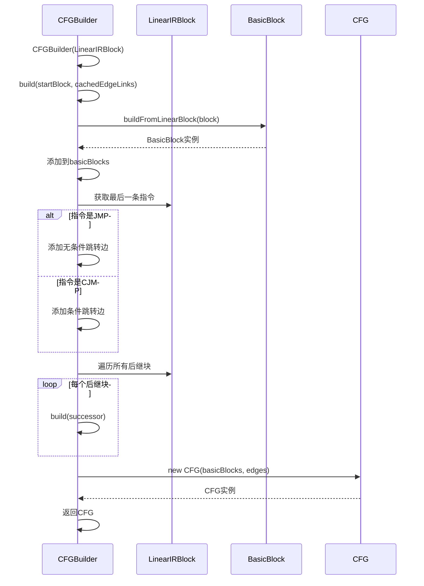
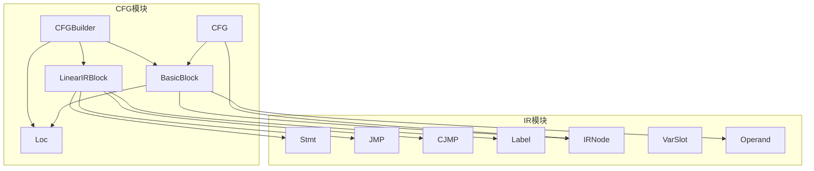

# CFG数据流

<cite>
**本文档中引用的文件**  
- [CFGBuilder.java](file://ep20/src/main/java/org/teachfx/antlr4/ep20/pass/cfg/CFGBuilder.java)
- [CFG.java](file://ep20/src/main/java/org/teachfx/antlr4/ep20/pass/cfg/CFG.java)
- [BasicBlock.java](file://ep20/src/main/java/org/teachfx/antlr4/ep20/pass/cfg/BasicBlock.java)
- [JMP.java](file://ep20/src/main/java/org/teachfx/antlr4/ep20/ir/stmt/JMP.java)
- [CJMP.java](file://ep20/src/main/java/org/teachfx/antlr4/ep20/ir/stmt/CJMP.java)
- [Stmt.java](file://ep20/src/main/java/org/teachfx/antlr4/ep20/ir/stmt/Stmt.java)
- [Label.java](file://ep20/src/main/java/org/teachfx/antlr4/ep20/ir/stmt/Label.java)
- [LinearIRBlock.java](file://ep20/src/main/java/org/teachfx/antlr4/ep20/pass/cfg/LinearIRBlock.java)
</cite>

## 目录
1. [引言](#引言)
2. [项目结构](#项目结构)
3. [核心组件](#核心组件)
4. [架构概述](#架构概述)
5. [详细组件分析](#详细组件分析)
6. [依赖分析](#依赖分析)
7. [性能考虑](#性能考虑)
8. [故障排除指南](#故障排除指南)
9. [结论](#结论)

## 引言
本文档详细描述了Cymbol编译器中控制流图（CFG）的数据流动过程。从线性IR指令序列出发，阐述了CFGBuilder如何识别基本块边界并构建BasicBlock对象集合。说明了控制流边（条件跳转、无条件跳转、函数调用）的建立规则，以及如何处理循环、条件语句和异常处理的CFG结构。通过实际案例展示一个函数的IR到CFG的转换过程，包括入口块、出口块的确定和支配关系的建立。最后解释了CFG数据结构在后续优化阶段（如活性分析）中的应用方式。

## 项目结构
Cymbol编译器的控制流图构建模块位于`ep20`项目中的`pass/cfg`包下，主要包含CFG构建器、基本块、控制流图等核心类。该模块负责将线性中间表示（IR）转换为结构化的控制流图，为后续的优化和代码生成提供基础。

**图示来源**  
- [CFGBuilder.java](file://ep20/src/main/java/org/teachfx/antlr4/ep20/pass/cfg/CFGBuilder.java)
- [CFG.java](file://ep20/src/main/java/org/teachfx/antlr4/ep20/pass/cfg/CFG.java)
- [BasicBlock.java](file://ep20/src/main/java/org/teachfx/antlr4/ep20/pass/cfg/BasicBlock.java)

**本节来源**  
- [CFGBuilder.java](file://ep20/src/main/java/org/teachfx/antlr4/ep20/pass/cfg/CFGBuilder.java)
- [CFG.java](file://ep20/src/main/java/org/teachfx/antlr4/ep20/pass/cfg/CFG.java)

## 核心组件
控制流图的核心组件包括CFGBuilder、CFG、BasicBlock和LinearIRBlock。这些组件协同工作，将线性IR指令序列转换为具有明确控制流结构的图表示。

**本节来源**  
- [CFGBuilder.java](file://ep20/src/main/java/org/teachfx/antlr4/ep20/pass/cfg/CFGBuilder.java)
- [CFG.java](file://ep20/src/main/java/org/teachfx/antlr4/ep20/pass/cfg/CFG.java)
- [BasicBlock.java](file://ep20/src/main/java/org/teachfx/antlr4/ep20/pass/cfg/BasicBlock.java)
- [LinearIRBlock.java](file://ep20/src/main/java/org/teachfx/antlr4/ep20/pass/cfg/LinearIRBlock.java)

## 架构概述
Cymbol编译器的CFG构建过程遵循典型的编译器设计模式：从线性IR序列开始，通过识别基本块边界，建立基本块之间的控制流边，最终形成完整的控制流图。该过程由CFGBuilder驱动，利用LinearIRBlock作为输入，生成BasicBlock集合和边关系，最终封装为CFG对象。

**图示来源**  
- [CFGBuilder.java](file://ep20/src/main/java/org/teachfx/antlr4/ep20/pass/cfg/CFGBuilder.java)
- [LinearIRBlock.java](file://ep20/src/main/java/org/teachfx/antlr4/ep20/pass/cfg/LinearIRBlock.java)
- [BasicBlock.java](file://ep20/src/main/java/org/teachfx/antlr4/ep20/pass/cfg/BasicBlock.java)
- [CFG.java](file://ep20/src/main/java/org/teachfx/antlr4/ep20/pass/cfg/CFG.java)

## 详细组件分析

### CFG构建过程分析
CFGBuilder是控制流图构建的核心类，负责将线性IR块转换为结构化的控制流图。它通过递归遍历LinearIRBlock的后继块，识别基本块边界，并建立控制流边。

#### CFGBuilder类分析

**图示来源**  
- [CFGBuilder.java](file://ep20/src/main/java/org/teachfx/antlr4/ep20/pass/cfg/CFGBuilder.java)
- [CFG.java](file://ep20/src/main/java/org/teachfx/antlr4/ep20/pass/cfg/CFG.java)
- [BasicBlock.java](file://ep20/src/main/java/org/teachfx/antlr4/ep20/pass/cfg/BasicBlock.java)

**本节来源**  
- [CFGBuilder.java](file://ep20/src/main/java/org/teachfx/antlr4/ep20/pass/cfg/CFGBuilder.java)
- [CFG.java](file://ep20/src/main/java/org/teachfx/antlr4/ep20/pass/cfg/CFG.java)
- [BasicBlock.java](file://ep20/src/main/java/org/teachfx/antlr4/ep20/pass/cfg/BasicBlock.java)

### 控制流边建立规则
控制流边的建立基于IR指令的类型，特别是跳转指令。无条件跳转（JMP）和条件跳转（CJMP）是建立控制流边的关键指令。

#### 跳转指令分析

**图示来源**  
- [JMP.java](file://ep20/src/main/java/org/teachfx/antlr4/ep20/ir/stmt/JMP.java)
- [CJMP.java](file://ep20/src/main/java/org/teachfx/antlr4/ep20/ir/stmt/CJMP.java)
- [Stmt.java](file://ep20/src/main/java/org/teachfx/antlr4/ep20/ir/stmt/Stmt.java)
- [Label.java](file://ep20/src/main/java/org/teachfx/antlr4/ep20/ir/stmt/Label.java)

**本节来源**  
- [JMP.java](file://ep20/src/main/java/org/teachfx/antlr4/ep20/ir/stmt/JMP.java)
- [CJMP.java](file://ep20/src/main/java/org/teachfx/antlr4/ep20/ir/stmt/CJMP.java)
- [Stmt.java](file://ep20/src/main/java/org/teachfx/antlr4/ep20/ir/stmt/Stmt.java)
- [Label.java](file://ep20/src/main/java/org/teachfx/antlr4/ep20/ir/stmt/Label.java)

### 基本块构建流程
CFGBuilder通过递归方式构建基本块，从起始的LinearIRBlock开始，为每个块创建对应的BasicBlock对象，并建立控制流边。

#### 构建流程时序图

**图示来源**  
- [CFGBuilder.java](file://ep20/src/main/java/org/teachfx/antlr4/ep20/pass/cfg/CFGBuilder.java)
- [LinearIRBlock.java](file://ep20/src/main/java/org/teachfx/antlr4/ep20/pass/cfg/LinearIRBlock.java)
- [BasicBlock.java](file://ep20/src/main/java/org/teachfx/antlr4/ep20/pass/cfg/BasicBlock.java)
- [CFG.java](file://ep20/src/main/java/org/teachfx/antlr4/ep20/pass/cfg/CFG.java)

**本节来源**  
- [CFGBuilder.java](file://ep20/src/main/java/org/teachfx/antlr4/ep20/pass/cfg/CFGBuilder.java)

## 依赖分析
CFG模块的依赖关系清晰，主要依赖于IR模块的指令类和工具类。CFGBuilder依赖于LinearIRBlock作为输入，生成BasicBlock和CFG对象。CFG对象又依赖于BasicBlock和控制流边的定义。

**图示来源**  
- [CFGBuilder.java](file://ep20/src/main/java/org/teachfx/antlr4/ep20/pass/cfg/CFGBuilder.java)
- [CFG.java](file://ep20/src/main/java/org/teachfx/antlr4/ep20/pass/cfg/CFG.java)
- [BasicBlock.java](file://ep20/src/main/java/org/teachfx/antlr4/ep20/pass/cfg/BasicBlock.java)
- [LinearIRBlock.java](file://ep20/src/main/java/org/teachfx/antlr4/ep20/pass/cfg/LinearIRBlock.java)
- [JMP.java](file://ep20/src/main/java/org/teachfx/antlr4/ep20/ir/stmt/JMP.java)
- [CJMP.java](file://ep20/src/main/java/org/teachfx/antlr4/ep20/ir/stmt/CJMP.java)
- [Stmt.java](file://ep20/src/main/java/org/teachfx/antlr4/ep20/ir/stmt/Stmt.java)
- [Label.java](file://ep20/src/main/java/org/teachfx/antlr4/ep20/ir/stmt/Label.java)

**本节来源**  
- [CFGBuilder.java](file://ep20/src/main/java/org/teachfx/antlr4/ep20/pass/cfg/CFGBuilder.java)
- [CFG.java](file://ep20/src/main/java/org/teachfx/antlr4/ep20/pass/cfg/CFG.java)
- [BasicBlock.java](file://ep20/src/main/java/org/teachfx/antlr4/ep20/pass/cfg/BasicBlock.java)
- [LinearIRBlock.java](file://ep20/src/main/java/org/teachfx/antlr4/ep20/pass/cfg/LinearIRBlock.java)

## 性能考虑
CFG构建过程的时间复杂度主要取决于IR指令的数量和控制流的复杂度。由于使用了缓存机制（cachedEdgeLinks）来避免重复添加边，边的添加操作具有较好的性能表现。递归构建过程可能会导致栈溢出，但对于典型的函数大小，这种风险较小。

## 故障排除指南
在CFG构建过程中可能遇到的问题包括：基本块边界识别错误、控制流边缺失或重复、递归深度过大等。可以通过检查LinearIRBlock的后继关系、验证JMP和CJMP指令的目标块是否正确解析、以及监控递归调用深度来诊断这些问题。

**本节来源**  
- [CFGBuilder.java](file://ep20/src/main/java/org/teachfx/antlr4/ep20/pass/cfg/CFGBuilder.java)
- [LinearIRBlock.java](file://ep20/src/main/java/org/teachfx/antlr4/ep20/pass/cfg/LinearIRBlock.java)

## 结论
Cymbol编译器的CFG构建模块设计合理，通过CFGBuilder、CFG、BasicBlock等核心组件的协作，有效地将线性IR序列转换为结构化的控制流图。该模块正确处理了无条件跳转、条件跳转等控制流结构，为后续的优化和代码生成阶段提供了坚实的基础。通过合理的依赖管理和清晰的接口设计，该模块具有良好的可维护性和扩展性。