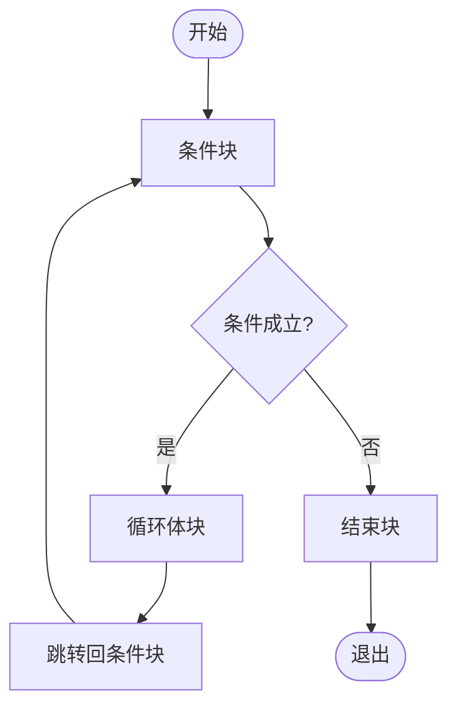

# IR数据流

<cite>
**本文档中引用的文件**  
- [CymbolIRBuilder.java](file://ep20/src/main/java/org/teachfx/antlr4/ep20/pass/ir/CymbolIRBuilder.java)
- [BinaryExprNode.java](file://ep20/src/main/java/org/teachfx/antlr4/ep20/ast/expr/BinaryExprNode.java)
- [Assign.java](file://ep20/src/main/java/org/teachfx/antlr4/ep20/ir/stmt/Assign.java)
- [IRNode.java](file://ep20/src/main/java/org/teachfx/antlr4/ep20/ir/IRNode.java)
- [TypeChecker.java](file://ep20/src/main/java/org/teachfx/antlr4/ep20/pass/sematic/TypeChecker.java)
</cite>

## 目录
1. [简介](#简介)
2. [项目结构](#项目结构)
3. [核心组件](#核心组件)
4. [架构概述](#架构概述)
5. [详细组件分析](#详细组件分析)
6. [依赖分析](#依赖分析)
7. [性能考虑](#性能考虑)
8. [故障排除指南](#故障排除指南)
9. [结论](#结论)

## 简介
本文档全面解析Cymbol编译器中间表示（IR）的数据流动过程。重点描述`CymbolIRBuilder`如何将经过类型检查的抽象语法树（AST）转换为三地址码形式的IR指令序列，涵盖表达式求值、控制流语句和函数调用的IR生成规则。同时说明虚拟寄存器分配策略、临时变量管理机制以及类型信息在IR层的保留方式。通过具体示例展示复杂表达式从AST到IR的转换流程，并分析IR生成过程中与`TypeChecker`的交互，确保生成类型安全的IR代码。

## 项目结构
Cymbol编译器的IR生成模块位于`ep20`目录下的`pass/ir`包中，是整个编译流水线中的关键阶段。该模块接收由前端构建并经类型检查后的AST，输出为线性化的三地址码IR，为后续的控制流分析和代码生成做准备。

**Diagram sources**
- [CymbolIRBuilder.java](file://ep20/src/main/java/org/teachfx/antlr4/ep20/pass/ir/CymbolIRBuilder.java)
- [TypeChecker.java](file://ep20/src/main/java/org/teachfx/antlr4/ep20/pass/sematic/TypeChecker.java)

**Section sources**
- [CymbolIRBuilder.java](file://ep20/src/main/java/org/teachfx/antlr4/ep20/pass/ir/CymbolIRBuilder.java)
- [Compiler.java](file://ep20/src/main/java/org/teachfx/antlr4/ep20/Compiler.java)

## 核心组件
`CymbolIRBuilder`是IR生成的核心组件，实现了`ASTVisitor<Void, VarSlot>`接口，通过访问者模式遍历AST节点并生成相应的IR指令。它维护当前基本块（`currentBlock`）、退出块（`exitBlock`）以及用于控制流跳转的栈结构（`breakStack`、`continueStack`）。表达式求值结果通过`evalExprStack`栈进行管理，确保嵌套表达式的正确求值顺序。

**Section sources**
- [CymbolIRBuilder.java](file://ep20/src/main/java/org/teachfx/antlr4/ep20/pass/ir/CymbolIRBuilder.java)
- [LinearIRBlock.java](file://ep20/src/main/java/org/teachfx/antlr4/ep20/pass/cfg/LinearIRBlock.java)

## 架构概述
IR生成过程遵循单遍遍历策略，将AST节点直接转换为线性IR指令序列。每个函数声明对应一个独立的`LinearIRBlock`链，控制流语句（如`if`、`while`）通过生成条件跳转（`CJMP`）和无条件跳转（`JMP`）指令来实现。表达式求值采用栈式管理，临时结果存储在虚拟寄存器（`OperandSlot`）中，最终通过`Assign`指令写入目标变量或传递给函数调用。

**Diagram sources**
- [CymbolIRBuilder.java](file://ep20/src/main/java/org/teachfx/antlr4/ep20/pass/ir/CymbolIRBuilder.java)
- [Stmt.java](file://ep20/src/main/java/org/teachfx/antlr4/ep20/ir/stmt/Stmt.java)

## 详细组件分析

### 表达式IR生成分析
`CymbolIRBuilder`通过重写`visit`方法处理各类表达式节点。对于二元表达式，先递归访问左右操作数，将结果压入求值栈，然后生成对应的`BinExpr`指令，并将结果分配给新的临时虚拟寄存器。

**Diagram sources**
- [CymbolIRBuilder.java](file://ep20/src/main/java/org/teachfx/antlr4/ep20/pass/ir/CymbolIRBuilder.java)
- [BinaryExprNode.java](file://ep20/src/main/java/org/teachfx/antlr4/ep20/ast/expr/BinaryExprNode.java)

### 控制流语句分析
对于`while`循环语句，`CymbolIRBuilder`创建三个基本块：条件块（`condBlock`）、循环体块（`doBlock`）和结束块（`endBlock`）。通过`jump`和`jumpIf`方法生成跳转指令，形成循环结构。

**Diagram sources**
- [CymbolIRBuilder.java](file://ep20/src/main/java/org/teachfx/antlr4/ep20/pass/ir/CymbolIRBuilder.java)
- [WhileStmtNode.java](file://ep20/src/main/java/org/teachfx/antlr4/ep20/ast/stmt/WhileStmtNode.java)

### 赋值语句分析
赋值语句的IR生成涉及右值求值和左值定位。右值表达式被递归访问并求值，结果存储在求值栈中；左值通过`FrameSlot.get`方法获取其在栈帧中的位置，最后生成`Assign`指令完成赋值。

**Diagram sources**
- [Assign.java](file://ep20/src/main/java/org/teachfx/antlr4/ep20/ir/stmt/Assign.java)
- [VarSlot.java](file://ep20/src/main/java/org/teachfx/antlr4/ep20/ir/expr/VarSlot.java)

**Section sources**
- [CymbolIRBuilder.java](file://ep20/src/main/java/org/teachfx/antlr4/ep20/pass/ir/CymbolIRBuilder.java)
- [Assign.java](file://ep20/src/main/java/org/teachfx/antlr4/ep20/ir/stmt/Assign.java)

## 依赖分析
`CymbolIRBuilder`与编译器的多个模块存在紧密依赖关系。它依赖`TypeChecker`提供的类型信息来确保操作的合法性，依赖`SymbolTable`中的符号（如`VariableSymbol`、`MethodSymbol`）来定位变量和函数，依赖`LinearIRBlock`和`Prog`来组织和存储生成的IR指令。

**Diagram sources**
- [CymbolIRBuilder.java](file://ep20/src/main/java/org/teachfx/antlr4/ep20/pass/ir/CymbolIRBuilder.java)
- [TypeChecker.java](file://ep20/src/main/java/org/teachfx/antlr4/ep20/pass/sematic/TypeChecker.java)
- [VariableSymbol.java](file://ep20/src/main/java/org/teachfx/antlr4/ep20/symtab/symbol/VariableSymbol.java)

**Section sources**
- [CymbolIRBuilder.java](file://ep20/src/main/java/org/teachfx/antlr4/ep20/pass/ir/CymbolIRBuilder.java)
- [TypeChecker.java](file://ep20/src/main/java/org/teachfx/antlr4/ep20/pass/sematic/TypeChecker.java)

## 性能考虑
IR生成过程采用单遍遍历，时间复杂度为O(n)，其中n为AST节点数量。虚拟寄存器通过`OperandSlot`的栈式管理实现高效分配与回收，避免了复杂的寄存器分配算法。临时变量的生命周期由求值栈自动管理，减少了内存管理开销。

## 故障排除指南
当IR生成出现错误时，应首先检查`TypeChecker`是否已正确执行，确保AST节点附带了正确的类型信息。其次，验证符号解析是否成功，`getRefSymbol()`方法返回的符号对象不应为空。最后，检查控制流栈（`breakStack`、`continueStack`）的压入与弹出是否匹配，避免栈溢出或下溢。

**Section sources**
- [CymbolIRBuilder.java](file://ep20/src/main/java/org/teachfx/antlr4/ep20/pass/ir/CymbolIRBuilder.java)
- [TypeChecker.java](file://ep20/src/main/java/org/teachfx/antlr4/ep20/pass/sematic/TypeChecker.java)

## 结论
`CymbolIRBuilder`成功实现了从类型化AST到三地址码IR的转换，通过访问者模式和栈式求值管理，高效地处理了表达式、控制流和函数调用。其设计充分考虑了与`TypeChecker`的协同工作，确保了生成IR的类型安全性，为后续的优化和代码生成奠定了坚实基础。