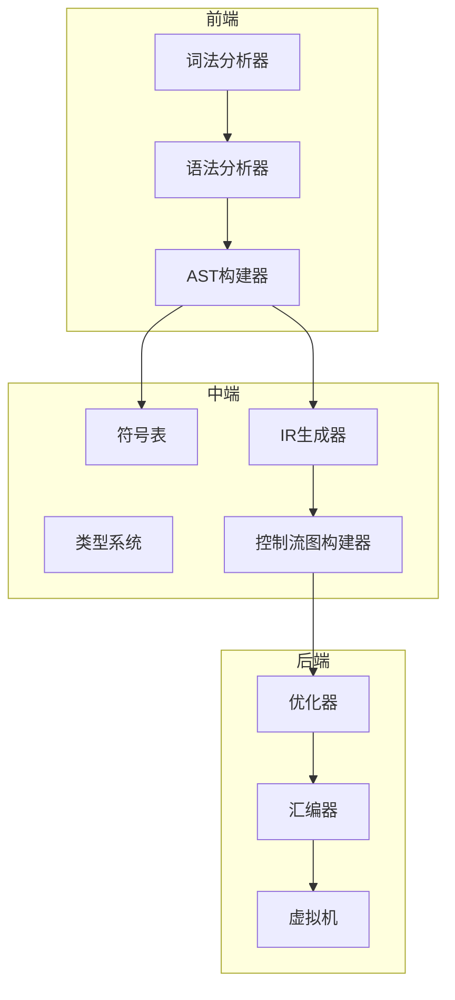
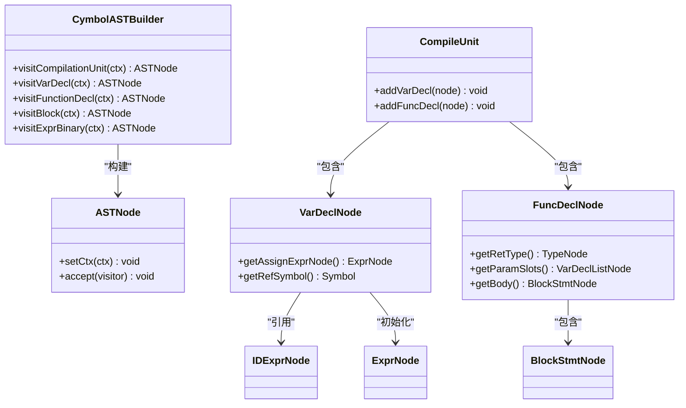
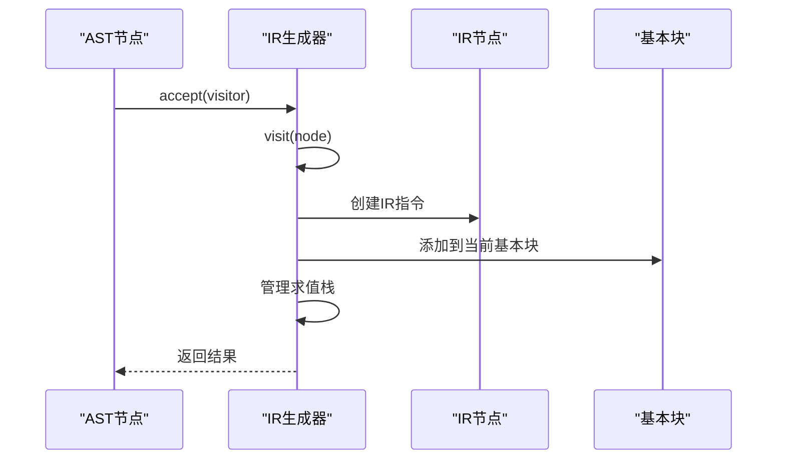
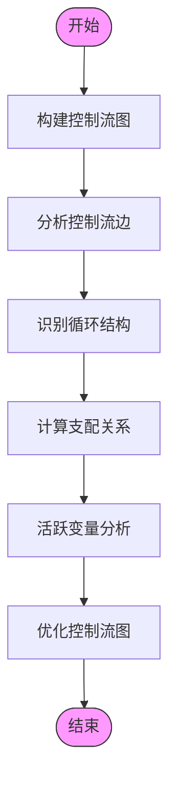
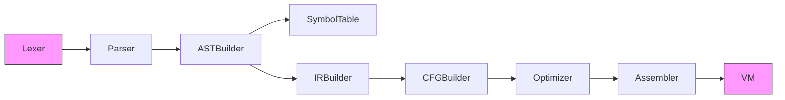

# 数据流

<cite>
**本文档中引用的文件**   
- [Compiler.java](file://ep20\src\main\java\org\teachfx\antlr4\ep20\Compiler.java)
- [CymbolASTBuilder.java](file://ep20\src\main\java\org\teachfx\antlr4\ep20\pass\ast\CymbolASTBuilder.java)
- [CymbolIRBuilder.java](file://ep20\src\main\java\org\teachfx\antlr4\ep20\pass\ir\CymbolIRBuilder.java)
- [CFGBuilder.java](file://ep20\src\main\java\org\teachfx\antlr4\ep20\pass\cfg\CFGBuilder.java)
- [CymbolAssembler.java](file://ep20\src\main\java\org\teachfx\antlr4\ep20\pass\codegen\CymbolAssembler.java)
- [TypeTable.java](file://ep20\src\main\java\org\teachfx\antlr4\ep20\symtab\type\TypeTable.java)
- [Symbol.java](file://ep20\src\main\java\org\teachfx\antlr4\ep20\symtab\symbol\Symbol.java)
- [TypeNode.java](file://ep20\src\main\java\org\teachfx\antlr4\ep20\ast\type\TypeNode.java)
</cite>

## 目录
1. [引言](#引言)
2. [项目结构](#项目结构)
3. [核心组件](#核心组件)
4. [架构概述](#架构概述)
5. [详细组件分析](#详细组件分析)
6. [依赖分析](#依赖分析)
7. [性能考虑](#性能考虑)
8. [故障排除指南](#故障排除指南)
9. [结论](#结论)
10. [附录](#附录)（如有必要）

## 引言
本文档全面描述了Cymbol编译器中的数据流动路径，从源代码输入到虚拟机字节码输出的完整生命周期。详细说明了数据在各个编译阶段的形态变化：源代码字符串 → 词法单元流 → 解析树 → AST → 符号表条目 → 类型信息 → 三地址码 → 控制流图 → 虚拟机指令。通过数据流图可视化展示关键数据结构的转换过程，解释ASTNode到IRNode的映射规则，Symbol和Type对象的创建与查询机制，以及BasicBlock中指令序列的组织方式。提供实际案例追踪一个简单函数的完整编译过程，展示各阶段数据状态的变化。

## 项目结构
Cymbol编译器项目采用模块化设计，主要包含词法分析、语法分析、AST构建、符号表管理、IR生成、控制流分析和代码生成等核心模块。项目结构清晰地分离了不同编译阶段的职责，确保了代码的可维护性和扩展性。



**图示来源**
- [Compiler.java](file://ep20\src\main\java\org\teachfx\antlr4\ep20\Compiler.java#L32-L64)
- [CymbolASTBuilder.java](file://ep20\src\main\java\org\teachfx\antlr4\ep20\pass\ast\CymbolASTBuilder.java#L0-L318)

**本节来源**
- [Compiler.java](file://ep20\src\main\java\org\teachfx\antlr4\ep20\Compiler.java#L32-L64)
- [CymbolASTBuilder.java](file://ep20\src\main\java\org\teachfx\antlr4\ep20\pass\ast\CymbolASTBuilder.java#L0-L318)

## 核心组件
Cymbol编译器的核心组件包括词法分析器、语法分析器、AST构建器、符号表管理器、IR生成器、控制流图构建器和汇编器。这些组件协同工作，完成从源代码到虚拟机字节码的转换。

**本节来源**
- [Compiler.java](file://ep20\src\main\java\org\teachfx\antlr4\ep20\Compiler.java#L32-L64)
- [CymbolASTBuilder.java](file://ep20\src\main\java\org\teachfx\antlr4\ep20\pass\ast\CymbolASTBuilder.java#L0-L318)

## 架构概述
Cymbol编译器的架构分为前端、中端和后端三个部分。前端负责词法分析和语法分析，生成抽象语法树（AST）。中端负责符号表管理和类型检查，生成中间表示（IR）并构建控制流图（CFG）。后端负责优化和代码生成，最终生成虚拟机字节码。


**图示来源**
- [Compiler.java](file://ep20\src\main\java\org\teachfx\antlr4\ep20\Compiler.java#L32-L64)
- [CymbolASTBuilder.java](file://ep20\src\main\java\org\teachfx\antlr4\ep20\pass\ast\CymbolASTBuilder.java#L0-L318)

## 详细组件分析
### AST构建器分析
AST构建器负责将语法分析器生成的解析树转换为抽象语法树（AST）。它通过访问者模式遍历解析树，为每个语法节点创建相应的AST节点。

#### 对象导向组件：


**图示来源**
- [CymbolASTBuilder.java](file://ep20\src\main\java\org\teachfx\antlr4\ep20\pass\ast\CymbolASTBuilder.java#L0-L318)
- [ASTNode.java](file://ep20\src\main\java\org\teachfx\antlr4\ep20\ast\ASTNode.java)

### IR生成器分析
IR生成器负责将AST转换为中间表示（IR）。它通过访问者模式遍历AST，为每个AST节点生成相应的IR指令。

#### API/服务组件：


**图示来源**
- [CymbolIRBuilder.java](file://ep20\src\main\java\org\teachfx\antlr4\ep20\pass\ir\CymbolIRBuilder.java#L0-L473)
- [IRNode.java](file://ep20\src\main\java\org\teachfx\antlr4\ep20\ir\IRNode.java)

### 控制流分析组件
控制流分析组件负责构建控制流图（CFG），分析程序的控制流结构，为后续优化提供基础。

#### 复杂逻辑组件：


**图示来源**
- [CFGBuilder.java](file://ep20\src\main\java\org\teachfx\antlr4\ep20\pass\cfg\CFGBuilder.java#L0-L63)
- [ControlFlowAnalysis.java](file://ep20\src\main\java\org\teachfx\antlr4\ep20\pass\cfg\ControlFlowAnalysis.java)

**本节来源**
- [CymbolIRBuilder.java](file://ep20\src\main\java\org\teachfx\antlr4\ep20\pass\ir\CymbolIRBuilder.java#L0-L473)
- [CFGBuilder.java](file://ep20\src\main\java\org\teachfx\antlr4\ep20\pass\cfg\CFGBuilder.java#L0-L63)

## 依赖分析
Cymbol编译器各组件之间的依赖关系清晰明确，遵循编译器设计的最佳实践。前端组件生成的数据结构被中端组件使用，中端组件生成的IR被后端组件使用。



**图示来源**
- [Compiler.java](file://ep20\src\main\java\org\teachfx\antlr4\ep20\Compiler.java#L32-L64)
- [CymbolASTBuilder.java](file://ep20\src\main\java\org\teachfx\antlr4\ep20\pass\ast\CymbolASTBuilder.java#L0-L318)

**本节来源**
- [Compiler.java](file://ep20\src\main\java\org\teachfx\antlr4\ep20\Compiler.java#L32-L64)
- [CymbolASTBuilder.java](file://ep20\src\main\java\org\teachfx\antlr4\ep20\pass\ast\CymbolASTBuilder.java#L0-L318)

## 性能考虑
Cymbol编译器在设计时充分考虑了性能因素。通过使用访问者模式，避免了复杂的条件判断，提高了代码执行效率。同时，通过优化控制流图，减少了不必要的跳转指令，提高了生成代码的执行效率。

## 故障排除指南
当遇到编译错误时，可以按照以下步骤进行排查：
1. 检查源代码是否符合语法规则
2. 检查符号表中是否存在未定义的符号
3. 检查类型系统是否出现类型不匹配
4. 检查控制流图是否正确构建
5. 检查生成的汇编代码是否正确

**本节来源**
- [CymbolIRBuilder.java](file://ep20\src\main\java\org\teachfx\antlr4\ep20\pass\ir\CymbolIRBuilder.java#L0-L473)
- [CymbolAssembler.java](file://ep20\src\main\java\org\teachfx\antlr4\ep20\pass\codegen\CymbolAssembler.java#L0-L154)

## 结论
Cymbol编译器通过清晰的模块划分和高效的数据流管理，实现了从源代码到虚拟机字节码的完整转换。其设计遵循编译器设计的最佳实践，具有良好的可维护性和扩展性。通过详细的文档和示例，开发者可以快速理解和使用该编译器。

## 附录
### 数据流示例
以下是一个简单函数的完整编译过程示例：

```c
int add(int a, int b) {
    return a + b;
}
```

1. **词法分析**：将源代码分解为词法单元流
2. **语法分析**：生成解析树
3. **AST构建**：转换为抽象语法树
4. **符号表管理**：创建函数和参数的符号表条目
5. **类型检查**：验证类型信息
6. **IR生成**：生成三地址码
7. **控制流分析**：构建控制流图
8. **代码生成**：生成虚拟机指令

**本节来源**
- [Compiler.java](file://ep20\src\main\java\org\teachfx\antlr4\ep20\Compiler.java#L32-L64)
- [CymbolIRBuilder.java](file://ep20\src\main\java\org\teachfx\antlr4\ep20\pass\ir\CymbolIRBuilder.java#L0-L473)