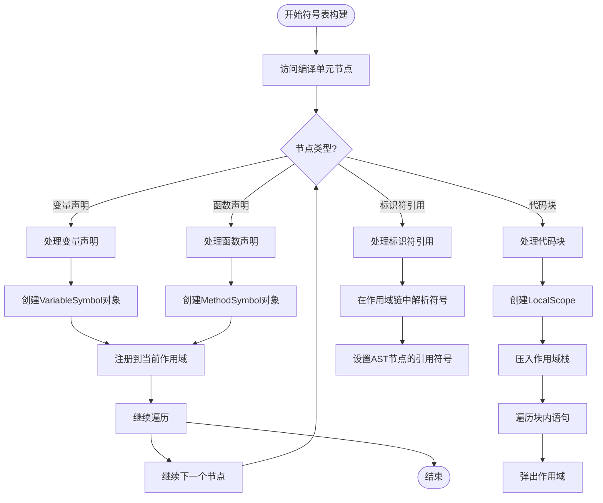
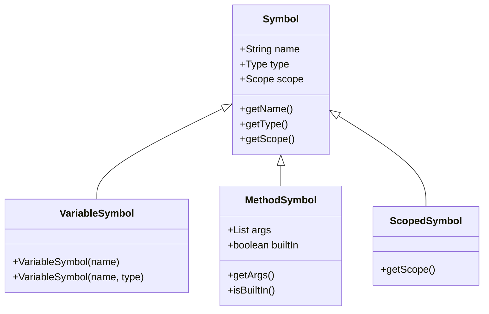
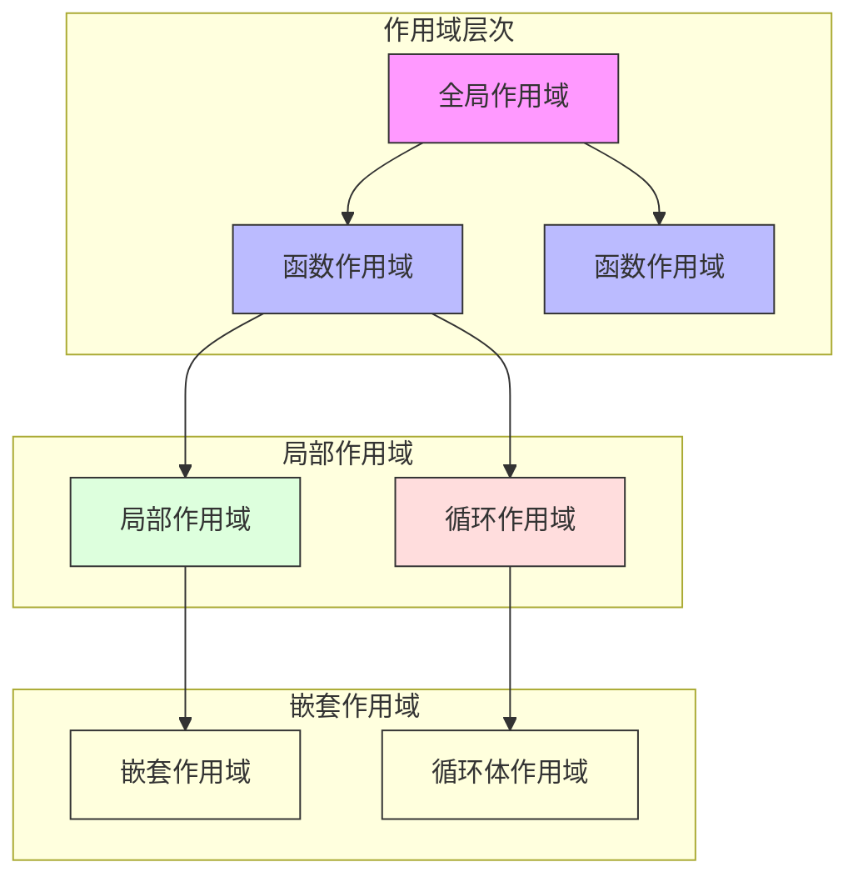
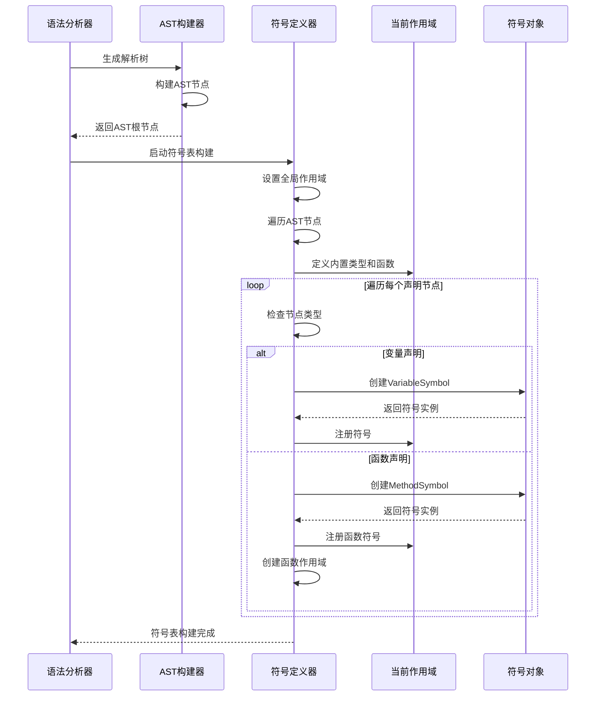

# 符号表数据流

<cite>
**本文档引用的文件**  
- [LocalDefine.java](file://ep20\src\main\java\org\teachfx\antlr4\ep20\pass\symtab\LocalDefine.java)
- [BaseScope.java](file://ep20\src\main\java\org\teachfx\antlr4\ep20\symtab\scope\BaseScope.java)
- [VariableSymbol.java](file://ep20\src\main\java\org\teachfx\antlr4\ep20\symtab\symbol\VariableSymbol.java)
- [project-architecture.md](file://ep20\docs\project-architecture.md)
- [CymbolASTBuilder.java](file://ep20\src\main\java\org\teachfx\antlr4\ep20\pass\ast\CymbolASTBuilder.java)
</cite>

## 目录
1. [引言](#引言)
2. [符号表构建流程](#符号表构建流程)
3. [符号类型与实例化规则](#符号类型与实例化规则)
4. [作用域层次结构](#作用域层次结构)
5. [符号解析机制](#符号解析机制)
6. [符号表与AST的引用关系](#符号表与ast的引用关系)
7. [符号表一致性保障](#符号表一致性保障)
8. [实际案例分析](#实际案例分析)
9. [结论](#结论)

## 引言
Cymbol编译器的符号表系统是语义分析阶段的核心组件，负责管理程序中所有标识符的声明与引用信息。该系统通过遍历抽象语法树（AST）来收集符号信息，并建立完整的作用域层次结构，为后续的类型检查和代码生成提供基础支持。

## 符号表构建流程
符号表的构建由`LocalDefine`类完成，该类继承自`ASTBaseVisitor`，通过访问者模式遍历AST节点。构建过程始于`CompileUnit`根节点，编译器首先保存当前作用域，然后递归访问子节点，在遇到声明语句时创建相应的符号对象并注册到当前作用域中。



**Diagram sources**
- [LocalDefine.java](file://ep20\src\main\java\org\teachfx\antlr4\ep20\pass\symtab\LocalDefine.java#L0-L170)

**Section sources**
- [LocalDefine.java](file://ep20\src\main\java\org\teachfx\antlr4\ep20\pass\symtab\LocalDefine.java#L0-L170)

## 符号类型与实例化规则
Cymbol编译器定义了多种符号类型，每种类型对应特定的程序实体。符号的实例化遵循严格的规则，确保类型信息的准确性和完整性。

### VariableSymbol
`VariableSymbol`表示变量声明，其构造函数接受名称和类型参数。当编译器遇到变量声明节点（`VarDeclNode`）时，会创建`VariableSymbol`实例并将其注册到当前作用域。



**Diagram sources**
- [VariableSymbol.java](file://ep20\src\main\java\org\teachfx\antlr4\ep20\symtab\symbol\VariableSymbol.java#L0-L19)
- [project-architecture.md](file://ep20\docs\project-architecture.md#L106-L209)

**Section sources**
- [VariableSymbol.java](file://ep20\src\main\java\org\teachfx\antlr4\ep20\symtab\symbol\VariableSymbol.java#L0-L19)

### MethodSymbol
`MethodSymbol`表示函数声明，包含函数名、返回类型、参数列表等信息。函数声明时会创建新的`MethodSymbol`，同时为其参数创建独立的`VariableSymbol`。

## 作用域层次结构
Cymbol编译器采用嵌套作用域模型，通过`Scope`接口和`BaseScope`基类实现。系统维护一个作用域栈，支持全局作用域（`GlobalScope`）和局部作用域（`LocalScope`）的动态管理。

### 作用域创建与管理
当进入新的代码块或函数时，编译器会创建新的作用域并压入栈中；退出时则从栈中弹出。`BaseScope`的构造函数会自动注册内置类型（int、float、void、boolean）和内置函数（print）。



**Diagram sources**
- [BaseScope.java](file://ep20\src\main\java\org\teachfx\antlr4\ep20\symtab\scope\BaseScope.java#L0-L71)
- [project-architecture.md](file://ep20\docs\project-architecture.md#L106-L209)

**Section sources**
- [BaseScope.java](file://ep20\src\main\java\org\teachfx\antlr4\ep20\symtab\scope\BaseScope.java#L0-L71)

## 符号解析机制
符号解析采用词法作用域规则，从当前作用域开始沿作用域链向上查找，直到找到匹配的符号或到达全局作用域。这一机制支持作用域嵌套和变量遮蔽。

### 查找路径
1. 首先在当前作用域的符号表中查找
2. 若未找到，则递归查询父作用域
3. 直到全局作用域仍未找到则报告"未定义符号"错误

### 遮蔽规则
内部作用域中声明的同名符号会遮蔽外部作用域的符号，但外部符号仍然存在。当内部作用域结束时，被遮蔽的符号重新可见。



**Diagram sources**
- [LocalDefine.java](file://ep20\src\main\java\org\teachfx\antlr4\ep20\pass\symtab\LocalDefine.java#L0-L170)

**Section sources**
- [LocalDefine.java](file://ep20\src\main\java\org\teachfx\antlr4\ep20\pass\symtab\LocalDefine.java#L0-L170)

## 符号表与AST的引用关系
符号表与AST之间通过双向引用建立紧密联系。AST节点持有对符号对象的引用，符号对象也记录其所属的作用域，这种设计实现了静态语义分析所需的信息关联。

- `IDExprNode`通过`setRefSymbol()`方法关联到其声明的`Symbol`对象
- `VarDeclNode`和`FuncDeclNode`在其声明节点中存储对应的符号引用
- 作用域信息通过`setScope()`方法传递给控制流语句节点

## 符号表一致性保障
系统通过以下机制确保符号表的一致性和完整性：

1. **作用域栈管理**：使用栈结构严格管理作用域的创建和销毁顺序
2. **原子性操作**：符号定义和解析操作在单一线程中完成，避免竞态条件
3. **内置符号预注册**：在作用域创建时自动注册基本类型和内置函数
4. **错误检测**：对未定义符号和重复声明进行实时检测和报告

## 实际案例分析
考虑以下Cymbol代码片段：
```c
int x = 10;
void func() {
    int x = 20;
    print(x);
}
```
编译器处理过程：
1. 在全局作用域创建`VariableSymbol("x", int)`
2. 进入`func`函数时创建新的`LocalScope`
3. 在函数作用域内创建新的`VariableSymbol("x", int)`，遮蔽全局变量
4. `print(x)`中的`x`解析为局部变量符号
5. 函数结束时弹出局部作用域，全局`x`重新可见

## 结论
Cymbol编译器的符号表系统通过精心设计的作用域层次结构和符号解析机制，有效支持了程序的静态语义分析。系统采用访问者模式遍历AST，动态构建符号表，并通过作用域链实现精确的符号查找和遮蔽规则。这种设计不仅保证了符号表的一致性和完整性，还为后续的类型检查和代码生成提供了可靠的基础。