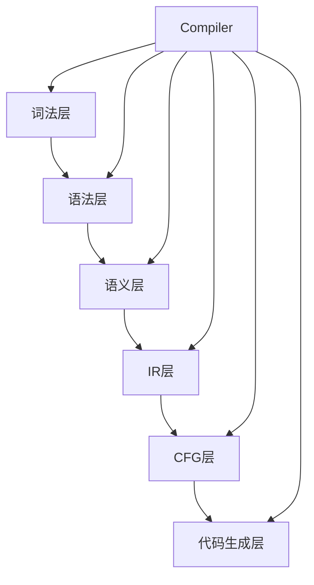
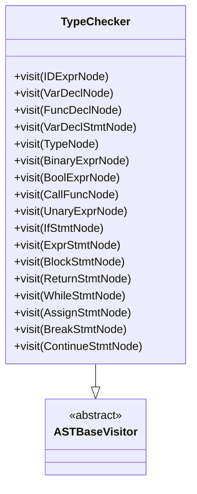
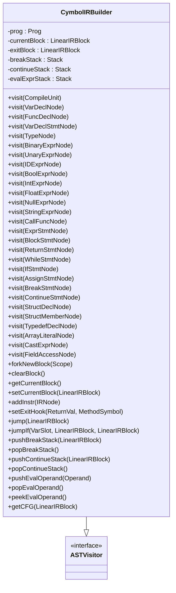
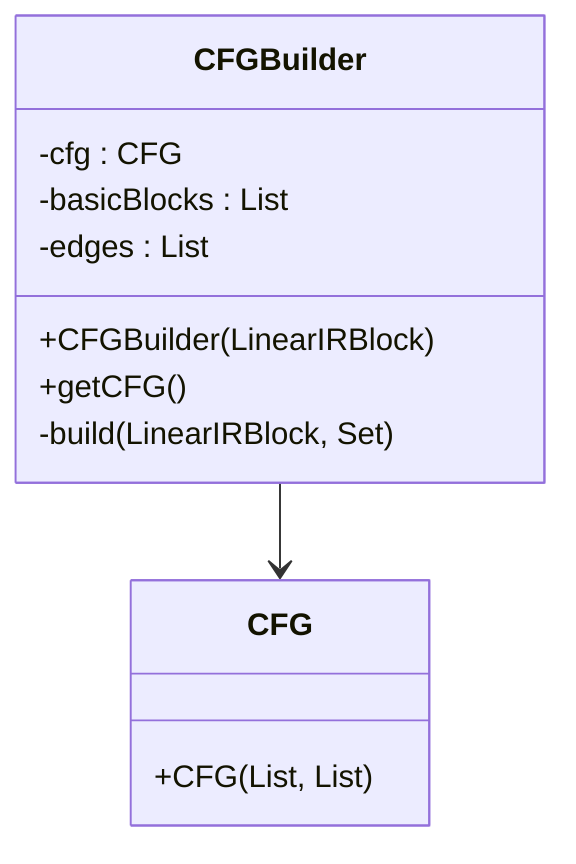
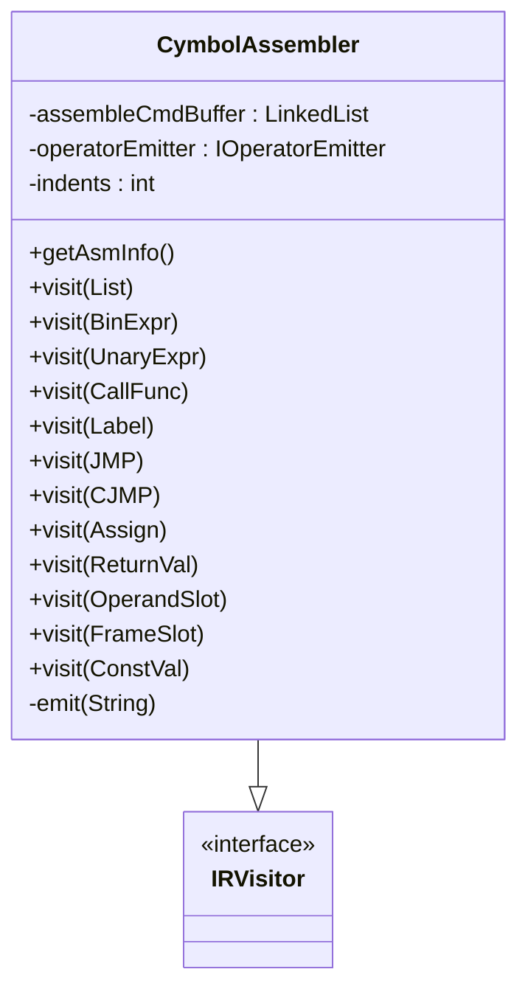
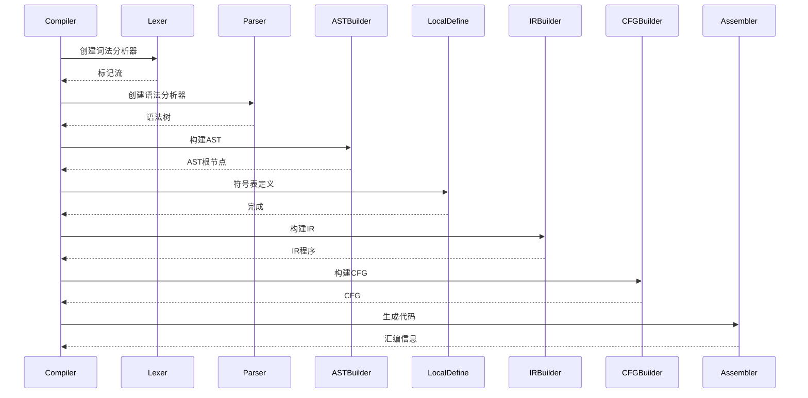

# 整体架构

<cite>
**本文档中引用的文件**  
- [Compiler.java](file://ep20/src/main/java/org/teachfx/antlr4/ep20/Compiler.java)
- [CymbolASTBuilder.java](file://ep20/src/main/java/org/teachfx/antlr4/ep20/pass/ast/CymbolASTBuilder.java)
- [TypeChecker.java](file://ep20/src/main/java/org/teachfx/antlr4/ep20/pass/sematic/TypeChecker.java)
- [CymbolIRBuilder.java](file://ep20/src/main/java/org/teachfx/antlr4/ep20/pass/ir/CymbolIRBuilder.java)
- [CFGBuilder.java](file://ep20/src/main/java/org/teachfx/antlr4/ep20/pass/cfg/CFGBuilder.java)
- [CymbolAssembler.java](file://ep20/src/main/java/org/teachfx/antlr4/ep20/pass/codegen/CymbolAssembler.java)
</cite>

## 目录
1. [引言](#引言)
2. [分层架构设计](#分层架构设计)
3. [编译器核心层次详解](#编译器核心层次详解)
4. [模块化设计与设计模式应用](#模块化设计与设计模式应用)
5. [编译器协调机制](#编译器协调机制)
6. [架构权衡与决策](#架构权衡与决策)
7. [结论](#结论)

## 引言
Cymbol编译器采用分层架构设计，将编译过程划分为六个清晰的层次：词法层、语法层、语义层、IR层、CFG层和代码生成层。这种分层设计不仅提高了代码的可维护性和可扩展性，还使得每个层次的职责边界明确，便于独立开发和测试。本文档详细描述了Cymbol编译器的整体架构，重点介绍其分层设计模式，并解释各层次之间的依赖关系和数据接口。

## 分层架构设计

**图示来源**  
- [Compiler.java](file://ep20/src/main/java/org/teachfx/antlr4/ep20/Compiler.java#L0-L161)

**本节来源**  
- [Compiler.java](file://ep20/src/main/java/org/teachfx/antlr4/ep20/Compiler.java#L0-L161)

## 编译器核心层次详解

### 词法层与语法层
词法层负责将源代码字符流转换为标记流，语法层则根据语法规则将标记流构建成抽象语法树（AST）。在Cymbol编译器中，这两个层次由ANTLR4自动生成的词法分析器和语法分析器实现。

**本节来源**  
- [Compiler.java](file://ep20/src/main/java/org/teachfx/antlr4/ep20/Compiler.java#L0-L161)

### 语义层
语义层负责类型检查、符号表构建等语义分析任务。`TypeChecker`类实现了访问者模式，遍历AST进行类型检查。

**图示来源**  
- [TypeChecker.java](file://ep20/src/main/java/org/teachfx/antlr4/ep20/pass/sematic/TypeChecker.java#L0-L105)

**本节来源**  
- [TypeChecker.java](file://ep20/src/main/java/org/teachfx/antlr4/ep20/pass/sematic/TypeChecker.java#L0-L105)

### IR层
IR层将AST转换为中间表示（IR），便于后续的优化和代码生成。`CymbolIRBuilder`类实现了访问者模式，遍历AST生成IR。

**图示来源**  
- [CymbolIRBuilder.java](file://ep20/src/main/java/org/teachfx/antlr4/ep20/pass/ir/CymbolIRBuilder.java#L0-L473)

**本节来源**  
- [CymbolIRBuilder.java](file://ep20/src/main/java/org/teachfx/antlr4/ep20/pass/ir/CymbolIRBuilder.java#L0-L473)

### CFG层
CFG层将IR转换为控制流图（CFG），用于后续的优化。`CFGBuilder`类负责构建CFG。

**图示来源**  
- [CFGBuilder.java](file://ep20/src/main/java/org/teachfx/antlr4/ep20/pass/cfg/CFGBuilder.java#L0-L63)

**本节来源**  
- [CFGBuilder.java](file://ep20/src/main/java/org/teachfx/antlr4/ep20/pass/cfg/CFGBuilder.java#L0-L63)

### 代码生成层
代码生成层将优化后的IR转换为目标代码。`CymbolAssembler`类负责生成虚拟机指令。

**图示来源**  
- [CymbolAssembler.java](file://ep20/src/main/java/org/teachfx/antlr4/ep20/pass/codegen/CymbolAssembler.java#L0-L154)

**本节来源**  
- [CymbolAssembler.java](file://ep20/src/main/java/org/teachfx/antlr4/ep20/pass/codegen/CymbolAssembler.java#L0-L154)

## 模块化设计与设计模式应用

### 访问者模式
访问者模式应用于AST和IR的遍历处理，解耦了数据结构和操作。

**本节来源**  
- [CymbolASTBuilder.java](file://ep20/src/main/java/org/teachfx/antlr4/ep20/pass/ast/CymbolASTBuilder.java#L0-L318)
- [CymbolIRBuilder.java](file://ep20/src/main/java/org/teachfx/antlr4/ep20/pass/ir/CymbolIRBuilder.java#L0-L473)

### 构建器模式
构建器模式应用于AST节点的创建，统一了创建接口，便于扩展。

**本节来源**  
- [CymbolASTBuilder.java](file://ep20/src/main/java/org/teachfx/antlr4/ep20/pass/ast/CymbolASTBuilder.java#L0-L318)

### 责任链模式
责任链模式应用于编译流水线，每个阶段处理完后将结果传递给下一阶段。

**本节来源**  
- [Compiler.java](file://ep20/src/main/java/org/teachfx/antlr4/ep20/Compiler.java#L0-L161)

## 编译器协调机制
`Compiler`类协调各模块工作，按照编译流水线的顺序依次调用各个模块。

**图示来源**  
- [Compiler.java](file://ep20/src/main/java/org/teachfx/antlr4/ep20/Compiler.java#L0-L161)

**本节来源**  
- [Compiler.java](file://ep20/src/main/java/org/teachfx/antlr4/ep20/Compiler.java#L0-L161)

## 架构权衡与决策
Cymbol编译器的架构设计在性能与可维护性之间取得了平衡。分层设计提高了代码的可维护性，但增加了模块间的通信开销。访问者模式解耦了数据结构和操作，但增加了类的数量。这些权衡考虑使得Cymbol编译器既易于扩展，又具有良好的性能。

**本节来源**  
- [Compiler.java](file://ep20/src/main/java/org/teachfx/antlr4/ep20/Compiler.java#L0-L161)
- [CymbolASTBuilder.java](file://ep20/src/main/java/org/teachfx/antlr4/ep20/pass/ast/CymbolASTBuilder.java#L0-L318)
- [CymbolIRBuilder.java](file://ep20/src/main/java/org/teachfx/antlr4/ep20/pass/ir/CymbolIRBuilder.java#L0-L473)

## 结论
Cymbol编译器采用分层架构设计，通过访问者模式、构建器模式和责任链模式等设计模式，实现了高内聚低耦合的模块化设计。这种设计不仅提高了代码的可维护性和可扩展性，还使得编译器易于理解和修改。未来可以进一步优化IR层和CFG层，提高编译器的性能。